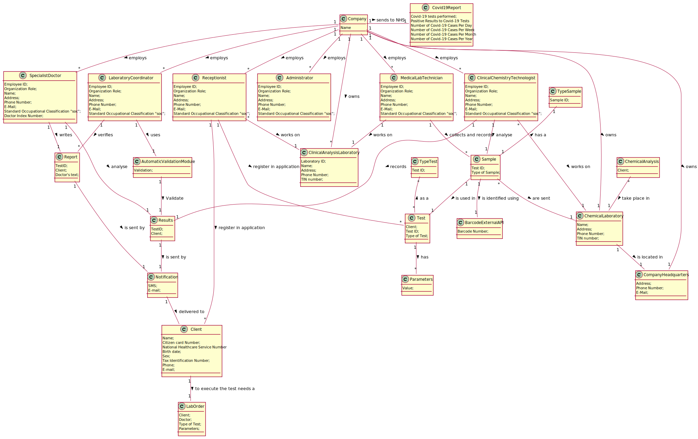

# OO Analysis #

The construction process of the domain model is based on the client specifications, especially the nouns (for _concepts_) and verbs (for _relations_) used.

## Rationale to identify domain conceptual classes ##
To identify domain conceptual classes, start by making a list of candidate conceptual classes inspired by the list of categories suggested in the book "Applying UML and Patterns: An Introduction to Object-Oriented Analysis and Design and Iterative Development".

### _Conceptual Class Category List_ ###

**Business Transactions**

* Test

---

**Transaction Line Items**

* Samples

---

**Product/Service related to a Transaction or Transaction Line Item**

* Covid-19 tests
* Analysis of blood

---

**Transaction Records**

---  

**Roles of People or Organizations**

* Client
* Receptionist
* Medical Lab Technician
* Specialist Doctor
* Administrator 
* Clinical Chemistry Technologist
* Laboratory Coordinator 

---

**Places**

* Clinical Analysis Laboratory
* Chemical Laboratory
* Company's Headquarters

---

**Noteworthy Events**

* Chemical Analysis

---

**Physical Objects**

* blood sample
* swab sample

---

**Descriptions of Things**

* Type of Test

---

**Catalogs**

*

---

**Containers**

*

---

**Elements of Containers**

*

---

**Organizations**

* Many Labs

---

**Other External/Collaborating Systems**

* Barcode External API

---

**Records of finance, work, contracts, legal matters**

*

---

**Financial Instruments**

*

---

**Documents mentioned/used to perform some work/**

* Lab Order
* Results
* Report

---

###**Rationale to identify associations between conceptual classes**###

An association is a relationship between instances of objects that indicates a relevant connection and that is worth of remembering, or it is derivable from the List of Common Associations:

+ **_A_** is physically or logically part of **_B_**
+ **_A_** is physically or logically contained in/on **_B_**
+ **_A_** is a description for **_B_**
+ **_A_** known/logged/recorded/reported/captured in **_B_** .
+ **_A_** uses or manages or owns **_B_**
+ **_A_** is related with a transaction (item) of **_B_**
+ etc.

| Concept (A) 		|  Association   	|  Concept (B) |
|----------	   		|:-------------:		|------:       |
| Analysis Of Blood   Covid19 Tests|  is a type of  |  Test
| Blood Sample Swab Sample    |    is a type of    | Sample
| Chemical Analysis       |  take place in    | Chemical Laboratory
| Chemical Laboratory|  is located in                 | Company Headquarters
| Client            | to execute the test needs a     | Lab Order
| Clinical Chemistry Technologist|  analyse | Sample
| Clinical Chemistry Technologist|  works on| Chemical Laboratory
| Clinical Chemistry Technologist|  records | Results
| Many Labs      	| employees   	 	    | Receptionist   Medical Lab Technician   Specialist Doctor  Administrator Clinical Chemistry Technologist Laboratory Coordinator|
| Many Labs      	| owns     		 	    | Clinical Analysis Laboratory   Chemical Laboratory   Company's Headquarters|
| Medical Lab Technician |   collects        | Sample
| Medical Lab Technician | records          | Sample
| Receptionist     	| works on              | Clinical Analysis Laboratory
| Receptionist   	| register in application| Test
| Receptionist   	| register in application| Client
| Report |  is delivered to  | Client
| Samples          	|  are sent          | Chemical Laboratory
| Specialist Doctor      |   analyse         | Results
| Specialist Doctor      |   writes          | Report
| Sample                  |  is identified using | Barcode External API
| Sample |  is  used in  | Test
| Test   |  is registered locally by   | Medical Lab Technician

## Domain Model

**Do NOT forget to identify concepts atributes too.**

**Insert below the Domain Model Diagram in a SVG format**

