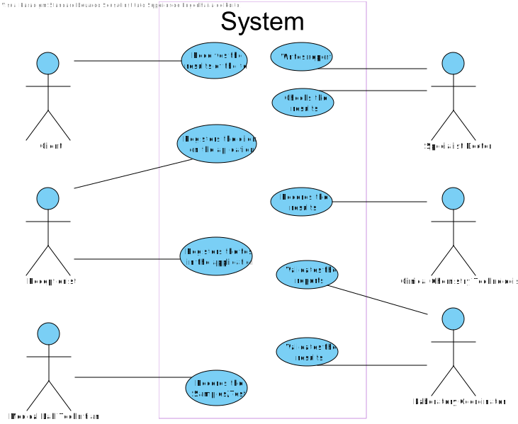

# Use Case Diagram (UCD)

**In the scope of this project, there is a direct relationship of _1 to 1_ between Use Cases (UC) and User Stories (US).**

However, be aware, this is a pedagogical simplification. On further projects and curricular units might also exist _1 to N **and/or** N to 1 relationships between US and UC.

**Insert below the Use Case Diagram in a SVG format**

**For each UC/US, it must be provided evidences of applying main activities of the software development process (requirements, analysis, design, tests and code). Gather those evidences on a separate file for each UC/US and set up a link as suggested below.**

# Use Cases / User Stories
| UC/US  | Description                                                               |                   
|:----|:------------------------------------------------------------------------|
| US1 | [Client takes on a Lab order](US1.md)  |
| US2 | [Client executes the test](US2.md)|
| US3 | [Receptionist works on Clinical Analysis Laboratory](US3.md)|
| US4 | [Receptionist registers the client in the application](US4.md)|
| US5 | [Receptionist registers the test in the application](US5.md)|
| US6 | [Medical Lab Technician collects sample](US6.md)
| US7 | [Specialist Doctor writes report](US7.md)
| US8 | [Specialist Doctor analyses results](US8.md)
| US9 | [Clinical Chemistry Technologist analyses sample](US9.md)
| US10 | [Clinical Chemistry Technologist records result](US10.md)
| US11 | [Clinical Chemistry Technologist works on Chemical Laboratory ](US11.md)
