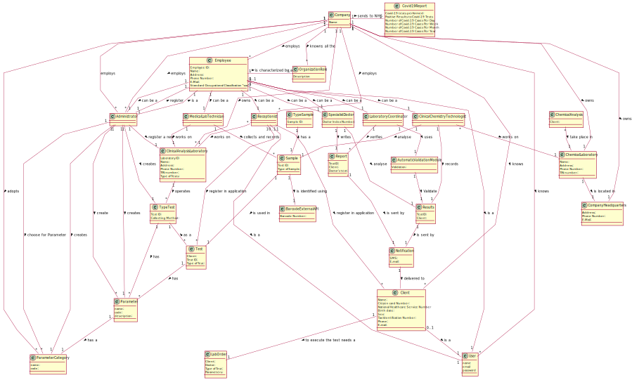

# OO Analysis

The construction process of the domain model is based on the client specifications, especially the nouns (for _concepts_) and verbs (for _relations_) used.

## Rationale to identify domain conceptual classes

To identify domain conceptual classes, start by making a list of candidate conceptual classes inspired by the list of categories suggested in the book "Applying UML and Patterns: An Introduction to Object-Oriented Analysis and Design and Iterative Development".

### _Conceptual Class Category List_

**Business Transactions**

- Test

---

**Transaction Line Items**

- Samples

---

**Product/Service related to a Transaction or Transaction Line Item**

- Covid-19 tests
- Analysis of blood

---

**Roles of People or Organizations**

- Client
- Receptionist
- Medical Lab Technician
- Specialist Doctor
- Administrator
- Clinical Chemistry Technologist
- Laboratory Coordinator

---

**Places**

- Clinical Analysis Laboratory
- Chemical Laboratory
- Company's Headquarters

---

**Noteworthy Events**

- Chemical Analysis

---

**Physical Objects**

- blood sample
- swab sample

---

**Descriptions of Things**

- Type of Test
- Type of Sample

--- 

**Organizations**

- Many Labs

---

**Other External/Collaborating Systems**

- Barcode External API
- AutomaticValidationModule

---

**Documents mentioned/used to perform some work/**

- Lab Order
- Results
- Report

---

###**Rationale to identify associations between conceptual classes**

| Concept (A)                     |         Association         |                                                                                                                                    Concept (B) |
| ------------------------------- | :-------------------------: | ---------------------------------------------------------------------------------------------------------------------------------------------: |
| Automatic Validation Module     |          validates          |                                                                                                                                        Results |
| Chemical Analysis               |        take place in        |                                                                                                                            Chemical Laboratory |
| Chemical Laboratory             |        is located in        |                                                                                                                           Company Headquarters |
| Chemical Laboratory             |        is located in        |                                                                                                                           Company Headquarters |
| Client                          | to execute the test needs a |                                                                                                                                      Lab Order |
| Clinical Chemistry Technologist |           analyse           |                                                                                                                                         Sample |
| Clinical Chemistry Technologist |          works on           |                                                                                                                            Chemical Laboratory |
| Clinical Chemistry Technologist |           records           |                                                                                                                                        Results |
| Company                         |          employees          | Receptionist   Medical Lab Technician   Specialist Doctor  Administrator Clinical Chemistry Technologist Laboratory Coordinator |
| Company                         |            owns             |                                                              Clinical Analysis Laboratory   Chemical Laboratory   Company's Headquarters |
| Laboratory Coordinator          |          verifies           |                                                                                                                                         Report |
| Laboratory Coordinator          |            uses             |                                                                                                                    Automatic Validation Module |
| Medical Lab Technician          |    collects and records     |                                                                                                                                         Sample |
| Medical Lab Technician          |          works on           |                                                                                                                   Clinical Analysis Laboratory |
| Notification                    |       is delivered to       |                                                                                                                                         Client |
| Receptionist                    |          works on           |                                                                                                                   Clinical Analysis Laboratory |
| Receptionist                    |   register in application   |                                                                                                                                         Client |
| Receptionist                    |   register in application   |                                                                                                                                           Test |
| Report                          |         is sent by          |                                                                                                                                   Notification |
| Results                         |         is sent by          |                                                                                                                                   Notification |
| Sample                          |          are sent           |                                                                                                                            Chemical Laboratory |
| Sample                          |     is identified using     |                                                                                                                           Barcode External API |
| Sample                          |         is used in          |                                                                                                                                           Test |
| Sample                          |            has a            |                                                                                                                                 Type of Sample |
| Specialist Doctor               |           writes            |                                                                                                                                         Report |
| Specialist Doctor               |           analyse           |                                                                                                                                        Results |
| Test                            |             has             |                                                                                                                                     Parameters |
| Test                            |             has             |                                                                                                                                   Type of Test |

## Domain Model

**Do NOT forget to identify concepts atributes too.**

**Insert below the Domain Model Diagram in a SVG format**

