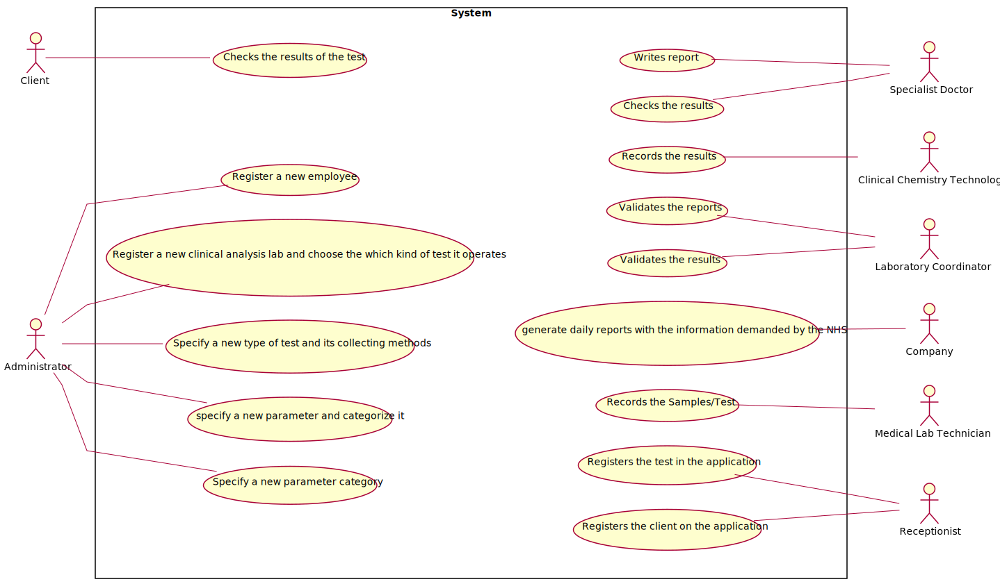

# Use Case Diagram (UCD)

**In the scope of this project, there is a direct relationship of _1 to 1_ between Use Cases (UC) and User Stories (US).**

**For each UC/US, it must be provided evidences of applying main activities of the software development process (requirements, analysis, design, tests and code). Gather those evidences on a separate file for each UC/US and set up a link as suggested below.**

# Use Cases / User Stories
| UC/US | Description                                                                                                          |
| :---- | :------------------------------------------------------------------------                                            |
| US3   | As a receptionist. I want to register a client                                                                       |
| US7   | As an administrator, I want to register a new employee                                                               |
| US8   | As an administrator, I want to register a new clinical analysis laboratory stating which kind of test(s) it operates |
| US9   | As an administrator, I want to specify a new parameter and categorize it                                             |
| US10  | As an administrator, I want to specify a new parameter and categorize it                                             |
| US11  | As an administrator, i want to specify a new parameter category                                                      |
 