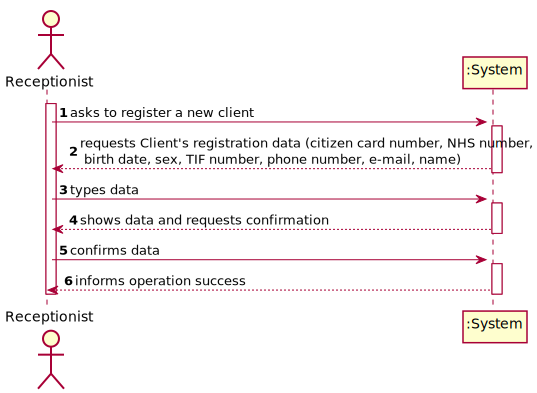
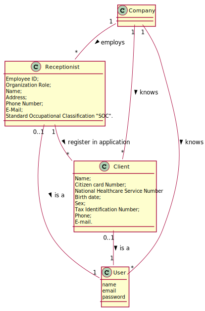
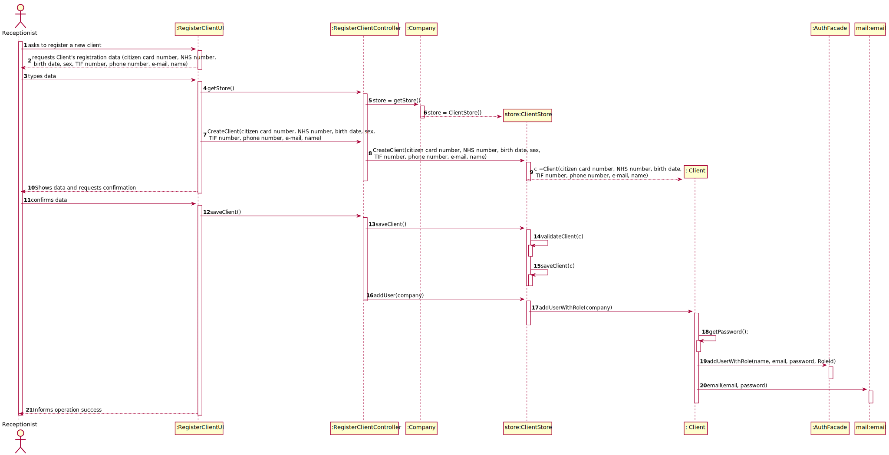
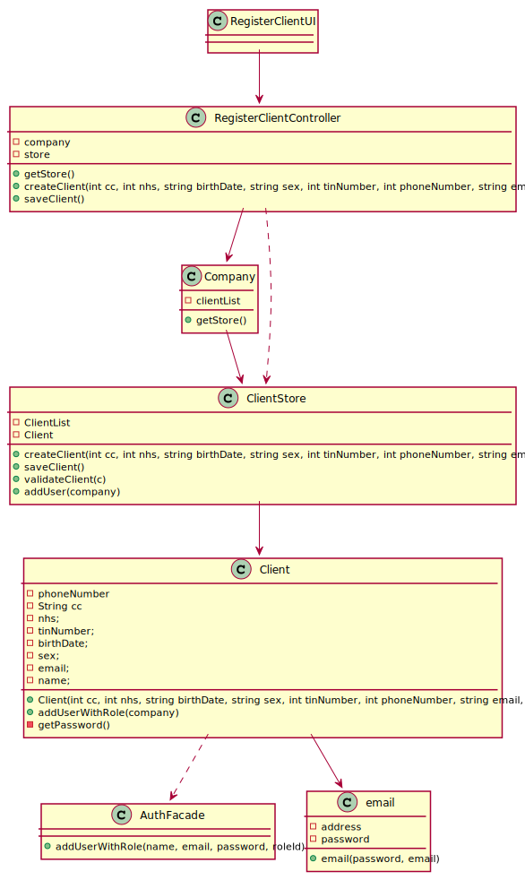

# US 03 - To register a Client

## 1. Requirements Engineering

### 1.1. User Story Description

As a receptionist of the laboratory, I want to register a client.

### 1.2. Customer Specifications and Clarifications

**From the specifications document:**

>	"The receptionist needs the client’s citizen card number, National Healthcare Service (NHS) number,
birth date, sex, Tax Identification number (TIF), phone number, e-mail and name, to register a client."

**From the client clarifications:**

> **Question:** To register a Client which is the format of each attribute?
>
> **Answer:**
>
> Citizen Card: 16 digit number
>
> NHS: 10 digit number
>
> TIN: 10 digit number
>
> Date of Birth: DD/MM/YY
>
> Sex: Male/Female
>
> Phone number: 11 digit number
>
> **Link:** https://moodle.isep.ipp.pt/mod/forum/discuss.php?d=7153#p9314
>

-

> **Question:** The receptionist needs mandatorily of all client data described on the project description?
>
> **Answer:** No, the receptionist doesn't need to input the client's sex, it is optional while all the other fields are required.
>
> **Link:** https://moodle.isep.ipp.pt/mod/forum/discuss.php?d=7153#p9314
>

-

> **Question:** After being registered by the receptionist, should the client receive some kind of confirmation e-mail in order to finish their registration?
>
> **Answer:** The client only receives an e-mail informing that the registration was successful and that they can start to use the system. The e-mail includes the client's password.
>
> **Link:** https://moodle.isep.ipp.pt/mod/forum/discuss.php?d=7736#p10081
>

-

> **Question:** Relative to registering a new user, how should the system respond in the event of creating a new user with the same attributes of an already existing user?
>
> **Answer:** This should be treated as an error. A subset of the attributes of any client are unique.
>
> **Link:** https://moodle.isep.ipp.pt/mod/forum/discuss.php?d=7482#p9736
>

-

> **Question:** During the registration of a customer, if they give a phone number already used by another customer, should the registration continue normally or should it be cancelled?
>
> **Answer:** The e-mail address and phone number should be unique for each user. The system should present a message informing about the error and asking for a different phone number.
>
> **Link:** https://moodle.isep.ipp.pt/mod/forum/discuss.php?d=7615

> **Question:** What should be the maximum length of the String with the name of the Client?
>
> **Answer:** A string with no more than 35 characters.
>
> **Link:** https://moodle.isep.ipp.pt/mod/forum/discuss.php?d=7945#p10383

> **Question:** Is there any restrictions to the client age?
>
> **Answer:** A client should not have more than 150 years of age.
>
> **Link:** https://moodle.isep.ipp.pt/mod/forum/discuss.php?d=7945#p10383

> **Question:** What should be the maximum length of the String with the name of the Client?
>
> **Answer:** A string with no more than 35 characters.
>
> **Link:** https://moodle.isep.ipp.pt/mod/forum/discuss.php?d=7945#p10383
### 1.3. Acceptance Criteria

* **AC1:** The client must become a system user. The "auth" component
  available on the repository must be reused (without modifications).
* **AC2:** To input the client's sex is optional while all the other fields are mandatory.
* **AC3:** The e-mail address and phone number should be unique for each user
* **AC4:** Citizen Card number is a 16-digit number.
* **AC5:** NHS number is a 10 digit number.
* **AC6:** Date of birth has DD/MM/YY as format.
* **AC7:** Phone number is an 11-digit number.
* **AC8:** Age must be inferior to 150 years
* **AC9:** TIN is a 10-digit number
* **AC10** Name must have maximum of 35 characters

### 1.4. Found out Dependencies

* There is a dependency to "US7- Register a new employee" since there must be a receptionist employed to register the client.

### 1.5 Input and Output Data

**Input Data:**
* Typed data:
	* Name
	* Citizen Card number
	* National Healthcare Service number
	* Tax Identification Number
	* Phone number
	* E-mail
	* Birthdate

* Selected data:
	* Sex

### 1.6. System Sequence Diagram (SSD)

*Insert here a SSD depicting the envisioned Actor-System interactions and throughout which data is inputted and outputted to fulfill the requirement. All interactions must be numbered.*

### 1.7 Other Relevant Remarks

*Use this section to capture other relevant information that is related with this US such as (i) special requirements ; (ii) data and/or technology variations; (iii) how often this US is held.*

## 2. OO Analysis

### 2.1. Relevant Domain Model Excerpt
*In this section, it is suggested to present an excerpt of the domain model that is seen as relevant to fulfill this requirement.*

### 2.2. Other Remarks

*Use this section to capture some aditional notes/remarks that must be taken into consideration into the design activity. In some case, it might be usefull to add other analysis artifacts (e.g. activity or state diagrams).*

## 3. Design - User Story Realization

### 3.1. Rationale

**The rationale grounds on the SSD interactions and the identified input/output data.**

| Interaction ID                                                                                                                         | Question: Which class is responsible for...                              | Answer                   | Justification (with patterns)                                                                                 |
| :-------------                                                                                                                         | :---------------------                                                   | :------------            | :----------------------------                                                                                 |
| Step 1: asks to register a new client                                                                                                  | ... asking to register a new client?                                     | RegisterClientUI         | Pure Fabrication: there is no reason to assign this responsibility to any existing class in the Domain Model. |
|                                                                                                                                        | ... coordinating the US?                                                 | RegisterClientController | Controller                                                                                                    |
|                                                                                                                                        | ... instantiating a new Client?                                          | ClientStore              | Creator   LC/HC                                                                                           |
| Step 2: requests client's registration data (citizen card number, NHS number, birth date, sex, TIF number, phone number, e-mail, name) | ... requesting the client's data?                                        | RegisterClientUI         | IE: the interface interacts with the actor.                                                                   |
| Step 3: types data                                                                                                                     | ... creating the ClientStore?                                            | Company                  | IE: Company knows all lists of objects in the system                                                          |
|                                                                                                                                        | ... saving the input data                                                | Client                   | IE: the object has its own data                                                                               |
| Step 4: shows data and requests confirmation                                                                                           | ... showing and requesting the confirmation of the data?                 | RegisterClientUI         |                                                                                                               |
|                                                                                                                                        | ... validating the data locally (e.g.: mandatory vs.non-mandatory data)? | Client                   | IE: knows its own data.                                                                                       |
|                                                                                                                                        | ... validating the data globally (e.g.: duplicated)?                     | ClientStore              | IE: knows/has all the Client objects                                                                          |
| Step 5: confirms data                                                                                                                  | ... confirming the data?                                                 | RegisterClientUI         | IE: the interface interacts with the actor.                                                                   |
|                                                                                                                                        | ... adding the user with role?                                           | ClientStore              | IE: it has the needed information of the client and their new user's data.                                    |
|                                                                                                                                        | ... creating the user password                                           | Client 		           | IE: knows his own data and generates its own data                                                                                                              |
| Step 6: informs operation success                                                                                                      | ... informing operation success?                                         | RegisterClientUI         | IE: the interface interacts with the actor.                                                                   |

### Systematization ##

According to the taken rationale, the conceptual classes promoted to software classes are:

* Company
* Client

Other software classes (i.e. Pure Fabrication) identified:

* RegisterClientUI
* RegisterClientController
* ClientStore
* RoleStore

## 3.2. Sequence Diagram (SD)

## 3.3. Class Diagram (CD)

# 4. Tests
*In this section, it is suggested to systematize how the tests were designed to allow a correct measurement of requirements fulfilling.*

**_DO NOT COPY ALL DEVELOPED TESTS HERE_**

**Test 1:** Check that it is not possible to create an instance of the Example class with null values.

	@Test(expected = IllegalArgumentException.class)
		public void ensureNullIsNotAllowed() {
		Exemplo instance = new Exemplo(null, null);
	}

*It is also recommended to organize this content by subsections.*

# 5. Construction (Implementation)

*In this section, it is suggested to provide, if necessary, some evidence that the construction/implementation is in accordance with the previously carried out design. Furthermore, it is recommeded to mention/describe the existence of other relevant (e.g. configuration) files and highlight relevant commits.*

*It is also recommended to organize this content by subsections.*

# 6. Integration and Demo

*In this section, it is suggested to describe the efforts made to integrate this functionality with the other features of the system.*

# 7. Observations

*In this section, it is suggested to present a critical perspective on the developed work, pointing, for example, to other alternatives and or future related work.*

