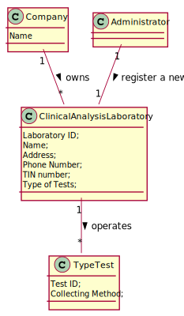

# US 08 - To register a new clinical analysis laboratory

## 1. Requirements Engineering

### 1.1. User Story Description

As an administrator, I want to register a new clinical analysis laboratory stating which kind of test(s) it operates.

### 1.2. Customer Specifications and Clarifications 

**From the specifications document:**

> "Many Labs is a company that [...] has a network of clinical analysis laboratories in England where analysis of blood (samples are collected) are performed, as well as Covid-19 tests. Many Labs performs two types of tests [...] Despite being out of scope, the system should be developed having in mind the need to
easily support other kinds of tests (e.g., urine)." 

**From the client clarifications:**

> **Question:** Is there a maximum limit of types of tests a clinical analysis laboratory can operate?
>
> **Answer:** No.
>
> **Link:** https://moodle.isep.ipp.pt/mod/forum/discuss.php?d=7553#p9817
>

-

> **Question:** We know through the specifications document that "All Many Labs clinical analysis laboratories perform clinical blood tests". but when creating a new Clinical Analysis Laboratory, should the system automatically record that it operates that type of test or should the person who is creating it select it manually while selecting other types of tests? Or other option?
>  
> **Answer:** The administrator should select, manually, all the types of tests to be performed by the Clinical Analysis Laboratory.
>
> **Link:** https://moodle.isep.ipp.pt/mod/forum/discuss.php?d=7553#p9817
>

-

> **Question:** Should the employees be allocated to the clinical lab in which they work? Or, for example, can one medical lab technician work in more than one clinical analysis lab?
>  
> **Answer:** Each Receptionist and each Medical Lab Technician can work in any Clinical Analysis Laboratory of the Many Labs network.
>
> **Link:** https://moodle.isep.ipp.pt/mod/forum/discuss.php?d=7603#p9891
>

-

> **Question:** Which type/format has LaboratoryID, address, name, phone number, and TIN number on Clinical Analysis Laboratory?
>
> **Answer:** Each Clinical Analysis Laboratory is characterized by the following attributes:
>
>Laboratory ID: five alphanumeric characters;
>
>Name: A string with no more than 20 characters;
>
>Address: A string with no more than 30 characters;
>
>Phone Number: 11 digit number;
>
>TIN number: 10 digit number;
>
>Type of tests performed by the lab.
>
> All information is required.
>
> **Link:** https://moodle.isep.ipp.pt/mod/forum/discuss.php?d=7636#p9940
>

-

> **Question:** Are the test types in US8 typed in or selected from those that the program has?
>
> **Answer:** The test types are selected from a list.
>
> **Link:** https://moodle.isep.ipp.pt/mod/forum/discuss.php?d=7707#p10047
>

-

> **Question:** When registering a new laboratory does the administrator selects or write the type of tests performed by a clinical Analysis laboratory?
>
> **Answer:** Yes. In Sprint B requirements we get: "US8: As an administrator, I want to register a new clinical analysis laboratory stating which kind of test(s) it operates".
>
> **Link:** https://moodle.isep.ipp.pt/mod/forum/discuss.php?d=7749#p10099
>

-

> **Question:** Can a parameter be classified in more than one parameter category?
>
> **Answer:** No. Each parameter has only one category. There are no subcategories.
>
> **Link:** https://moodle.isep.ipp.pt/mod/forum/discuss.php?d=7749#p10099
>

### 1.3. Acceptance Criteria

* **AC1:** "Name cannot be empty and has, at maximum, 15 chars."

* **AC2:** "Address cannot be empty and has, at maximum, 30 chars."

* **AC3:** "Phone number is an 11 digit number."

* **AC4:** "TIN is a 10 digit number."

### 1.4. Found out Dependencies

There is a dependency to "US9: As an administrator, I want to specify a new type of test and its collecting methods." since at least a type of test must exist to specify which type of test the clinical analysis laboratory operates.

### 1.5 Input and Output Data

**Input Data:**
* Typed data:
    * Laboratory ID
    * Name
    * Address
    * Phone number
    * TIN number
    
* Selected data: 
    * Type of Tests

**Output Data:**
* (In)Success of the operation

### 1.6. System Sequence Diagram (SSD)

*Insert here a SSD depicting the envisioned Actor-System interactions and throughout which data is inputted and outputted to fulfill the requirement. All interactions must be numbered.*

### 1.7 Other Relevant Remarks

*Use this section to capture other relevant information that is related with this US such as (i) special requirements ; (ii) data and/or technology variations; (iii) how often this US is held.* 

## 2. OO Analysis

### 2.1. Relevant Domain Model Excerpt 

### 2.2. Other Remarks

## 3. Design - User Story Realization 

### 3.1. Rationale

**The rationale grounds on the SSD interactions and the identified input/output data.**

| Interaction ID | Question: Which class is responsible for... | Answer  | Justification (with patterns)  |
|:-------------  |:--------------------- |:------------|:---------------------------- |
| Step 1: wants to register a new clinical analysis laboratory                   | ... registering a new clinical analysis laboratory?                               | CreateClinicalAnalysisLabUI         | IE: the interface interacts with the actor.                                                                               |
| Step 2: requests data (laboratory ID, name, address, phone number, TIN number) | ... requesting the essential data?                                                |                                     |                                                                                                                           |
| Step 3: types requested data                                                   | ... coordinating the US?                                                          | CreateClinicalAnalysisLabController | IE: it knows and controls the information needed, sending it to the next procedures.                                      |
|                                                                                | ... creating and storing the information of the new clinical analysis laboratory? | Company                             | IE: it's the owner and has to create a place to store all the information needed of the new clinical analysis laboratory. |
|                                                                                | ... creating and validating the clinical analysis laboratory?                     | ClinicalAnalysisLabStore            | IE: it's the place that stores all the necessary data for the new clinical analysis laboratory.                           |
|                                                                                | ... getting the types of tests?                                                   | TestTypeStore                       | IE: it's the place that stores the types of tests operated.                                                               |
| Step 4: shows types of test list and asks to select types                      | ... showing and asking about the types of tests?                                  |                                     |                                                                                                                           |
| Step 5: selects types of tests                                                 | ... setting and validating the type of tests?                                     | ClinicalAnalysisLaboratory          | IE: it has the authority to select and validate the type of tests it does.                                                |
| Step 6: shows all data and requests confirmation                               | ... showing and requesting the data confirmation?                                 |                                     |                                                                                                                           |
| Step 7: confirms the data                                                      | ... confirming the data?                                                          | CreateClinicalAnalysisLabUI         | IE: the interface interacts with the actor.                                                                               |
|                                                                                | ... saving and validating the new clinical analysis laboratory?                   | ClinicalAnalysisLabStore            | IE: it's the place that stores all the necessary data for the new clinical analysis laboratory.                           |
| Step 8: informs operation success                                              | ... informing operation success?                                                  | CreateClinicalAnalysisLabUI         | IE: the interface interacts with the actor.                                                                               | 

### Systematization ##

According to the taken rationale, the conceptual classes promoted to software classes are: 

 * Company
 * ClinicalAnalysisLaboratory

Other software classes (i.e. Pure Fabrication) identified: 
 
 * CreateClinicalAnalysisLabUI  
 * CreateClinicalAnalysisLabController
 * ClinicalAnalysisLabStore
 * TestTypeStore

## 3.2. Sequence Diagram (SD)

*In this section, it is suggested to present an UML dynamic view stating the sequence of domain related software objects' interactions that allows to fulfill the requirement.* 

## 3.3. Class Diagram (CD)

*In this section, it is suggested to present an UML static view representing the main domain related software classes that are involved in fulfilling the requirement as well as and their relations, attributes and methods.*

# 4. Tests 
*In this section, it is suggested to systematize how the tests were designed to allow a correct measurement of requirements fulfilling.* 

**_DO NOT COPY ALL DEVELOPED TESTS HERE_**

**Test 1:** Check that it is not possible to create an instance of the Example class with null values. 

	@Test(expected = IllegalArgumentException.class)
		public void ensureNullIsNotAllowed() {
		Exemplo instance = new Exemplo(null, null);
	}

*It is also recommended to organize this content by subsections.* 

# 5. Construction (Implementation)

*In this section, it is suggested to provide, if necessary, some evidence that the construction/implementation is in accordance with the previously carried out design. Furthermore, it is recommeded to mention/describe the existence of other relevant (e.g. configuration) files and highlight relevant commits.*

*It is also recommended to organize this content by subsections.* 

# 6. Integration and Demo 

*In this section, it is suggested to describe the efforts made to integrate this functionality with the other features of the system.*

# 7. Observations

*In this section, it is suggested to present a critical perspective on the developed work, pointing, for example, to other alternatives and or future related work.*

