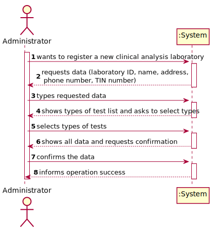
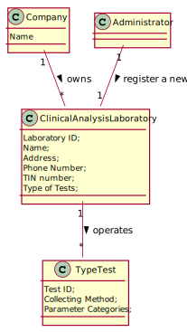
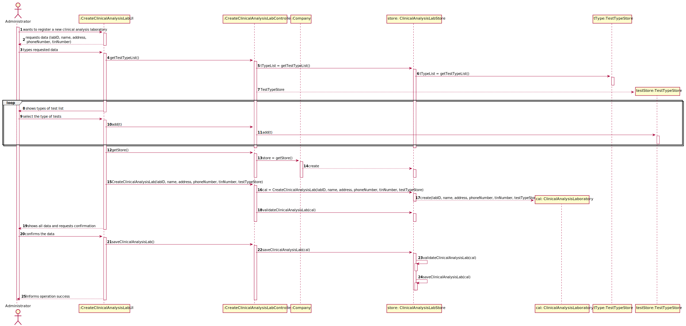
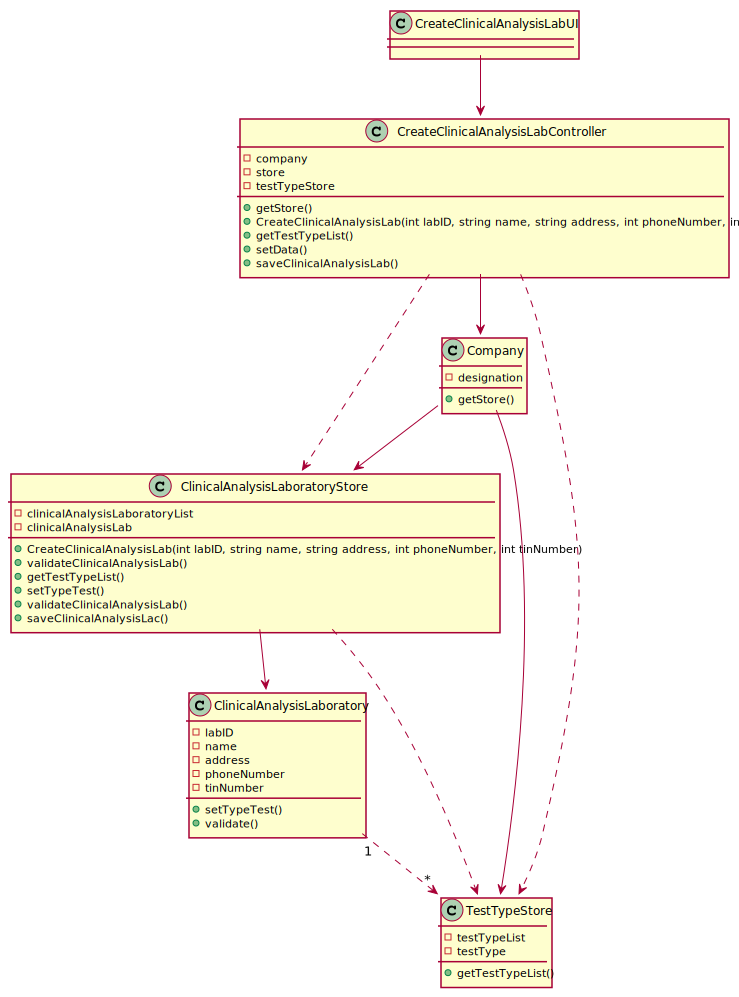

# US 08 - To register a new clinical analysis laboratory

## 1. Requirements Engineering

### 1.1. User Story Description

As an administrator, I want to register a new clinical analysis laboratory stating which kind of test(s) it operates.

### 1.2. Customer Specifications and Clarifications

**From the specifications document:**

> "Many Labs is a company that [...] has a network of clinical analysis laboratories in England where analysis of blood (samples are collected) are performed, as well as Covid-19 tests. Many Labs performs two types of tests [...] Despite being out of scope, the system should be developed having in mind the need to easily support other kinds of tests (e.g., urine)."

**From the client clarifications:**

> **Question:** Is there a maximum limit of types of tests a clinical analysis laboratory can operate?
>
> **Answer:** No.
>
> **Link:** https://moodle.isep.ipp.pt/mod/forum/discuss.php?d=7553#p9817
>

-

> **Question:** We know through the specifications document that "All Many Labs clinical analysis laboratories perform clinical blood tests". but when creating a new Clinical Analysis Laboratory, should the system automatically record that it operates that type of test or should the person who is creating it select it manually while selecting other types of tests? Or other option?
>
> **Answer:** The administrator should select, manually, all the types of tests to be performed by the Clinical Analysis Laboratory.
>
> **Link:** https://moodle.isep.ipp.pt/mod/forum/discuss.php?d=7553#p9817
>

-

> **Question:** Should the employees be allocated to the clinical lab in which they work? Or, for example, can one medical lab technician work in more than one clinical analysis lab?
>
> **Answer:** Each Receptionist and each Medical Lab Technician can work in any Clinical Analysis Laboratory of the Many Labs network.
>
> **Link:** https://moodle.isep.ipp.pt/mod/forum/discuss.php?d=7603#p9891
>

-

> **Question:** Which type/format has LaboratoryID, address, name, phone number, and TIN number on Clinical Analysis Laboratory?
>
> **Answer:** Each Clinical Analysis Laboratory is characterized by the following attributes:
>
>Laboratory ID: five alphanumeric characters;
>
>Name: A string with no more than 20 characters;
>
>Address: A string with no more than 30 characters;
>
>Phone Number: 11 digit number;
>
>TIN number: 10 digit number;
>
>Type of tests performed by the lab.
>
> All information is required.
>
> **Link:** https://moodle.isep.ipp.pt/mod/forum/discuss.php?d=7636#p9940
>

-

> **Question:** Are the test types in US8 typed in or selected from those that the program has?
>
> **Answer:** The test types are selected from a list.
>
> **Link:** https://moodle.isep.ipp.pt/mod/forum/discuss.php?d=7707#p10047
>

-

> **Question:** When registering a new laboratory does the administrator selects or write the type of tests performed by a clinical Analysis laboratory?
>
> **Answer:** Yes. In Sprint B requirements we get: "US8: As an administrator, I want to register a new clinical analysis laboratory stating which kind of test(s) it operates".
>
> **Link:** https://moodle.isep.ipp.pt/mod/forum/discuss.php?d=7749#p10099
>

-

> **Question:** Can a parameter be classified in more than one parameter category?
>
> **Answer:** No. Each parameter has only one category. There are no subcategories.
>
> **Link:** https://moodle.isep.ipp.pt/mod/forum/discuss.php?d=7749#p10099
>

### 1.3. Acceptance Criteria

* **AC1:** "Name cannot be empty and has, at maximum, 20 chars."

* **AC2:** "Address cannot be empty and has, at maximum, 30 chars."

* **AC3:** "Phone number is an 11 digit number."

* **AC4:** "TIN is a 10 digit number."

* **AC5:** "The test types are selected from a list."

### 1.4. Found out Dependencies

There is a dependency to "US9: As an administrator, I want to specify a new type of test and its collecting methods."
since at least a type of test must exist to specify which type of test the clinical analysis laboratory operates.

### 1.5 Input and Output Data

**Input Data:**

* Typed data:
    * Laboratory ID
    * Name
    * Address
    * Phone number
    * TIN number

* Selected data:
    * Type of Tests

**Output Data:**

* (In)Success of the operation

### 1.6. System Sequence Diagram (SSD)

*Insert here a SSD depicting the envisioned Actor-System interactions and throughout which data is inputted and
outputted to fulfill the requirement. All interactions must be numbered.*



### 1.7 Other Relevant Remarks

*Use this section to capture other relevant information that is related with this US such as (i) special requirements
; (ii) data and/or technology variations; (iii) how often this US is held.*

## 2. OO Analysis

### 2.1. Relevant Domain Model Excerpt



### 2.2. Other Remarks

## 3. Design - User Story Realization

### 3.1. Rationale

**The rationale grounds on the SSD interactions and the identified input/output data.**

| Interaction ID | Question: Which class is responsible for... | Answer  | Justification (with patterns)  |
|:-------------  |:--------------------- |:------------|:---------------------------- |
| Step 1: wants to register a new clinical analysis laboratory                   | ... registering a new clinical analysis laboratory?                               | CreateClinicalAnalysisLabUI         | IE: the interface interacts with the actor.                                                                               |
| Step 2: requests data (laboratory ID, name, address, phone number, TIN number) | ... requesting the essential data?                                                |                                     |                                                                                                                           |
| Step 3: types requested data                                                   | ... coordinating the US?                                                          | CreateClinicalAnalysisLabController | IE: it knows and controls the information needed, sending it to the next procedures.                                      |
|                                                                                | ... creating and storing the information of the new clinical analysis laboratory? | Company                             | IE: it's the owner and has to create a place to store all the information needed of the new clinical analysis laboratory. |
|                                                                                | ... creating and validating the clinical analysis laboratory?                     | ClinicalAnalysisLabStore            | IE: it's the place that stores all the necessary data for the new clinical analysis laboratory.                           |
|                                                                                | ... getting the types of tests?                                                   | TestTypeStore                       | IE: it's the place that stores the types of tests operated.                                                               |
| Step 4: shows types of test list and asks to select types                      | ... showing and asking about the types of tests?                                  |                                     |                                                                                                                           |
| Step 5: selects types of tests                                                 | ... setting and validating the type of tests?                                     | ClinicalAnalysisLaboratory          | IE: it has the authority to select and validate the type of tests it does.                                                |
| Step 6: shows all data and requests confirmation                               | ... showing and requesting the data confirmation?                                 |                                     |                                                                                                                           |
| Step 7: confirms the data                                                      | ... confirming the data?                                                          | CreateClinicalAnalysisLabUI         | IE: the interface interacts with the actor.                                                                               |
|                                                                                | ... saving and validating the new clinical analysis laboratory?                   | ClinicalAnalysisLabStore            | IE: it's the place that stores all the necessary data for the new clinical analysis laboratory.                           |
| Step 8: informs operation success                                              | ... informing operation success?                                                  | CreateClinicalAnalysisLabUI         | IE: the interface interacts with the actor.                                                                               | 

### Systematization ##

According to the taken rationale, the conceptual classes promoted to software classes are:

* Company
* ClinicalAnalysisLaboratory

Other software classes (i.e. Pure Fabrication) identified:

* CreateClinicalAnalysisLabUI
* CreateClinicalAnalysisLabController
* ClinicalAnalysisLabStore
* TestTypeStore

## 3.2. Sequence Diagram (SD)

*In this section, it is suggested to present an UML dynamic view stating the sequence of domain related software
objects' interactions that allows to fulfill the requirement.*



## 3.3. Class Diagram (CD)

*In this section, it is suggested to present an UML static view representing the main domain related software classes
that are involved in fulfilling the requirement as well as and their relations, attributes and methods.*



# 4. Tests

**Test 1:** Check that it is not possible to create an instance of the Clinical Lab Analysis class with null values.

    @Test(expected = IllegalArgumentException.class)
    public void ClinicalNull() {
        ClinicalAnalysisLab cli = new ClinicalAnalysisLab(null,null,null,null,null,null);
    }

**Test2** Check that it is not possible to create an instance of the Clinical Lab Analysis class with name with more
letters than the maximum (AC1).

````
    @Test(expected = IllegalArgumentException.class)
    public void RegisterLabNameTooLong() {
        ParameterCategory pc1 = new ParameterCategory("AE554", "Hemogram");
        cat.add(pc1);
        TestType t = new TestType("283h3", "descrição", "metodo 1", cat);
        //Arrange + Act
        ClinicalAnalysisLab lab = new ClinicalAnalysisLab("laboratorio laboratorio dois","porto", "2gs45","6357976543","16297483987", t);
    }
    
````

**Test3** Check that it is not possible to create an instance of the Clinical Lab Analysis class with name blank (AC1).

````
    @Test(expected = IllegalArgumentException.class)
    public void RegisterLabNameBlank() {
        ParameterCategory pc1 = new ParameterCategory("AE554", "Hemogram");
        cat.add(pc1);
        TestType t = new TestType("283h3", "descrição", "metodo 1", cat);
        //Arrange + Act
        ClinicalAnalysisLab lab = new ClinicalAnalysisLab("","porto", "2gs45","6334906543","16274835987", t);
    }
````

**Test4** Check that it is not possible to create an instance of the Clinical Lab Analysis class with address blank (
AC2).

```
    @Test(expected = IllegalArgumentException.class)
    public void RegisterAddressBlank() {
        ParameterCategory pc1 = new ParameterCategory("AE554", "Hemogram");
        cat.add(pc1);
        TestType t = new TestType("283h3", "descrição", "metodo 1", cat);
        //Arrange + Act
        ClinicalAnalysisLab lab = new ClinicalAnalysisLab("laboratorio dois","", "2gs45","6334906543","16274835987", t);
    }
```

**Test5** Check that it is not possible to create an instance of the Clinical Lab Analysis class with address with more
letters than the minimum (AC2).

````
    @Test(expected = IllegalArgumentException.class)
    public void RegisterLabAddressTooLong() {
        ParameterCategory pc1 = new ParameterCategory("AE554", "Hemogram");
        cat.add(pc1);
        TestType t = new TestType("283h3", "descrição", "metodo 1", cat);
        //Arrange + Act
        ClinicalAnalysisLab lab = new ClinicalAnalysisLab("laboratorio dois","rio, porto, portugal, europa, terra", "2gs45","6357976543","16275483987", t);
    }
````

**Test6** Check that it is not possible to create an instance of the Clinical Lab Analysis class with invalid TIN
number (AC3).

````
    @Test(expected = IllegalArgumentException.class)
    public void RegisterPhoneNumberNotElevenDigits() {
        ParameterCategory pc1 = new ParameterCategory("AE554", "Hemogram");
        cat.add(pc1);
        TestType t = new TestType("283h3", "descrição", "metodo 1", cat);
        //Arrange + Act
        ClinicalAnalysisLab lab = new ClinicalAnalysisLab("laboratorio dois","porto", "2gs45","6334906543","16274980843573987", t);
    }
````

**Test7** Check that it is not possible to create an instance of the Clinical Lab Analysis class with TIN number (AC4).

````
    @Test(expected = IllegalArgumentException.class)
    public void RegisterTinNot10Digits() {
        ParameterCategory pc1 = new ParameterCategory("AE554", "Hemogram");
        cat.add(pc1);
        TestType t = new TestType("283h3", "descrição", "metodo 1", cat);
        //Arrange + Act
        ClinicalAnalysisLab lab = new ClinicalAnalysisLab("laboratorio dois","porto", "2gs45","63349369906543","16274835987", t);
    }
````

# 5. Construction (Implementation)

## Class ClinicalAnalysisLab

```
public class ClinicalAnalysisLab {
    private String name;
    private String address;
    private String id;
    private String tin;
    private String phoneNumber;
    private TestType tType;

    /**
     * Constructor of the ClinicalAnalysisLab, it calls methods in order to validate the parameters
     * @param name name of the Clinical Analysis Lab
     * @param address address of the Clinical Analysis Lab
     * @param id id of Clinical Analysis Lab
     * @param tin TIN of Clinical Analysis Lab
     * @param phoneNumber Phone Number Clinical Analysis Lab
     * @param tType list of Test Types associated with the test
     */
    public ClinicalAnalysisLab(String name, String address, String id, String tin, String phoneNumber, TestType tType) {
        checkNameRules(name);
        checkAddressRules(address);
        checkPhoneNumberRules(phoneNumber);
        checkLabIDRules(id);
        checkTINNumberRules(tin);
        checkTestTypeRules(tType);
        this.name = name;
        this.address = address;
        this.id = id;
        this.tin = tin;
        this.phoneNumber = phoneNumber;
        this.tType = tType;
    }

    /**
     * This method checks if the list of Types of tests provided meets the requirements, if not it throws a exception making the execution to stop
     * @param tType list of Test Types associated with the test
     */
    private void checkTestTypeRules(TestType tType) {
        if (tType == null)
            throw new IllegalArgumentException("Collecting method cannot be blank.");
    }

    /**
     * This method checks if the code provided meets the requirements, if not it throws a exception making the execution to stop
     *
     * @param id laboratory's ID
     */
    private void checkLabIDRules(String id) {
        if (StringUtils.isBlank(id))
            throw new IllegalArgumentException("Laboratory ID cannot be blank.");
        if (id.length() != 5)
            throw new IllegalArgumentException("Laboratory ID must have 5 chars.");
    }


    public ClinicalAnalysisLab(TestType testType) {
        this.tType = testType;
    }

    /**
     * This method checks if the code provided meets the requirements, if not it throws a exception making the execution to stop
     *
     * @param name name of the laboratory
     */
    private void checkNameRules(String name) {
        if (StringUtils.isBlank(name))
            throw new IllegalArgumentException("Name cannot be blank.");
        if (name.length() < 15)
            throw new IllegalArgumentException("Name must have at least 15 chars.");
    }

    /**
     * This method checks if the code provided meets the requirements, if not it throws a exception making the execution to stop
     *
     * @param address address of the laboratory
     */
    private void checkAddressRules(String address) {
        if (StringUtils.isBlank(address))
            throw new IllegalArgumentException("Address cannot be blank.");
        if (address.length() > 30)
            throw new IllegalArgumentException("Address has, at maximum, 30 chars.");
    }

    /**
     * This method checks if the code provided meets the requirements, if not it throws a exception making the execution to stop
     *
     * @param phoneNumber phone number of the laboratory
     */
    private void checkPhoneNumberRules(String phoneNumber) {
        if (StringUtils.isBlank(phoneNumber))
            throw new IllegalArgumentException("Phone number cannot be blank.");
        if (phoneNumber.length() != 11)
            throw new IllegalArgumentException("Phone number must have 11 chars.");
        phoneNumber = phoneNumber.toLowerCase();
        char[] charArray = phoneNumber.toCharArray();
        for (int i = 0; i < charArray.length; i++) {
            char c = charArray[i];
            if (!(c >= '0' && c <= '9')) {
                throw new IllegalArgumentException("Phone Number only accepts numbers.");
            }
        }
    }

    /**
     * This method checks if the code provided meets the requirements, if not it throws a exception making the execution to stop
     *
     * @param tin TIN of the laboratory
     */
    private void checkTINNumberRules(String tin) {
        if (StringUtils.isBlank(tin))
            throw new IllegalArgumentException("TIN cannot be blank.");
        if (tin.length() != 10)
            throw new IllegalArgumentException("TIN must have 10 chars.");
        tin = tin.toLowerCase();
        char[] charArray = tin.toCharArray();
        for (int i = 0; i < charArray.length; i++) {
            char c = charArray[i];
            if (!(c >= '0' && c <= '9')) {
                throw new IllegalArgumentException("TIN only accepts numbers.");
            }
        }
    }

    /**
     * @return A string with the format ClinicalAnalysisLab: name= name, address= address, id= id, tin=tType, phonenumber= phoneNumber, typetest= (list of tests);
     */
    @Override
    public String toString() {
        return "ClinicalAnalysisLab: " +
                "name=" + this.name +
                ", address=" + this.address +
                ", id=" + this.id +
                ", tin=" + this.tType +
                ", phonenumber=" + this.phoneNumber +
                ", typetest=" + this.tType.toString();
    }
}

```

## Class ClinicalAnalysisLabStore

````java
package app.domain.model;

import java.util.ArrayList;
import java.util.List;

/**
 * Class that represents an List of all the Clinical Analysis Lab in the system
 */
public class ClinicalAnalysisLabStore {
    List<ClinicalAnalysisLab> array;
    ClinicalAnalysisLab cal;

    /**
     * Constructor of the class it creates an empty list to be filled with objects of Clinical Analysis Lab
     */
    public ClinicalAnalysisLabStore() {
        this.array = new ArrayList<ClinicalAnalysisLab>();
    }

    /**
     * This method creates a new Clinical Analysis Lab object by calling his constructor
     *
     * @param name        name of the Clinical Analysis Lab
     * @param address     address of the Clinical Analysis Lab
     * @param id          id of Clinical Analysis Lab
     * @param tin         TIN of Clinical Analysis Lab
     * @param phoneNumber Phone Number Clinical Analysis Lab
     * @param tType       list of Test Types associated with the test
     * @return Clinical Analysis Lab object created
     */
    public ClinicalAnalysisLab CreateClinicalAnalysisLab(String name, String address, String id, String tin, String phoneNumber, TestType tType) {
        this.cal = new ClinicalAnalysisLab(name, address, id, tin, phoneNumber, tType);
        return this.cal;
    }

    /**
     * this method checks if the Clinical Analysis Lab object received is not null, if don't already exists in the ArrayList
     *
     * @param cal Clinical Analysis Lab object
     * @return boolean value that is true if the object is not null and dont already exists in the ArrayList
     */
    public boolean ValidateClinicalAnalysisLab(ClinicalAnalysisLab cal) {
        if (cal == null || contains(cal)) {
            return false;
        }
        return true;
    }

    /**
     * this method checks if the Clinical Analysis Lab object received already exits in the ArrayList
     *
     * @param cal Clinical Analysis Lab object
     * @return boolean value that is true if the object already exists in the ArrayList
     */

    public boolean contains(ClinicalAnalysisLab cal) {
        if (this.array.contains(cal)) {
            return true;
        } else {
            return false;
        }
    }

    /**
     * this method is used to save the Clinical Analysis Lab object in the arrayList already created, before adding the object the method validates it
     *
     * @return a boolean value that indicates the success of the operation
     */
    public boolean saveClinicalAnalysisLab() {
        if (ValidateClinicalAnalysisLab(this.cal)) {
            add(cal);
            return true;
        } else {
            return false;
        }
    }

    /**
     * this method adds the Clinical Analysis Lab object to the arrayList
     *
     * @param cal ParameterCategory object
     * @return a boolean value that indicates the success of the operation
     */
    public boolean add(ClinicalAnalysisLab cal) {
        array.add(cal);
        return true;
    }

    /**
     * This method search for an Clinical Analysis Lab object by the index of that object in the ArrayList
     *
     * @param index index of the array list where we want to get the object
     * @return the Clinical Analysis Lab object that was in the index of the array list
     */
    public ClinicalAnalysisLab get(int index) {
        return array.get(index);
    }

    /**
     * Go through all the objects in the ArrayList and appends the String of the method toString to a new String creating a new line for object
     *
     * @return String with all the objects in the ArrayList
     */
    public String toString() {
        StringBuilder listString = new StringBuilder();

        for (ClinicalAnalysisLab s : array) {
            listString.append(s.toString()).append("\n");
        }
        return String.valueOf(listString);
    }

    /**
     * @return Parameter Category object
     */
    public ClinicalAnalysisLab getCal() {
        return cal;
    }

}
````

## Class ClinicalAnalysisLabController

````java
package app.controller;

import app.domain.model.Company;
import app.domain.model.*;

/**
 * Controller of the UserStory : Register a new clinical analysis laboratory
 */
public class ClinicalAnalysisLabController {
    private Company company;
    private ClinicalAnalysisLabStore store;
    private ClinicalAnalysisLab cal;
    private TestTypeStore typeTStore;

    /**
     * Constructor of the class, gets an instance of the company class
     */
    public ClinicalAnalysisLabController() {
        this(App.getInstance().getCompany());
    }

    /**
     * Constructor of the class, receives an instance of the company class
     *
     * @param company instance of Company
     */
    public ClinicalAnalysisLabController(Company company) {
        this.company = company;
        this.cal = null;
    }

    /**
     * Creates a new ClinicalAnalysisLab  instance, firstly creates a instance of ClinicalAnalysisLabStore and then call the method of this instance that creates the ClinicalAnalysisLab instance
     * @param name name of the Clinical Analysis Lab
     * @param address address of the Clinical Analysis Lab
     * @param id id of Clinical Analysis Lab
     * @param tin TIN of Clinical Analysis Lab
     * @param phoneNumber Phone Number Clinical Analysis Lab
     * @param tType list of Test Types associated with the test
     */
    public void createClinicalAnalysisLab(String name, String address, String id, String tin, String phoneNumber, TestType tType) {
        store = company.getClinicalAnalysisLabList();
        store.CreateClinicalAnalysisLab(name, address, id, tin, phoneNumber, tType);

    }

    /**
     * @return the list with all the Type if Tests in the system
     */
    public TestTypeStore getTypetestList() {
        return this.typeTStore = company.TestTypeList();
    }

    /**
     * @return String that represents the ClinicalAnalysisLab instance
     */
    public ClinicalAnalysisLab getcal() {
        return store.getCal();
    }

    /**
     * Calls the method of the instance of ClinicalAnalysisLabStore that saves the ClinicalAnalysisLab instance in the ArrayList
     *
     * @return success of the operation
     */
    public boolean saveClinicalAnalysisLab() {
        return this.store.saveClinicalAnalysisLab();
    }

}

````

## Class ClinicalAnalysisLabUI

```` 
package app.ui.console;

import app.controller.ClinicalAnalysisLabController;
import app.controller.ParameterController;
import app.domain.model.ClinicalAnalysisLab;
import app.domain.model.ParameterCategory;
import app.domain.model.TestType;
import app.ui.console.utils.Utils;

public class ClinicalAnalysisLabUI implements Runnable {

    private ClinicalAnalysisLabController ctrl;

    public ClinicalAnalysisLabUI() {
        this.ctrl = new ClinicalAnalysisLabController();
    }


    /**
     * When an object implementing interface {@code Runnable} is used
     * to create a thread, starting the thread causes the object's
     * {@code run} method to be called in that separately executing
     * thread.
     * <p>
     * The general contract of the method {@code run} is that it may
     * take any action whatsoever.
     *
     * @see Thread#run()
     */
    @Override
    public void run() {
        boolean cont = true;
        if (ctrl.getTypetestList() == null || ctrl.getTypetestList().isEmpty()) {
            System.out.println("There are no TestTypes added to the system please add at least one before trying to create a new Clinical Analysis Lab");
        } else {
            do {
                boolean exception = false;
                do {
                    try {
                        String name = Utils.readLineFromConsole("Please enter the name of the new Clinical Analysis Lab");
                        String address = Utils.readLineFromConsole("Please enter the address of the new Clinical Analysis Lab");
                        String id = Utils.readLineFromConsole("Please enter the id of the new Clinical Analysis Lab");
                        String tin = Utils.readLineFromConsole("Please enter the tin of the new Clinical Analysis Lab");
                        String phoneNumber = Utils.readLineFromConsole("Please enter the phoneNumber of the new Clinical Analysis Lab");
                        TestType testType = (TestType) Utils.showAndSelectOne(ctrl.getTypetestList().getList(), "Select a TypeTest");

                        ctrl.createClinicalAnalysisLab(name,address,id,tin,phoneNumber,testType);
                        exception = false;
                    } catch (Exception e) {
                        e.printStackTrace();
                        System.out.println("An error occurred during the creation during the creation of the Clinical Analysis Lab please try again");
                        exception = true;
                    }
                } while (exception);

                cont = Utils.confirm("The following Clinical Analysis Lab was created do you want to save? " + ctrl.getcal().toString());
                if (cont) {

                    if (ctrl.saveClinicalAnalysisLab()) {
                        System.out.println("The Clinical Analysis Lab was saved with success");
                    }

                } else {
                    System.out.println("Couldn't save the Clinical Analysis Lab please try again ");
                }


            } while (!cont);

        }
    }
}
````

# 6. Integration and Demo

- A new option was added in the Admin Menu

# 7. Observations


