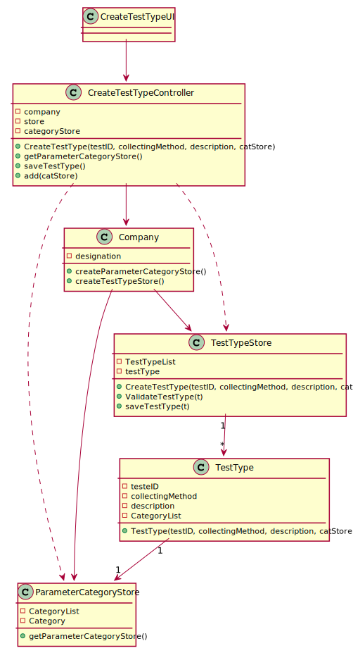

# US 09 - To specify a new type of test and its collecting methods.

## 1. Requirements Engineering

### 1.1. User Story Description

As an administrator, I want to specify a new type of test and its collecting methods.

### 1.2. Customer Specifications and Clarifications

**From the specifications document:**
> "Despite being out of scope, the system should be developed having in mind the need to easily support other kinds of tests (e.g., urine). Regardless, such tests rely on measuring one or more parameters that can be grouped/organized by categories."

**From the client clarifications:**

> **Question:** Does a type of test holds any attribute besides its name and collecting methods?
>
> **Answer:** The attributes for a new test type are:            
> . Code: five alphanumeric characters. The code is not automatically generated.
>
>   . Description: a string with no more than 15 characters.
>
>   . Collecting Method: a string with no more than 20 characters.
>
>   Each test type should have a set of categories.
>
>   Each category should be chosen from a list of categories.
>
>   Each category has a name and a unique code. There are no subcategories.
>
>   There exists only one collection method per test type.
>
> **Link:** https://moodle.isep.ipp.pt/mod/forum/discuss.php?d=7512#p9768

-

> **Question:** What does the client mean by the collecting methods and  what collecting methods  are available?
> Are the collecting methods stored simpled as a word or a sentence, or does it also must contain its description, and/or another attributes?
>
> **Answer:** To make a Covid test you need a swab to collect a sample. To make a blood test you need sample tubes and a syringe. When the administrator specifies a new type of test, the administrator also specifies the method to collect a sample. The administrator introduces a brief description for specifying the collecting method.
>
> **Link:** https://moodle.isep.ipp.pt/mod/forum/discuss.php?d=7752#p10102

### 1.3. Acceptance Criteria

- **AC1:** Collecting Method cannot be empty and has a string of 20 characters, at maximum.
- **AC2:** Description cannot be empty and has, at maximum, 15 chars.
- **AC3:** Code is a string with 5 alphanumeric characters.
- **AC4** Category has a name and a unique code.

### 1.4. Found out Dependencies

There is a dependecy to "US10: As an administrator, I want to specify a new parameter and categorize it."
since each test type should have a set of categories.

### 1.5 Input and Output Data

**Input Data:**

* Typed data:
    * Code
    * Collecting method
    * Description

* Selected data:
    * Category list

**Output Data:**

* (In)Success of the operation

### 1.6. System Sequence Diagram (SSD)

### 1.7 Other Relevant Remarks

The number of times this US will be used is very low. Many Labs does Covid-19 and Blood tests so, we expect to use this
US twice. It might be used more times when Many Labs starts to make other types of test (Urine tests, for example).

## 2. OO Analysis

### 2.1. Relevant Domain Model Excerpt

### 2.2. Other Remarks

## 3. Design - User Story Realization

### 3.1. Rationale

**The rationale grounds on the SSD interactions, and the identified input/output data.**

| Interaction ID | Question: Which class is responsible for... | Answer  | Justification (with patterns)  |
|:-------------  |:--------------------- |:------------|:---------------------------- |
| Step 1: wants to specify a new type of test |... interacting with the actor? | CreateTestTypeUI | Pure Fabrication: there is no reason to assign this responsibility to any existing class in the Domain Model.|
| | ... coordinating the US? | CreateParameterController | Controller  |
| | ... instantiating a new Parameter Category Store List? | Company | Creator: R1/2: we look to decrease the responsibilities assign to the the Company class in order to go accordingly to GRASP|
|   | ... getting the list of Parameter Categories? |Company| Creator: R1/2 |
| Step 2: confirms the category|... adding the chose Parameter Categories to the Category List associated to the test type?    |   ParameterCategoryStore  |  IE: responsible for saving all parameter categories |                                                                               |
| Step 3: types requested data  |    ... create a Test Type Store List?|  Company | Creator: R1/2  |
| |... create a Test Type? | TestTypeStore|IE: responsible for saving all Test Types|
| |... validate the Test Type? | TestTypeStore | IE: knows/has all the TestType objects|
| Step 4: confirms the data |    ... saving the Test Type? | TestTypeStore |IE: responsible for saving all Test Types|                          |                                                                                        |

### Systematization ##

According to the taken rationale, the conceptual classes promoted to software classes are:

* Company
* TestType

Other software classes (i.e. Pure Fabrication) identified:

* CreateTestTypeUI
* CreateTestTypeController
* TestTypeStore
* ParameterCategoryStore

## 3.2. Sequence Diagram (SD)

## 3.3. Class Diagram (CD)

# 4. Tests

**Test 1:** Checks that it is not possible to create an instance of the TestType class with null values.

	@Test(expected = IllegalArgumentException.class)
		public void ensureNullIsNotAllowed() {
		TestType instance = new Exemplo(null, null, null, null);
	}

**Tests AC1**

***Test AC1.1:*** Checks that it is not possible to create an instance of the TestType class with a long collecting
method containing more than 20 chars.

    @Test(expected = IllegalArgumentException.class)
        public void CreateInvalidTestTypeCollectingMethodOver20Chars() {
    
            ParameterCategoryStore cat = new ParameterCategoryStore();
            ParameterCategory pc1 = new ParameterCategory("AE554", "Hemogram");
            ParameterCategory pc2 = new ParameterCategory("A8554", "Hemograma");
            cat.add(pc1);
            cat.add(pc2);
            TestType t = new TestType("283h3", "descrição", "metodo 1 metodo 2 metodo 3", cat);
        }

***Test AC1.2:*** Checks that it is not possible to create an instance of the TestType class without a collecting
method.

    @Test(expected = IllegalArgumentException.class)
        public void CreateInvalidTestTypeBlankCollectingMethod() {
            ParameterCategoryStore cat = new ParameterCategoryStore();
            ParameterCategory pc1 = new ParameterCategory("AE554", "Hemogram");
            ParameterCategory pc2 = new ParameterCategory("A8554", "Hemograma");
            cat.add(pc1);
            cat.add(pc2);
            TestType t = new TestType("283h3", "descrição", "", cat);
        }                        

**Tests AC2:**

***Test AC2.1*** Checks that it is not possible to create an instance of the TestType class with a long description
containing more than 15 chars.

	 @Test(expected = IllegalArgumentException.class)
         public void CreateInvalidTestTypeDescriptionOver15Chars() {
     
             ParameterCategoryStore cat = new ParameterCategoryStore();
             ParameterCategory pc1 = new ParameterCategory("AE554", "Hemogram");
             ParameterCategory pc2 = new ParameterCategory("A8554", "Hemograma");
             cat.add(pc1);
             cat.add(pc2);
             TestType t = new TestType("2ed45", "descrição descrição descrição", "metodo 1", cat);
         }

***Test AC2.2:*** Checks that it is not possible to create an instance of the TestType class without a description.

      @Test(expected = IllegalArgumentException.class)
        public void CreateInvalidTestTypeBlankDescription() {
    
            ParameterCategoryStore cat = new ParameterCategoryStore();
            ParameterCategory pc1 = new ParameterCategory("AE554", "Hemogram");
            ParameterCategory pc2 = new ParameterCategory("A8554", "Hemograma");
            cat.add(pc1);
            cat.add(pc2);
            TestType t = new TestType("2ed45", "", "metodo 1", cat);
        }

**Tests AC3**

***Test AC3.1:*** Checks that it is not possible to create an instance of the TestType class with an ID number
containing other than 5 chars.

    @Test(expected = IllegalArgumentException.class)
        public void CreateInvalidTestTypeID() {
            ParameterCategoryStore cat = new ParameterCategoryStore();
            ParameterCategory pc1 = new ParameterCategory("AE554", "Hemogram");
            ParameterCategory pc2 = new ParameterCategory("A8554", "Hemograma");
            cat.add(pc1);
            cat.add(pc2);
            TestType t = new TestType("wwl11ww", "descrição", "metodo 1", cat);
        }

***Test AC3.2:*** Checks that it is not possible to create an instance of the TestType class without an ID number.

    @Test(expected = IllegalArgumentException.class)
        public void CreateInvalidTestTypeBlankID(){
            ParameterCategoryStore cat = new ParameterCategoryStore();
            ParameterCategory pc1 = new ParameterCategory("AE554", "Hemogram");
            ParameterCategory pc2 = new ParameterCategory("A8554", "Hemograma");
            cat.add(pc1);
            cat.add(pc2);
            TestType t = new TestType("", "descrição", "metodo 1", cat);
        }

# 5. Construction (Implementation)

## Class TestTypeController

    public class TestTypeController {

        private Company company;
        private TestTypeStore store;
        private TestType testT;
        private ParameterCategoryStore cat;

        public TestTypeController() {this(App.getInstance().getCompany());}

         public TestTypeController(Company company) {
            this.company = company;
            this.testT = null;
        }

        public void createTestType(String testID, String description, String collectingMethod, ParameterCategoryStore catList){
            store = company.CreateTestTypeStore();
            store.CreateTestType(testID,description,collectingMethod,catList);
        }

        public boolean saveTestType() {
            return this.store.saveTestType();
        }
    }

## Class TestTypeStore

    public class TestTypeStore {
        List<TestType> array;
        TestType t;
    
        public TestTypeStore() {
            this.array = new ArrayList<>();
        }
    
        public TestType CreateTestType(String testID, String description, String collectingMethod, ParameterCategoryStore catStore) {
            this.t = new TestType(testID, description, collectingMethod, catStore);
            return this.t;
        }
    
        public boolean ValidateTestType(TestType t) {
            if (t == null || contains(t)) {
                return false;
            }
            else {
                if (uniqueID(t)) {
                    return true;
                }
            }
            return true;
        }
    
        public boolean uniqueID(TestType t) {
            boolean find = true;
            for (TestType t1:array) {
                if (t.getTestID().equals(t1.getTestID())){
                    find = false;
                }
            }
            return find;
        }
    
    
        public boolean contains(TestType t) {
            if (this.array.contains(t)) {
                return true;
            } else {
                return false;
            }
        }
    
        public boolean saveTestType() {
            if (ValidateTestType(this.t)) {
                add(t);
                return true;
            } else {
                return false;
            }
        }
    
        public boolean add(TestType t) {
            return array.add(t);
        }
    
    
        public TestType getByID(String id) {
            for (TestType t : array) {
                if (t.getTestID().equals(id)) {
                    return t;
                }
            }
            return null;
        }
    
        public boolean isEmpty(){return array.isEmpty();}
    }

## Class TestType

    public class TestType {
        private String testID;
        private String description;
        private String collectingMethod;
        private ParameterCategoryStore catStore;
    
        public TestType(String testID, String description, String collectingMethod, ParameterCategoryStore catStore){
            checkCodeRules(testID);
            checkCollectingMethodRules(collectingMethod);
            checkDescriptionRules(description);
            checkCategoriesList(catStore);
            this.testID=testID;
            this.description=description;
            this.collectingMethod=collectingMethod;
            this.catStore=catStore;
        }
    
        /**
         * This method checks if the code provided meets the requirements, if not it throws a exception making the execution to stop
         *
         * @param testID identification code of the test
         */
        private void checkCodeRules(String testID) {
            if (StringUtils.isBlank(testID))
                throw new IllegalArgumentException("Code cannot be blank.");
            if (testID.length() != 5)
                throw new IllegalArgumentException("Code must have 5 alphanumeric chars.");
        }
    
        /**
         * This method checks if the code provided meets the requirements, if not it throws a exception making the execution to stop
         *
         * @param description description of the test
         */
        private void checkDescriptionRules(String description) {
            if (StringUtils.isBlank(description))
                throw new IllegalArgumentException("Description cannot be blank.");
            if (description.length() > 16)
                throw new IllegalArgumentException("Description must have, at maximum, 15 chars.");
        }
    
    
        /**
         * This method checks if the code provided meets the requirements, if not it throws a exception making the execution to stop
         *
         * @param collectingMethod collecting method of the test
         */
        private void checkCollectingMethodRules(String collectingMethod) {
            if (StringUtils.isBlank(collectingMethod))
                throw new IllegalArgumentException("Collecting method cannot be blank.");
            if (collectingMethod.length() > 21)
                throw new IllegalArgumentException("Collecting method must have, at maximum, 20 chars.");
        }
    
        /**
         * This method checks if the code provided meets the requirements, if not it throws a exception making the execution to stop
         *
         * @param catStore the list of categories of the test
         */
        private void checkCategoriesList(ParameterCategoryStore catStore){
            if (catStore.isEmpty())
                throw new IllegalArgumentException("Collecting method cannot be blank.");
        }
    
        @Override
        public String toString() {
            return "TestType{" + "testID=" + testID + '\n' +
                    "description=" + description + '\n' +
                    "collectingMethod=" + collectingMethod + '\n' +
                    "categories:\n          " + catStore +
                    '}';
        }
    
        public String getTestID() {
            return testID;
        }
    
        public ParameterCategoryStore getCatStore() {
            return catStore;
        }
    }

## Class TestTypeUI

    package app.ui.console;
    
    import app.controller.TestTypeController;
    import app.domain.model.ParameterCategory;
    import app.domain.model.ParameterCategoryStore;
    import app.ui.console.utils.Utils;
    
    public class TestTypeUI implements Runnable {
        private TestTypeController ctrl;
        private ParameterCategoryStore catStore;
    
        public TestTypeUI() {
            this.ctrl = new TestTypeController();
            this.catStore = new ParameterCategoryStore();
        }
    
    
        @Override
        public void run() {
            boolean cont = true;
            boolean leave = false;
            if (this.ctrl.getParameterCategoryList() == null || this.ctrl.getParameterCategoryList().isEmpty()) {
                System.out.println("There are no Categories added to the system please add at least one before trying to create a new type of test.");
            } else {
                do {
                    boolean exception = false;
                    do{
                        ParameterCategory cat = (ParameterCategory) Utils.showAndSelectOne(this.ctrl.getParameterCategoryList().getList(), "Select a Category");
                        this.catStore.add(cat);
                        leave = Utils.confirm("Do you want to select more categories? (s/n)");
                    }while (!leave);
                    do {
                        try {
                            String testID = Utils.readLineFromConsole("Please enter the ID code of the new type of test");
                            String description = Utils.readLineFromConsole("Please enter the description of the new type of test");
                            String collectingMethod = Utils.readLineFromConsole("Please enter the collecting method of the new type of test");
    
                            this.ctrl.createTestType(testID, description, collectingMethod, this.catStore);
                            this.ctrl.saveTestType();
                        } catch (Exception e) {
                            e.printStackTrace();
                            System.out.println("An error occurred during the creation during the creation of the type of test please try again");
                            exception = true;
                        }
                    } while (exception);
                    cont = Utils.confirm("The following type of test was created do you want to save? (s/n) " + this.ctrl.getTestT().toString());
                    if (cont) {
    
                        if (this.ctrl.saveTestType()) {
                            System.out.println("The type of test was saved with success");
                        }
    
                    } else {
                        System.out.println("Couldn't save the type of test please try again ");
                    }
    
                } while (!cont);
    
            }
        }
    }

# 6. Integration and Demo

- A new option on the admin menu was added

# 7. Observations

Although DTO's could be used in this US, we opted by not use it in this sprint. In the next one there should be
implemented DTO's with the purpose of reducing coupling. 

