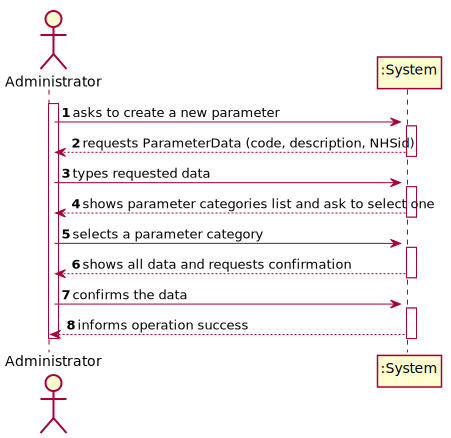
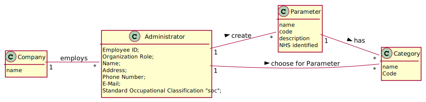
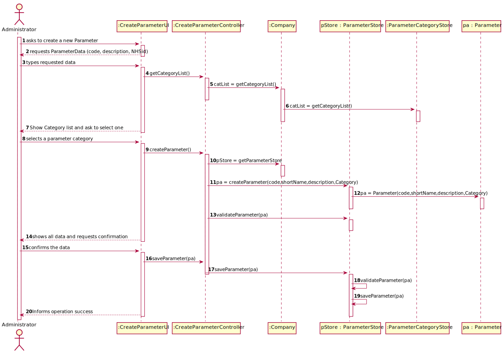
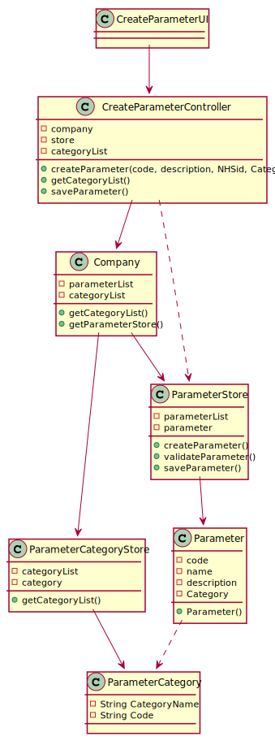

# US 10 - TO CREATE A NEW PARAMETER AND CATEGORIZE IT

## 1. Requirements Engineering

*In this section, it is suggested to capture the requirement description and specifications as provided by the client as well as any further clarification on it. It is also suggested to capture the requirements acceptance criteria and existing dependencies to other requirements. At last, identfy the involved input and output data and depicted an Actor-System interaction in order to fulfill the requirement.*

### 1.1. User Story Description

*As an administrator, I want to specify a new parameter and categorize it.*

### 1.2. Customer Specifications and Clarifications
**From the specifications document:**

> *"Regardless, such tests rely on measuring one
  or more parameters that can be grouped/organized by categories."*

**From the client clarifications:**

> **Question:**
> How does the assignment of a parameter category works? Does he have to select the category or he have the option to create in the moment?
>
> **Answer:**
> There exists a user story to specify a new parameter category. Therefore, the administrator should select one category when creating a parameter.

> **Question:**
> When a new parameter is specified, should there always be a category it falls under prior to its specification and subsequent categorization?
>
> **Answer:**
> Each parameter is associated with one category. 

> **Question:**
> Does the client want to specify more than one new parameter at a time?
>
> **Answer:**
> Yes

> **Question:**
> Can a parameter be classified in more than one parameter category?
>
> **Answer:**
> No. Each parameter has only one category. There are no subcategories.

> **Question:**
> What is the data that characterize a parameter? Should we follow the same data as the parameter category, for example, would each parameter have its own code, description and NHS identifier?
>
> **Answer:**
> Each parameter is associated with one category. Each parameter has a Code, a Short Name and a Description.
The Code are five alphanumeric characters. The Short Name is a String with no more than 8 characters. The Description is a String with no more than 20 characters.

> **Question:**
> What are the information related to a Parameter Category?
>
> **Answer:**
> Each category has a name and a unique code. There are no subcategories

> **Question:**
> What are the information related to a Parameter Category?
>
> **Answer:**
> Each category has a name and a unique code. There are no subcategories

> **Question:**
> What are the information related to a Parameter Category?
>
> **Answer:**
> Each category has a name and a unique code. There are no subcategories

### 1.3. Acceptance Criteria

- *AC1: The Code are five alphanumeric characters.*

- *AC2: The Short Name is a String with no more than 8 characters.*

- *AC3: The Description is a String with no more than 20 characters.*

- *AC4: Each parameter has only one category.*

### 1.4. Found out Dependencies

- *There is a dependency to "US011 Create a Parameter category" since at least a category needs to exist.*

### 1.5 Input and Output Data

*Input Data*
- *Typed data: code, description*
- *Selected data: (category)*

*Output Data*
- *(In)Success of the operation*

### 1.6. System Sequence Diagram (SSD)

### 1.7 Other Relevant Remarks

There's not other remarks regarding SSD.

## 2. OO Analysis

### 2.1. Relevant Domain Model Excerpt

### 2.2. Other Remarks

There's not other remarks regarding MD.

## 3. Design - User Story Realization

### 3.1. Rationale

| Interaction ID | Question: Which class is responsible for... | Answer  | Justification (with patterns)  |
|:-------------  |:--------------------- |:------------|:---------------------------- |
| Step 1: asks to create a new parameter  		                              |	... interacting with the actor?                                         | CreateParameterCategoryUI                     |  Pure Fabrication: there is no reason to assign this responsibility to any existing class in the Domain Model.      |
| 			  		                                                          |	... coordinating the US?                                                | CreateParameterCategoryController             | Controller                                                                                                          |
|                                                                             | ... the creation of the parameter?                                      | ParameterStore                                | IE: responsible for saving all parameters                                                                           |
| Step 2: requests ParameterData (code, description, NHSid)  		          |	...requesting Parameter Data?                                           |                                               |                                                                                                                     |
| Step 3: types requested data  		                                      | ...saving the inputted data?                                            | Parameter                                     | IE: object created has its own data.                                                                                |
| Step 4: shows parameter categories list and ask to select one               | ...knowing the Parameter categories to show?                            | ParameterCategoryStore                        | IE: knows all categories.                                                                                           |
| Step 5: selects a parameter category  		                              |	...saving the selected category?                                        | Parameter                                     | IE: parameter created in step 1 is classified in one category.                                                      | 
|                                                                             | ...local validation?                                                    | Parameter                                     | IE: knows its own data.                                                                                             |
| Step 6: shows all data and requests confirmation  		                  |	...informing operation that shows all data and requests confirmation?   | CreateParameterCategoryUI                     | IE: is responsible for user interactions.                                                                           |  
|     			  		                                                      |	...showing all data?                                                    | Parameter                                     | IE: knows all the parameter's data.                                                                                 | 
|Step 7: confirms the data                                                    | ...informing operation confirmation?                                    | CreateParameterCategoryUI                     | IE: is responsible for user interactions.                                                                           |
|                                                                             | ...global validation?                                                   | ParameterStore                                | IE: knows all parameters.                                                                                           |
|                                                                             |	...saving the created Parameter?                                        | ParameterStore                                | IE: owns all its parameters.                                                                                        |                                                          
|Step 8: informs operation success                                            | ...informing operation success?                                         | CreateParameterCategoryUI                     | IE: is responsible for user interactions.                                                                           |
### Systematization ##

According to the taken rationale, the conceptual classes promoted to software classes are:

* Company
* ParameterCategory
* Parameter

Other software classes (i.e. Pure Fabrication) identified:
* CreateParameterCategoryUI
* CreateParameterCategoryController
* ParameterCategoryStore
* ParameterStore

## 3.2. Sequence Diagram (SD)

## 3.3. Class Diagram (CD)

# 4. Tests

**Test 1:** Check that it is not possible to create the codes with more or less than five alphanumeric characters.   
  
    @Test(expected = IllegalArgumentException.class)
    public void CreateCodeParameterTest() {
        //Arrange + Act
        Parameter parameter = new Parameter("A12345","SUP", "another one", cat );
    }

**Test 2:** Check that it is not possible to create a short name with more than 8 characters.

    @Test(expected = IllegalArgumentException.class)
    public void CreateInvalidNameParameterTestOver8char() {
        //Arrange + Act
        Parameter parameter = new Parameter("A1234", "ulittlebitch", "another one", cat);
    }

**Test 3:** Check that it is not possible to create a description with more than 20 characters.

    @Test(expected = IllegalArgumentException.class)
    public void CreateInvalidDescriptionParameterTestOver20char() {
        //Arrange + Act
        Parameter parameter = new Parameter("A1234", "SUP", "aaaaaaaaaaaaaaaaaaaaaaaaaaaaaaaaaaaaaaaaaaaaaaaaaaaaaaaaaaaaaa", cat);
    }

            
# 5. Construction (Implementation)

##ParameterController

    public class ParameterController {

    private Company company;
    private Parameter pc;
    private ParameterStore store;

    public ParameterController() {

        this(App.getInstance().getCompany());
    }

    public ParameterController(Company company) {
        this.company = company;
        this.pc = null;

    }

    public boolean createParameter(String code, String name, String description, ParameterCategory cat) {
        store = company.getParameterList();
        if (store.CreateParameter(code, name, description, cat)){
            return true;
        }else {
            return false;
        }
    }

    public boolean saveParameterCategory() {
        return this.store.saveParameter(pc);
    }
    }

##ParameterStore

    public ParameterStore() {
        this.array = new ArrayList<Parameter>();
    }

    public boolean CreateParameter(String code, String name, String description, ParameterCategory cat) {
        this.pc = new Parameter(name , code, description, cat);
        if (ValidateParameter(pc)) {
            return true;
        } else {
            return false;
        }
    }

    public boolean ValidateParameter(Parameter pc) {
        if (pc == null && !contains(pc)) {
            return false;
        }
        return true;
    }

    public boolean contains(Parameter pc) {
        if (this.array.contains(pc)) {
            return true;
        } else {
            return false;
        }
    }

    public boolean saveParameter(Parameter pc) {
        if (ValidateParameter(pc)) {
            add(pc);
            return true;
        } else {
            return false;
        }
    }

    public boolean add(Parameter pc) {
        array.add(pc);
        return true;
    }

    public Parameter get(int index) {
        return array.get(index);
    }

    public Parameter getByCode(String code) {
        for (Parameter pc : array) {
            if (pc.getCode().equals(code)) {
                return pc;
            }
        }
        return null;
    }

    public Parameter getByName(String name) {
        for (Parameter pc : array) {
            if (pc.getName().equals(name)) {
                return pc;
            }
        }
        return null;
    }

    public String toString() {
        StringBuilder listString = new StringBuilder();

        for (Parameter s : array) {
            listString.append(s.toString()).append("\n");
        }
        return String.valueOf(listString);
    }

    public Parameter getPc() {
        return pc;
    }
    }

##Parameter

    public class Parameter {
    private String name;
    private String code;
    private String description;
    private ParameterCategory cat;

    public Parameter(String code, String name, String description, ParameterCategory cat) {
        checkCodeRules(code);
        checkNameRules(name);
        checkDescriptionRules(description);
        this.code = code;
        this.name = name;
        this.description = description;
        this.cat = cat;
    }

    private void checkCodeRules(String code) {
        if (StringUtils.isBlank(code))
            throw new IllegalArgumentException("Code cannot be blank.");
        if (code.length() != 5)
            throw new IllegalArgumentException("Code must have 5 chars.");
    }

    private void checkNameRules(String name) {
        if (StringUtils.isBlank(name))
            throw new IllegalArgumentException("Name cannot be blank.");
        if (name.length() > 8)
            throw new IllegalArgumentException("Name must have 8 chars.");
    }

    private void checkDescriptionRules(String description) {
        if (StringUtils.isBlank(description))
            throw new IllegalArgumentException("Description cannot be blank.");
        if (description.length() > 20)
            throw new IllegalArgumentException("Description must have 20 chars.");
    }

    @Override
    public String toString() {
        return "Parameter{" +
                "code='" + code + '\'' +
                ", name='" + name + '\'' +
                ", description='" + description + '\'' +
                ", category='" + cat.toString() + '\'' +
                '}';
    }

    public String getCode() {
        return code;
    }

    public String getName() {
        return name;
    }

    public void setName(String name) {
        this.name = name;
    }
    }

# 6. Integration and Demo

*In this section, it is suggested to describe the efforts made to integrate this functionality with the other features of the system.*

# 7. Observations

After analysing the code made available by the teacher in the base repository we realized that in order to access the UI that makes possible to the administrator select the operation he wants to use he already needs to be authenticated in the system therefore there is no need to referer to it in our artifacts. 

