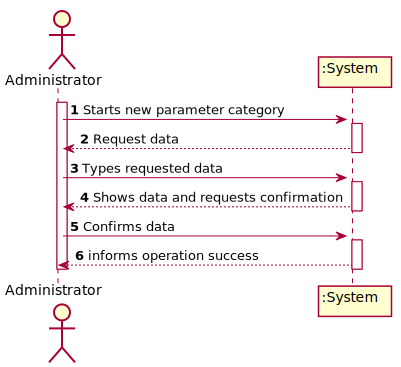
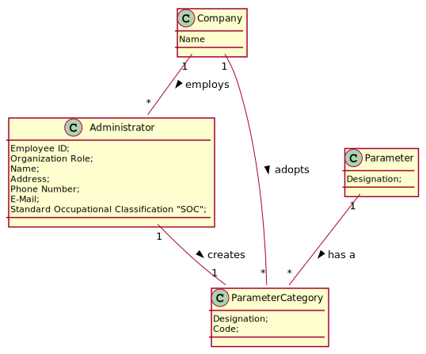
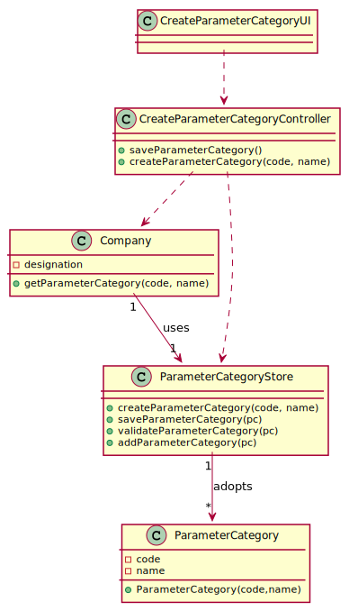

# US 011 - Create a Category

## 1. Requirements Engineering

### 1.1. User Story Description

As an administrator, I want to specify a new parameter category.

### 1.2. Customer Specifications and Clarifications

**From the specifications document:**

> “Blood tests are frequently characterized by measuring several parameters which for presentation/reporting purposes are organized by categories. For example, parameters such as the number of Red Blood Cells (RBC), White Blood Cells (RBC) and Platelets (PLT) are usually presented under the blood count (Hemogram) category."

> "Regardless, such tests rely on measuring one or more parameters that can be grouped/organized by categories."

**From the client clarifications:**

> **Question:**
> What are the information related to a Parameter Category?
>
> **Answer:**
> Each category has a name and a unique code. There are no subcategories

### 1.3. Acceptance Criteria

- **AC1:** The Code must be unique.
- **AC2:** Code must be between 5 and 8 characters
### 1.4. Found out Dependencies

- No dependencies were found.

### 1.5 Input and Output Data

**Input Data:**

- Typed data:
  - a code,
  - a name,

- Selected data:
  - (none)

**Output Data:**

- (In)Success of the operation

### 1.6. System Sequence Diagram (SSD)

**Other alternatives might exist.**
 
### 1.7 Other Relevant Remarks

- 

## 2. OO Analysis

### 2.1. Relevant Domain Model Excerpt

### 2.2. Other Remarks

n/a

## 3. Design - User Story Realization
 
### 3.1. Rationale

| Interaction ID                                      | Question: Which class is responsible for...                              | Answer                    | Justification (with patterns)                                                                                                             |
| :-------------------------------------------------- | :----------------------------------------------------------------------- | :-----------------        | :----------------------------------------------------------                                                                               |
| Msg 1: starts new parameter category                | ... instantiating a new Parameter Category?                              | ParameterCategoryStore    | Creator: R1/2   LC & HC: we look to decrease the responsibilities assign to the the Company class in order to go accordingly to GRASP |
|                                                     | ... interacting with the actor?                                          | CreateParameterCategoryUI | Pure Fabrication: there is no reason to assign this responsibility to any existing class in the Domain Model.                             |
|                                                     | ... coordinating the US?                                                 | CreateParameterController | Controller                                                                                                                                |
| Msg 2: request data (code, name)                  | n/a                                                                      |                           |                                                                                                                                           |
| Msg 3: types requested data                         | ... saving the input data?                                               | Parameter Category        | IE: The object created in step 1 has its own data.                                                                                        |
| Msg 4: shows the data and requests a confirmation | ... validating the data locally (e.g.: mandatory vs.non-mandatory data)? | Parameter Category        | IE: knows its own data.                                                                                                                   |
|                                                     | ... validating the data globally (e.g.: duplicated)?                     | ParameterCategoryStore    | IE: knows/has all the ParameterCategory objects                                                                                           |
| Msg 5: confirms the data                            | ... saving the created parameter category?                               | ParameterCategoryStore    | IE: records all the ParameterCategory objects                                                                                             |
| Msg 6: informs operation success                  | ... informing operation success?                                         | UI                        | IE: responsible for user interaction                                                                                                      |

#### Systematization

According to the taken rationale, the conceptual classes promoted to software classes are:

- Company
- Parameter Category

Other software classes (i.e. Pure Fabrication) identified:

- ParameterCategoryStore
- CreateParameterCategoryUI
- CreateParameterController

### 3.2. Sequence Diagram (SD)
 
 

 
### 3.3. Class Diagram (CD)

 
 

## 4. Tests

**Test 1:** Check that it is not possible to create an instance of the Task class with null values.

    @Test(expected = IllegalArgumentException.class)
    	public void ensureNullIsNotAllowed() {
    	Task instance = new Task(null, null, null, null, null, null, null);
    }

**Test 2:** Check that it is not possible to create an instance of the Task class with a reference containing less than
five chars - AC2.

    @Test(expected = IllegalArgumentException.class)
    	public void ensureReferenceMeetsAC2() {
    	Category cat = new Category(10, "Category 10");

    	Task instance = new Task("Ab1", "Task Description", "Informal Data", "Technical Data", 3, 3780, cat);
    }

_It is also recommended organizing this content by subsections._

## 5. Construction (Implementation)

### Class CreateTaskController

    	public boolean createTask(String ref, String designation, String informalDesc,
    		String technicalDesc, Integer duration, Double cost, Integer catId)() {

    		Category cat = this.platform.getCategoryById(catId);

    		Organization org;
    		// ... (omitted)

    		this.task = org.createTask(ref, designation, informalDesc, technicalDesc, duration, cost, cat);

    		return (this.task != null);
    	}

### Class Organization

    	public Task createTask(String ref, String designation, String informalDesc,
    		String technicalDesc, Integer duration, Double cost, Category cat)() {

    		Task task = new Task(ref, designation, informalDesc, technicalDesc, duration, cost, cat);
    		if (this.validateTask(task))
    			return task;
    		return null;
    	}

## 6. Integration and Demo

- A new option on the Employee menu options was added.

- Some demo purposes some tasks are bootstrapped while system starts.

## 7. Observations

After analysing the code made available by the teacher in the base repository we realized that in order to access the UI that makes possible to the administrator select the operation he wants to use he already needs to be authenticated in the system therefore there is no need to referer to it in our artifacts. 

