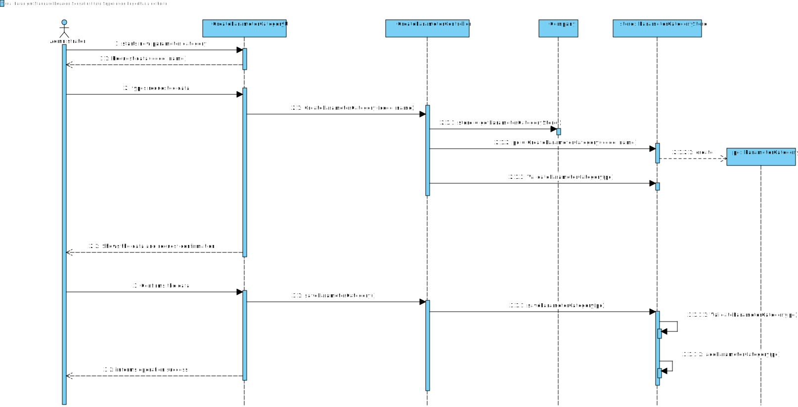

# US 011 - Create a Category

## 1. Requirements Engineering

### 1.1. User Story Description

As an administrator, I want to specify a new parameter category.

### 1.2. Customer Specifications and Clarifications

**From the specifications document:**

> “Blood tests are frequently characterized by measuring several parameters which for presentation/reporting purposes are organized by categories. For example, parameters such as the number of Red Blood Cells (RBC), White Blood Cells (RBC) and Platelets (PLT) are usually presented under the blood count (Hemogram) category."

> "Regardless, such tests rely on measuring one or more parameters that can be grouped/organized by categories."

**From the client clarifications:**

> **Question:**
> What are the information related to a Parameter Category?
>
> **Answer:**
> Each category has a name and a unique code. There are no subcategories

### 1.3. Acceptance Criteria

- **AC1:** The Code must be unique.
- **AC2:** Code must be between 5 and 8 characters

### 1.4. Found out Dependencies

- No dependencies were found.

### 1.5 Input and Output Data

**Input Data:**

- Typed data:
    - a code,
    - a name,

- Selected data:
    - (none)

**Output Data:**

- (In)Success of the operation

### 1.6. System Sequence Diagram (SSD)


**Other alternatives might exist.**

### 1.7 Other Relevant Remarks

-

## 2. OO Analysis

### 2.1. Relevant Domain Model Excerpt


### 2.2. Other Remarks

n/a

## 3. Design - User Story Realization

### 3.1. Rationale

| Interaction ID                                      | Question: Which class is responsible for...                              | Answer                    | Justification (with patterns)                                                                                                             |
| :-------------------------------------------------- | :----------------------------------------------------------------------- | :-----------------        | :----------------------------------------------------------                                                                               |
| Msg 1: starts new parameter category                | ... instantiating a new Parameter Category?                              | ParameterCategoryStore    | Creator: R1/2 </br> LC & HC: we look to decrease the responsibilities assign to the the Company class in order to go accordingly to GRASP |
|                                                     | ... interacting with the actor?                                          | CreateParameterCategoryUI | Pure Fabrication: there is no reason to assign this responsibility to any existing class in the Domain Model.                             |
|                                                     | ... coordinating the US?                                                 | CreateParameterController | Controller                                                                                                                                |
| Msg 2: request data (code, name)                    | n/a                                                                      |                           |                                                                                                                                           |
| Msg 3: types requested data                         | ... saving the input data?                                               | Parameter Category        | IE: The object created in step 1 has its own data.                                                                                        |
| Msg 4: shows the data and requests a confirmation   | ... validating the data locally (e.g.: mandatory vs.non-mandatory data)? | Parameter Category        | IE: knows its own data.                                                                                                                   |
|                                                     | ... validating the data globally (e.g.: duplicated)?                     | ParameterCategoryStore    | IE: knows/has all the ParameterCategory objects                                                                                           |
| Msg 5: confirms the data                            | ... saving the created parameter category?                               | ParameterCategoryStore    | IE: records all the ParameterCategory objects                                                                                             |
| Msg 6: informs operation success                    | ... informing operation success?                                         | UI                        | IE: responsible for user interaction                                                                                                      |

#### Systematization

According to the taken rationale, the conceptual classes promoted to software classes are:

- Company
- Parameter Category

Other software classes (i.e. Pure Fabrication) identified:

- ParameterCategoryStore
- CreateParameterCategoryUI
- CreateParameterController

### 3.2. Sequence Diagram (SD)



### 3.3. Class Diagram (CD)


## 4. Tests

**Test 1:** Check that it is not possible to create an instance of the Parameter Category class with null values.

    Test(expected = IllegalArgumentException.class)
    public void CreateNullCategoryTest() {
        //Arrange + Act
        ParameterCategory cat = new ParameterCategory(null, null);

    }

**Test 2:** Check that it is not possible to create an instance of the Parameter Category class with a code with less than 4 digits - AC2.

     @Test(expected = IllegalArgumentException.class)
    public void CreateCodeTooSmallCategoryTest() {
        //Arrange + Act
        ParameterCategory cat = new ParameterCategory("AF5", "Hemograma");
    }

**Test 3:** Check that it is not possible to create an instance of the Parameter Category class with a code with more than 8 digits - AC2.
```
    @Test(expected = IllegalArgumentException.class)
    public void CreateCodeWith9Characters() {
        //Arrange + Act
        ParameterCategory cat = new ParameterCategory("AFO4I8R46", "Hemograma");
    }
```


_It is also recommended organizing this content by subsections._

## 5. Construction (Implementation)

### Class ParameterCategoryStore

```
public class ParameterCategoryStore {
    List<ParameterCategory> array;
    ParameterCategory pc;
    /**
     * Constructor of the class it creates an empty list to be filled with objects of ParameterCategory
     */
    public ParameterCategoryStore() {
        this.array = new ArrayList<>();
    }

    /**
     * This method creates a new ParameterCategory object by calling his constructor. It also validates the object using the method ValidateParameterCategory implemented by this class
     *
     * @param code unique code needed to identify the Parameter Category
     * @param name short name that characterize the Parameter Category
     * @return boolean value that indicates if the object created is valid or not
     */
    public boolean CreateParameterCategory(String code, String name) {
        this.pc = new ParameterCategory(code, name);
        if (ValidateParameterCategory(pc)) {
            return true;
        } else {
            return false;
        }
    }

    /**
     * this method checks if the ParameterCategory object received is not null and if don't already exists.in the ArrayList
     *
     * @param pc ParameterCategory object
     * @return boolean value that is true if the object is not null and dont already exists in the ArrayList
     */

    public boolean ValidateParameterCategory(ParameterCategory pc) {
     if (pc == null | contains(pc)) { |
            return false;
        }
        return true;
    }

    /**
     * this method checks if the ParameterCategory object received already exits in the ArrayList
     *
     * @param pc ParameterCategory object
     * @return boolean value that is true if the object already exists in the ArrayList
     */

    public boolean contains(ParameterCategory pc) {
        if (this.array.contains(pc)) {
            return true;
        } else {
            return false;
        }
    }

    /**
     * this method is used to save the ParameterCategory object in the arrayList already created, before adding the object teh method validates it
     *
     * @return a boolean value that indicates the success of the operation
     */
    public boolean saveParameterCategory() {
        if (ValidateParameterCategory(this.pc)) {
            add(pc);
            return true;
        } else {
            return false;
        }
    }

    /**
     * this method adds the ParameterCategory object to the arrayList
     *
     * @param pc ParameterCategory object
     * @return a boolean value that indicates the success of the operation
     */

    public boolean add(ParameterCategory pc) {
        array.add(pc);
        return true;
    }


    public ParameterCategory get(int index) {
        return array.get(index);
    }


    public ParameterCategory getByCode(String code) {
        for (ParameterCategory pc : array) {
            if (pc.getCode().equals(code)) {
                return pc;
            }
        }
        return null;
    }

    public ParameterCategory getByName(String name) {
        for (ParameterCategory pc : array) {
            if (pc.getName().equals(name)) {
                return pc;
            }
        }
        return null;
    }

    public String toString() {
        StringBuilder listString = new StringBuilder();

        for (ParameterCategory s : array) {
            listString.append(s.toString()).append("\n");
        }
        return String.valueOf(listString);
    }

    public ParameterCategory getPc() {
        return pc;
    }
}
```

### Class ParameterCategoryController
```
    	public class ParameterCategoryController {

    private Company company;
    private ParameterCategoryStore store;

    public ParameterCategoryController() {
        this(App.getInstance().getCompany());
      //  App app = new App();
      //  UserSession session = App.getCurrentUserSession();
      //  if (!session.isLoggedInWithRole("ADMINISTRATOR")) {
      //      throw new IllegalStateException("Not Authorized");
      //  }
    }

    public ParameterCategoryController(Company company) {
        this.company = company;

    }


    public boolean createParameterCategory(String code, String name) {
        store = company.getParameterCategoryList();
        if (store.CreateParameterCategory(code,name)){
            return true;
        }else {
            return false;
        }


    }
    
    public ParameterCategory getpc(){
        return store.getPc();
    }

    public boolean saveParameterCategory() {
        return this.store.saveParameterCategory();
    }
}
```
### Class ParameterCategory

```
  public class ParameterCategory {
  private String code;
  private String name;


    /**
     * Constructor of the ParameterCategory, it calls 2 methods in order to validate the parameters
     *
     * @param code unique code needed to identify the Parameter Category
     * @param name short name that characterize the Parameter Category
     */
    public ParameterCategory(String code, String name) {
        checkCodeRules(code);
        checkNameRules(name);
        this.code = code;
        this.name = name;
    }

    /**
     * This method checks if the code provided meets the requirements, if not it throws a exception making the execution to stop
     *
     * @param code unique code needed to identify the Parameter Category
     */
    private void checkCodeRules(String code) {
        if (StringUtils.isBlank(code))
            throw new IllegalArgumentException("Code cannot be blank.");
| if ((code.length() < 5) | (code.length() > 8)) |
            throw new IllegalArgumentException("Code must have 5 to 8 chars.");
    }

    /**
     * This method checks if the code provided meets the requirements, if not it throws a exception making the execution to stop
     *
     * @param name name tha identifies the Parameter Category
     */
    private void checkNameRules(String name) {
        if (StringUtils.isBlank(name))
            throw new IllegalArgumentException("Name cannot be blank.");
    }


    @Override
    public String toString() {
        return "Code = "+code +" Name="+name;
    }

    /**
     * Returns the code of the Parameter Category
     *
     * @return code: unique code needed to identify the Parameter Category
     */

    public String getCode() {
        return code;
    }

    /**
     * modifies the code of the Parameter Category
     *
     * @param code unique code needed to identify the Parameter Category
     */
    public void setCode(String code) {
        checkCodeRules(code);
        this.code = code;
    }

    /**
     * Returns the name of the Parameter Category
     *
     * @return name
     */
    public String getName() {
        return name;
    }

    /**
     * modifies the code of the Parameter Category
     *
     * @param name unique name needed to identify the Parameter Category
     */
    public void setName(String name) {
        checkNameRules(name);
        this.name = name;
    }
  }
```
### Class Company

```
public class Company {

    private String designation;
    private AuthFacade authFacade;

    private ParameterCategoryStore parameterCategoryList;

    public Company(String designation) {
        if (StringUtils.isBlank(designation))
            throw new IllegalArgumentException("Designation cannot be blank.");

        this.designation = designation;
        this.authFacade = new AuthFacade();
    }

    public String getDesignation() {
        return designation;
    }

    public AuthFacade getAuthFacade() {
        return authFacade;
    }

    /**
     * creates a new empty list of Parameter Categories objects
     * @return empty list of Parameter Categories objects
     */

    public ParameterCategoryStore getParameterCategoryList() {
        return this.parameterCategoryList = new ParameterCategoryStore();
    }
    
}
```


## 6. Integration and Demo

- A new option on the Admin menu options was added.
- There is an admin user in bootstrap that we are using in order to test our US.

## 7. Observations

After analysing the code made available by the teacher in the base repository we realized that in order to access the UI
that makes possible to the administrator select the operation he wants to use he already needs to be authenticated in
the system therefore there is no need to referer to it in our artifacts. 

