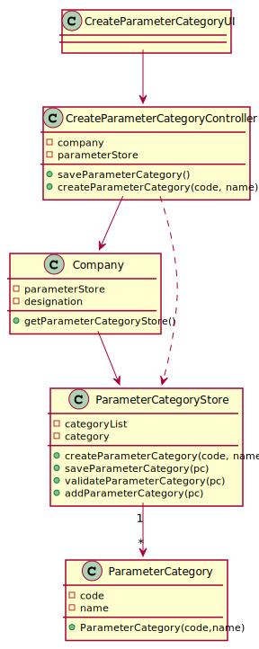

# US 011 - Create a Category

## 1. Requirements Engineering

### 1.1. User Story Description

As an administrator, I want to specify a new parameter category.

### 1.2. Customer Specifications and Clarifications

**From the specifications document:**

> “Blood tests are frequently characterized by measuring several parameters which for presentation/reporting purposes are organized by categories. For example, parameters such as the number of Red Blood Cells (RBC), White Blood Cells (RBC) and Platelets (PLT) are usually presented under the blood count (Hemogram) category."

> "Regardless, such tests rely on measuring one or more parameters that can be grouped/organized by categories."

**From the client clarifications:**

> **Question:**
> What are the information related to a Parameter Category?
>
> **Answer:**
> Each category has a name and a unique code. There are no subcategories


> **Question:**
> Regarding the creation of a new category, what should be the format of the code in terms of length, should it be alphanumeric or numbers only? Also, can we assume that both attributes are mandatory?
>
> **Answer:**
> The format of the attributes of one category are: <br>
Name: is a string with no more than 10 characters; <br>
Code: are five alphanumeric characters. The code is unique and is not automatically generated.<br>
Both attributes are mandatory.<br>
There are no subcategories.<br>

### 1.3. Acceptance Criteria

- **AC1:** The Code must be unique.
- **AC2:** Code are 5 alphanumeric characters
- **AC3:** Name has no more than 10 characters

### 1.4. Found out Dependencies

- No dependencies were found.

### 1.5 Input and Output Data

**Input Data:**

- Typed data:
    - a code,
    - a name,

- Selected data:
    - (none)

**Output Data:**

- (In)Success of the operation

### 1.6. System Sequence Diagram (SSD)


### 1.7 Other Relevant Remarks

-

## 2. OO Analysis

### 2.1. Relevant Domain Model Excerpt


### 2.2. Other Remarks

n/a

## 3. Design - User Story Realization

### 3.1. Rationale

| Interaction ID                                      | Question: Which class is responsible for...                              | Answer                    | Justification (with patterns)                                                                                                             |
| :-------------------------------------------------- | :----------------------------------------------------------------------- | :-----------------        | :----------------------------------------------------------                                                                               |
| Msg 1: starts new parameter category                | ... instantiating a new Parameter Category?                              | ParameterCategoryStore    | Creator: R1/2 </br> LC & HC: we look to decrease the responsibilities assign to the the Company class in order to go accordingly to GRASP |
|                                                     | ... interacting with the actor?                                          | CreateParameterCategoryUI | Pure Fabrication: there is no reason to assign this responsibility to any existing class in the Domain Model.                             |
|                                                     | ... coordinating the US? the                                             | CreateParameterController | Controller                                                                                                                                |
| Msg 2: request data (code, name)                    | n/a                                                                      |                           |                                                                                                                                           |
| Msg 3: types requested data                         | ... saving the input data?                                               | Parameter Category        | IE: The object created in step 1 has its own data.                                                                                        |
| Msg 4: shows the data and requests a confirmation   | ... validating the data locally (e.g.: mandatory vs.non-mandatory data)? | Parameter Category        | IE: knows its own data.                                                                                                                   |
|                                                     | ... validating the data globally (e.g.: duplicated)?                     | ParameterCategoryStore    | IE: knows/has all the ParameterCategory objects                                                                                           |
| Msg 5: confirms the data                            | ... saving the created parameter category?                               | ParameterCategoryStore    | IE: records all the ParameterCategory objects                                                                                             |
| Msg 6: informs operation success                    | ... informing operation success?                                         | UI                        | IE: responsible for user interaction                                                                                                      |

#### Systematization

According to the taken rationale, the conceptual classes promoted to software classes are:

- Company
- Parameter Category

Other software classes (i.e. Pure Fabrication) identified:

- ParameterCategoryStore
- CreateParameterCategoryUI
- CreateParameterController

### 3.2. Sequence Diagram (SD)


### 3.3. Class Diagram (CD)



## 4. Tests

**Test 1:** Check that it is not possible to create an instance of the Parameter Category class with null values.

        @Test(expected = IllegalArgumentException.class)
    public void CreateNullCategoryTest() {
        //Arrange + Act
        ParameterCategory cat = new ParameterCategory(null, null);
    }

**Test 2:** Check that it is not possible to save an instance of the Task Parameter Category with a code that already
exists - AC1.

```
  @Test
  public void validateParameterCategoryAlreadyExistsCode(){
    //Arrange + act
    ParameterCategoryStore store = new ParameterCategoryStore();
    ParameterCategory pc1 = new ParameterCategory("AF687","Hemogram");
    store.add(pc1);
    ParameterCategory pc2 = new ParameterCategory("AF687","Hemograma");

   Assert.assertFalse(store.ValidateParameterCategory(pc2));
  }
```

**Test 3:** Check that it is not possible to create an instance of the Task Parameter Category with a code containing
less than five chars - AC2.

    @Test(expected = IllegalArgumentException.class)
    public void CreateCodeTooSmallCategoryTest() {
        //Arrange + Act
        ParameterCategory cat = new ParameterCategory("AF5", "Hemograma");
    }

**Test 4:** Check that it is not possible to create an instance of the Task Parameter Category with a name containing
more than 10 chars - AC3.

  ```
      @Test(expected = IllegalArgumentException.class)
    public void CreateNameTooBigCategoryTest() {
        //Arrange + Act
        ParameterCategory cat = new ParameterCategory("AFO4I", "Hemogramatu");
    }
  ``` 

_It is also recommended organizing this content by subsections._

## 5. Construction (Implementation)

### Class ParameterCategoryController

```
    public class ParameterCategoryController {

    private Company company;
    private ParameterCategoryStore store;

    public ParameterCategoryController() {
        this(App.getInstance().getCompany());
    }

    public ParameterCategoryController(Company company) {
        this.company = company;

    }


    public void createParameterCategory(String code, String name) {
        store = company.getParameterCategoryList();
        store.CreateParameterCategory(code,name);
    }

    public ParameterCategory getpc(){
        return store.getPc();
    }

    public boolean saveParameterCategory() {
        return this.store.saveParameterCategory();
    }
}
```

### Class ParameterCategory

```
    	public class ParameterCategory {
    private String code;
    private String name;


    /**
     * Constructor of the ParameterCategory, it calls 2 methods in order to validate the parameters
     *
     * @param code unique code needed to identify the Parameter Category
     * @param name short name that characterize the Parameter Category
     */
    public ParameterCategory(String code, String name) {
        checkCodeRules(code);
        checkNameRules(name);
        this.code = code;
        this.name = name;
    }

    /**
     * This method checks if the code provided meets the requirements, if not it throws a exception making the execution to stop
     *
     * @param code unique code needed to identify the Parameter Category
     */
    private void checkCodeRules(String code) {
        if (StringUtils.isBlank(code)) {
            throw new IllegalArgumentException("Code cannot be blank.");
        }
        if ((code.length() != 5)) {
            throw new IllegalArgumentException("Code must have 5 to 8 chars.");
        }
    }

    /**
     * This method checks if the code provided meets the requirements, if not it throws a exception making the execution to stop
     *
     * @param name name tha identifies the Parameter Category
     */
    private void checkNameRules(String name) {
        if (StringUtils.isBlank(name)) {
            throw new IllegalArgumentException("Name cannot be blank.");
        }
        if (name.length()>10){
            throw new IllegalArgumentException("Name cannot have more than 10 characters.");
        }
    }

    /**
     * @return A string with the format "Code = code Name= name" where "code" and "name" are the two parameter of the Parameter Category object
     */

    @Override
    public String toString() {
        return "Code = " + code + " Name=" + name;
    }

    /**
     * Returns the code of the Parameter Category
     *
     * @return code: unique code needed to identify the Parameter Category
     */
    public String getCode() {
        return code;
    }

    /**
     * Returns the name of the Parameter Category
     *
     * @return name
     */
    public String getName() {
        return name;
    }

```

### Class ParameterCategoryStore

```
public class ParameterCategoryStore {
    List<ParameterCategory> array;
    private ParameterCategory pc;

    /**
     * Constructor of the class it creates an empty list to be filled with objects of ParameterCategory
     */
    public ParameterCategoryStore() {
        this.array = new ArrayList<>();
    }

    /**
     * This method creates a new ParameterCategory object by calling his constructor.
     *
     * @param code unique code needed to identify the Parameter Category
     * @param name short name that characterize the Parameter Category
     * @return Parameter Category object created
     */
    public ParameterCategory CreateParameterCategory(String code, String name) {

        this.pc = new ParameterCategory(code, name);
        return this.pc;
    }

    /**
     * this method checks if the ParameterCategory object received is not null, if don't already exists.in the ArrayList and if the ParameterCategory code dont already exist
     *
     * @param pc ParameterCategory object
     * @return boolean value that is true if the object is not null and dont already exists in the ArrayList
     */

    public boolean ValidateParameterCategory(ParameterCategory pc) {
| if (pc == null | contains(pc) | !uniqueCode(pc)) { |
            return false;
        }
        return true;
    }

    /**
     * This method searches in the Array List if alredy exists a Parameter Category object with the same code
     * @param pc Parameter Category object in which we want to check the code
     * @return true if the code dont already exists, false if not
     */

    public boolean uniqueCode(ParameterCategory pc){
        boolean find = true;
        for (ParameterCategory pc1:array) {
            if (pc.getCode().equals(pc1.getCode())){
                find = false;
            }
        }
        return find;
    }

    /**
     * this method checks if the ParameterCategory object received already exits in the ArrayList
     *
     * @param pc ParameterCategory object
     * @return boolean value that is true if the object already exists in the ArrayList
     */

    public boolean contains(ParameterCategory pc) {
        if (this.array.contains(pc)) {
            return true;
        } else {
            return false;
        }
    }

    /**
     * this method is used to save the ParameterCategory object in the arrayList already created, before adding the object the method validates it
     *
     * @return a boolean value that indicates the success of the operation
     */
    public boolean saveParameterCategory() {
        if (ValidateParameterCategory(this.pc)) {
            add(pc);
            return true;
        } else {
            return false;
        }
    }

    /**
     * this method adds the ParameterCategory object to the arrayList
     *
     * @param pc ParameterCategory object
     * @return a boolean value that indicates the success of the operation
     */

    public boolean add(ParameterCategory pc) {
        return array.add(pc);
    }

    /**
     * This method search for an Parameter Category object by the index of that object in the ArrayList
     * @param index index of the array list where we want to get the object
     * @return the Parameter Category object that was in the index of the array list
     */

    public ParameterCategory get(int index) {
        return array.get(index);
    }

    /**
     * This method search for an Parameter Category object by the code of that object in the ArrayList
     * @param code code that characterize the Parameter Category object
     * @return if the object is found it returns the object, if not it returns null
     */

    public ParameterCategory getByCode(String code) {
        for (ParameterCategory pc : array) {
            if (pc.getCode().equals(code)) {
                return pc;
            }
        }
        return null;
    }


    public String toString() {
        StringBuilder listString = new StringBuilder();

        for (ParameterCategory s : array) {
            listString.append(s.toString()).append("\n");
        }
        return String.valueOf(listString);
    }

    public ParameterCategory getPc() {
        return pc;
    }
}

```

### Class ParameterCategoryUI

```
public class ParameterCategoryUI implements Runnable {
    private ParameterCategoryController ctrl;

    public ParameterCategoryUI() {
        this.ctrl = new ParameterCategoryController();
    }


    /**
     * When an object implementing interface {@code Runnable} is used
     * to create a thread, starting the thread causes the object's
     * {@code run} method to be called in that separately executing
     * thread.
     * <p>
     * The general contract of the method {@code run} is that it may
     * take any action whatsoever.
     *
     * @see Thread#run()
     */
    @Override
    public void run() {
        boolean cont = true;
        do {
            boolean exception = false;
            do {
                try {
                    String code = Utils.readLineFromConsole("Please enter the code of the new Parameter Category");
                    String name = Utils.readLineFromConsole("Please enter the name of the new Parameter Category");
                    ctrl.createParameterCategory(code, name);
                    exception = false;
                } catch (Exception e) {
                    e.printStackTrace();
                    System.out.println("An error occurred during the creation during the creation of the Parameter please try again");
                    exception = true;
                }
            }while (exception);

            cont = Utils.confirm("The following Category was created do you want to save?" + ctrl.getpc().toString());
            if (cont) {

                if (ctrl.saveParameterCategory()){
                    System.out.println("The Category was saved with success");
                }

            } else {
                System.out.println("Couldn't save the Parameter please try again ");
            }


        } while (!cont);

    }
}
```

## 6. Integration and Demo

- A new option on the admin menu options was added.

- A demo admin user bootstrapped while system starts.

## 7. Observations


