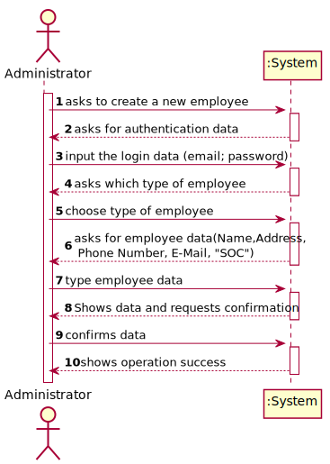
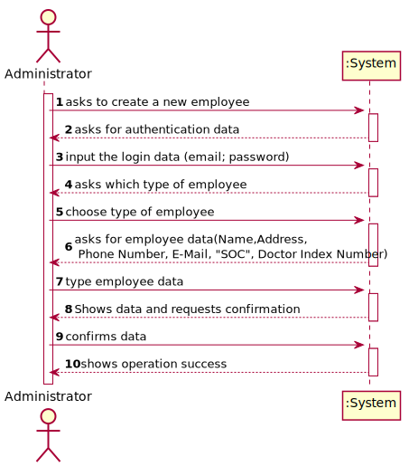

# US 07 - To register a new employee

## 1. Requirements Engineering

*In this section, it is suggested to capture the requirement description and specifications as provided by the client as well as any further clarification on it. It is also suggested to capture the requirements acceptance criteria and existing dependencies to other requirements. At last, identfy the involved input and output data and depicted an Actor-System interaction in order to fulfill the requirement.*

### 1.1. User Story Description

"As an administrator, I want to register a new employee"

### 1.2. Customer Specifications and Clarifications 
#### From the specifications document:

#### From the client clarifications:

##### Question 1
> **Question:**
> Relative to registering a new user, how should the system respond in the event of creating a new user with the same attributes of an already existing user?

> **Answer:**
> This should be treated as an error. A subset of the attributes of any client are unique.

##### Question 2
> **Question:**
> Can an employee have more than a role?

> **Answer:**
> Every user of the application has only one role.

##### Question 3
> **Question:**
> How should we generate the SOC number, employee ID and the doctor index number ?

> **Answer:**
> The employee ID should be generated from the initials of the employee name and should include a number. The number should have 5 digits and it increases automatically when a new employee is registered in the system. For instance, if the company has 20 employees and the administrator wants to register a specialist doctor with the name Ana Maria Santos Moura, then the the employee ID for this specialist doctor should be AMSM00021.

##### Question 4
> **Question:**
> When creating a new employee, the attribute "Doctor Index Number", are implemented by the administrator or incremented by the system?

> **Answer:**
> The Doctor Index Number should be introduced by the administrator.

##### Question 5
> **Question:**
> Should the employees be allocated to the clinical lab in which they work? Or, for example, can one medical lab technician work in more than one clinical analysis lab?

>**Answer:**
> Each Receptionist and each Medical Lab Technician can work in any Clinical Analysis Laboratory of the Many Labs network.

##### Question 6
> **Question:**
> How are the passwords delivered to the users (client/employee)?
 
>**Answer:**
> Each users receives an e-mail informing that the registration was successful and that he can start to use the system. The e-mail includes the user password.

##### Question 7
> **Question:**
> Is the administrator an employee? If he/she is, who does him/her register?

>**Answer:**
> Yes. An administrator should be registered when the application starts for first time. The application can have more than one administrator.

##### Question 8
> **Question:**
> Should we vallidate if a new employee is the same as one that there is already inside the system ? Do we need to vallidate same atributes to check similarities ?

>**Answer:**
> Yes.

### 1.3. Acceptance Criteria

* **AC1:** Each user must have a single role defined in the system. The "auth" component available on the repository must be reused (without modifications).

* **AC2:** Attributes of any employee (user) are unique

* **AC3:** The employee ID should be generated from the initials of the employee name and should include a number. The number should have 5 digits, and it increases automatically when a new employee is registered in the system.

* **AC4:** The Doctor Index Number should be introduced by the administrator

* **AC5:** Each user receives an e-mail informing that the registration was successful and that he can start to use the system. The e-mail includes the user password.

* **AC6:** An administrator should be registered when the application starts for first time. The application can have more than one administrator.

### 1.4. Found out Dependencies

* This US needs to use the "auth" component in order to register a new user that, in this case, is an employee and to authenticate the administrator.  

### 1.5 Input and Output Data

**Input Data:**

- Typed data:
  * Name;
  * Address;
  * Phone Number;
  * E-Mail;
  * Standard Occupational Classification "SOC";
  * Doctor Index Number

- Selected data:
    - Organization Role; ????

### 1.6. System Sequence Diagram (SSD)

In the System Sequence Diagram we choose to develop 2 alternatives, in the first one the administrator register an employee that is not a specialist doctor and in the second the administrator register a new specialist doctor.
We choose this because the specialist doctor need a different parameter that is the "Doctor Index Number"

**Alt 1**

**Alt 2**

### 1.7 Other Relevant Remarks

*Use this section to capture other relevant information that is related with this US such as (i) special requirements ; (ii) data and/or technology variations; (iii) how often this US is held.* 

## 2. OO Analysis

### 2.1. Relevant Domain Model Excerpt 
*In this section, it is suggested to present an excerpt of the domain model that is seen as relevant to fulfill this requirement.* 

### 2.2. Other Remarks

*Use this section to capture some aditional notes/remarks that must be taken into consideration into the design activity. In some case, it might be usefull to add other analysis artifacts (e.g. activity or state diagrams).* 

## 3. Design - User Story Realization 

### 3.1. Rationale

**The rationale grounds on the SSD interactions and the identified input/output data.**

| Interaction ID | Question: Which class is responsible for... | Answer  | Justification (with patterns)  |
|:-------------  |:--------------------- |:------------|:---------------------------- |
| Step 1  		 |							 |             |                              |
| Step 2  		 |							 |             |                              |
| Step 3  		 |							 |             |                              |
| Step 4  		 |							 |             |                              |
| Step 5  		 |							 |             |                              |
| Step 6  		 |							 |             |                              |              

### Systematization ##

According to the taken rationale, the conceptual classes promoted to software classes are: 

 * Class1
 * Class2
 * Class3

Other software classes (i.e. Pure Fabrication) identified: 
 * xxxxUI  
 * xxxxController

## 3.2. Sequence Diagram (SD)

*In this section, it is suggested to present an UML dynamic view stating the sequence of domain related software objects' interactions that allows to fulfill the requirement.* 

## 3.3. Class Diagram (CD)

*In this section, it is suggested to present an UML static view representing the main domain related software classes that are involved in fulfilling the requirement as well as and their relations, attributes and methods.*

# 4. Tests 
*In this section, it is suggested to systematize how the tests were designed to allow a correct measurement of requirements fulfilling.* 

**_DO NOT COPY ALL DEVELOPED TESTS HERE_**

**Test 1:** Check that it is not possible to create an instance of the Example class with null values. 

	@Test(expected = IllegalArgumentException.class)
		public void ensureNullIsNotAllowed() {
		Exemplo instance = new Exemplo(null, null);
	}

*It is also recommended to organize this content by subsections.* 

# 5. Construction (Implementation)

*In this section, it is suggested to provide, if necessary, some evidence that the construction/implementation is in accordance with the previously carried out design. Furthermore, it is recommeded to mention/describe the existence of other relevant (e.g. configuration) files and highlight relevant commits.*

*It is also recommended to organize this content by subsections.* 

# 6. Integration and Demo 

*In this section, it is suggested to describe the efforts made to integrate this functionality with the other features of the system.*

# 7. Observations

*In this section, it is suggested to present a critical perspective on the developed work, pointing, for example, to other alternatives and or future related work.*

