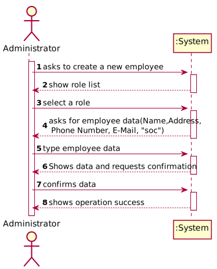

# US 07 - To register a new employee

## 1. Requirements Engineering

*In this section, it is suggested to capture the requirement description and specifications as provided by the client as well as any further clarification on it. It is also suggested to capture the requirements acceptance criteria and existing dependencies to other requirements. At last, identfy the involved input and output data and depicted an Actor-System interaction in order to fulfill the requirement.*


### 1.1. User Story Description

"As an administrator, I want to register a new employee"

### 1.2. Customer Specifications and Clarifications
#### From the specifications document:


#### From the client clarifications:

##### Question 1
> **Question:**
> Relative to registering a new user, how should the system respond in the event of creating a new user with the same attributes of an already existing user?

> **Answer:**
> This should be treated as an error. A subset of the attributes of any client are unique.

##### Question 2
> **Question:**
> Can an employee have more than a role?

> **Answer:**
> Every user of the application has only one role.

##### Question 3
> **Question:**
> How should we generate the SOC number, employee ID and the doctor index number ?

> **Answer:**
> The employee ID should be generated from the initials of the employee name and should include a number. The number should have 5 digits and it increases automatically when a new employee is registered in the system. For instance, if the company has 20 employees and the administrator wants to register a specialist doctor with the name Ana Maria Santos Moura, then the the employee ID for this specialist doctor should be AMSM00021.

##### Question 4
> **Question:**
> When creating a new employee, the attribute "Doctor Index Number", are implemented by the administrator or incremented by the system?

> **Answer:**
> The Doctor Index Number should be introduced by the administrator.

##### Question 5
> **Question:**
> Should the employees be allocated to the clinical lab in which they work? Or, for example, can one medical lab technician work in more than one clinical analysis lab?

>**Answer:**
> Each Receptionist and each Medical Lab Technician can work in any Clinical Analysis Laboratory of the Many Labs network.

##### Question 6
> **Question:**
> How are the passwords delivered to the users (client/employee)?

>**Answer:**
> Each users receives an e-mail informing that the registration was successful and that he can start to use the system. The e-mail includes the user password.

##### Question 7
> **Question:**
> Is the administrator an employee? If he/she is, who does him/her register?

>**Answer:**
> Yes. An administrator should be registered when the application starts for first time. The application can have more than one administrator.

##### Question 8
> **Question:**
> Should we vallidate if a new employee is the same as one that there is already inside the system ? Do we need to vallidate same atributes to check similarities ?

>**Answer:**
> Yes.


### 1.3. Acceptance Criteria

* **AC1:** Each user must have a single role defined in the system. The "auth" component available on the repository must be reused (without modifications).

* **AC2:** Attributes of any employee (user) are unique

* **AC3:** The employee ID should be generated from the initials of the employee name and should include a number. The number should have 5 digits, and it increases automatically when a new employee is registered in the system.

* **AC4:** The Doctor Index Number should be introduced by the administrator

* **AC5:** Each user receives an e-mail informing that the registration was successful and that he can start to use the system. The e-mail includes the user password.

* **AC6:** An administrator should be registered when the application starts for first time. The application can have more than one administrator.


### 1.4. Found out Dependencies

* This US needs to use the "auth" component in order to register a new user that, in this case, is an employee and to authenticate the administrator.

### 1.5 Input and Output Data

**Input Data:**

- Typed data:
  * Name;
  * Address;
  * Phone Number;
  * E-Mail;
  * Standard Occupational Classification "SOC";
  * Doctor Index Number

- Selected data:
  - Organization Role;

### 1.6. System Sequence Diagram (SSD)




### 1.7 Other Relevant Remarks

*Use this section to capture other relevant information that is related with this US such as (i) special requirements ; (ii) data and/or technology variations; (iii) how often this US is held.*


## 2. OO Analysis

### 2.1. Relevant Domain Model Excerpt
*In this section, it is suggested to present an excerpt of the domain model that is seen as relevant to fulfill this requirement.*


### 2.2. Other Remarks

*Use this section to capture some aditional notes/remarks that must be taken into consideration into the design activity. In some case, it might be usefull to add other analysis artifacts (e.g. activity or state diagrams).*


## 3. Design - User Story Realization

### 3.1. Rationale

**The rationale grounds on the SSD interactions and the identified input/output data.**

| Interaction ID                                                              | Question: Which class is responsible for...                           | Answer                     | Justification (with patterns)                                                                                 |
| :-------------                                                              | :---------------------                                                | :------------              | :----------------------------                                                                                 |
| Step 1: ask to create a new employee                                        | ... coordinating the US?                                              | RegisterEmployeeController | Controller                                                                                                    |
|                                                                             | ... interacting with the actor?                                       | RegisterEmployeeUI         | Pure Fabrication: there is no reason to assign this responsibility to any existing class in the Domain Model. |
|                                                                             | ... instantiating a employee?                                         | EmployeeStore              | Creator <br> LC & HC: we look to decrease the responsibilities assign to the the Company class                |
| Step 2: show role list                                                      | ... knowing the roles to show?                                        | RoleStore                  | IE: the roles are defined by the RoleStore.                                                                   |
| Step 3: select a role                                                       | ...saving the selected role?                                          | Employee                   | IE: employee registered in step 1 is classified in one role.                                                  |
| Step 4: asks for employee data(Name,Address,  Phone Number, E-Mail,  "SOC") | ...requesting employee data?                                          |                            |                                                                                                               |
| Step 5: type employee data                                                  | ...saving the inputted data?                                          | Employee                   | IE: object created has its own data.                                                                          |
|                                                                             | ...local validation?                                                  | Employee                   | IE: knows its own data.                                                                                       |
| Step 6: Shows data and requests confirmation                                | ...informing operation that shows all data and requests confirmation? | RegisterEmployeeUI         | IE: is responsible for user interactions.                                                                     |
|                                                                             | ...showing all data?                                                  | Employee                   | IE: knows all the employee's data.                                                                            |
| Step 7: confirms data                                                       | ...informing operation confirmation?                                  | RegisterEmployeeUI         | IE: is responsible for user interactions.                                                                     |
|                                                                             | ...global validation?                                                 | EmployeeStore              | IE: knows all employees.                                                                                      |
|                                                                             | ...saving the created Employee?                                       | EmployeeStore              | IE: owns all its employees.                                                                                   |
| Step 8: shows operation success                                             | ...informing operation success?                                       | RegisterEmployeeUI         | IE: is responsible for user interactions.                                                                     |


### Systematization ##

According to the taken rationale, the conceptual classes promoted to software classes are:

* Employee
* Subclasses to Employee (ClinicalChemistryTechnologist; MedicalLabTechnician; LaboratoryCoordinator; Receptionist; SpecialistDoctor)

Other software classes (i.e. Pure Fabrication) identified:
* RegisterEmployeeUI
* RegisterEmployeeController
* EmployeeStore
* RoleStore

## 3.2. Sequence Diagram (SD)

*In this section, it is suggested to present an UML dynamic view stating the sequence of domain related software objects' interactions that allows to fulfill the requirement.*


## 3.3. Class Diagram (CD)

*In this section, it is suggested to present an UML static view representing the main domain related software classes that are involved in fulfilling the requirement as well as and their relations, attributes and methods.*


# 4. Tests

**Test 1:** Check that it is not possible to create an instance of the Employee class with null values.
    
     @Test (expected = IllegalArgumentException.class)
    public void RegisterEmployeeBlank() {
        //Arrange + Act
        Employee employee = new Employee(null,null,null, null,null,null,null);
    }  

**Test 2:** Attributes of any employee (user) are unique.
      
      @Test
    public void validateCreateEmployeeID() {
        //Arrange + act
        EmployeeStore store = new EmployeeStore();
        Employee employeeID1 =new Employee("B00001","Bino", "casa", "91111111111","something@isep.pt","111111111111111111",role ) ;

        //Assert
        Assert.assertTrue(store.ValidateEmployee(employeeID1));
    }

**Test 3:** The employee ID should be generated from the initials of the employee name and should include a number. The number should have 5 digits, and it increases automatically when a new employee is registered in the system.

    @Test
    public void EmployeeIDcheck() {
        //Arrange + Act
        String expected = "Employee: ID=B00001, name=Bino, address=AtuaTerra, phonenumber=91234567811, email=something@isep.com, SOC=111111111111111111, Role=Medical Lab Technician";
        EmployeeStore store = new EmployeeStore();
        store.CreateEmployee("Bino","AtuaTerra", "91234567811","something@isep.com","111111111111111111","",1);

        Employee employee = new Employee("B00001","Bino","AtuaTerra", "91234567811","something@isep.com","111111111111111111",role);
        String actual = store.getEm().toString();

        Assert.assertEquals(expected,actual);

    }

**Test 4:** The Doctor Index Number should be introduced by the administrator.
  
    @Test
    public void checkDoctorIndexNumber() {
        //Arrange + Act
        SpecialistDoctor employee = new SpecialistDoctor("B00001","Bino","AtuaTerra", "91234567811","something@isep.com","111111111111111111","1111111111111111",role);
    }

**Test 5:** Each User has a specific email.

    @Test(expected = IllegalArgumentException.class)
    public void CreateEmployeeEmailWrongFormat() {
        //Arrange + Act
        Employee employee = new Employee("B00001","Bino","AtuaTerra", "91234567811","bino@fusivel","11111111111111111",role);
    }

**Test 6:** The application can have more than one administrator(adding a role).
    
    @Test
    public void getRoleIndexRightTest() {
        RoleStore roleList = new RoleStore();
        String actual = String.valueOf(roleList.get(1));
        String expected = String.valueOf(new Role("1", "Medical Lab Technician"));

        Assert.assertEquals(actual, expected);
    }


# 5. Construction (Implementation)

##Employee

````
package app.domain.model;

import app.domain.shared.Constants;
import auth.AuthFacade;
import org.apache.commons.lang3.RandomStringUtils;
import org.apache.commons.lang3.StringUtils;

import java.text.Normalizer;
import java.util.regex.Pattern;

public class Employee {
    private String name;
    private String address;
    private String phonenumber;
    private String email;
    private String SOC;
    private Role role;
    private String employeeID;


    public Employee(String employeeID, String name, String address, String phonenumber, String email, String SOC, Role role) {
        checkNameRules(name);
        checkAddressRules(address);
        checkPhoneNumberRules(phonenumber);
        checkEmailRules(email);
        checkSOCRules(SOC);
        this.name = name;
        this.address = address;
        this.phonenumber = phonenumber;
        this.email = email;
        this.SOC = SOC;
        this.role = role;
        this.employeeID = employeeID;

    }


    private void checkNameRules(String name) {
        if (StringUtils.isBlank(name))
            throw new IllegalArgumentException("Name cannot be blank.");

        name = name.toLowerCase();

        name = Normalizer.normalize(name, Normalizer.Form.NFD);
        name = name.replaceAll("[\\p{InCombiningDiacriticalMarks}]", "");
        name = name.replaceAll(" ", "");

        char[] charArray = name.toCharArray();
        for (int i = 0; i < charArray.length; i++) {
            char c = charArray[i];
            if (!(c >= 'a' && c <= 'z')) {
                throw new IllegalArgumentException("Name only accepts letters");
            }
        }
    }

    private void checkAddressRules(String address) {
        if (StringUtils.isBlank(address))
            throw new IllegalArgumentException("Address cannot be blank.");
    }

    private void checkPhoneNumberRules(String phonenumber) {
        if (StringUtils.isBlank(phonenumber))
            throw new IllegalArgumentException("Phonenumber cannot be blank.");
        if (phonenumber.length() != 11)
            throw new IllegalArgumentException("Phonenumber must have 11 chars.");

        char[] charArray = phonenumber.toCharArray();
        for (int i = 0; i < charArray.length; i++) {
            char c = charArray[i];
            if (!(c >= '0' && c <= '9')) {
                throw new IllegalArgumentException("Phonenumber only accepts numbers");
            }
        }
    }


    /**
     * This methode checks if email is correct.
     * Retrieved by professor Paulo Maio code of template of the project.
     * @author Paulo Maio <pam@isep.ipp.pt>
      * @param email
     */

    private void checkEmailRules(String email) {

        if (StringUtils.isBlank(email))
            throw new IllegalArgumentException("Email cannot be blank.");

        String emailRegex = "^[a-zA-Z0-9_+&*-]+(?:\\." + "[a-zA-Z0-9_+&*-]+)*@" +"(?:[a-zA-Z0-9-]+\\.)+[a-z" + "A-Z]{2,7}$";

        Pattern pat = Pattern.compile(emailRegex);
        if(!pat.matcher(email).matches()){
            throw new IllegalArgumentException("Invalid Email.");
        }
    }


    private void checkSOCRules(String SOC) {
        if (StringUtils.isBlank(SOC))
            throw new IllegalArgumentException("SOC cannot be blank.");

        char[] charArray = SOC.toCharArray();
        for (int i = 0; i < charArray.length; i++) {
            char c = charArray[i];
            if (!(c >= '0' && c <= '9')) {
                throw new IllegalArgumentException("SOC only accepts numbers");
            }
        }
    }

    private String getPassword() {
        int lenght = 10;

        return RandomStringUtils.randomAlphanumeric(lenght);
    }

    public boolean addUserWithRole(Company company) {

        boolean success = false;
        String password = getPassword();
        AuthFacade authFacade = company.getAuthFacade();

        if (role.equals("Clinical Chemistry Technologist")) {
            success = authFacade.addUserWithRole(this.name, this.email, getPassword(), Constants.ROLE_CLINICALCHEMISTRYTECHNOLOGIST);
        }

        if (role.equals("Medical Lab Technician")) {
            success = authFacade.addUserWithRole(this.name, this.email, getPassword(), Constants.ROLE_MEDICALLABTECHNICIIAN);
        }

        if (role.equals("LaboratoryCoordinator"))
            success = authFacade.addUserWithRole(this.name, this.email, getPassword(), Constants.ROLE_LABORATORYCOORDINATOR);

        if (role.equals("Receptionist")) {
            success = authFacade.addUserWithRole(this.name, this.email, getPassword(), Constants.ROLE_RECEPTIONIST);
        }

        if (success){
            Email mail = new Email(this.email,getPassword());

        }
        return success;
    }


    @Override
    public String toString() {
        return "Employee:" +
                " ID=" + employeeID +
                ", name=" + name +
                ", address=" + address +
                ", phonenumber=" + phonenumber +
                ", email=" + email +
                ", SOC=" + SOC +
                ", Role="+ role ;

    }


}
````

##EmployeeStore
````
package app.domain.model;

import java.util.ArrayList;
import java.util.List;

public class EmployeeStore {
    private List <Employee> array;
    private Employee em;

    public EmployeeStore() {
        this.array = new ArrayList<Employee>();
    }


    public Employee CreateEmployee(String name, String address, String phonenumber, String email, String SOC,String DoctorIndexNumber, int role) {

        RoleStore roles = new RoleStore();

        if (role == 5){
            this.em = new SpecialistDoctor(CreateEmployeeID(name),name, address, phonenumber, email,SOC,DoctorIndexNumber ,roles.get(role));
        }else{
            this.em = new Employee(CreateEmployeeID(name), name, address, phonenumber, email, SOC, roles.get(role));
        }
        return this.em;
    }

    private String CreateEmployeeID(String name){

        int ID = array.size() + 1;
        String EmployeeNumberID = String.valueOf(ID);
        String EmployeeNameID = "";
        String empty;

        for (int i = 0; i < name.length(); i++) {
            if (Character.isUpperCase(name.charAt(i))) {
                EmployeeNameID += name.charAt(i);
            }
        }
        empty = "" + ID;
        while(empty.length() < 5){
            empty = "0" + empty;
        }
        String EmployeeID = EmployeeNameID+empty;

        return EmployeeID;
    }


    public boolean ValidateEmployee(Employee em) {
        if (em == null || contains(em)) {
            return false;
        }
        return true;
    }
    public boolean contains(Employee em) {
        if (this.array.contains(em)) {
            return true;
        } else {
            return false;
        }
    }
    public boolean saveEmployee() {
        if (ValidateEmployee(this.em)) {
            add(em);
            return true;
        } else {
            return false;
        }
    }
    public boolean add(Employee em) {
        array.add(em);
        return true;
    }
    public Employee get(int index) {
        return array.get(index);
    }

    public String toString() {
        StringBuilder listString = new StringBuilder();

        for (Employee s : array) {
            listString.append(s.toString()).append("\n");
        }
        return String.valueOf(listString);
    }

    public boolean addUserWithRole(Company company) {
        return em.addUserWithRole(company);
    }

    public Employee getEm() {
        return em;
    }


}


````

##Role
````

package app.domain.model;

import org.apache.commons.lang3.StringUtils;

import java.util.Arrays;

public class Role {

    private String roleID;
    private String roleName;


    public Role(String roleID, String roleName) {

        this.roleID = roleID;
        this.roleName = roleName;


    }

    public String getRoleID() {
        return roleID;
    }

    @Override
    public String toString() {
        return roleName ;


    }


}
````

##RoleStore
````

package app.domain.model;

import javax.management.relation.RoleList;
import java.util.ArrayList;
import java.util.Arrays;
import java.util.List;

public class RoleStore {


    private  List <Role> array;
    private Role pc;

    private final Role ClinicalChemistryTechnologist = new Role("0","Clinical Chemistry Technologist");
    private final Role MedicalLabTechnician = new Role("1", "Medical Lab Technician");
    private final Role LaboratoryCoordinator = new Role("2", "LaboratoryCoordinator");
    private final Role Receptionist = new Role("3","Receptionist");
    private final Role SpecialistDoctor = new Role("4","SpecialistDoctor");


    public RoleStore(){
        this.array = new ArrayList<>();

        array.add(ClinicalChemistryTechnologist);
        array.add(MedicalLabTechnician);
        array.add(LaboratoryCoordinator);
        array.add(Receptionist);
        array.add(SpecialistDoctor);
    }


    public Role get(int index ) {
        return array.get(index);
    }


    public List<Role> getRoleList(){

        return this.array;
    }


}

````


##SpecialistDoctor
````
package app.domain.model;

import app.domain.shared.Constants;
import auth.AuthFacade;
import org.apache.commons.lang3.RandomStringUtils;
import org.apache.commons.lang3.StringUtils;

public class SpecialistDoctor extends Employee{

    private String DoctorIndexNumber;
    private Role role;
    private String name;
    private String address;
    private String phonenumber;
    private String email;
    private String SOC;
    private String EmployeeID;


    public SpecialistDoctor(String EmployeeID,String name, String address, String phonenumber, String email, String SOC, String DoctorIndexNumber, Role role) {
        super(EmployeeID ,name, address, phonenumber, email, SOC, role);

        checkDoctorIndexNumberRules(DoctorIndexNumber);

        this.DoctorIndexNumber = DoctorIndexNumber;


    }


    private void checkDoctorIndexNumberRules(String DoctorIndexNumber) {
        if (StringUtils.isBlank(DoctorIndexNumber))
            throw new IllegalArgumentException("Doctor Index Number cannot be blank.");

        DoctorIndexNumber = DoctorIndexNumber.toLowerCase();
        char[] charArray = DoctorIndexNumber.toCharArray();
        for (int i = 0; i < charArray.length; i++) {
            char c = charArray[i];
            if (!(c >= '0' && c <= '9')) {
                throw new IllegalArgumentException("Doctor Index Number only accepts numbers");
            }
        }
    }


    private String getPassword() {
        int lenght = 10;

        return RandomStringUtils.randomAlphanumeric(lenght);
    }

    public boolean addUserWithRole(Company company) {
        boolean success = false;
        String password = getPassword();
        AuthFacade authFacade = company.getAuthFacade();
        success = authFacade.addUserWithRole(this.name, this.email, getPassword(), Constants.ROLE_SPECIALISTDOCTOR);
        if (success){
            Email mail = new Email(this.email,getPassword());

        }
        return success;
    }

    @Override
    public String toString() {
        return super.toString()+ ", DoctorIndexNumber="+ DoctorIndexNumber;


    }
}
````


# 6. Integration and Demo

- It was needed a new option in the admin's menu.
- It was needed to add more system roles when initializing the system.


# 7. Observations

In US7, we could use the DTOs but we didn't have such time. So, in the future sprints, we will update the project providing the DTOs.


