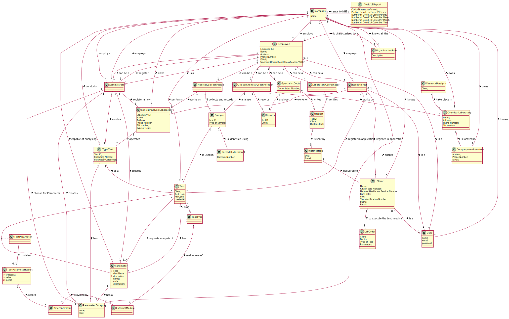

# OO Analysis

The construction process of the domain model is based on the client specifications, especially the nouns (for _
concepts_) and verbs (for _relations_) used.

## Rationale to identify domain conceptual classes

To identify domain conceptual classes, start by making a list of candidate conceptual classes inspired by the list of
categories suggested in the book "Applying UML and Patterns: An Introduction to Object-Oriented Analysis and Design and
Iterative Development".

### _Conceptual Class Category List_

**Business Transactions**

- Test

---

**Transaction Line Items**

- Sample

---

**Product/Service related to a Transaction or Transaction Line Item**

---

**Roles of People or Organizations**

- Client
- Receptionist
- Medical Lab Technician
- Specialist Doctor
- Administrator
- Clinical Chemistry Technologist
- Laboratory Coordinator
- User

---

**Places**

- Clinical Analysis Laboratory
- Chemical Laboratory
- Company's Headquarters

---

**Noteworthy Events**

- Chemical Analysis

---

**Physical Objects**

- blood sample
- swab sample

---

**Descriptions of Things**

-Parameter

- Type of Test
- Type of Sample
- Reference Value
- Test Parameter

--- 

**Organizations**

- Many Labs

---

**Other External/Collaborating Systems**

- Barcode External API
- AutomaticValidationModule

---

**Documents mentioned/used to perform some work/**

- Lab Order
- Notification
- Organization Role
- Results
- Report

---

### **Rationale to identify associations between conceptual classes**

| Concept (A)                     | Association                 | Concept (B)                                                                                                                                    |
| ------------------------------- | :-------------------------: | ---------------------------------------------------------------------------------------------------------------------------------------------: |
| Administrator                   | choose for Parameter        | ParameterCategory                                                                                                                              |
| Administrator                   | register a new              | ClinicalAnalysisLaboratory                                                                                                                     |
| Administrator                   | register                    | Employee                                                                                                                                       |
| Administrator                   | creates                     | Parameter                                                                                                                                      |
| Administrator                   | creates                     | ParameterCategory                                                                                                                              |
| Administrator                   | creates                     | TypeTest                                                                                                                                       |
| Administrator                   | is a                        | Employee                                                                                                                                       |
| ChemicalAnalysis                | take place in               | ChemicalLaboratory                                                                                                                             |
| ChemicalLaboratory              | is located in               | CompanyHeadquarters                                                                                                                            |
| Client                          | is a                        | User                                                                                                                                           |
| Client                          | to execute the test needs a | LabOrder                                                                                                                                       |
| ClinicalAnalysisLaboratory      | operates                    | TypeTest                                                                                                                                       |
| ClinicalChemistryTechnologist   | works on                    | ChemicalLaboratory                                                                                                                             |
| ClinicalChemistryTechnologist   | records                     | Results                                                                                                                                        |
| ClinicalChemistryTechnologist   | analyse                     | Sample                                                                                                                                         |
| Company                         | knows all the               | OrganizationRole                                                                                                                               |
| Company                         | sends to NHS                | Covid19Report                                                                                                                                  |
| Company                         | employs                     | Administrator                                                                                                                                  |
| Company                         | employs                     | Administrator                                                                                                                                  |
| Company                         | knows                       | Client                                                                                                                                         |
| Company                         | owns                        | ClinicalAnalysisLaboratory                                                                                                                     |
| Company                         | employs                     | Employee                                                                                                                                       |
| Company                         | capable of analysing        | Parameter                                                                                                                                      |
| Company                         | adopts                      | ParameterCategory                                                                                                                              |
| Company                         | employs                     | Receptionist                                                                                                                                   |
| Company                         | performs                    | Test                                                                                                                                           |
| Company                         | conducts                    | TypeTest                                                                                                                                       |
| Company                         | knows                       | User                                                                                                                                           |
| Company                         | owns                        | ChemicalLaboratory                                                                                                                             |
| Company                         | owns                        | CompanyHeadquarters                                                                                                                            |
| Employee                        | is a                        | User                                                                                                                                           |
| Employee                        | is characterized by a       | OrganizationRole                                                                                                                               |
| Employee                        | can be a                    | Administrator                                                                                                                                  |
| Employee                        | can be a                    | ClinicalChemistryTechnologist                                                                                                                  |
| Employee                        | can be a                    | LaboratoryCoordinator                                                                                                                          |
| Employee                        | can be a                    | MedicalLabTechnician                                                                                                                           |
| Employee                        | can be a                    | Receptionist                                                                                                                                   |
| Employee                        | can be a                    | SpecialistDoctor                                                                                                                               |
| LaboratoryCoordinator           | verifies                    | Report                                                                                                                                         |
| MedicalLabTechnician            | collects and records        | Sample                                                                                                                                         |
| MedicalLabTechnician            | works on                    | ClinicalAnalysisLaboratory                                                                                                                     |
| Notification                    | delivered to                | Client                                                                                                                                         |
| Parameter                       | has a                       | ParameterCategory                                                                                                                              |
| Receptionist                    | works on                    | ClinicalAnalysisLaboratory                                                                                                                     |
| Receptionist                    | is a                        | User                                                                                                                                           |
| Receptionist                    | register in application     | Client                                                                                                                                         |
| Receptionist                    | register in application     | Test                                                                                                                                           |
| ReferenceValue                  | provided by                 | ExternalModule                                                                                                                                 |
| Report                          | is sent by                  | Notification                                                                                                                                   |
| Sample                          | is identified using         | BarcodeExternalAPI                                                                                                                             |
| Sample                          | is used in                  | Test                                                                                                                                           |
| SpecialistDoctor                | writes                      | Report                                                                                                                                         |
| SpecialistDoctor                | analyse                     | Results                                                                                                                                        |
| Test                            | is of                       | TestType                                                                                                                                       |
| Test                            | requests analysis of        | Parameter                                                                                                                                      |
| Test                            | has                         | Parameter                                                                                                                                      |
| TestParameter                   | contains                    | TestParameterResult                                                                                                                            |
| TestParameterResult             | record                      | ReferenceValue                                                                                                                                 |
| TypeTest                        | makes use of                | ExternalModule                                                                                                                                 |
| TypeTest                        | has                         | ParameterCategory                                                                                                                              |
| TypeTest                        | as a                        | Test                                                                                                                                           |

## Domain Model

