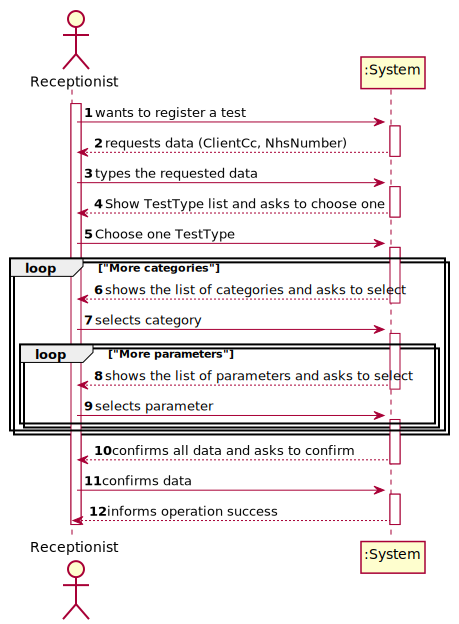
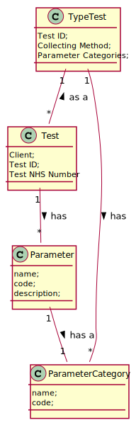
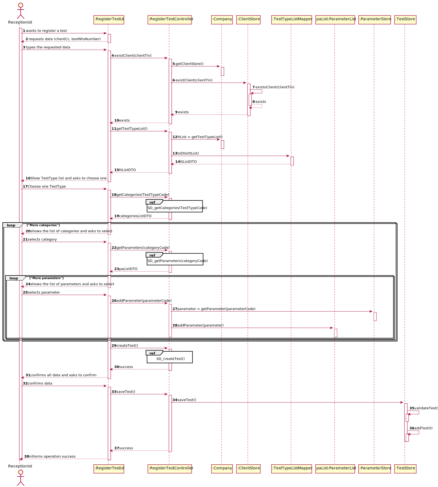
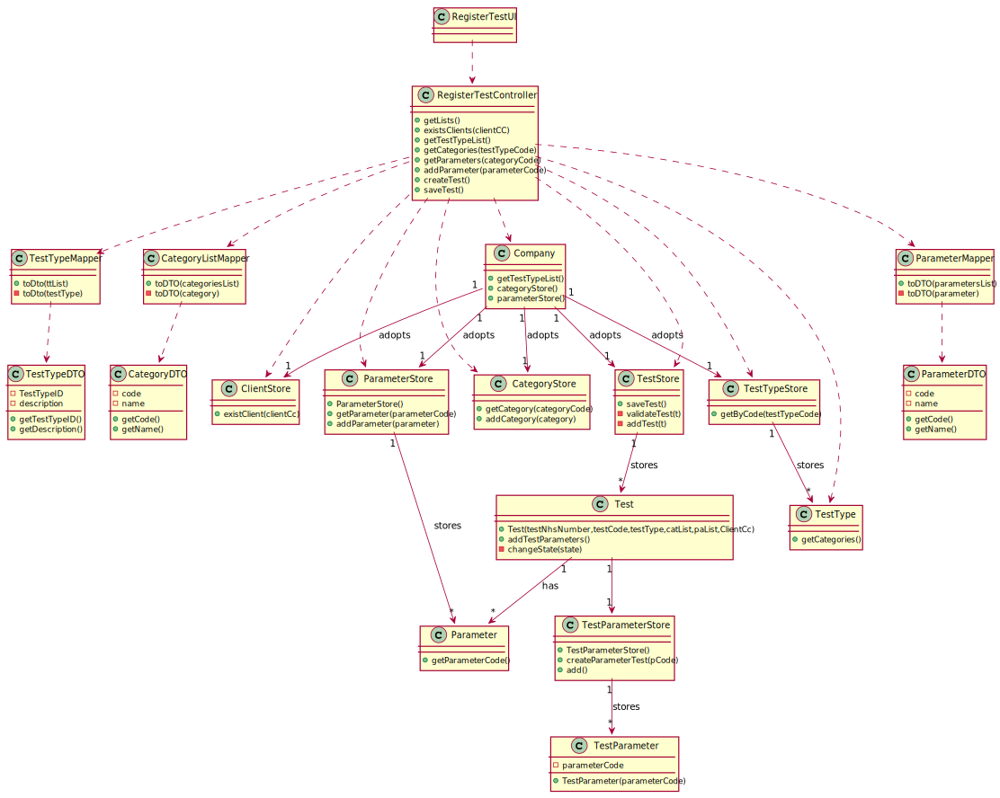

# US 4 - To register a test to be performed to a registered client

## 1. Requirements Engineering

### 1.1. User Story Description

As a receptionist of the laboratory, I intend to register a test to be performed to a registered client.

### 1.2. Customer Specifications and Clarifications

**From the specifications document:**
> "Typically, the client arrives at one of the clinical analysis laboratories with a lab order prescribed by a doctor. Once there, a receptionist asks the client’s citizen card number, the lab order (which contains the type of test and parameters to be measured), and registers in the application the test to be performed to that client."

> "Many Labs perform two types of tests. Each test is characterized by an internal code, an NHS code, a description that identifies the sample collection method, the date and time when the samples were collected, the date and time of the chemical analysis, the date and time of the diagnosis made by the specialist doctor, the date and time when the laboratory coordinator validated the test, and the test type (whether it is blood test or Covid test)."
>
**From the client clarifications:**

> **Question:**
> When the receptionist chooses the test type, should the categories appear, and then when selecting the category, the receptionist can choose the parameters for the test? Or when the Receptionist chooses the test type, should appear all the parameters that it includes immediately?
>
> **Answer:**
> Firstly, the receptionist should choose a test type. Then choose a category from a set of categories. Last, the receptionist should choose a parameter.

> **Question:**
> What are the attributes of a test and the acceptance criteria?
>
> **Answer:**
> A test has the following attributes:  
Test code : Sequential number with 12 digits. The code is automatically generated. 
NHS code: 12 alphanumeric characters.

> **Question:**
> Is the NHS code of which test is unique or not.
>
> **Answer:**
> Yes, it is

> **Question:**
> On the project description it says "Each test is characterized by an internal code, an NHS code, a description that identifies the sample collection method...". You said that the code is a 12 digit sequential number. Does this mean that, for example, the first test will have the code "000000000001" and so on?
>
> **Answer:**
> Yes.

> **Question:**
> On the project description we have multiple attributes of date and time ("date and time when the samples were collected", etc). Are these attributes filled by the author of the respective act or is it generated by the system when those acts are performed?
>
> **Answer:**
> The system should automatically generate the date and time of the event (test registration, chemical analysis, diagnosis and validation).

> **Question:**
> When the receptionist is registering a test for a client, the test can have more than one category and many parameters of the chosen categories, or it only can have one category?>
>
> **Answer:**
> Each test can have more than one category.

### 1.3. Acceptance Criteria

- **AC1:** The receptionist must select the Categories and Parameters to be analysed from all possible Categories and Parameters in accordance with
  the test type.
- **AC2:** Citizen Card number is a 16-digit number.
- **AC3:** Test Code must be a sequential number with 12 digits that is generated automatically
- **AC4:** Each test can have more than one category.
- **AC5:** The system should automatically generate the date and time of the every event
- **AC6:** NHS code have 12 alphanumeric characters
### 1.4. Found out Dependencies

* There is a dependency to "US3- To register a client." since the client must be registered in the application to
  register their test.

* There is a dependency to "US7- To register an employee." since at least one receptionist must be registered in the application to
  register the test.  

* There is a dependency to "US11 - To register a Parameter Category", to "US10 - To register a Parameter " and to "US - To specify a new type of test" since at least a type of test must be registered and consequently there must be registered ate least one parameter and one parameter category. 

### 1.5 Input and Output Data

**Input Data:**

* Typed data:
    * client's citizen card number
    * Nhs Number

* Selected data:
    * Parameter Category
    * Parameters
    * Type of test

**Output Data:**

* List of Types of test in the system
* List of Parameters in the system
* List of Parameter Categories in the system
* (In)Success of the operation

### 1.6. System Sequence Diagram (SSD)

*Insert here a SSD depicting the envisioned Actor-System interactions and throughout which data is inputted and
outputted to fulfill the requirement. All interactions must be numbered.*

 
### 1.7 Other Relevant Remarks

*Use this section to capture other relevant information that is related with this US such as (i) special requirements
; (ii) data and/or technology variations; (iii) how often this US is held.*

## 2. OO Analysis

### 2.1. Relevant Domain Model Excerpt

*In this section, it is suggested to present an excerpt of the domain model that is seen as relevant to fulfill this
requirement.*

### 2.2. Other Remarks

*Use this section to capture some aditional notes/remarks that must be taken into consideration into the design
activity. In some case, it might be usefull to add other analysis artifacts (e.g. activity or state diagrams).*

## 3. Design - User Story Realization

### 3.1. Rationale

**The rationale grounds on the SSD interactions and the identified input/output data.**

| Interaction ID                                          | Question: Which class is responsible for...                                 | Answer               | Justification (with patterns)                                                                                                                                                                                                                                                                                                   |
| :-------------                                          | :---------------------                                                      | :------------        | :----------------------------                                                                                                                                                                                                                                                                                                   |
| Step 1: wants to register a test                        | ... interacting with the actor?                                             | CreateTestUI         | Pure Fabrication: there is no reason to assign this responsibility to any existing class in the Domain Model                                                                                                                                                                                                                    |
|                                                         | ... coordinating the US?                                                    | CreateTestController | Controller                                                                                                                                                                                                                                                                                                                      |
| Step 2: requests data (clientCc, testNhsNumber)         | ... create the CategoryStore and ParameterStore objects of the Test Object? | Controller           | IE: ver isto não está bem                                                                                                                                                                                                                                                                                                       |
| Step 3: types the requested data                        | ... checks if the Client object exists ?                                    | ClientStore          | IE: knows all the clients in the system                                                                                                                                                                                                                                                                                         |
|                                                         | ... get the data to show the user?                                          | TypeTestMapper       | DTO: in order to detach the domain layer from the the ui layer we use a data transfer object in order to only extract data from the domain class and dont extract operations                                                                                                                                                    |
| Step 4: Show TestType list and asks to choose one       |                                                                             |                      |                                                                                                                                                                                                                                                                                                                                 |
| Step 5: Choose one TestType                             | ... get the Type of Test?                                                   | TestTypeStore        | IE: The store knows all the types of test in the system                                                                                                                                                                                                                                                                         |
|                                                         | ... get the categories associated with the type of test?                    | TestType             | IE: TestType knows all the categories associated with it                                                                                                                                                                                                                                                                        |
| Step 6: shows the list of categories and asks to select |                                                                             |                      |                                                                                                                                                                                                                                                                                                                                 |
| Step 7: selects category                                | ... get the Category?                                                       | CategoryStore        | IE: The store knows all the categories in the system                                                                                                                                                                                                                                                                            |
|                                                         | ... get the parameters associated with the categories?                      | ParameterStore       | IE: Since the category object does not hold the information of which parameters are associated with the category object the class that knows all the parameters object and all his proprieties is the ParameterStore class. Therefore is the class responsible for getting the te parameters associated with the given category |
| Step 8: shows the list of parameters and asks to select |                                                                             |                      |                                                                                                                                                                                                                                                                                                                                 |
| Step 9: selects parameter                               | ... get the Parameter                                                       | ParameterStore       | IE: The store knows all the parameters in the system                                                                                                                                                                                                                                                                            |
|                                                         | ... create the Test ?                                                       | TestStore            | Creator (R1) and HC+LC: By the application of the Creator (R1) it would be the Company. But, by applying HC + LC to the Company, this delegates that responsibility to the TestStore                                                                                                                                            |
|                                                         | ... create the test code?                                                   | TestStore            | IE: Store knows all the tests and so have the information to generate the ID                                                                                                                                                                                                                                                    |
|                                                         | ... change the object state?                                                | Test                 | IE: Test knows his own state                                                                                                                                                                                                                                                                                                    |
|                                                         | ... validate the date? (locally)                                            | Test                 | IE: knows its own information                                                                                                                                                                                                                                                                                                   |
|                                                         | ... validate data? (globally)                                               | TestStore            | IE: Store knows all the tests                                                                                                                                                                                                                                                                                                   |
| Step 10: confirms all data and asks to confirm          |                                                                             |                      |                                                                                                                                                                                                                                                                                                                                 |
| Step 11: confirms data                                  | ... saving the Test object                                                  | TestStore            | IE: knows all                                                                                                                                                                                                                                                                                                                   |
|                                                         |                                                                             |                      |                                                                                                                                                                                                                                                                                                                                 |
| Step 12: informs operation success                      | ...informing operation success                                              | CreateTestUI         | **IE:** is responsible for user interactions                                                                                                                                                                                                                                                                                    |

### Systematization ##

According to the taken rationale, the conceptual classes promoted to software classes are:

* Company
* Test
* Parameter
* Category
* TestType

Other software classes (i.e. Pure Fabrication) identified:

* CreateTestUI
* CreateTestController
* TestStore
* ParameterStore
* CategoryStore
* TestTypeStore

## 3.2. Sequence Diagram (SD)

### Main Sequence Diagram

### createTest() Sequence Diagram
.svg)

### getCategories(TestTypeCode) Sequence Diagram
.svg)

### getParameters(categoryCode) Sequence Diagram
.svg)

### getTestTypeList() Sequence Diagram
.svg)

## 3.3. Class Diagram (CD)

*In this section, it is suggested to present an UML static view representing the main domain related software classes
that are involved in fulfilling the requirement as well as and their relations, attributes and methods.*

# 4. Tests

*In this section, it is suggested to systematize how the tests were designed to allow a correct measurement of
requirements fulfilling.*

**_DO NOT COPY ALL DEVELOPED TESTS HERE_**

**Test 1:** Check that it is not possible to create an instance of the Example class with null values.

	@Test(expected = IllegalArgumentException.class)
		public void ensureNullIsNotAllowed() {
		Exemplo instance = new Exemplo(null, null);
	}

*It is also recommended to organize this content by subsections.*

# 5. Construction (Implementation)

*In this section, it is suggested to provide, if necessary, some evidence that the construction/implementation is in
accordance with the previously carried out design. Furthermore, it is recommeded to mention/describe the existence of
other relevant (e.g. configuration) files and highlight relevant commits.*

*It is also recommended to organize this content by subsections.*

# 6. Integration and Demo

*In this section, it is suggested to describe the efforts made to integrate this functionality with the other features
of the system.*

# 7. Observations

*In this section, it is suggested to present a critical perspective on the developed work, pointing, for example, to
other alternatives and or future related work.*

