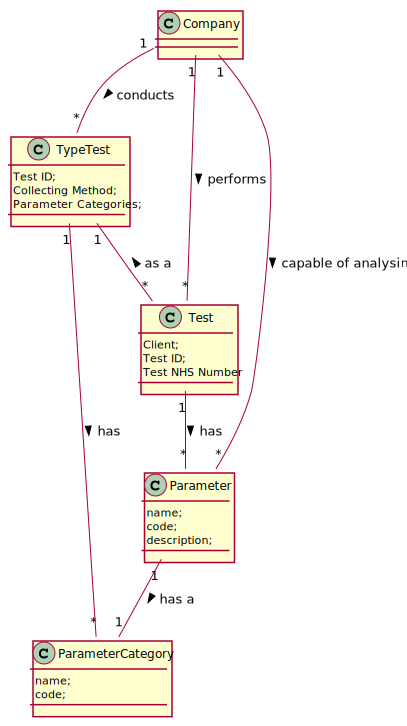
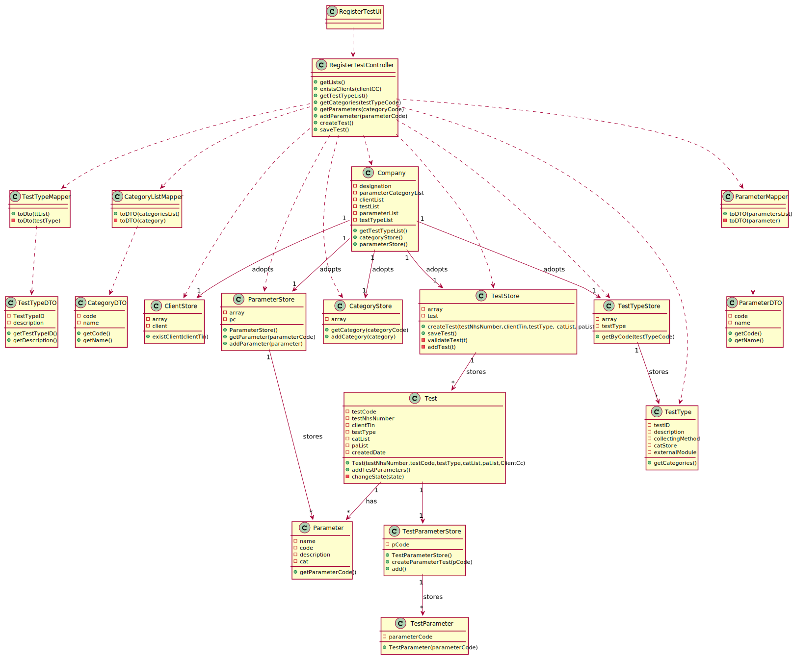

# US 4 - To register a test to be performed to a registered client

## 1. Requirements Engineering

### 1.1. User Story Description

As a receptionist of the laboratory, I intend to register a test to be performed to a registered client.

### 1.2. Customer Specifications and Clarifications

**From the specifications document:**
> "Typically, the client arrives at one of the clinical analysis laboratories with a lab order prescribed by a doctor. Once there, a receptionist asks the client’s citizen card number, the lab order (which contains the type of test and parameters to be measured), and registers in the application the test to be performed to that client."

> "Many Labs perform two types of tests. Each test is characterized by an internal code, an NHS code, a description that identifies the sample collection method, the date and time when the samples were collected, the date and time of the chemical analysis, the date and time of the diagnosis made by the specialist doctor, the date and time when the laboratory coordinator validated the test, and the test type (whether it is blood test or Covid test)."
>
**From the client clarifications:**

> **Question:**
> When the receptionist chooses the test type, should the categories appear, and then when selecting the category, the receptionist can choose the parameters for the test? Or when the Receptionist chooses the test type, should appear all the parameters that it includes immediately?
>
> **Answer:**
> Firstly, the receptionist should choose a test type. Then choose a category from a set of categories. Last, the receptionist should choose a parameter.


> **Question:**
> What are the attributes of a test and the acceptance criteria?
>
> **Answer:**
> A test has the following attributes: <br>
Test code : Sequential number with 12 digits. The code is automatically generated.<br>
NHS code: 12 alphanumeric characters.

> **Question:**
> Is the NHS code of which test is unique or not.
>
> **Answer:**
> Yes, it is

> **Question:**
> On the project description it says "Each test is characterized by an internal code, an NHS code, a description that identifies the sample collection method...". You said that the code is a 12 digit sequential number. Does this mean that, for example, the first test will have the code "000000000001" and so on?
>
> **Answer:**
> Yes.

> **Question:**
> On the project description we have multiple attributes of date and time ("date and time when the samples were collected", etc). Are these attributes filled by the author of the respective act or is it generated by the system when those acts are performed?
>
> **Answer:**
> The system should automatically generate the date and time of the event (test registration, chemical analysis, diagnosis and validation).

> **Question:**
> When the receptionist is registering a test for a client, the test can have more than one category and many parameters of the chosen categories, or it only can have one category?
>
> **Answer:**
> Each test can have more than one category.

> **Question:**
> Shouldn't the receptionist locate the Client by the Citizen Card Number instead of TIN Number?
>
> **Answer:**
> The receptionist should use the TIN number to find the client.

> **Question:**
> You've said on previous questions that the NHS code contains 12 characters and is alphanumeric, so this will be different from the NHS number from the client, am I right? If so, how do we know a certain test is associated to a client?
>
> **Answer:**
> A test has a NHS code and a client has a NHS number. In US4 the receptionist of the laboratory should ask the client to get his TIN number. Using the TIN number the receptionist of the laboratory can find all information about the client. Do not forget that a client should be registered in the system to make a test.

> **Question:**
> Can the client have two identical tests? or the system should stop from creating the same test?
>
> **Answer:**
> A test is unique in the system.

### 1.3. Acceptance Criteria

- **AC1:** The receptionist must select the Categories and Parameters to be analysed from all possible Categories and
  Parameters in accordance with the test type.
- **AC2:** Client's Tax Identification Number must have 10 digits.
- **AC3:** Test Code must be a sequential number with 12 digits that is generated automatically
- **AC4:** Each test can have more than one category.
- **AC5:** The system should automatically generate the date and time of the every event
- **AC6:** NHS code have 12 alphanumeric characters
- **AC7:** A test is unique in the system
- **AC8:** The receptionist should use the TIN number to find the client

### 1.4. Found out Dependencies

* There is a dependency to "US3- To register a client." since the client must be registered in the application to
  register their test.

* There is a dependency to "US7- To register an employee." since at least one receptionist must be registered in the
  application to register the test.

* There is a dependency to "US11 - To register a Parameter Category", to "US10 - To register a Parameter " and to "US -
  To specify a new type of test" since at least a type of test must be registered and consequently there must be
  registered ate least one parameter and one parameter category.

### 1.5 Input and Output Data

**Input Data:**

* Typed data:
    * client's citizen card number
    * Client's Tin Number


* Selected data:
    * Parameter Category
    * Parameters
    * Type of test

**Output Data:**

* List of Types of test in the system
* List of Parameters in the system
* List of Parameter Categories in the system
* (In)Success of the operation

### 1.6. System Sequence Diagram (SSD)

*Insert here a SSD depicting the envisioned Actor-System interactions and throughout which data is inputted and
outputted to fulfill the requirement. All interactions must be numbered.*


### 1.7 Other Relevant Remarks

*Use this section to capture other relevant information that is related with this US such as (i) special requirements
; (ii) data and/or technology variations; (iii) how often this US is held.*

## 2. OO Analysis

### 2.1. Relevant Domain Model Excerpt

*In this section, it is suggested to present an excerpt of the domain model that is seen as relevant to fulfill this
requirement.*



### 2.2. Other Remarks

*Use this section to capture some aditional notes/remarks that must be taken into consideration into the design
activity. In some case, it might be usefull to add other analysis artifacts (e.g. activity or state diagrams).*

## 3. Design - User Story Realization

### 3.1. Rationale

**The rationale grounds on the SSD interactions and the identified input/output data.**

| Interaction ID                                          | Question: Which class is responsible for...              | Answer               | Justification (with patterns)                                                                                                                                                                                                                                                                                                   |
| :-------------                                          | :---------------------                                   | :------------        | :----------------------------                                                                                                                                                                                                                                                                                                   |
| Step 1: wants to register a test                        | ... interacting with the actor?                          | CreateTestUI         | Pure Fabrication: there is no reason to assign this responsibility to any existing class in the Domain Model                                                                                                                                                                                                                    |
|                                                         | ... coordinating the US?                                 | CreateTestController | Controller                                                                                                                                                                                                                                                                                                                      |
| Step 2: requests data (clientCc, testNhsNumber)         |                                                          |                      |                                                                                                                                                                                                                                                                                                                                 |
| Step 3: types the requested data                        | ... checks if the Client object exists ?                 | ClientStore          | IE: knows all the clients in the system                                                                                                                                                                                                                                                                                         |
|                                                         | ... get the data to show the user?                       | TypeTestMapper       | DTO: in order to detach the domain layer from the the ui layer we use a data transfer object in order to only extract data from the domain class and dont extract operations                                                                                                                                                    |
| Step 4: Show TestType list and asks to choose one       |                                                          |                      |                                                                                                                                                                                                                                                                                                                                 |
| Step 5: Choose one TestType                             | ... get the Type of Test?                                | TestTypeStore        | IE: The store knows all the types of test in the system                                                                                                                                                                                                                                                                         |
|                                                         | ... get the categories associated with the type of test? | TestType             | IE: TestType knows all the categories associated with it                                                                                                                                                                                                                                                                        |
| Step 6: shows the list of categories and asks to select |                                                          |                      |                                                                                                                                                                                                                                                                                                                                 |
| Step 7: selects category                                | ... get the Category?                                    | CategoryStore        | IE: The store knows all the categories in the system                                                                                                                                                                                                                                                                            |
|                                                         | ... get the parameters associated with the categories?   | ParameterStore       | IE: Since the category object does not hold the information of which parameters are associated with the category object the class that knows all the parameters object and all his proprieties is the ParameterStore class. Therefore is the class responsible for getting the te parameters associated with the given category |
| Step 8: shows the list of parameters and asks to select |                                                          |                      |                                                                                                                                                                                                                                                                                                                                 |
| Step 9: selects parameter                               | ... get the Parameter                                    | ParameterStore       | IE: The store knows all the parameters in the system                                                                                                                                                                                                                                                                            |
|                                                         | ... create the Test ?                                    | TestStore            | Creator (R1) and HC+LC: By the application of the Creator (R1) it would be the Company. But, by applying HC + LC to the Company, this delegates that responsibility to the TestStore                                                                                                                                            |
|                                                         | ... create the test code?                                | TestStore            | IE: Store knows all the tests and so have the information to generate the ID                                                                                                                                                                                                                                                    |
|                                                         | ... change the object state?                             | Test                 | IE: Test knows his own state                                                                                                                                                                                                                                                                                                    |
|                                                         | ... validate the date? (locally)                         | Test                 | IE: knows its own information                                                                                                                                                                                                                                                                                                   |
|                                                         | ... validate data? (globally)                            | TestStore            | IE: Store knows all the tests                                                                                                                                                                                                                                                                                                   |
| Step 10: confirms all data and asks to confirm          |                                                          |                      |                                                                                                                                                                                                                                                                                                                                 |
| Step 11: confirms data                                  | ... saving the Test object                               | TestStore            | IE: knows all                                                                                                                                                                                                                                                                                                                   |
|                                                         |                                                          |                      |                                                                                                                                                                                                                                                                                                                                 |
| Step 12: informs operation success                      | ...informing operation success                           | CreateTestUI         | **
IE:** is responsible for user interactions
|

### Systematization ##

According to the taken rationale, the conceptual classes promoted to software classes are:

* Company
* Test
* Parameter
* Category
* TestType

Other software classes (i.e. Pure Fabrication) identified:

* CreateTestUI
* CreateTestController
* TestStore
* ParameterStore
* CategoryStore
* TestTypeStore
* TestTypeMapper
* CategoryMapper
* ParameterMapper

## 3.2. Sequence Diagram (SD)

### Main Sequence Diagram


### createTest() Sequence Diagram

.svg)

### getCategories(TestTypeCode) Sequence Diagram

.svg)

### getParameters(categoryCode) Sequence Diagram

.svg)

### getTestTypeList() Sequence Diagram

.svg)

## 3.3. Class Diagram (CD)

*In this section, it is suggested to present an UML static view representing the main domain related software classes
that are involved in fulfilling the requirement as well as and their relations, attributes and methods.*



# 4. Tests

*In this section, it is suggested to systematize how the tests were designed to allow a correct measurement of
requirements fulfilling.*

**_DO NOT COPY ALL DEVELOPED TESTS HERE_**

**Test 1:** Check that it is possible to create an instance of the Test class .

````
    @Test
    public void createValidTest() {
        ParameterCategoryStore cat = new ParameterCategoryStore();
        ParameterCategory pc1 = new ParameterCategory("AH000", "Hemogram");
        cat.add(pc1);
        List<ParameterCategory> cat1 = new ArrayList<>();
        cat1.add(pc1);
        List<Parameter> pa = new ArrayList<>();
        Parameter p1 = new Parameter("AH000", "Nome", "description", pc1);
        pa.add(p1);
        TestType testType = new TestType("BL000", "description", "sei lá", cat);

        app.domain.model.Test test = new app.domain.model.Test("1234s", "123456789012", "1234567890123456", testType, cat1, pa);
        Assert.assertNotNull(test);
    }
````

**Test 2:** Check that it is not possible to create an instance of the Test class with null arguments .

````
    @Test(expected = IllegalArgumentException.class)
    public void createInvalidTestNhsNumberNull() {
        ParameterCategoryStore cat = new ParameterCategoryStore();
        ParameterCategory pc1 = new ParameterCategory("AH000", "Hemogram");
        cat.add(pc1);
        List<ParameterCategory> cat1 = new ArrayList<>();
        cat1.add(pc1);
        List<Parameter> pa = new ArrayList<>();
        Parameter p1 = new Parameter("AH000", "Nome", "description", pc1);
        pa.add(p1);
        TestType testType = new TestType("BL000", "description", "sei lá", cat);

        app.domain.model.Test test = new app.domain.model.Test("000000000000001", null, "1234567890123456", testType, cat1, pa);
    }
    
````

**Test 3:** Check that it is not possible to save a repeated Test object (AC7) .

````
    @Test
    public void addInvalidTest() {

        ParameterCategoryStore cat = new ParameterCategoryStore();
        ParameterCategory pc1 = new ParameterCategory("AH000", "Hemogram");
        cat.add(pc1);
        List<ParameterCategory> cat1 = new ArrayList<>();
        cat1.add(pc1);
        List<Parameter> pa = new ArrayList<>();
        Parameter p1 = new Parameter("AH000", "Nome", "description", pc1);
        pa.add(p1);
        TestType testType = new TestType("BL000", "description", "sei lá", cat);
        TestStore store = new TestStore();

        store.createTest("123456789187", "1234567890123456", testType, cat1, pa);
        store.saveTest();

        store.createTest("123456789187", "1234567890123456", testType, cat1, pa);

        Assert.assertFalse(store.saveTest());

    }
    
````


# 5. Construction (Implementation)

## RegisterTestUI

```java
public class RegisterTestUI implements Runnable {
    private CreateTestController ctrl;
    private TestTypeDTO testType;
    private List<CategoryListDTO> categories;
    private CategoryListDTO category;
    private List<ParameterDTO> parameters;
    private ParameterDTO parameter;

    public RegisterTestUI() {
        this.ctrl = new CreateTestController();
    }

    /**
     * When an object implementing interface {@code Runnable} is used
     * to create a thread, starting the thread causes the object's
     * {@code run} method to be called in that separately executing
     * thread.
     * <p>
     * The general contract of the method {@code run} is that it may
     * take any action whatsoever.
     *
     * @see Thread#run()
     */
    @Override
    public void run() {
        ctrl.getLists();
        boolean cont = true;
        boolean cat = true;
        boolean pa = true;

        do {
            String tin = Utils.readLineFromConsole("Please enter the Tin of the Client ()");
            ctrl.getLists();
            if (ctrl.existClient(tin)) {
                boolean exception = false;
                do {
                    String testNhsCode = Utils.readLineFromConsole("Please enter the Test NHS Code (12 characters)");
                    try {
                        this.testType = (TestTypeDTO) Utils.showAndSelectOne(ctrl.getTestTypeList(), "Please select one Type of Test");

                        this.categories = ctrl.getCategories(testType.getTestID());
                        do {
                            this.category = (CategoryListDTO) Utils.showAndSelectOne(categories, "Please select one Category\n");
                            do {
                                this.parameters = ctrl.getParameters(this.category.getCode());
                                this.parameter = (ParameterDTO) Utils.showAndSelectOne(parameters, "Please select one Parameter");

                                ctrl.addParameter(parameter.getCode());
                                pa = Utils.confirm("Do you want to select other parameter");
                            } while (pa);
                            cat = Utils.confirm("Do you want to select other category");
                        } while (cat);
                    } catch (Exception e) {
                        System.out.println("There must exist Types of Tests, Parameter Categories and Parameters in the system \n");
                    }
                    try {
                        ctrl.createTest(testNhsCode, tin);
                        exception = false;
                    } catch (Exception e) {
                        System.out.println(e.getMessage());
                        System.out.println("An error occurred during the creation during the creation of the Test please try again\n");
                        exception = true;

                    }
                } while (exception);

                cont = Utils.confirm("The following Test was created do you want to save? (s/n) \n" + ctrl.getTest());
                if (cont) {
                    ctrl.saveTest();
                }
            } else {
                System.out.println("The client does not exists please register the client before registering the test");
                cont = true;
            }
        } while (!cont);


    }
}
```

## CreateTestController

````java
public class CreateTestController {
    private Company company;
    private TestStore store;
    private TestTypeStore ttList;
    private TestType testType;
    private ParameterCategoryStore categoriesList;
    private List<ParameterCategory> caList;
    private List<Parameter> paList;


    public CreateTestController() {
        this(App.getInstance().getCompany());
    }

    public CreateTestController(Company company) {
        this.company = company;
        store = company.getTestList();
    }

    public void getLists() {

        this.caList = new ArrayList<ParameterCategory>();
        this.paList = new ArrayList<Parameter>();

    }

    public boolean existClient(String clientTin) {
        ClientStore cList = company.getClientList();
        return cList.exists(clientTin);
    }

    public void createTest(String testNhsNumber, String clientCc) {
        store.createTest(testNhsNumber, clientCc, this.testType, this.caList, this.paList);
    }

    public boolean saveTest() {
        return store.saveTest();
    }

    public List<TestTypeDTO> getTestTypeList() {
        this.ttList = company.getTestTypeList();
        TestTypeListMapper typeMapper = new TestTypeListMapper();
        return typeMapper.toDTO(ttList);
    }

    public List<CategoryListDTO> getCategories(String testTypeCode) {
        this.testType = ttList.getByID(testTypeCode);
        this.categoriesList = company.getParameterCategoryList();
        CategoryListMapper catMapper = new CategoryListMapper();
        return catMapper.toDTO(categoriesList);
    }

    public List<ParameterDTO> getParameters(String categoryCode) {
        ParameterStore paStore = company.getParameterList();

        ParameterCategory category = this.categoriesList.getByCode(categoryCode);
        this.caList.add(category);
        List<Parameter> plist = paStore.getParameterList(categoryCode);
        ParameterListMapper pMapper = new ParameterListMapper();
        return pMapper.toDTO(plist);
    }

    public void addParameter(String parameterCode) {
        ParameterStore paStore = company.getParameterList();
        Parameter pa = paStore.getParameter(parameterCode);
        this.paList.add(pa);
    }

    public String getTest() {
        return store.getTest();
    }
}
````

## Company

````java
public class Company {

    private final String designation;
    private final AuthFacade authFacade;

    private final ParameterCategoryStore parameterCategoryList;
    private final ClientStore clientList;
    private final TestStore testList;
    private ParameterStore parameterList;
    private TestTypeStore testTypeList;

    /**
     * Constructor of the Company Class, instances a new object of AuthFacade and new empty stores
     *
     * @param designation Designation of Company
     */
    public Company(String designation) {

        this.designation = designation;
        this.authFacade = new AuthFacade();
        this.parameterList = new ParameterStore();
        this.testTypeList = new TestTypeStore();
        this.parameterCategoryList = new ParameterCategoryStore();
        this.clientList = new ClientStore();
        this.testList = new TestStore();

    }

    /**
     * @return designation of the Company
     */
    public String getDesignation() {
        return designation;
    }

    /**
     * @return Object of AuthFacade instantiated by the Company Controller
     */
    public AuthFacade getAuthFacade() {
        return authFacade;
    }

    /**
     * @return the list of Parameters Categories in the System
     */

    public ParameterCategoryStore getParameterCategoryList() {
        return this.parameterCategoryList;
    }


    /**
     * @return the list of Parameters in the System
     */
    public ParameterStore getParameterList() {
        this.parameterList = new ParameterStore();
        return this.parameterList;
    }

    /**
     * @return the list of Types of Tests in the System
     */
    public TestTypeStore getTestTypeList() {
        this.testTypeList = new TestTypeStore();
        return this.testTypeList;
    }

}
````

## ClientStore

````java
public class ClientStore {
    private final List<Client> array;
    private Client client;

    public boolean exists(String tin) {
        for (Client c : array) {
            return c.getTinNumber().equals(tin);
        }
        return false;
    }
}

````

## ParameterStore

````java

/**
 * Class that represents an List of all the Parameters in the system
 */
public class ParameterStore {
    private List<Parameter> array;
    private Parameter pc;

    /**
     * Constructor of the class it creates an empty list to be filled with objects of Parameter
     */
    public ParameterStore() {
        this.array = new ArrayList<Parameter>();
    }

    /**
     * this method adds the Parameter object to the arrayList
     *
     * @param pc Parameter object
     * @return a boolean value that indicates the success of the operation
     */

    public boolean add(Parameter pc) {
        array.add(pc);
        return true;
    }


    /**
     * @param parameterCode the code of the parameter
     * @return parameter object with the given code
     */
    public Parameter getParameter(String parameterCode) {
        for (Parameter p : array) {
            if (p.getCode().equals(parameterCode)) {
                return p;
            }
        }
        return null;
    }

}
````

## CategoryStore

````java

/**
 * Class that represents an List of all the Category of Parameters in the system
 */
public class ParameterCategoryStore {
    List<ParameterCategory> array;

    /**
     * Constructor of the class it creates an empty list to be filled with objects of ParameterCategory
     */
    public ParameterCategoryStore() {
        this.array = new ArrayList<>();
    }

    public boolean add(ParameterCategory pc) {
        return array.add(pc);
    }


    /**
     * This method search for an Parameter Category object by the code of that object in the ArrayList
     *
     * @param code code that characterize the Parameter Category object
     * @return if the object is found it returns the object, if not it returns null
     */

    public ParameterCategory getByCode(String code) {
        for (ParameterCategory pc : array) {
            if (pc.getCode().equals(code)) {
                return pc;
            }
        }
        return null;
    }
}
````

## TestStore

````java
/**
 * Class that represents an List of Tests in the system
 */
public class TestStore {
    private List<Test> array;
    private Test t;

    /**
     * Constructor of the class it creates an empty list to be filled with objects of Test
     */
    public TestStore() {
        this.array = new ArrayList<>();
    }

    /**
     * This method creates a new Test object by calling his constructor
     *
     * @param testNhsNumber unique code that identifies the test
     * @param clientTin     unique code that identifies the client associated with the test
     * @param testType      type of this test
     * @param catList       list of parameters categories that are measured in this test
     * @param paList        list of parameters that are measured in this test
     * @return boolean value representing the test validity within the system requirements
     */
    public boolean createTest(String testNhsNumber, String clientTin, TestType testType, List<ParameterCategory> catList, List<Parameter> paList) {

        this.t = new Test(getTestId(), testNhsNumber, clientTin, testType, catList, paList);
        this.t.addTestParameter();

        return validateTest();
    }

    /**
     * method creates the unique id of a test, the unique id is a number with 15 digits and increases conforming the number of tests in the system, for example if there are 5 tests in the system the id created will be "000000000000006"
     *
     * @return string that represents the id of the test
     */
    private String getTestId() {
        int ID = this.array.size() + 1;
        StringBuilder testNumber = new StringBuilder(String.valueOf(ID));

        while (testNumber.length() < 15) {
            testNumber.insert(0, "0");
        }

        return testNumber.toString();
    }

    /**
     * checks if the test is valid, in order to be valid the test must not be null, the object cannot already be stored in the list and the object cannot be equal to an object already existent in the list
     *
     * @return boolean value representing the test validity
     */
    public boolean validateTest() {
        return this.t != null && !contains(this.t) && !exists(this.t);
    }

    /**
     * checks if the test exists in the list by comparing the nhs number of each test
     *
     * @param t test object to be compared
     * @return boolean value that represents the existence of the test
     */
    private boolean exists(Test t) {
        for (Test t1 : this.array) {
            if (t.getTestNhsNumber().equals(t1.getTestNhsNumber())) {
                return true;
            }
        }
        return false;
    }

    /**
     * checks if the test object already exits in the list
     *
     * @param t test object to be tested
     * @return boolean value that represents the existence of the object
     */
    private boolean contains(Test t) {
        return array.contains(t);
    }

    /**
     * this methods adds the test object to the list
     *
     * @return boolean value that represents the success of the operation
     */
    public boolean saveTest() {
        if (validateTest()) {
            array.add(this.t);
            return true;
        }
        return false;
    }


    /**
     * adds the test to the list without validation
     *
     * @param t test instance that is going to be saved to the list
     * @return boolean value that represents the success of the operation
     */
    private boolean addTest(Test t) {
        return array.add(t);
    }

}
````

## TestTypeStore

````java
public class TestTypeStore {
    List<TestType> array;
    TestType t;

    /**
     * Constructor of the class it creates an empty list to be filled with objects of Parameter
     */
    public TestTypeStore() {
        this.array = new ArrayList<>();
    }

    /**
     * This method creates a new TestType object by calling his constructor
     *
     * @param testID           ID of Type if Test
     * @param description      simple description of the type of test
     * @param collectingMethod collecting methods of the type of test
     * @param catStore         list of Parameter Categories associated with the test
     * @return Type of Test created
     */
    public TestType CreateTestType(String testID, String description, String collectingMethod, ParameterCategoryStore catStore) {
        this.t = new TestType(testID, description, collectingMethod, catStore);
        return this.t;
    }

    /**
     * This method search for an TestType object by the code of that object in the ArrayList
     *
     * @param id ID that characterize the TestType object
     * @return if the object is found it returns the object, if not it returns null
     */
    public TestType getByCode(String id) {
        for (TestType t1 : array) {
            if (t1.getTestID().equals(id)) {
                return t1;
            }
        }
        return null;
    }
}

````

## Test

````java

public class Test {

    private final String testCode;
    private final String testNhsNumber;
    private final String clientTin;
    private final TestType testType;
    private final List<ParameterCategory> catList;
    private final List<Parameter> paList;
    private final LocalDate createdDate;

    /**
     * Constructor of the Test object, it call methods on order to validate the NhsNumber, the list of categories and the list of parameters
     *
     * @param testCode      unique code generated automatically
     * @param testNhsNumber unique code that identifies the test
     * @param clientTin     unique code that identifies the client associated with the test
     * @param testType      type of this test
     * @param catList       list of parameters categories that are measured in this test
     * @param paList        list of parameters that are measured in this test
     */
    public Test(String testCode, String testNhsNumber, String clientTin, TestType testType, List<ParameterCategory> catList, List<Parameter> paList) {

        checkTestNhsNumberRules(testNhsNumber);
        checkTestCodeRules(testCode);
        checkCatList(catList);
        checkPaList(paList);
        this.testCode = testCode;
        this.testNhsNumber = testNhsNumber;
        this.clientTin = clientTin;
        this.testType = testType;
        this.catList = catList;
        this.paList = paList;
        this.createdDate = LocalDate.now();

    }

    /**
     * This method checks if the test code meets the requirements, if not it throws a exception making the execution to stop
     *
     * @param testCode unique code generated automatically
     */
    private void checkTestCodeRules(String testCode) {
        if (testCode == null) {
            throw new IllegalArgumentException("The Test Code must exist");
        }
    }

    /**
     * This method checks if the list of parameters meets the requirements, if not it throws a exception making the execution to stop
     *
     * @param paList list of parameters that are measured in this test
     */
    private void checkPaList(List<Parameter> paList) {
        if (paList.isEmpty()) {
            throw new IllegalArgumentException("Parameter List must not be empty");
        }

    }

    /**
     * This method checks if the list of parameters categories meets the requirements, if not it throws a exception making the execution to stop
     *
     * @param catList list of parameters categories that are measured in this test
     */
    private void checkCatList(List<ParameterCategory> catList) {
        if (catList.isEmpty()) {
            throw new IllegalArgumentException("Category List must not be empty");
        }
    }

    /**
     * This method checks if the list of parameters categories meets the requirements, if not it throws a exception making the execution to stop
     *
     * @param testNhsNumber unique code that identifies the test
     */
    private void checkTestNhsNumberRules(String testNhsNumber) {
        if (testNhsNumber == null) {
            throw new IllegalArgumentException("The NHS Number must exist");
        }

        if (!StringUtils.isAlphanumeric(testNhsNumber)) {
            throw new IllegalArgumentException("The NHS Number must have just alphanumeric characters");
        }

        if (testNhsNumber.length() > Constants.TEST_NHS_CODE) {
            throw new IllegalArgumentException("The NHS Number must have a maximum of 12 characters");
        }

    }

    /**
     * Creates a new TestParameter object for each Parameter in the Parameter list received in the constructor and saves it in a new TestParameter List
     */
    public void addTestParameter() {
        this.testParam = new ArrayList<>();
        for (Parameter p : this.paList) {
            String code = p.getCode();
            TestParameter tp = new TestParameter(code);

            this.testParam.add(tp);

        }
        changeState(State.CREATED);
    }

    /**
     * Changes the state of the object test by changing the variable state with a value from the enum "State"
     *
     * @param s a value of the enum "State"
     */
    private void changeState(State s) {
        this.state = s;
    }

    /**
     * Changes the state of the object test by changing the variable state with a value from the enum "State
     * @param s a value of the enum "State"
     */
    public void changeState(String s) {
        switch (s) {
            case "CREATED":
                changeState(State.CREATED);
                break;
            case "SAMPLE_COLLECTED":
                changeState(State.SAMPLE_COLLECTED);
                this.sampleCreatedDate = LocalDate.now();
                break;
            case "SAMPLE_ANALYSED":
                changeState(State.SAMPLE_ANALYSED);
                this.analysedData = LocalDate.now();
                break;
            case "DIAGNOSTIC_MADE":
                changeState(State.DIAGNOSTIC_MADE);
                this.diagnosticDate = LocalDate.now();
                break;
            case "VALIDATED":
                changeState(State.VALIDATED);
                this.validatedDate = LocalDate.now();
                break;
            default:
                break;
        }
    }


    /**
     * @return a string with the current state of the test
     */
    public String getState() {
        return state.toString();
    }


    /**
     * This enum represents all the states that the Test object can assume
     */
    enum State {
        CREATED,
        SAMPLE_COLLECTED,
        SAMPLE_ANALYSED,
        DIAGNOSTIC_MADE,
        VALIDATED;


    }

}
````

## Parameter

````java

/**
 * Class that represents an Parameter
 */
public class Parameter {
    private final String name;
    private final String code;
    private final String description;
    private final ParameterCategory cat;


    /**
     * Constructor of the Parameter, it calls 2 methods in order to validate the parameters
     *
     * @param code        unique code needed to identify the Parameter
     * @param description description that characterize the Parameter
     * @param name        short name that characterize the Parameter
     * @param cat         category associated with the Parameter
     */
    public Parameter(String code, String name, String description, ParameterCategory cat) {
        checkCodeRules(code);
        checkNameRules(name);
        checkDescriptionRules(description);
        this.code = code;
        this.name = name;
        this.description = description;
        this.cat = cat;
    }

    /**
     * This method checks if the code provided meets the requirements, if not it throws a exception making the execution to stop
     *
     * @param code unique code needed to identify the Parameter
     */
    private void checkCodeRules(String code) {
        //
    }

    /**
     * This method checks if the code provided meets the requirements, if not it throws a exception making the execution to stop
     *
     * @param name name tha identifies the Parameter
     */
    private void checkNameRules(String name) {
        //
    }

    /**
     * This method checks if the description provided meets the requirements, if not it throws a exception making the execution to stop
     *
     * @param description description that characterize the Parameter
     */
    private void checkDescriptionRules(String description) {
        //
    }


    /**
     * @return unique code needed to identify the Parameter
     */
    public String getCode() {
        return code;
    }

}

````

## TestParameter

````java

/**
 * Class that represents a parameter associated with a test
 */
public class TestParameter {
    private final String pCode;

    /**
     * @param pCode Parameter Code
     */
    public TestParameter(String pCode) {
        this.pCode = pCode;
    }

}
````

*It is also recommended to organize this content by subsections.*

## TestType

````java

/**
 * Class that represents an Type of Test
 */
public class TestType {
    private String testID;
    private String description;
    private String collectingMethod;
    private ParameterCategoryStore catStore;
    private String externalModule;

    /**
     * Constructor of TestType, it calls methods in order to validate the parameters
     *
     * @param testID           ID of Type if test
     * @param description      simple description of the type of test
     * @param collectingMethod collecting methods of the type of test
     * @param catStore         list of Parameter Categories associated with the test
     */
    public TestType(String testID, String description, String collectingMethod, ParameterCategoryStore catStore) {
        checkCodeRules(testID);
        checkCollectingMethodRules(collectingMethod);
        checkDescriptionRules(description);
        checkCategoriesList(catStore);
        this.testID = testID;
        this.description = description;
        this.collectingMethod = collectingMethod;
        this.catStore = catStore;
        this.externalModule = setExternalModule(testID);

    }


    /**
     * This method checks if the code provided meets the requirements, if not it throws a exception making the execution to stop
     *
     * @param testID identification code of the test
     */
    private void checkCodeRules(String testID) {
        //
    }

    /**
     * This method checks if the code provided meets the requirements, if not it throws a exception making the execution to stop
     *
     * @param description description of the test
     */
    private void checkDescriptionRules(String description) {
        //
    }


    /**
     * This method checks if the code provided meets the requirements, if not it throws a exception making the execution to stop
     *
     * @param collectingMethod collecting method of the test
     */
    private void checkCollectingMethodRules(String collectingMethod) {
        //
    }

    /**
     * This method checks if the code provided meets the requirements, if not it throws a exception making the execution to stop
     *
     * @param catStore the list of categories of the test
     */
    private void checkCategoriesList(ParameterCategoryStore catStore) {
        //
    }


    /**
     * @return List of categories associated with the test
     */
    public ParameterCategoryStore getCatStore() {
        return catStore;
    }
}

````

# 6. Integration and Demo

- A new option on the receptionist menu was added.

# 7. Observations

*In this section, it is suggested to present a critical perspective on the developed work, pointing, for example, to
other alternatives and or future related work.*


