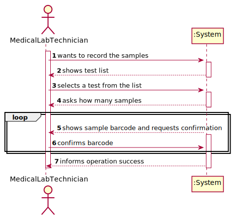
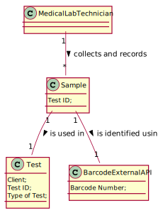
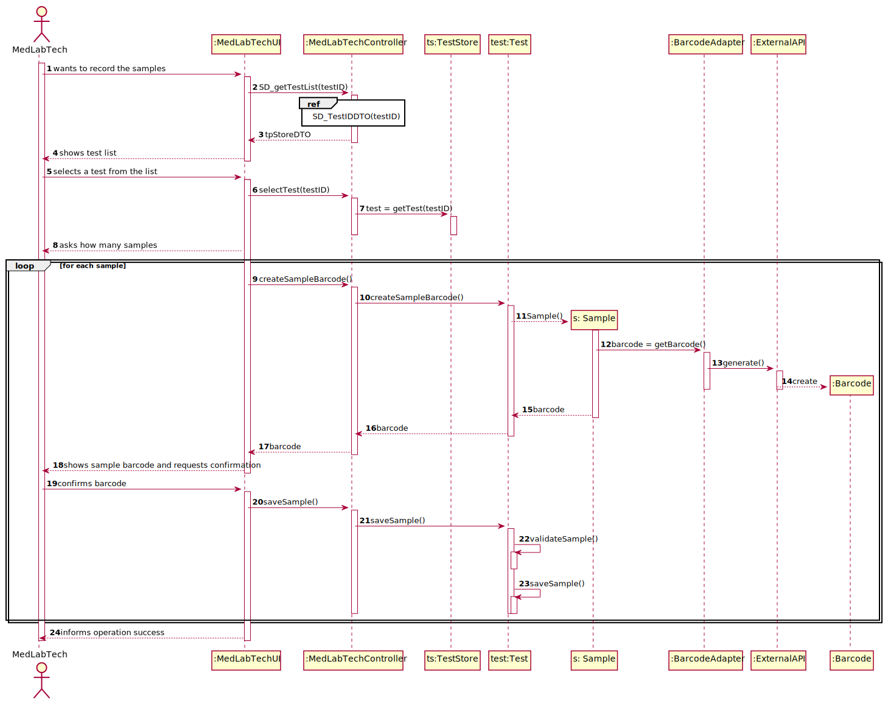
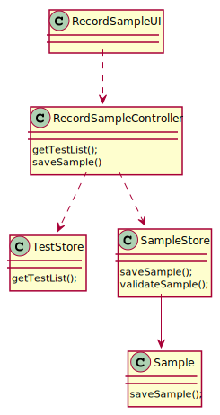

# US 05 - Record the samples

## 1. Requirements Engineering

### 1.1. User Story Description

As a medical lab technician, I want to record the samples collected in the scope of a given test.

### 1.2. Customer Specifications and Clarifications

**From the specifications document:**

> "Then, the client should wait until a medical lab technician calls him/her to collect the samples required to perform a given test"
>

**From the client clarifications:**

> **Question:** What kind of attributes should a sample have?
>
> **Answer:** Each sample is associated with a test. A sample has only one attribute, a barcode number (UPC) that is a sequential number and is automatically generated by the system. Each sample has a unique barcode number. In US5, the medical lab technician checks the system and see all tests for which there are no samples collected. The medical lab technician selects a test and the system asks for the number of samples to collect.
>
> **Link:** https://moodle.isep.ipp.pt/mod/forum/discuss.php?d=8244
>

-

> **Question:** Can a test have more than one sample?
>
> **Answer:** Yes.
>
> **Link:** https://moodle.isep.ipp.pt/mod/forum/discuss.php?d=8244
>

-

> **Question:** We didn't fully understand what will the API do in this US, so here's out interpretation from the US, correct us if we're wrong please: The API will be generated randomly and the API is an attribute from the sample.
>
> **Answer:** The API will be used to generate/print barcodes.
>
> **Link:** https://moodle.isep.ipp.pt/mod/forum/discuss.php?d=8244
>

-

> **Question:**  In the US acceptance criteria, it's also said that: "The API to use is defined by configuration.", does this means the medical lab technician is the one who chooses which kind of API wants to use for a certain sample?
>
> **Answer:** No.
>
> **Link:** https://moodle.isep.ipp.pt/mod/forum/discuss.php?d=8244
>

-

> **Question:** What information does the medical lab technician needs to input to the record a new sample?
>
> **Answer:** The medical lab technician checks a list of tests and selects one. Then, the application generates barcodes (one or more). After printing the barcodes (one or more) the use case ends.
>
> **Link:** https://moodle.isep.ipp.pt/mod/forum/discuss.php?d=8360#p10930
>

-

> **Question:** During the current sprint, how should we allow the barcodes to be printed. After generating them via the API, should we save the barcode images to the disk?
>
> **Answer:** Each generated barcode should be saved in a folder as a jpeg file.
>
> **Link:** https://moodle.isep.ipp.pt/mod/forum/discuss.php?d=8491
>

-

> **Question:**  It was answered in one of the previous questions that the sample only has one attribute, the barcode, however the description of the project also mentions a date of collection of the samples, is this date supposed to be an attribute of the test and not of the sample itself?
>
> **Answer:** Yes. The system should record the date (DD/MM/YYYY) and time (HH:MM) when the sample is collect made. The date and time are automatically generated by the system when the barcode is issued.
>
> **Link:** https://moodle.isep.ipp.pt/mod/forum/discuss.php?d=8450
>

-

> **Question:**   If there were multiple samples for a single test, would there be only one collection date for all of them?
>
> **Answer:** Only one collection date and time for a test.
>
> **Link:** https://moodle.isep.ipp.pt/mod/forum/discuss.php?d=8450
>

-

> **Question:** Why is there the specification for only the tests with no samples?
>
> **Answer:** The Medical Lab Technician selects a tests and the number of barcodes he/she wants. Then the system generates the requested barcodes. After generating the barcodes, the select test is no more available in the system for generating barcodes.
>
> **Link:** https://moodle.isep.ipp.pt/mod/forum/discuss.php?d=8437
>

-

> **Question:** Shouldn't there be a way for technicians to add more samples to an existing test?
>
> **Answer:** No.
>
> **Link:** https://moodle.isep.ipp.pt/mod/forum/discuss.php?d=8437
>

-

> **Question:** Should there be a validation of the number of samples?
>
> **Answer:** No.
>
> **Link:** https://moodle.isep.ipp.pt/mod/forum/discuss.php?d=8437
>

-

> **Question:** After the barcodes are generated. The concept-reality link would be, for example to stick each barcode into each sample?
>
> **Answer:** Yes. Each generated barcode should be saved in a folder as a jpeg file.
>
> **Link:** https://moodle.isep.ipp.pt/mod/forum/discuss.php?d=8437
>

-

> **Question:** Regarding US5, after selecting the number of samples for the test chosen by the medical lab tec., should the barcodes be displayed on the screen, or just printed and saved?
>
> **Answer:** Should be saved in a file. From a previous post: "Each sample has a unique barcode number. Each generated barcode should be saved in a folder as a jpeg file".
>
> **Link:** https://moodle.isep.ipp.pt/mod/forum/discuss.php?d=8589
>

-

> **Question:** What is supposed to show to the Medical Lab Technician when he selects the pretended test ?
>
> **Answer:** Firstly, the Medical Lab Technician checks the system to see the tests/clients that need to be done. Before selecting a test, the Medical Lab Technician checks/see the name of the client and all the test data (test attributes, test type, collection method, parameters, etc.). Then, the Medical Lab Technician selects one test/client and the system asks for the number of samples to collect. Next, the system generates the barcodes to put in the samples.
>
> **Link:** https://moodle.isep.ipp.pt/mod/forum/discuss.php?d=8583
>

-

> **Question:** About the generation of barcodes to each sample is it to follow the UPC-A standard? If so, what would be the manufacturer identification number? And can item number be generated sequentially?
>
> **Answer:** From a previous post: "A sample has only one attribute, a barcode number (UPC) that is a sequential number and is automatically generated by the system".
>
> **Link:** https://moodle.isep.ipp.pt/mod/forum/discuss.php?d=8582
>

### 1.3. Acceptance Criteria

* **AC1:** The system should support several barcode APIs. The API to use is defined by configuration.

* **AC2:** Each sample has a unique barcode number that is a sequential number and is automatically generated by the
  system.

### 1.4. Found out Dependencies

- The US5 has dependencies with the US4 since it needs the registered tests in which the medical lab technician will
  record the samples.

### 1.5 Input and Output Data

**Input Data:**

* Typed data:
    * Number of samples

* Selected data:
    * Test

**Output Data:**

* (In)Success of the Operation

### 1.6. System Sequence Diagram (SSD)



### 1.7 Other Relevant Remarks

## 2. OO Analysis

### 2.1. Relevant Domain Model Excerpt



### 2.2. Other Remarks

## 3. Design - User Story Realization

### 3.1. Rationale

| Interaction ID | Question: Which class is responsible for... | Answer  | Justification (with patterns)  |
|:-------------  |:--------------------- |:------------|:---------------------------- |
| Step 1: wants to record the samples                    | ... getting the test list?                        | RecordSampleUI         | IE: the interface interacts with the actor.                                          |
|                                                        | ... handling the tests lists?                     | RecordSampleController     | IE: it knows and controls the information needed, sending it to the next procedures. |
| Step 2: shows test list                                | ... showing the test list?                        |                      |                                                                                      |
| Step 3: select a test from the list                    | ... selecting the test?                           | RecordSampleUI         | IE: the interface interacts with the actor.                                          |
|                                                        | ... stores the tests and their respective data?   | Test Store           | IE: it knows and saves all the information related to the tests.                     |
| Step 4: asks how many samples                          | ... asking for samples?                           |                      |                                                                                      |
|                                                        | ... creates the samples barcodes?                 | Test                 | IE: the tests can have more than one sample and each sample has a unique barcode.    |
|                                                        | ... getting and generating the barcodes?          | Barcode              | IE: it's where the barcode for each sample will be created.                          |
| Step 5: shows sample barcode and requests confirmation | ... showing all data and requesting confirmation? |                      |                                                                                      |
| Step 6: confirms barcode                               | ... validating and saving the sample?             | Test                 | IE: it's where the samples needed are recorded.                                      |
| Step 7: informs operation success                      | ... informing the success of the operation?       | RecordSampleUI         | IE: the interface interacts with the actor.                                          |

### Systematization ##

According to the taken rationale, the conceptual classes promoted to software classes are:

* Company
* Sample
* Test
* Barcode

Other software classes (i.e. Pure Fabrication) identified:

* RecordSampleUI
* RecordSampleController
* TestStore
* BarcodeAdapter

## 3.2. Sequence Diagram (SD)



## 3.3. Class Diagram (CD)



# 4. Tests

**Test 1:**

````
    
````

**Test2**

````
    
````

**Test3**

````

````

# 5. Construction (Implementation)

## Class Sample

```

```

## Class SampleStore

````
````

## Class Test

````
````

## Class TestStore

````
````

## Class RecordSampleController

````

````

## Class RecordSampleUI

```` 

````

# 6. Integration and Demo

# 7. Observations


