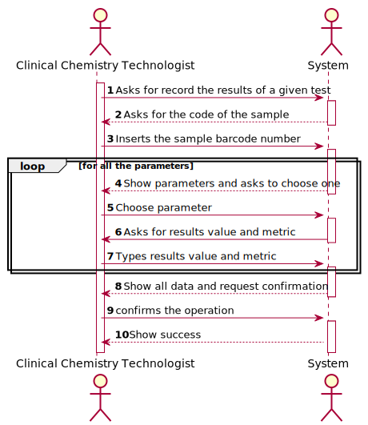
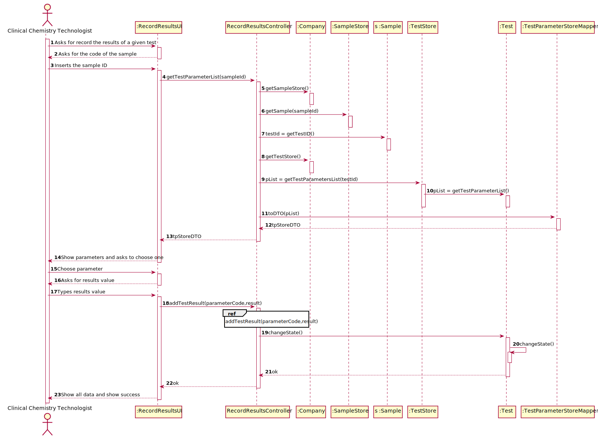
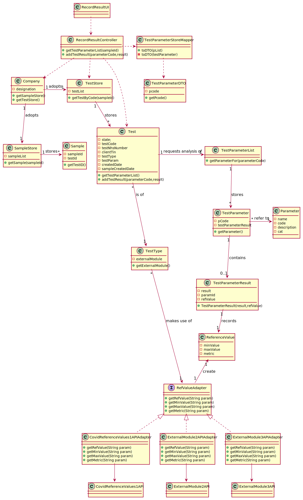

# US 12 - Record results

## 1. Requirements Engineering

*In this section, it is suggested to capture the requirement description and specifications as provided by the client as
well as any further clarification on it. It is also suggested capturing the requirements' acceptance criteria and
existing dependencies to other requirements. At last, identify the involved input and output data and depicted an
Actor-System interaction in order to fulfill the requirement.*

### 1.1. User Story Description

*"As a clinical chemistry technologist, I intend to record the results of a given test."*

### 1.2. Customer Specifications and Clarifications

**From the specifications document:**

> "At the company's headquarters, the clinical chemistry technologist receives the samples (delivered by a courier) and performs the chemical analysis, recording the results in the software application"

> "To facilitate and simplify the validation work performed by the specialist doctor, the application uses an external module that is responsible for doing an automatic validation using test reference values"

**From the client clarifications:**

> **Question:**
> When the Clinical Chemistry Technologist wants to record the results of a test, how does he has access to that test? By internal code, NHS code?
>
> **Answer:**
> Each sample has a unique barcode. The clinical chemistry technologist should use the sample barcode number to find the test for which the sample was collected.


> **Question:**
> Should the system present a result for each test parameter or a single result for the test to be recorded?
>
> **Answer:**
> The Clinical Chemistry Technologist should register a value/result for each parameter of the test


> **Question:**
> From the Acceptance Criteria we get that "the API request should include, at most: (i) a key to access the module (e.g.: “KEY1234”); (ii) a parameter identifier; (iii) the reference date; and (iv) reference measurement unit (e.g. "mg")." Does this "at most" express that there are some parameters of the API request that are optional? If so, could you clarify the parameters that are optional?
>
> **Answer:**
> "At most" means the maximum number of parameters that will be used. Depending on the API being used, all parameters above may be required or some may be optional. Important: The number of parameters depends on the API that is being used.


> **Question:**
> The results of the tests can be negative or there are any restriction in this particular variable?
>
> **Answer:**
> The result/value of one parameter is related with the type of parameter we are measuring. To get an idea, please check the values returned by the external modules (jar APIs).


> **Question:**
> When you intend to record the results of the Blood Test, do you want to introduce all results for all parameters or just only one?
>
> **Answer:**
> The clinical chemistry technologist should record all results related to a test at a given time/moment.


> **Question:**
> According to the project description the external modules should be used by the specialist doctor when creating the diagnosis, so, shouldn't the acceptance criteria of the external modules be applied on US 014 instead of US 012?
>
> **Answer:**
> The reference values should be presented both to the clinical chemistry technologist (US12) and to the specialist doctor (US14). In the Project description we get: "To facilitate and simplify the validation work [make a diagnosis and write a report] performed by the specialist doctor, the application uses an external module that is responsible for doing an automatic validation using test reference values.

### 1.3. Acceptance Criteria

**AC1:** The application should use an external module that is responsible for providing the test reference values. The
application can use an external module for each type of test. For instance, when the results are for blood tests
parameters, the externalize BloodReferenceValues1API can be used. When the results are for Covid-19 tests parameters,
the external module CovidReferenceValues1API can be used. In any case, the API request should include, at most:

- (i) a key to access the module (e.g.:“KEY1234”);
- (ii) a parameter identifier;
- (iii) the reference date;
- (iv) reference measurement unit (e.g. "mg").

**AC2:** The clinical chemistry technologist should use the sample barcode number to find the test for which the sample
was collected

**AC3:** The reference values should be presented both to the clinical chemistry technologist (US12) and to the
specialist doctor (US14)

### 1.4. Found out Dependencies

This US is dependent of:

- **US4:** Since at least one test must be registered in the system.
- **US5:** Since the test must have an associated sample in the system.
- **US7:** Since at least one Clinical Chemistry Technologist must be registered in the system.

### 1.5 Input and Output Data

**Input Data:**

* Typed data:
    * SampleID
    * Parameter Results

**Output Data:**

* List of parameters
* Reference values
* (In)Success of the operation

### 1.6. System Sequence Diagram (SSD)

*Insert here a SSD depicting the envisioned Actor-System interactions and throughout which data is inputted and
outputted to fulfill the requirement. All interactions must be numbered.*



### 1.7 Other Relevant Remarks

*Use this section to capture other relevant information that is related with this US such as (i) special requirements
; (ii) data and/or technology variations; (iii) how often this US is held.*

## 2. OO Analysis

### 2.1. Relevant Domain Model Excerpt

*In this section, it is suggested to present an excerpt of the domain model that is seen as relevant to fulfill this
requirement.*


### 2.2. Other Remarks

*Use this section to capture some aditional notes/remarks that must be taken into consideration into the design
activity. In some case, it might be usefull to add other analysis artifacts (e.g. activity or state diagrams).*

## 3. Design - User Story Realization

### 3.1. Rationale

**The rationale grounds on the SSD interactions and the identified input/output data.**

| Interaction ID                                      | Question: Which class is responsible for...               | Answer                  | Justification (with patterns)                                                                                                                                                                                                                                                                                                                     |
| :-------------                                      | :---------------------                                    | :------------           | :----------------------------                                                                                                                                                                                                                                                                                                                     |
| Step 1: Asks for record the results of a given test | ... interacting with the user                             | RecordResultsUI         | **PureFabrication:** there is no reason to assign this responsibility to any existing class in the Domain Model                                                                                                                                                                                                                                   |
|                                                     | ... coordinating the US?                                  | RecordResultsController | **Controller** <br> **PureFabrication:** there is no reason to assign this responsibility to any existing class in the Domain Model                                                                                                                                                                                                               |
| Step 2: Asks for the code of the sample             |                                                           |                         |                                                                                                                                                                                                                                                                                                                                                   |
| Step 3: Inserts the sample ID                       | ... search for the test associated with the sample        | TestStore               | **IE:** store knows all the tests and can ask the object for information                                                                                                                                                                                                                                                                          |
|                                                     | ... confirms that the sample is waiting for result        | Test                    | **IE:** Test object knows its own state                                                                                                                                                                                                                                                                                                           |
| Step 4: Show parameters and asks to choose one      | ... transfer the parameter data from the domain to the UI | TestParameterStoreDTO   | **DTO:** in order to detach the domain layer from the the ui layer we use a data transfer object in order to only extract data from the domain class and dont extract operations                                                                                                                                                                  |
| Step 5: Choose parameter                            | ... get the TestParameter object chosen                   | Test                    | **IE:** Test object knows all the TestParameter associated with it                                                                                                                                                                                                                                                                                |
| Step 6: Asks for results value and metric           |                                                           |                         |                                                                                                                                                                                                                                                                                                                                                   |
| Step 7: Types results value and metric              | ... create the TestParameterResult object                 | TestParameter           | **Creator:** TestParameter object contains ParameterResult object                                                                                                                                                                                                                                                                                 |
|                                                     | ... get ReferenceValue for the Parameter                  | RefValueAdapter         | **Protected Variations:** Since the system needs to support different APIs we are using an interface and several adapters in order to be able to support them. The system uses  java reflection in order to know the interface needed in runtime, we use polymorphism by implementing a interface that will be implemented in the adapter classes. |
|                                                     | ...change the testState                                   | Test                    | **IE:** Test knows its own data                                                                                                                                                                                                                                                                                                                   |
| Step 8: Show all data and show successes            | ... informing the operation success                       | RecordResultsUI         | **IE:** responsible for user interaction                                                                                                                                                                                                                                                                                                          |

### Systematization ##

According to the taken rationale, the conceptual classes promoted to software classes are:

* Test
* TestParameter
* TestParameterResult

Other software classes (i.e. Pure Fabrication) identified:

* RecordResultUI
* RecordResultController
* TestParameterStoreDTO
* TestParameterDTO
* TestParameterStoreMapper
* RefValueAdapter

## 3.2. Sequence Diagram (SD)

### US12_SD



### SD_AddTestResult(parameterCode,result,metric).svg

.svg)

## 3.3. Class Diagram (CD)

*In this section, it is suggested to present an UML static view representing the main domain related software classes
that are involved in fulfilling the requirement as well as and their relations, attributes and methods.*



# 4. Tests

*In this section, it is suggested to systematize how the tests were designed to allow a correct measurement of
requirements fulfilling.*

**Test 1:** Check that it is possible to create an instance of the TestParameterResult class.

    @Test
    public void TestParameterResultTest() {
        ParameterCategory cat = new ParameterCategory("HB000", "name");
        Parameter pa = new Parameter("HB000", "Haemoglo", "description", cat);
        RefValue ref = new RefValue(0.12, 0.8, "me");
        TestParameterResult result = new TestParameterResult(0.854, pa.getCode(), ref);

        Assert.assertNotNull(result);
    }

**Test 2** Checks if is possible to create an RefValue object
````
    @Test
    public void getRefValueNotNull() {
        RefValueAdapter1 ref = new RefValueAdapter1();
        TestParameter tp = new TestParameter("IgGAN");

        RefValue refValue = ref.getRefValue(tp.getpCode());
        Assert.assertNotNull(refValue);
    }
````

**Test 3**  Checks if it is possible to add results to a created test
````
    @Test
    public void addTestResultTestValid() throws ClassNotFoundException, InstantiationException, IllegalAccessException {

        ParameterCategoryStore cat = new ParameterCategoryStore();
        ParameterCategory pc1 = new ParameterCategory("AH000", "Hemogram");
        cat.add(pc1);
        List<ParameterCategory> cat1 = new ArrayList<>();
        cat1.add(pc1);
        List<Parameter> pa = new ArrayList<>();
        Parameter p1 = new Parameter("AH000", "Nome", "description", pc1);
        pa.add(p1);
        TestType testType = new TestType("BL000", "description", "sei lá", cat);

        app.domain.model.Test test = new app.domain.model.Test("000000000000001", "123456789187", "1234567890123456", testType, cat1, pa);
        test.addTestParameter();
        test.changeState("SAMPLE_COLLECTED");

        Assert.assertTrue(test.addTestResult("AH000", 0.254));
    }
 ````

**Test 4:** Checks that is not possible to add results to not existent parameter 
````
    @Test
    public void addTestResultNullTestParameters() {

        ParameterCategoryStore cat = new ParameterCategoryStore();
        ParameterCategory pc1 = new ParameterCategory("AH000", "Hemogram");
        cat.add(pc1);
        List<ParameterCategory> cat1 = new ArrayList<>();
        cat1.add(pc1);
        List<Parameter> pa = new ArrayList<>();
        Parameter p1 = new Parameter("AH000", "Nome", "description", pc1);
        pa.add(p1);
        TestType testType = new TestType("BL000", "description", "sei lá", cat);

        app.domain.model.Test test = new app.domain.model.Test("000000000000001", "123456789187", "1234567890123456", testType, cat1, pa);

        test.addTestParameter();
        test.changeState("SAMPLE_COLLECTED");
        boolean value = test.addTestResult("AH001", 0.254);
        Assert.assertFalse(value);
    }
````

# 5. Construction (Implementation)

## RecordResultUI

````java
public class RecordResultsUI implements Runnable {
    RecordResultsController ctr;

    public RecordResultsUI() {
        this.ctr = new RecordResultsController();
    }


    /**
     * When an object implementing interface {@code Runnable} is used
     * to create a thread, starting the thread causes the object's
     * {@code run} method to be called in that separately executing
     * thread.
     * <p>
     * The general contract of the method {@code run} is that it may
     * take any action whatsoever.
     *
     * @see Thread#run()
     */

    @Override
    public void run() {
        String barcode = Utils.readLineFromConsole("Please enter the barcode number of the sample of the test to register results");
        boolean exception = false;
        do {
            try {

                for (TestParameterDTO tp : ctr.getTestParameterList(barcode)) {
                    System.out.println(tp.toString());
                    double result = Utils.readDoubleFromConsole("Please insert the result: ");
                    exception = ctr.addTestResult(tp.getPcode(), result);


                }
            } catch (Exception e) {
                System.out.println("It was not possible to record the results");
                System.out.println(e.getMessage());
                exception = false;
            }
        } while (!exception);
        System.out.println("Results recorded: \n");
        System.out.println(ctr.getResults());

        boolean confirm = Utils.confirm("Do you want to proceed? (s/n)");
        if (confirm) {
            ctr.saveTest();
        }
    }
}
````

## RecordResultsController

````java
public class RecordResultsController {
    private Company company;
    private TestStore tStore;
    private List<TestParameter> pList;
    private Test t;
    private SampleStore sampleStore;

    public RecordResultsController() {
        this(App.getInstance().getCompany());
    }

    public RecordResultsController(Company company) {
        this.company = company;
        this.tStore = company.getTestList();
        this.sampleStore = company.getSampleStore();

    }

    public List<TestParameterDTO> getTestParameterList(String sampleId) {
        Sample sample = sampleStore.getSample(sampleId);
        this.t = tStore.getTestByCode(sample.getTestID());
        if (this.t == null) {
            throw new IllegalStateException("Sample does not exists");
        } else {
            pList = t.getTestParam();
            TestParameterListMapper testParameterListMapper = new TestParameterListMapper();
            return testParameterListMapper.toDTO(pList);
        }
    }

    public boolean addTestResult(String parameterCode, double result) throws ClassNotFoundException, InstantiationException, IllegalAccessException {
        if (t.addTestResult(parameterCode, result)) {
            return true;
        }
        return false;
    }

    public String getResults() {

        return this.t.getResults();

    }

    public void saveTest() {
        t.changeState("SAMPLE_ANALYSED");
    }
}

````

## Company

````java
public class Company {

    private final String designation;
    private final AuthFacade authFacade;
    private final TestStore testList;
    private final SampleStore sampleStore;


    /**
     * Constructor of the Company Class, instances a new object of AuthFacade and new empty stores
     *
     * @param designation Designation of Company
     */
    public Company(String designation) {
        if (StringUtils.isBlank(designation))
            throw new IllegalArgumentException("Designation cannot be blank.");

        this.designation = designation;
        this.authFacade = new AuthFacade();
        this.testList = new TestStore();

    }

    /**
     * @return designation of the Company
     */
    public String getDesignation() {
        return designation;
    }

    /**
     * @return Object of AuthFacade instantiated by the Company Controller
     */
    public AuthFacade getAuthFacade() {
        return authFacade;
    }


    /**
     * @return the list of Tests in the System
     */
    public TestStore getTestList() {
        return this.testList;
    }


    /**
     *
     * @return the list of Samples in the System
     */
    public SampleStore getSampleStore() {
        return sampleStore;
    }

}
````

## TestStore

````java

/**
 * Class that represents an List of Tests in the system
 */
public class TestStore {
    private List<Test> array;

    /**
     * Constructor of the class it creates an empty list to be filled with objects of Test
     */
    public TestStore() {
        this.array = new ArrayList<>();
    }

    /**
     * @param testId unique nhs code that represents the test
     * @return the test that is associated with nhs code if there is not a test with this code returns null
     */
    public Test getTestByCode(String testId) {
        for (Test t1 : this.array) {
            if (t1.getTestNhsNumber().equals(testId)) {
                return t1;
            }
        }
        return null;
    }

}

````

*It is also recommended to organize this content by subsections.*

## SampleStore

````java
public class SampleStore {

    private Sample sample;
    private List<Sample> testSamples;


    public SampleStore() {
        this.testSamples = new ArrayList<>();
    }

    public Sample getSample(String sampleID) {
        for (Sample s : testSamples) {
            if (s.getBarcode().equals(sampleID)) {
                return s;
            }
        }
        return null;
    }

}
````

## Sample

````java
public class Sample {

    private final String barcode;
    private final String testID;


    public Sample(String testID, String barcode) {
        checkBarcodeRules(barcode);
        checkTestIDRules(testID);
        this.testID = testID;
        this.barcode = barcode;

    }

    private void checkTestIDRules(String testID) {
        //
    }

    private void checkBarcodeRules(String barcode) {
        //
    }

    public String getBarcode() {
        return barcode;
    }

    public String getTestID() {
        return testID;
    }

}
````

## Test

````java
public class Test {

    private final String testCode;
    private final String testNhsNumber;
    private final String clientTin;
    private final TestType testType;
    private final List<ParameterCategory> catList;
    private final List<Parameter> paList;
    private final LocalDate createdDate;
    private State state;
    private List<TestParameter> testParam;
    private LocalDate sampleCreatedDate;
    private LocalDate analysedData;

    /**
     * Constructor of the Test object, it call methods on order to validate the NhsNumber, the list of categories and the list of parameters
     *
     * @param testCode      unique code generated automatically
     * @param testNhsNumber unique code that identifies the test
     * @param clientTin     unique code that identifies the client associated with the test
     * @param testType      type of this test
     * @param catList       list of parameters categories that are measured in this test
     * @param paList        list of parameters that are measured in this test
     */
    public Test(String testCode, String testNhsNumber, String clientTin, TestType testType, List<ParameterCategory> catList, List<Parameter> paList) {

        checkTestNhsNumberRules(testNhsNumber);
        checkTestCodeRules(testCode);
        checkCatList(catList);
        checkPaList(paList);
        this.testCode = testCode;
        this.testNhsNumber = testNhsNumber;
        this.clientTin = clientTin;
        this.testType = testType;
        this.catList = catList;
        this.paList = paList;
        this.createdDate = LocalDate.now();

    }

    /**
     * This method checks if the test code meets the requirements, if not it throws a exception making the execution to stop
     *
     * @param testCode unique code generated automatically
     */
    private void checkTestCodeRules(String testCode) {
        //
    }

    /**
     * This method checks if the list of parameters meets the requirements, if not it throws a exception making the execution to stop
     *
     * @param paList list of parameters that are measured in this test
     */
    private void checkPaList(List<Parameter> paList) {
        //
    }

    /**
     * This method checks if the list of parameters categories meets the requirements, if not it throws a exception making the execution to stop
     *
     * @param catList list of parameters categories that are measured in this test
     */
    private void checkCatList(List<ParameterCategory> catList) {
        //
    }

    /**
     * This method checks if the list of parameters categories meets the requirements, if not it throws a exception making the execution to stop
     *
     * @param testNhsNumber unique code that identifies the test
     */
    private void checkTestNhsNumberRules(String testNhsNumber) {
        //

    }

    /**
     * Changes the state of the object test by changing the variable state with a value from the enum "State"
     *
     * @param s a value of the enum "State"
     */
    private void changeState(State s) {
        this.state = s;
    }

    /**
     * Changes the state of the object test by changing the variable state with a value from the enum "State
     * @param s a value of the enum "State"
     */
    public void changeState(String s) {
        switch (s) {
            case "CREATED":
                changeState(State.CREATED);
                break;
            case "SAMPLE_COLLECTED":
                changeState(State.SAMPLE_COLLECTED);
                this.sampleCreatedDate = LocalDate.now();
                break;
            case "SAMPLE_ANALYSED":
                changeState(State.SAMPLE_ANALYSED);
                this.analysedData = LocalDate.now();
                break;
            case "DIAGNOSTIC_MADE":
                changeState(State.DIAGNOSTIC_MADE);
                this.diagnosticDate = LocalDate.now();
                break;
            case "VALIDATED":
                changeState(State.VALIDATED);
                this.validatedDate = LocalDate.now();
                break;
            default:
                break;
        }
    }

    /**
     * @return a string with all the results associated with the test
     */
    public String getResults() {
        StringBuilder listString = new StringBuilder();

        for (TestParameter s : this.testParam) {
            listString.append(s.getTestParameterResult()).append("\n");
        }
        return String.valueOf(listString);

    }

    /**
     * @param parameterCode the code of the parameter that will be associated with a result
     * @param result double that represents numerical the result of the analysis of the test parameters
     * @return boolean represents the success of the operation
     */
    public boolean addTestResult(String parameterCode, double result) {

        if (!state.equals(State.SAMPLE_COLLECTED)) {
            return false;
        }

        TestParameter pa = null;
        for (TestParameter p : testParam) {
            if (p.getpCode().equals(parameterCode)) {
                pa = p;
            }
        }
        if (pa == null) {
            return false;
        }

        String externalModule = testType.getExternalModule();
        try {
            Class<?> oClass = Class.forName(externalModule);
            RefValueAdapter em = (RefValueAdapter) oClass.newInstance();
            pa.addResult(result, em.getRefValue(pa.getpCode()));
            return true;
        } catch (Exception e) {
            System.out.println(e.getMessage());
            return false;
        }
    }

    /**
     * @return this list of Test Parameters associated with the test
     */
    public List<TestParameter> getTestParam() {
        return testParam;
    }

    /**
     * @return a string with the current state of the test
     */
    public String getState() {
        return state.toString();
    }


    /**
     * This enum represents all the states that the Test object can assume
     */
    enum State {
        CREATED,
        SAMPLE_COLLECTED,
        SAMPLE_ANALYSED,
        DIAGNOSTIC_MADE,
        VALIDATED;
    }


}
````

## TestType

````java

/**
 * Class that represents an Type of Test
 */
public class TestType {
    private String externalModule;

    /**
     * Constructor of TestType, it calls methods in order to validate the parameters
     *
     * @param testID           ID of Type if test
     * @param description      simple description of the type of test
     * @param collectingMethod collecting methods of the type of test
     * @param catStore         list of Parameter Categories associated with the test
     */
    public TestType(String testID, String description, String collectingMethod, ParameterCategoryStore catStore) {
        checkCodeRules(testID);
        checkCollectingMethodRules(collectingMethod);
        checkDescriptionRules(description);
        checkCategoriesList(catStore);
        this.testID = testID;
        this.description = description;
        this.collectingMethod = collectingMethod;
        this.catStore = catStore;
        this.externalModule = setExternalModule(testID);

    }

    private String setExternalModule(String testID) {
        //
        return externalModule;
    }

    /**
     * This method checks if the code provided meets the requirements, if not it throws a exception making the execution to stop
     *
     * @param testID identification code of the test
     */
    private void checkCodeRules(String testID) {
        //
    }

    /**
     * This method checks if the code provided meets the requirements, if not it throws a exception making the execution to stop
     *
     * @param description description of the test
     */
    private void checkDescriptionRules(String description) {
        //  
    }


    /**
     * This method checks if the code provided meets the requirements, if not it throws a exception making the execution to stop
     *
     * @param collectingMethod collecting method of the test
     */
    private void checkCollectingMethodRules(String collectingMethod) {
        //
    }

    /**
     * This method checks if the code provided meets the requirements, if not it throws a exception making the execution to stop
     *
     * @param catStore the list of categories of the test
     */
    private void checkCategoriesList(ParameterCategoryStore catStore) {
        //
    }


    /**
     *
     * @return String with the name of the external module associated with the testType
     */
    public String getExternalModule() {
        return externalModule;
    }
}

````

## TestParameter

````java

/**
 * Class that represents a parameter associated with a test
 */
public class TestParameter {
    private final String pCode;
    private TestParameterResult testParameterResult;

    /**
     * @param pCode Parameter Code
     */
    public TestParameter(String pCode) {
        this.pCode = pCode;
    }

    /**
     * returns the code of the parameter
     *
     * @return the code of the parameter
     */
    public String getpCode() {
        return pCode;
    }

    /**
     * Associates a result to the test Parameter by instantiation a new TestParameterResult object
     *
     * @param result   double that represents numerical the result of the analysis of the test parameters
     * @param refValue reference values of the results of the parameter
     */
    public void addResult(double result, RefValue refValue) {
        this.testParameterResult = new TestParameterResult(result, this.pCode, refValue);
    }

    /**
     * @return a string that represents the test results
     */
    public String getTestParameterResult() {
        return this.testParameterResult.toString();
    }

}
````

## TestParameterResult

````java

/**
 * Class that represents the result of a parameter associated with a test
 */
public class TestParameterResult {
    double result;
    String paramId;
    RefValue refValue;

    /**
     *
     * @param result double that represents numerical the result of the analysis of the test parameters
     * @param paramId unique Id that represents the parameter that will receive the result
     * @param refValue reference values of the results of the parameter
     */
    public TestParameterResult(double result, String paramId, RefValue refValue) {

        this.result = result;
        this.paramId = paramId;
        this.refValue = refValue;
    }

    /**
     * Method that represents the object in a string
     * @return a string that represents the object
     */
    @Override
    public String toString() {
        //
    }
}
````

## Parameter

````java

/**
 * Class that represents an Parameter
 */
public class Parameter {
    private final String name;
    private final String code;
    private final String description;
    private final ParameterCategory cat;


    /**
     * Constructor of the Parameter, it calls 2 methods in order to validate the parameters
     *
     * @param code        unique code needed to identify the Parameter
     * @param description description that characterize the Parameter
     * @param name        short name that characterize the Parameter
     * @param cat         category associated with the Parameter
     */
    public Parameter(String code, String name, String description, ParameterCategory cat) {
        checkCodeRules(code);
        checkNameRules(name);
        checkDescriptionRules(description);
        this.code = code;
        this.name = name;
        this.description = description;
        this.cat = cat;
    }

    /**
     * This method checks if the code provided meets the requirements, if not it throws a exception making the execution to stop
     *
     * @param code unique code needed to identify the Parameter
     */
    private void checkCodeRules(String code) {
        //
    }

    /**
     * This method checks if the code provided meets the requirements, if not it throws a exception making the execution to stop
     *
     * @param name name tha identifies the Parameter
     */
    private void checkNameRules(String name) {
        //
    }

    /**
     * This method checks if the description provided meets the requirements, if not it throws a exception making the execution to stop
     *
     * @param description description that characterize the Parameter
     */
    private void checkDescriptionRules(String description) {
        //
    }


    /**
     * @return unique code needed to identify the Parameter
     */
    public String getCode() {
        return code;
    }


}
````

## ReferenceValue

````java

/**
 * Class that represents the reference value of a given parameter
 */
public class RefValue {
    private final double minValue;
    private final double maxValue;
    private final String metric;

    /**m
     * Constructor of the reference value class
     * @param minValue minimum value of the parameter
     * @param maxValue maximum value of the parameter
     * @param metric metric of the parameter
     */
    public RefValue(double minValue, double maxValue, String metric) {
        this.minValue = minValue;
        this.maxValue = maxValue;
        this.metric = metric;
    }

    /**
     *
     * @return minimum value of the parameter
     */
    public double getMinValue() {
        return minValue;
    }

    /**
     *
     * @return maximum value of the parameter
     */
    public double getMaxValue() {
        return maxValue;
    }

    /**
     *
     * @return metric of the parameter
     */
    public String getMetric() {
        return metric;
    }
}
````

## RefValueAdapter

````java
public interface RefValueAdapter {

    /**
     * @param param string that represents the parameter
     * @return instance of reference value associated with parameter provided
     */
    RefValue getRefValue(String param);

    /**
     * @param param string that represents the parameter
     * @return minimum reference value associated with parameter provided
     */
    double getMinValue(String param);

    /**
     * @param param string that represents the parameter
     * @return maximum reference value associated with parameter provided
     */
    double getMaxValue(String param);

    /**
     * @param param string that represents the parameter
     * @return string that represents the metric associated with parameter provided
     */
    String getMetric(String param);
}

````

# 6. Integration and Demo

- A new menu for Clinical Chemistry Technologist was added.

# 7. Observations

*In this section, it is suggested to present a critical perspective on the developed work, pointing, for example, to
other alternatives and or future related work.*


