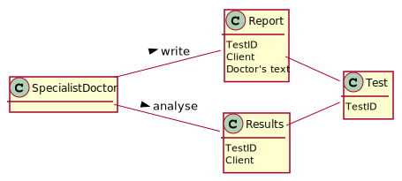

# US 10 - TO CREATE A NEW PARAMETER AND CATEGORIZE IT

## 1. Requirements Engineering

### 1.1. User Story Description

*As a specialist doctor, I intend to make the diagnosis and write a report for a given test.*

### 1.2. Customer Specifications and Clarifications
**From the specifications document:**

> *"To facilitate and simplify the validation work performed by the specialist doctor, the application
uses an external module that is responsible for doing an automatic validation using test reference
values."*

**From the client clarifications:**

> **Question:**
> What characterizes a diagnosis? What it needs to have in it to be a valid diagnosis?
>
> **Answer:**
> The report contains the diagnosis. The report is free text and should have no more than 400 words.

> **Question:**
> Regarding the tests that the Specialist Doctor can write a report about. Should the SD chose from a list of tests? and Should him only receive a list of test that have completed all the previous steps?
>
> **Answer:**
> The system shows all tests ready (that have completed all the previous steps) to make the diagnosys and the Specialist Doctor selects one test. Then, the Specialist Doctor writes the report for the selected test.

> **Question:**
> If the report is not validated by the Lab Coordinator, can it be due to the report and diagnosis or are all of the reports and diagnosis written valid?
>
> **Answer:**
> I already answered this question.
> 
> 
### 1.3. Acceptance Criteria

- *AC1: The report is free text and should have no more than 400 words.*

- *AC2: The report contains the diagnosis.*

### 1.4. Found out Dependencies

- *There is a dependency to "US12 As a clinical chemistry technologist, I intend to record the results of a given test" since at least the results of the given test needs to exist.*

### 1.5 Input and Output Data

*Input Data*
- *Typed data: Doctor's text*
- *Selected data: (test)*

*Output Data*
- *(In)Success of the operation*

### 1.6. System Sequence Diagram (SSD)

### 1.7 Other Relevant Remarks

There's not other remarks regarding SSD.

## 2. OO Analysis

### 2.1. Relevant Domain Model Excerpt

### 2.2. Other Remarks

There's not other remarks regarding MD.

## 3. Design - User Story Realization

### 3.1. Rationale

| Interaction ID | Question: Which class is responsible for... | Answer  | Justification (with patterns)  |
|:-------------  |:--------------------- |:------------|:---------------------------- |
| Step 1: asks for a Report  		                                          |	... interacting with the actor?                                         | CreateReportUI                                |  Pure Fabrication: there is no reason to assign this responsibility to any existing class in the Domain Model.      |
| 			  		                                                          |	... coordinating the US?                                                | CreateReportController                        | Controller                                                                                                          |
|                                                                             | ... the creation of the report?                                         | Test                                          | IE: responsible for saving all reports                                                                              |
| Step 2: shows the test list                                		          |	...showing the tests?                                                   | TestStore                                     | IE: knows all tests.                                                                                                |
| Step 3: select a test           		                                      | ...saving the selected data?                                            | Test                                          | IE: object created has its own data.                                                                                |
| Step 4: shows Test data list and ask for a diagnosis of the test            | ...knowing the Test to show?                                            | TestStore                                     | IE: knows all tests.                                                                                                |
| Step 5: type diagnosis data  		                                          |	...saving the diagnosis?                                                | Report                                        | IE: Report has one diagnosis.                                                                                       | 
|                                                                             | ...local validation?                                                    | Report                                        | IE: knows its own data.                                                                                             |
| Step 6: shows all data and requests confirmation  		                  |	...informing operation that shows all data and requests confirmation?   | CreateReportUI                                | IE: is responsible for user interactions.                                                                           |  
|     			  		                                                      |	...showing all data?                                                    | Report                                        | IE: knows all the report's data.                                                                                    | 
|Step 7: confirms the data                                                    | ...informing operation confirmation?                                    | CreateReportUI                                | IE: is responsible for user interactions.                                                                           |
|                                                                             |	...saving the created Report?                                           | Test                                          | IE: owns the report.                                                                                                |                                                          
|Step 8: informs operation success                                            | ...informing operation success?                                         | CreateReportUI                                | IE: is responsible for user interactions.                                                                           |
### Systematization ##

According to the taken rationale, the conceptual classes promoted to software classes are:

* Test
* Report

Other software classes (i.e. Pure Fabrication) identified:
* CreateReportUI
* CreateReportController
* TestStore

## 3.2. Sequence Diagram (SD)

## 3.3. Class Diagram (CD)

# 4. Tests

**Test 1:** The report is free text and should have no more than 400 words.

    @Test
    public void checkDiagnosisRules200() {
        //Arrange + Act
        Report rep = new Report("123456789012", "aaaaaaaaaaaaaaaaaaaaaaaaaaaaaaaaaaaaaaaaaaaaaaaaaaaaaaaaaaaaaaaaaaaaaaaaaaaaaaaaaaaaaaaaaaaaaaaaaaaaaaaaaaaaaaaaaaaaaaaaaaaaaaaaaaaaaaaaaaaaaaaaaaaaaaaaaaaaaaaaaaaaaaaaaaaaaaaaaaaaaaaaaaaaaaaaaaaaaaaa");
    }

**Test 2:** The report contains the diagnosis.

    @Test
    public void ReportTest() {
        //Arrange + Act
        Report rep = new Report("123456789012","1234");
    }

            
# 5. Construction (Implementation)

##CreateReportController

    package app.controller;
    
    
    import app.domain.mappers.TestListMapper;
    import app.domain.mappers.dto.TestDTO;
    import app.domain.model.Company;
    import app.domain.model.Test;
    import app.domain.stores.TestStore;
    
    
    import java.util.List;
    
    public class CreateReportController {
    
        private Company company;
        private TestStore tList;
        private Test t;
    
    
    
    
        public CreateReportController(Company company) {
            this.company = company;
        }
    
        public CreateReportController() {
            this(App.getInstance().getCompany());
        }
    
    
    
        public List<TestDTO> tList() {
            this.tList = company.testList().getListOfTestsAnalysed();
            TestListMapper typeMapper = new TestListMapper();
            return typeMapper.toDTO(tList);
        }
    
        public String getResults(String testId ) {
            this.t = tList.getTestByCode(testId);
            return t.getResults();
        }
    
        public void createReport(String diagnosis){
            t.createReport(diagnosis);
        }
    
        public void saveReport(){
            t.saveReport();
        }
    
    
    
    
    }

##TestStore

    public TestStore getListOfTestsAnalysed() {
    TestStore listToReport = new TestStore();
    for (Test t : this.array) {
    if (t.getState().equals("SAMPLE_ANALYSED")) {
    listToReport.addTest(t);
    }
    }
    return listToReport;
    }

##Test

    public boolean createReport(String diagnosis) {
    this.rep = new Report(this.testCode, diagnosis);
    
            return this.rep != null;
        }
    
        public void saveReport() {
            changeState(State.DIAGNOSTIC_MADE);
        }

##Report

    package app.domain.model;
    
    import app.domain.shared.Constants;
    import org.apache.commons.lang3.StringUtils;
    
    
    public class Report {
    
        private final String testID;
        private final String diagnosis;
    
        @Override
        public String toString() {
            return "The report for the test "+ testID+" is: \n" + diagnosis;
        }
    
        public Report(String testID, String diagnosis) {
            checkDiagnosisRules(diagnosis);
            this.testID = testID;
            this.diagnosis = diagnosis;
        }
    
    
        private void checkDiagnosisRules(String diagnosis) {
    
            if (StringUtils.isBlank(diagnosis)){
                throw new IllegalArgumentException("Diagnosis cannot be blank.");
        }
    
            if (diagnosis.length() > Constants.DIAGNOSIS_MAX_LENGHT){
                throw new IllegalArgumentException("Diagnosis cannot exceed 200 char.");
            }
    
        }
    
        public String getTestID() {
            return testID;
        }
    
    
        public String getDiagnosis() {
            return diagnosis;
        }
    
    
    }

# 6. Integration and Demo

- A new option was added in the Admin Menu

# 7. Observations

