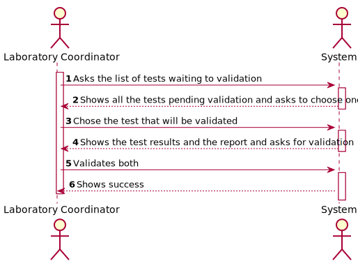
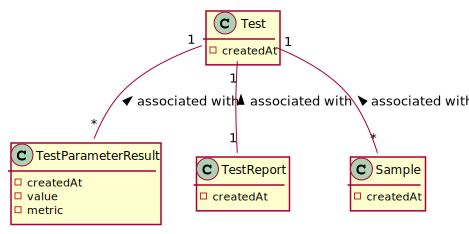

# US 15 - Validate the work done

## 1. Requirements Engineering

*In this section, it is suggested to capture the requirement description and specifications as provided by the client as
well as any further clarification on it. It is also suggested capturing the requirements' acceptance criteria and
existing dependencies to other requirements. At last, identify the involved input and output data and depicted an
Actor-System interaction in order to fulfill the requirement.*

### 1.1. User Story Description

*"As a laboratory coordinator, I want to validate the work done by the clinical chemistry technologist and specialist doctor."*

### 1.2. Customer Specifications and Clarifications

**From the specifications document:**

> "After the specialist doctor has completed the diagnosis, the results of the clinical analyses and the
report become available in the system and must be validated by the laboratory coordinator. To
validate the work done, the laboratory coordinator checks the chemical test/result and associated
diagnosis made and confirms that everything was done correctly. Once the laboratory coordinator
confirms that everything was done correctly, the client receives a notification alerting that the
results are already available in the central application and informing that he/she must access the
application to view those results. The client receives the notification by SMS and e-mail. At the
same time the results are also available in the central application where the medical lab technicians
who collect the samples, the clinical chemistry technologist, the specialist doctor, and the laboratory
coordinator can check them."

**From the client clarifications:**

> **Question:**
> Should the laboratory coordinator validate the test results one by one or should he do only one validation of all of them?
>
> **Answer:**
>  The coordinator can validate all, or a subset of test results. The system does not show client personal information but shows all dates (test registration date, chemical analysis date and diagnosis date).

> **Question:**
> After validation do we need to have the time and date of the validation?
>
> **Answer:**
>  Yes, the system should record the date (DD/MM/YYYY) and time (HH:MM) when the validation was made. Moreover, in this US, when the system shows to the laboratory coordinator all the dates (test registration date, chemical analysis date and diagnosis date), the system should show the date (DD/MM/YYYY), and the time (HH:MM).
-
> **Question:**
> About the US 15, in the clarification says that the program just validates dates, but in the statement of work, referees the use of an external model that validate the reference values of the parameters.
>
> **Answer:**
>  In the acceptance criteria of US 15 we get: "The system does not show client personal information but shows all dates (test registration date, chemical analysys date and diagnosis date)".
-
> **Question:** After we validate, we send the email saying they can check the app for the results. But what happens to the test ifself? Does it stay within the system or is deleted?
>
> **Answer:** The tests should not be eliminated.
-
> **Question:** Regarding the process of validating a certain test/result, what validation states should be considered by the laboratory coordinator?
                For example, can "Valid" or "Invalid" be accepted as a confirmation for the chemical test/result and its diagnosis?
>
> **Answer:** Only Valid state. The system shows all tests ready to validate (tests that already have the test registration date, the chemical analysys date and the diagnosis date registered in the system) and the laboratory coordinator selects one or more tests to mark as validated.
-
> **Question:** Regarding to US 15, what information does the laboratory coordinator needs to be able do validate a test? We got from the description that it's suposed to show all dates. Should the system provide any more information?
>
> **Answer:** Only the dates.
-
> **Question:** What's the Criteria to the validation of the test? We only receive dates but what do we have to do to check if everything is "ok" to validate?
>
> **Answer:** The lab coordinator only checks the dates (date and time) and validates a subset of tests that he selects. The lab coordinador does not check any other information.
              From a previous post: "The system shows all tests ready to validate (tests that already have the test registration date, the chemical analysis date and the diagnosis date registered in the system) and the laboratory coordinator selects one or more tests to mark as validated".
-

### 1.3. Acceptance Criteria

**AC1:** The system does not show client personal information but shows all dates (test registration date, chemical analysis date and diagnosis date).

**AC2:** The system should record the date (DD/MM/YYYY) and time (HH:MM) when the validation was made.

**AC3:** When the system shows to the laboratory coordinator all the dates (test registration date, chemical analysis date and diagnosis date), the system should show the date (DD/MM/YYYY), and the time (HH:MM).

### 1.4. Found out Dependencies

This US is dependent of:

- **US4:** Since at least one test must be registered in the system.
- **US7:** Since at least one Laboratory Coordinator must be registered in the system.
- **US12:** Since the test must have associated results.
- **US14:** Since the test must have an associated report

### 1.5 Input and Output Data

**Input Data:**

* Selected data:
    * Test to validate
    * Validation 

**Output Data:**

* Tests data
* (In)Success of the operation

### 1.6. System Sequence Diagram (SSD)

*Insert here a SSD depicting the envisioned Actor-System interactions and throughout which data is inputted and
outputted to fulfill the requirement. All interactions must be numbered.*

 

### 1.7 Other Relevant Remarks

*Use this section to capture other relevant information that is related with this US such as (i) special requirements
; (ii) data and/or technology variations; (iii) how often this US is held.*

## 2. OO Analysis

### 2.1. Relevant Domain Model Excerpt

*In this section, it is suggested to present an excerpt of the domain model that is seen as relevant to fulfill this
requirement.*

### 2.2. Other Remarks

*Use this section to capture some additional notes/remarks that must be taken into consideration into the design
activity. In some case, it might be useful to add other analysis artifacts (e.g. activity or state diagrams).*

## 3. Design - User Story Realization

### 3.1. Rationale

**The rationale grounds on the SSD interactions, and the identified input/output data.**

| Interaction ID                                                         | Question: Which class is responsible for...               | Answer             | Justification (with patterns)                                                                                                                                                               |
| :-------------                                                         | :---------------------                                    | :------------      | :----------------------------                                                                                                                                                               |
| Step 1 : Asks the list of tests waiting to validation                  | ... interacting with the actor?                           | ValidateUI         | **Pure Fabrication:** there is no reason to assign this responsibility to any existing class in the Domain                                                                                  |
|                                                                        | ... coordinating the US?                                  | ValidateController | **Controller**                                                                                                                                                                              |
| Step 2 : Shows all the tests pending validation and asks to choose one | ... search for the tests that are ready for validate      | TestStore          | **IE:** TestStore knows and stores all the Tests objects                                                                                                                                    |
|                                                                        | ... transfer the data in the domain to be shown in the UI | TestDatesDTO       | **DTO:** in order to detach the domain layer from the the ui layer we use a data transfer object in order to only extract the data needed from the domain class and don't extract operations |
| Step 3 : Chose the test that will be validated                         | ... saving the selected test                              | TestStore          | **IE:** TestStore knows and stores all the Tests objects                                                                                                                                    |
| Step 4 : Asks for confirmation                                         | ... global validation                                     | Test               | **IE:** knows its own data                                                                                                                                                                   |
| Step 6 : Shows success                                                 | ...informing operation success?                           | CreateTestUI       | **IE:** is responsible for user interactions.                                                                                                                                                                                            |

### Systematization ##

According to the taken rationale, the conceptual classes promoted to software classes are:

* Test

Other software classes (i.e. Pure Fabrication) identified:

* ValidateUI
* ValidateController

## 3.2. Sequence Diagram (SD)

*In this section, it is suggested to present an UML dynamic view stating the sequence of domain related software
objects' interactions that allows to fulfill the requirement.*

## 3.3. Class Diagram (CD)

*In this section, it is suggested to present an UML static view representing the main domain related software classes
that are involved in fulfilling the requirement as well as and their relations, attributes and methods.*

# 4. Tests

*In this section, it is suggested to systematize how the tests were designed to allow a correct measurement of
requirements fulfilling.*

**_DO NOT COPY ALL DEVELOPED TESTS HERE_**

**Test 1:** Check that it is not possible to create an instance of the Example class with null values.

	@Test(expected = IllegalArgumentException.class)
		public void ensureNullIsNotAllowed() {
		Exemplo instance = new Exemplo(null, null);
	}

*It is also recommended to organize this content by subsections.*

# 5. Construction (Implementation)

*In this section, it is suggested to provide, if necessary, some evidence that the construction/implementation is in
accordance with the previously carried out design. Furthermore, it is recommeded to mention/describe the existence of
other relevant (e.g. configuration) files and highlight relevant commits.*

*It is also recommended to organize this content by subsections.*

# 6. Integration and Demo

*In this section, it is suggested to describe the efforts made to integrate this functionality with the other features
of the system.*

# 7. Observations

*In this section, it is suggested to present a critical perspective on the developed work, pointing, for example, to
other alternatives and or future related work.*

