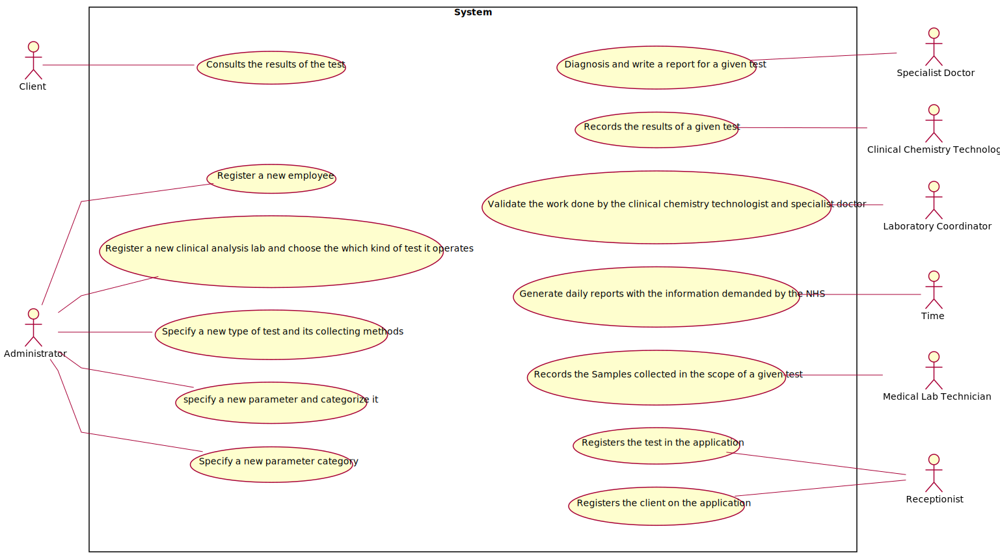

# Use Case Diagram (UCD)

**In the scope of this project, there is a direct relationship of _1 to 1_ between Use Cases (UC) and User Stories (US)
.**

**For each UC/US, it must be provided evidences of applying main activities of the software development process (
requirements, analysis, design, tests and code). Gather those evidences on a separate file for each UC/US and set up a
link as suggested below.**

# Use Cases / User Stories

| UC/US | Description                                                                                                                 |
| :---- | :------------------------------------------------------------------------                                                   |
| US3   | As a receptionist, I want to register a client                                                                              |
| US4   | As a receptionist, I intend to register a test to be performed to a registered client.                                      |
| US5   | As a medical lab technician, I want to record the samples collected in the scope of a given test.                           |
| US7   | As an administrator, I want to register a new employee                                                                      |
| US8   | As an administrator, I want to register a new clinical analysis laboratory stating which kind of test(s) it operates        |
| US9   | As an administrator, I want to specify a new parameter and categorize it                                                    |
| US10  | As an administrator, I want to specify a new parameter and categorize it                                                    |
| US11  | As an administrator, i want to specify a new parameter category                                                             |
| US12  | As a clinical chemistry technologist, I intend to record the results of a given test.                                       |
| US14  | As a specialist doctor, I intend to make the diagnosis and write a report for a given test.                                 |
| US15  | As a laboratory coordinator, I want to validate the work done by the clinical chemistry technologist and specialist doctor. |
