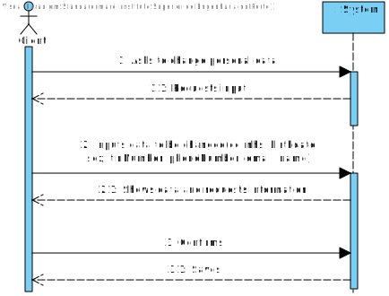

# US 02 - UpdateClientsData

# US2: As a client, I want to update my personal data.

## 1. Requirements Engineering

*In this section, it is suggested to capture the requirement description and specifications as provided by the client as well as any further clarification on it. It is also suggested capturing the requirements' acceptance criteria and existing dependencies to other requirements. At last, identify the involved input and output data and depicted an Actor-System interaction in order to fulfill the requirement.*

### 1.1. User Story Description

*As a client, I want to update my personal data.*

### 1.2. Customer Specifications and Clarifications 

**From the specifications document:**

**From the client clarifications:**

> **Question:** Should the Client type in the attribute he/she wants to update or should he choose from a list?
> 
> **Answer:** In this sprint each team should develop a graphical user interface for US2. The application should show the current user data and the client can update any attribute.

> **Question:** Should the system present a result for each test parameter or a single result for the test to be recorded?
> 
> **Answer:** The Clinical Chemistry Technologist should register a value/result for each parameter of the test.

> **Question:** Are the reference values, for each parameter, going to be delivered to the groups? If so, when and how?
> 
> **Answer:** You should use the APIs available in moodle to obtain the reference values.

### 1.3. Acceptance Criteria

### 1.4. Found out Dependencies

### 1.5 Input and Output Data

### 1.6. System Sequence Diagram (SSD)

### 1.7 Other Relevant Remarks

## 2. OO Analysis

### 2.1. Relevant Domain Model Excerpt 
*In this section, it is suggested to present an excerpt of the domain model that is seen as relevant to fulfill this requirement.* 

### 2.2. Other Remarks

*Use this section to capture some additional notes/remarks that must be taken into consideration into the design activity. In some case, it might be useful to add other analysis artifacts (e.g. activity or state diagrams).* 

## 3. Design - User Story Realization 

### 3.1. Rationale

**The rationale grounds on the SSD interactions and the identified input/output data.**

| Interaction ID | Question: Which class is responsible for... | Answer  | Justification (with patterns)  |
|:-------------  |:--------------------- |:------------|:---------------------------- |
| **Step/Msg 1:** asks to record the results of a given test | ... interacting with the actor? | TestResultUI | **Pure Fabrication:** there is no reason to assign this responsibility to any existing class in the Domain Model |
|                                                        | ... coordinating the US? | TestResultController | Controller |
| **Step/Msg 2:** request sample barcode number | n/a | | |
| **Step/Msg 3:** types the sample barcode number | ... knowing TestStore? | Company | **IE:** TestStore is initialized in Company |
|                                             | ... knowing all the existent test? | TestStore | **IE:** knows its own tests |
|                                             | ... transferring the data typed in the UI to the domain? | TestParameterDTO | **DTO:** When there is so much data to transfer, it is better to opt by using a DTO in order to reduce coupling between UI and domain |
| **Step/Msg 4:** shows one parameter at a time and requests each value/result | n/a | | |
| **Step/Msg 5:** types the value/result | ... knowing and getting the reference values? | ExternalModule | **Protected Variation:** It is necessary to know which adapter to use in order to get the reference values for the correct API |
|                                    | ... getting the ExternalModule? | TestType | **IE:** knows what API to get depending on the type of test |
|                                    | ... creating the TestParameterResult object? | TestParameter | **Creator:** TestParameterResult is an attribute of TestParameter |
|                                    | ... validating and saving the typed data? | ReferenceValue | **IE:** knows its own data |
|                                    | ... changing the test state? | Test | **IE:** After the tests being recorded, Test must change its state |
| **Step/Msg 6:** informs operation success | ... informing operation success? | RecordTestResultUI | **IE:** responsible for user interaction |

### Systematization ##

According to the taken rationale, the conceptual classes promoted to software classes are: 

 
Other software classes (i.e. Pure Fabrication) identified: 
 

## 3.2. Sequence Diagram (SD)

## 3.3. Class Diagram (CD)

# 4. Tests

# 5. Construction (Implementation)

# 7. Observations
<<<<<<< HEAD

=======
=======
# US 02 - UpdateClientsData

>>>>>>> 6973975b228fcf67595d9db84dbbb7df86703e93
>>>>>>> 876fd281ab880120b85ae85f806e9925bcd1e4d6
