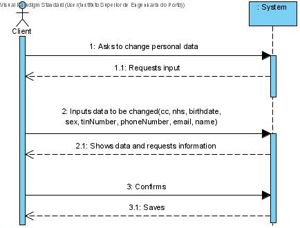
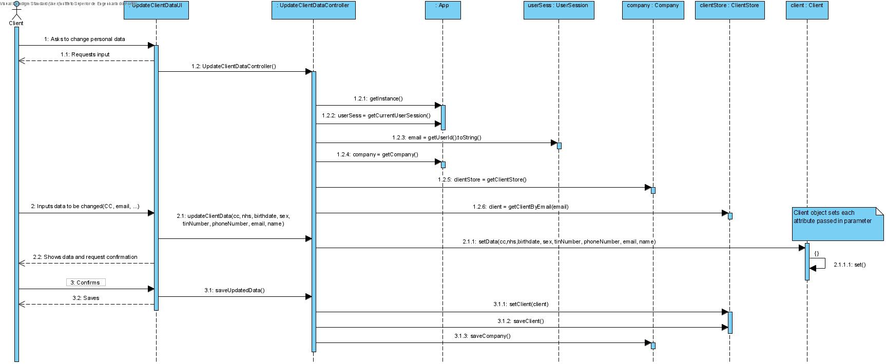
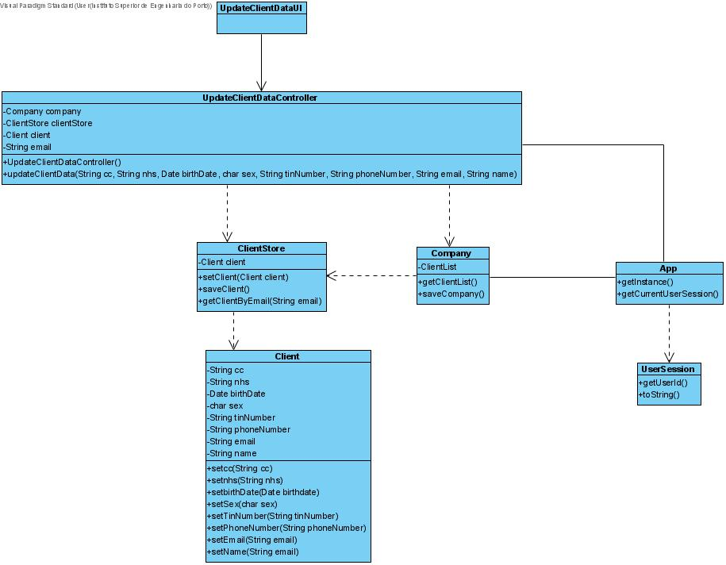

# US 02 - As a client, I want to update my personal data

## 1. Requirements Engineering

### 1.1. User Story Description

*As a client, I want to update my personal data.*

### 1.2. Customer Specifications and Clarifications 

**From the client clarifications:**

> **Question:** Should the Client type in the attribute he/she wants to update or should he choose from a list?
> 
> **Answer:** In this sprint each team should develop a graphical user interface for US2. The application should show the current user data and the client can update any attribute.
>
> **Question:** To update the attribute, should the Client type the previous data?
> 
> **Answer:** In this sprint each team should develop a graphical user interface for US2. The application should show the current user data and the client can update any attribute.
>
> **Question:** What is the Data that the Client can update?
> 
> **Answer:** In this sprint each team should develop a graphical user interface for US2. The application should show the current user data and the client can update any attribute.
> 
> **Question** In US02 when the client changes the password what should the rules be for this new password? (for example, a digit limit)
> 
> **Answer:** The password should be randomly generated. It should have ten alphanumeric characters
> 
> **Question** Should/Can we show the current data held in the client's account? If so, we think that showing certain information(Password, for exemple) could violate some security purposes. How should we approach that situation?
>
> **Answer:** "The client can only update his: name, address, phone number and sex attributes. The other attributes can not be updated. There are some restrictions that forced me to make this decision."
> 
> **Question** When we update the client's information, should we send an email informing that the client's data has been changed? If so, what should this email contain?
> 
> **Answer:** Yes. The e-mail message should only inform the client that his personal data has been updated.
> 
> 
### 1.3. Acceptance Criteria
The client can only update his: name, address, phone number and sex attributes. The other attributes can not be updated.
The e-mail message should only inform the client that his personal data has been updated.
Develop a graphical user interface for US2
The application should show the current user data and the client can update any attribute.

***The client's information is updated***
### 1.4. Found out Dependencies

**From Sprint A:**

There is a dependency to:
* **"US3: As a receptionist of the laboratory, I want to register a client."** Since the client needs to be registered in the system in order to update his information

### 1.5 Input and Output Data

**Input Data:**

* Typed data:
  * Personal information
  
### 1.6. System Sequence Diagram (SSD)

*Insert here a SSD depicting the envisioned Actor-System interactions and throughout which data is inputted and outputted to fulfill the requirement. All interactions must be numbered.*

### 1.7 Other Relevant Remarks

* The US should not have to be repeated very often since 

## 2. OO Analysis

### 2.1. Relevant Domain Model Excerpt 
*In this section, it is suggested to present an excerpt of the domain model that is seen as relevant to fulfill this requirement.* 

## 3. Design - User Story Realization 

### 3.1. Rationale

| Interaction ID | Question: Which class is responsible for... | Answer  | Justification (with patterns)  |
|:-------------  |:--------------------- |:------------|:---------------------------- |
| **Step/Msg 1:** Asks to change personal data |  interacting with the actor? | UpdateClientDataUI | **Pure Fabrication:** there is no reason to assign this responsibility to any existing class in the Domain Model |
|                                                        |  coordinating the US? | UpdateClientDataController | Controller |
| **Step/Msg 2:** requests input | n/a | | |
| **Step/Msg 3:** inputs data to be changed | knowing ClientStore? | Company | **IE:** ClientStore is initialized in Company |
|                                             |  knowing all the existent clients? | ClientStore | **IE:** knows its own clients |
| **Step/Msg 4:** Shows data and requests confirmation | n/a | | |
| **Step/Msg 5:** Confirms | 
| **Step/Msg 6:** Saves |  informing operation success? | UpdateClientDataUI | **IE:** responsible for user interaction |

### Systematization ##

According to the taken rationale, the conceptual classes promoted to software classes are: 

 * Company
 * Client

Other software classes (i.e. Pure Fabrication) identified: 
 * UpdateClientDataUI  
 * UpdateClientDataController
 * ClientStore

## 3.2. Sequence Diagram (SD)

  

* SD_AddTestResult(parameterCode, result, metric)

## 3.3. Class Diagram (CD)

*In this section, it is suggested to present an UML static view representing the main domain related software classes that are involved in fulfilling the requirement as well as and their relations, attributes and methods.*

# 4. Tests

### TestParameterResult Tests

**Test 1:** Get the test parameter result's parameterID.

    public void getParamID() {

        TestParameterResult tpr1 = new TestParameterResult("IgGAN", 15);

        String expected = "IgGAN";
        String actual = tpr1.getParamID();

        Assert.assertEquals(expected, actual);

    }

**Test 2:** Get the test parameter result's result.

    public void getResult() {

        TestParameterResult tpr1 = new TestParameterResult("IgGAN", 15.5);

        Double expected = 15.5;
        Double actual = tpr1.getResult();

        Assert.assertEquals(expected, actual);

    }

**Test 3:** Get the test parameter result's reference value.

    public void getRefValue() {

        TestParameterResult tpr1 = new TestParameterResult("IgGAN", 1.4);

        RefValue expected = new RefValue("mm/hr", 1.0, 10.0);

        tpr1.setRefValue(expected);
        RefValue actual = tpr1.getRefValue();

        Assert.assertEquals(expected, actual);

    }

**Test 4:** Set the test parameter result's reference value.

    public void setRefValue() {

        TestParameterResult tpr1 = new TestParameterResult("IgGAN", 15.5);
        RefValue rv1 = new RefValue("aaa", 10.0, 20.0);

        tpr1.setRefValue(rv1);
        RefValue actual = tpr1.getRefValue();

        Assert.assertEquals(rv1, actual);

    }

### RefValue Tests

**Test 5:** Get the metric.

    public void getMetric() {

        RefValue rv1 = new RefValue("aaa", 10.0, 20.0);

        String expected = "aaa";
        String actual = rv1.getMetric();

        Assert.assertEquals(expected, actual);

    }

**Test 6:** Get the minimum reference value.

    public void getRefValueMin() {

        RefValue rv1 = new RefValue("aaa", 10.0, 20.0);

        Double expected = 10.0;
        Double actual = rv1.getRefValueMin();

        Assert.assertEquals(expected, actual);

    }

**Test 7:** Get the maximum reference value.

    public void getRefValueMax() {

        RefValue rv1 = new RefValue("aaa", 10.0, 20.0);

        Double expected = 20.0;
        Double actual = rv1.getRefValueMax();

        Assert.assertEquals(expected, actual);

    }

**Test 8:** Get corresponding test using the sampleID.

    private boolean getCorrespondingTest(String sampleID) {
    String testID;

        List<Sample> samples = sampleStore.getSampleList();

        testID = "";

        for (Sample sa : samples) {
            if (sa.getBarcode().equals(sampleID)) {
                testID = sa.getTr().getTestID();
            }
        }

        List<Test> tests = testStore.getTestList();

        for (Test test1 : tests) {
            if (test1.getTestID().equals(testID)) {
                this.test = test1;
                return test1.compareTestState("SAMPLE_COLLECTED");
            }
        }
        return false;
    }
	

*It is also recommended organizing this content by subsections.* 

# 5. Construction (Implementation)

### Class RecordTestResultUI

    public class RecordTestResultUI implements Runnable {

        RecordTestResultController ctrl;

        public RecordTestResultUI() {
            ctrl = new RecordTestResultController();
        }

        @Override
        public void run() {

            boolean result = true;
            boolean repeat = false;
            double value;

            String sampleID = Utils.readLineFromConsole("Please enter the sample barcode number of the test:");

            List<TestParameter> parameters = ctrl.getParameters(sampleID);

            if (this.ctrl.getSampleListDto() == null || this.ctrl.getSampleListDto().isEmpty()) {
                System.out.println("The list is of samples is empty!");
            } else {
                do {
                    for (TestParameter param : parameters) {
                        System.out.println();
                        System.out.print("Parameters: " + param.getParam().getName());

                        value = Utils.readDoubleFromConsole("Please insert the result/value:");

                        try {
                            result = ctrl.addTestParameterResult(param.getParam().getCode(), value);
                            result = true;
                        } catch (Exception e) {
                            System.out.println(e.getMessage());
                            result = false;
                        }

                        if (result) {
                            System.out.println("Test parameter result saved with success!");
                        } else {
                            System.out.println("Incorrect input of data (an error has occurred).");
                            repeat = Utils.confirm("Try again? (s/n)");
                        }
                    }
                } while (repeat);
            }

            if (result) {
                ctrl.setState();
                System.out.println("Success! All test parameters results have been recorded.");
            } else {
                System.out.println("Something went wrong... please, try again.");
            }
        }
    }

### Class UpdateClientDataController

    import app.domain.stores.ClientStore;

    import java.util.Date;

    public class UpdateClientDataController {

    private Company company = App.getInstance().getCompany();
    private final Client client;
    private final ClientStore clientStore = company.getClientList();

    public UpdateClientDataController(){
        String email = App.getInstance().getCurrentUserSession().getUserId().toString();
        this.client = company.getClientList().getClientByEmail(email);
    }

    public void updateClientData(String cc, String nhs, Date birthDate, char sex, String tinNumber, String phoneNumber, String email, String name){
        this.client.setCc(cc);
        this.client.setNhs(nhs);
        this.client.setBirthDate(birthDate);
        this.client.setSex(String.valueOf(sex));
        this.client.setTinNumber(tinNumber);
        this.client.setPhoneNumber(phoneNumber);
        this.client.setEmail(email);
        this.client.setName(name);

        clientStore.setClient(this.client);
        clientStore.saveClient();
        company.saveCompany();
    }
}

# 6. Integration and Demo

### Integration in the Company class

    ClientStore clientStore = new ClientStore();

    public ClientStore getClientStore() {
        return clientStore;
    }

### Integration in the Test class

    public void createTestParameter(String testID, List<Parameter> parameters) {
        TestParameter tp;
        for (Parameter param : parameters) {
            tp = new TestParameter(testID, param);
            this.tpList.add(tp);
        }
    }

    public List<TestParameter> getTpList() {
        return tpList;
    }

    public boolean addTestParameterResult(String parameterCode, double result) throws ClassNotFoundException, InstantiationException, IllegalAccessException {

        TestParameter tp1 = null;

        for (TestParameter tp : tpList) {
            if (tp.getParam().getCode().equals(parameterCode)) {
                tp1 = tp;
            }
        }

        if (tp1 == null) {
            return false;
        }

        String em = tt.getExternalModule();
        Class<?> daclass = Class.forName(em);
        RefValueAdapter adp = (RefValueAdapter) daclass.newInstance();

        String paramCode = tp1.getParam().getCode();

        TestParameterResult tpr = new TestParameterResult(parameterCode, result);
        tpr.setRefValue(adp.getRefValue(paramCode));

        tp1.setTpr(tpr);
        return true;
    }

    public boolean compareTestState(String state) {

        if (state.equals("SAMPLE_ANALYSED") || state.equals("DIAGNOSTIC_MADE") || state.equals("VALIDATED")) {
            return false;
        }
        return true;
    }

### Integration in the TestType class

    public String getExternalModule() {
        return externalModule;
    }

    public String setExternalModule(String testCode) {

        if(testCode.equals("BL000")) {
            return Constants.EM_REFERENCE_API;
        }

        if(testCode.equals("COV19")) {
            return Constants.COVID_REFERENCE_API;
        }
        return null;
    }

### Constants class

    public static final int ACCESS_KEY = 12345;
    public static final String COVID_REFERENCE_API = "app.domain.model.RefValueAdapter1";
    public static final String EM_REFERENCE_API = "app.domain.model.RefValueAdapter2";
    public static final String BC_REFERENCE_API = "app.domain.model.BarcodeAdapter1";

# 7. Observations