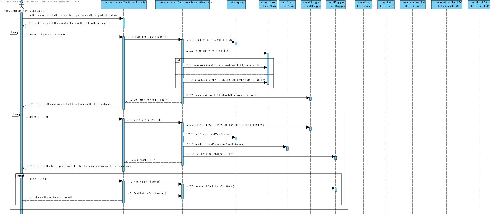

# US 13 - Consult the historical tests performed by a particular client check tests details/results

## 1. Requirements Engineering

### 1.1. User Story Description

*As a clinical chemistry technologist, I intend to consult the historical tests performed by a particular client and to be able to check tests details/results.*

### 1.2. Customer Specifications and Clarifications 

**From the specifications document:**

> “At the same time, the results are also available in the central application where the medical lab technicians who collect the samples, the **clinical chemistry technologist**, the specialist doctor, and the laboratory coordinator can check them.”

> "To facilitate the access to the results, **the application must allow ordering the clients by TIN and by name**. The **ordering algorithm** to be used by the application must be defined through a **configuration file**. It is intended that the choice of the ordering algorithm is based on the algorithm complexity (mainly the execution time). Therefore, at least **two sorting algorithms** should be evaluated and documented in the application user manual (in the annexes) that must be delivered with the application."

**From the client clarifications:**

> **Question:** The client's tests, that we have to show on this US, need to have been validated by the lab coordinator or is it enough if they just have results and we can show them before being validated by the lab coordinator?
> 
> **Answer:** The tests to be presented in US13 are tests that have already been validated by the lab coordinator.

> **Question:** From the user story description "As a clinical chemistry technologist, I intend to consult the historical tests performed by a particular client and to be able to check tests details/results". What do you mean by "check tests details/results"?
> 
> **Answer:** The clinical chemistry technologist should be able to check the historical tests performed by a particular client and see the results obtained in each test. For a given client (that was selected by the clinical chemistry technologist) the application should show all tests performed by the client and, for each parameter, the application should show the parameter value and the parameter reference values. The clinical chemistry technologist should not have access to the report made by the specialist doctor.

> **Question:** Should the user be the one selecting if the Clients are ordered by Name or TIN, or should it be defined through the configuration file? If it is the user, how should he be able to select it?
> 
> **Answer:** When using the application, the clinical chemistry technologist should be able to sort the clients by name or TIN. The algorithm that will be used to sort the data should be defined through a configuration file.

> **Question:** In US13, the Clinical Chemistry Technologist, can select more than one client at once to view its historical test results?
> 
> **Answer:** No.

> **Question:** In US13 acceptance criteria, "The application must allow ordering the clients by TIN and by name...". What do you mean by that? Is there a priority in ordering between name and TIN?
> 
> **Answer:** The user can choose to sort the clients by name OR by TIN.

### 1.3. Acceptance Criteria

* **AC1:** The application must allow ordering the clients by TIN and by name to help the clinical chemistry technologist choose the target client.
* **AC2:** The ordering algorithm to be used by the application must be defined through a configuration file.
* **AC3:** At least two sorting algorithms should be available.
* **AC4:** The system should show only clients that have tests already validated by the lab coordinator.
* **AC5:** The tests to be presented are tests that have already been validated by the lab coordinator.
* **AC6:** For a given client (that was selected by the clinical chemistry technologist) the application should show all tests performed by the client and, for each parameter, the application should show the parameter value and the parameter reference values.

### 1.4. Found out Dependencies

**From Sprint B:**

There is a dependency to:

* **"US03 Register a client"** since at least one client must be registered in the system in order to register its tests.
* **"US07 Register a new employee"** since at least a Clinical Chemistry Technologist must be registered in the system.

**From Sprint C:**

There is a dependency to:

* **"US04 Register a test to be performed to a registered client"** since at least one test must be registered in the system in order to check its details/results.
* **"US12 Record the results of a given test"** since the test results must exist in order to check them.

### 1.5 Input and Output Data

**Input Data:**

  * Typed data: None

  * Selected data:
    * Client list order (by TIN or by name)
    * Client
    * Test

**Output Data:**

  * List of clients ordered by TIN/name
  * List of the validated tests performed by a particular client
  * List of the test results

### 1.6. System Sequence Diagram (SSD)

*Insert here a SSD depicting the envisioned Actor-System interactions and throughout which data is inputted and outputted to fulfill the requirement. All interactions must be numbered.*

### 1.7 Other Relevant Remarks

*Use this section to capture other relevant information that is related with this US such as (i) special requirements ; (ii) data and/or technology variations; (iii) how often this US is held.* 

## 2. OO Analysis

### 2.1. Relevant Domain Model Excerpt 
*In this section, it is suggested to present an excerpt of the domain model that is seen as relevant to fulfill this requirement.* 

### 2.2. Other Remarks

*Use this section to capture some additional notes/remarks that must be taken into consideration into the design activity. In some case, it might be useful to add other analysis artifacts (e.g. activity or state diagrams).* 

## 3. Design - User Story Realization 

### 3.1. Rationale

**The rationale grounds on the SSD interactions and the identified input/output data.**

| Interaction ID | Question: Which class is responsible for... | Answer  | Justification (with patterns)  |
|:-------------  |:--------------------- |:------------|:---------------------------- |
| **Step/Msg 1:** asks to consult the historical tests performed by a particular client | ... interacting with the actor? | ConsultClientTestsAndResultsUI | **Pure Fabrication:** there is no reason to assign this responsibility to any existing class in the Domain Model |
|                                                                                       | ... coordinating the US? | ConsultClientTestsAndResultsController | Controller |
|                                                                                       | ... knowing ClientStore? | Company | **IE:** ClientStore is initialized in Company |
|                                                                                       | ... getting the client list and ordering it? | ClientStore | **IE:** has the clients list and knows its data |
|                                                                                       | ... transferring the data from the domain to the UI? | ClientMapper | **DTO:** when there is so much data to transfer, it is better to opt by using a DTO in order to reduce coupling between UI and domain |
| **Step/Msg 2:** shows the ordered list of clients and asks to select one | n/a | | |
| **Step/Msg 3:** selects a client | ... transferring the data from the UI to the domain? | ClientMapper | **DTO:** when there is so much data to transfer, it is better to opt by using a DTO in order to reduce coupling between UI and domain |
|                                  | ... knowing TestStore? | Company | **IE:** TestStore is initialized in Company |
|                                  | ... getting the validated tests list? | TestStore | **IE:** has the tests list and knows its data |
|                                  | ... transferring the data from the domain to the UI? | TestMapper | **DTO:** when there is so much data to transfer, it is better to opt by using a DTO in order to reduce coupling between UI and domain |
| **Step/Msg 4:** shows the tests performed by the chosen client and asks to select one | n/a | | |
| **Step/Msg 5:** selects a test | ... getting the test details/results? | ConsultClientTestsAndResultsController | **IE:** has access to the requested data |
|                                | ... transferring the data from the UI to the domain? | TestMapper | **DTO:** when there is so much data to transfer, it is better to opt by using a DTO in order to reduce coupling between UI and domain |
| **Step/Msg 6:** shows the test details/results | n/a | | |

### Systematization ##

According to the taken rationale, the conceptual classes promoted to software classes are: 

 * Company
 * Client
 * Test

Other software classes (i.e., Pure Fabrication) identified:

* ConsultClientTestsAndResultsUI
* ConsultClientTestsAndResultsController
* ClientStore
* TestStore
* ClientMapper
* TestMapper

## 3.2. Sequence Diagram (SD)

## 3.3. Class Diagram (CD)

*In this section, it is suggested to present an UML static view representing the main domain related software classes that are involved in fulfilling the requirement as well as and their relations, attributes and methods.*

# 4. Tests

### TestParameterResult Tests

**Test 1:** 

# 5. Construction (Implementation)

# 6. Integration and Demo

# 7. Observations