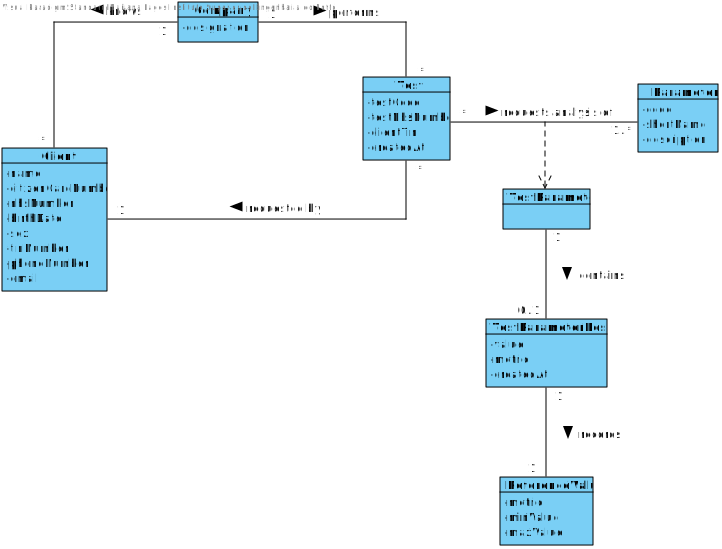
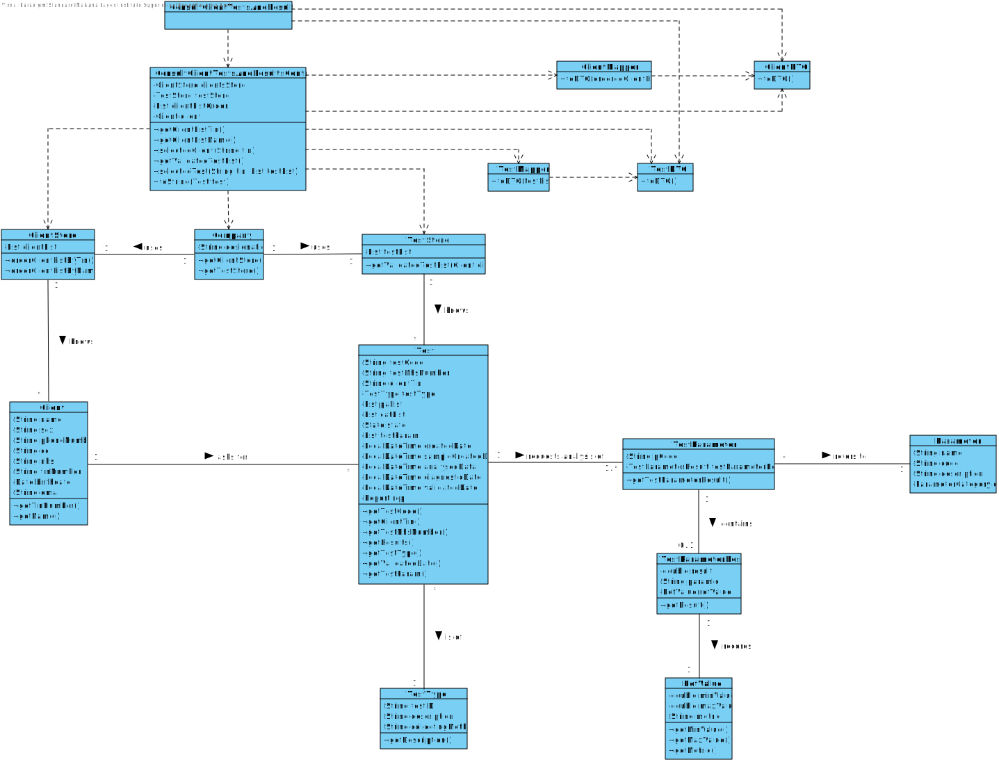

# US 13 - Consult the historical tests performed by a particular client check tests details/results

## 1. Requirements Engineering

*In this section, it is suggested to capture the requirement description and specifications as provided by the client as well as any further clarification on it. It is also suggested capturing the requirements' acceptance criteria and existing dependencies to other requirements. At last, identify the involved input and output data and depicted an Actor-System interaction in order to fulfill the requirement.*

### 1.1. User Story Description

*As a clinical chemistry technologist, I intend to consult the historical tests performed by a particular client and to be able to check tests details/results.*

### 1.2. Customer Specifications and Clarifications 

**From the specifications document:**

> “At the same time, the results are also available in the central application where the medical lab technicians who collect the samples, the clinical chemistry technologist, the specialist doctor, and the laboratory coordinator can check them.”

> "To facilitate the access to the results, the application must allow ordering the clients by TIN and by name. The ordering algorithm to be used by the application must be defined through a configuration file. It is intended that the choice of the ordering algorithm is based on the algorithm complexity(mainly the execution time). Therefore, at least two sorting algorithms should be evaluated and documented in the application user manual (in the annexes) that must be delivered with the application."

**From the client clarifications:**

> **Question:** Should we show every client already registered when we show the clients' list to the clinical chemistry technologist or should we only show the clients' with a test or more already assigned?
> 
> **Answer:** The system should show only clients that have tests already validated by the lab coordinator.

> **Question:**
> 
> **Answer:**

### 1.3. Acceptance Criteria

* **AC1:** The application must allow ordering the clients by TIN and by name to help the clinical chemistry technologist choose the target client.
* **AC2:** The ordering algorithm to be used by the application must be defined through a configuration file.
* **AC3:** At least two sorting algorithms should be available.
* **AC4:** The system should show only clients that have tests already validated by the lab coordinator.
* **AC5:** The state of the tests to be shown must be "VALIDATED".

### 1.4. Found out Dependencies

**From Sprint B:**

There is a dependency to:

* **"US03 Register a client"** since at least one client must be registered in the system in order to register its tests.
* **"US07 Register a new employee"** since at least a Clinical Chemistry Technologist must be registered in the system.

**From Sprint C:**

There is a dependency to:
* **"US04 Register a test to be performed to a registered client"** since at least one test must be registered in the system in order to check its details/results.
* **"US12 Record the results of a given test"** since the test results must exist in order to check them.

### 1.5 Input and Output Data

**Input Data:**

* Typed data: n/a

* Selected data:
  * Client
  * Test

**Output Data:**

* List of clients ordered by TIN/name
* List of the validated tests performed by a particular client
* List of the test results
* Failure message (only in case anything goes wrong)

### 1.6. System Sequence Diagram (SSD)

*Insert here a SSD depicting the envisioned Actor-System interactions and throughout which data is inputted and outputted to fulfill the requirement. All interactions must be numbered.*

### 1.7 Other Relevant Remarks

*Use this section to capture other relevant information that is related with this US such as (i) special requirements ; (ii) data and/or technology variations; (iii) how often this US is held.* 

## 2. OO Analysis

### 2.1. Relevant Domain Model Excerpt 
*In this section, it is suggested to present an excerpt of the domain model that is seen as relevant to fulfill this requirement.* 

### 2.2. Other Remarks

*Use this section to capture some additional notes/remarks that must be taken into consideration into the design activity. In some case, it might be useful to add other analysis artifacts (e.g. activity or state diagrams).* 

## 3. Design - User Story Realization 

### 3.1. Rationale

**The rationale grounds on the SSD interactions and the identified input/output data.**

| Interaction ID | Question: Which class is responsible for... | Answer  | Justification (with patterns)  |
|:-------------  |:--------------------- |:------------|:---------------------------- |
| **Step/Msg 1:** asks to consult the historical tests performed by a particular client | ... interacting with the actor? |  | **Pure Fabrication:** there is no reason to assign this responsibility to any existing class in the Domain Model |
|                                                                                       | ... coordinating the US? |  | Controller |
| **Step/Msg 2:** shows the ordered list of clients and asks to select one | n/a | | |
| **Step/Msg 3:** selects a client |  |  |  |
| **Step/Msg 4:** shows the tests performed by the chosen client and asks to select one | n/a | | |
| **Step/Msg 5:** selects a test |  |  |  |
| **Step/Msg 6:** shows the test results | | | |

### Systematization ##

According to the taken rationale, the conceptual classes promoted to software classes are: 

 * Client
 * Test
 * TestParameterResult

Other software classes (i.e., Pure Fabrication) identified:

* ConsultClientTestsAndResultsUI
* ConsultClientTestsAndResultsController

## 3.2. Sequence Diagram (SD)

## 3.3. Class Diagram (CD)

*In this section, it is suggested to present an UML static view representing the main domain related software classes that are involved in fulfilling the requirement as well as and their relations, attributes and methods.*

# 4. Tests

### TestParameterResult Tests

**Test 1:** 

# 5. Construction (Implementation)

# 6. Integration and Demo

# 7. Observations