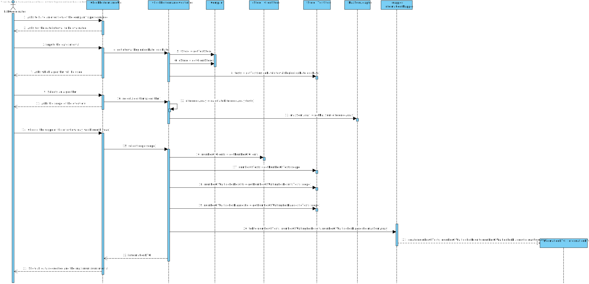
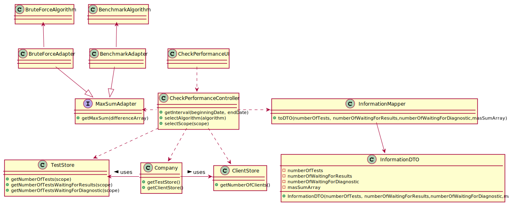

# US 16 - Overview of the Company Performance

## 1. Requirements Engineering

### 1.1. User Story Description

*As a laboratory coordinator, I want to have an overview of all the tests performed by Many Labs and analyse the overall
performance of the company (for instance, check the sub-intervals in which there were more samples waiting for the
result). To facilitate overall analysis, the application should also display statistics and graphs*

### 1.2. Customer Specifications and Clarifications

**From the specifications document:**

> Moreover, Many Labs is a company that needs to be continuously evaluating and improving its internal processes to achieve excellence and to beat the competition. Therefore, the company wants to decrease the number of tests waiting for its result. To evaluate this, it proceeds as following: for any interval of time, for example one week (6 working days with 12 working hours per day), the difference between the number of new tests and the number of results available to the client during each half an hour period is computed. In that case, a list with 144 integers is obtained, where a positive integer means that in such half an hour more tests were processed than results were obtained, and a negative integer means the opposite. Now, the problem consists in determining what the contiguous subsequence of the initial sequence is, whose sum of their entries is maximum. This will show the time interval, in such week, when the company was less effective in responding. So, the application should implement a brute-force algorithm (an algorithm which examines each subsequence) to determine the contiguous subsequence with maximum sum, for any interval of time registered.

> The implemented algorithm should be analysed in terms of its worst-case time complexity, and it should be compared to a provided benchmark algorithm. The algorithm to be used by the application must be defined through a configuration file.

> The complexity analysis must be accompanied by the observation of the execution time of the algorithms for inputs of variable size in order to observe the asymptotic behaviour. The time complexity analysis of the algorithms should be properly documented in the application user manual (in the annexes) that must be delivered with the application.

**From the client clarifications:**

> **Question:** Should the interval of time considered for the evaluation be asked to the Laboratory Coordinator?
>
> **Answer:** Yes.

> **Question:** How should we ask him the interval of time to be considered? Should we ask him to type a number of days? A number of weeks? Should we give general options like: last week, last month..., for him to select from?
>
> **Answer:** In case the Laboratory Coordinator chooses, for example, one week, should we consider the last 7 days, or should we consider, for example, the data from monday to sunday? A: The laboratory coordinator should introduce two dates that define an interval, the beginning date and the end date. This interval will be used to find the contiguous subsequence with maximum sum.

> **Question:** In the User Story Description, it reads: "As a laboratory coordinator, I want to have an overview of all the tests performed by Many Labs. What is the meaning of "overview" here? Should the laboratory coordinator see the number of tests waiting for samples, the number of tests waiting for results, the number of tests waiting for diagnoses... Or should he see the information available for each one of the tests in the application?
>
> **Answer:** The laboratory coordinator should be able to check the number of clients, the number of tests waiting for results, the number of tests waiting for diagnosis, and the total number of tests processed in the laboratory in each day, week, month and year. Moreover, the laboratory coordinator should be able to check the contiguous subsequence with maximum sum.

> **Question:** After the Laboratory Coordinator types the requested data and views the analysis of the company performance, should he be able to re-type different data and view the results for a different interval of time and/or algorithm? To make the re-type of the data easier, should there be a "clear" button, that is responsible for clearing the text fields for data entry?
>
> **Answer:** The laboratory coordinator should be able to explore different parameter values (settings) and check the results. Each team should prepare a simple and intuitive interface that requires a minimum number of interactions with the user.

> **Question:** Does the laboratory coordinator also select the amount of working hours per day? Or should we just consider it as 12 working hours/day?
>
> **Answer:** The lab coordinator does not select the amount of working hours per day. Please consider 12 working hours per day.

> **Question:** Regarding US16, when the laboratory coordinator "analyses the overall performance of the company", is the analysis purely looking at the results? Or should he write any type of report based on the results for the interval he is seeing?
>
> **Answer:** You should only identify the time interval where there was a delay in the response (the maximum subsequence).

> **Question:** On the project description is written that "The algorithm to be used by the application must be defined through a configuration file", but on the requirements is written that "the laboratory coordinator should have the ability to dynamically select the algorithm to be applied from the ones available on the system". Should we discard the configuration file and add an option on th program to select one of the available algorithms?
>
> **Answer:** Developing an application, like the one we are developing during the Integrative Project, is a dynamic process and the best teams are those who are prepared to react to change quickly. Moreover, the latest client requests/requirements are those that should be considered. Typically, a client updates the requirements throughout the project development. Please consider the requirements introduced at the beginning of Sprint D. The laboratory coordinator should have the ability to dynamically select the algorithm to be applied from the ones available on the system (either the benchmark algorithm provided in moodle or the brute-force algorithm to be developed by each team).

> **Question:** When you say tests waiting results are you referring to tests with samples collected but not analyzed yet? If so, and considering the csv file does not have an explicit date for when the sample is collected, which date should we use?
>
> **Answer:** You should use the test registration date (Test_Reg_DateHour).

### 1.3. Acceptance Criteria

* **AC1:** While evaluating the performance the laboratory coordinator should have the ability to dynamically select the
  algorithm to be applied from the ones available on the system (the benchmark algorithm provided in moodle and the
  brute-force algorithm to be developed). Support for easily adding other similar algorithms is required.
* **AC2:** The laboratory coordinator should introduce two dates that define an interval, the beginning date and the end date. This interval will be used to find the contiguous subsequence with maximum sum.
* **AC3:** The laboratory coordinator should only identify the time interval where there was a delay in the response (the maximum subsequence).
* **AC4:** The lab coordinator does not select the amount of working hours per day. Please consider 12 working hours per day.
* **AC5:** The laboratory coordinator should be able to explore different parameter values (settings) and check the results. Each team should prepare a simple and intuitive interface that requires a minimum number of interactions with the user.
* **AC6:** The laboratory coordinator should use the test registration date (Test_Reg_DateHour).

### 1.4. Found out Dependencies

* There is a dependency to "US4", "US5", "US12","US14","US15" since there will be evaluated the difference at a certain
  time between the registered tests, and the validated tests

### 1.5 Input and Output Data

**Input Data:**

* Selected data:
    * Date Interval
    * Algorithm to be used

**Output Data:**

* Number of clients
* Amount of tests waiting for result
* Amount of tests waiting for diagnosis
* Amount of tests validated
* Interval of maximum sum

### 1.6. System Sequence Diagram (SSD)

*Insert here a SSD depicting the envisioned Actor-System interactions and throughout which data is inputted and
outputted to fulfill the requirement. All interactions must be numbered.*

### 1.7 Other Relevant Remarks
 
*n/a*

## 2. OO Analysis

### 2.1. Relevant Domain Model Excerpt

*n/a*

### 2.2. Other Remarks

*n/a*

## 3. Design - User Story Realization

### 3.1. Rationale

**The rationale grounds on the SSD interactions and the identified input/output data.**

| Interaction ID                                                | Question: Which class is responsible for...               | Answer                     | Justification (with patterns)                                                                            |
| :-------------                                                | :---------------------                                    | :------------              | :----------------------------                                                                            |
| Step 1: Asks to have an overview of the company's performance | ...interactions with the user                             | CheckPerformanceUI         | **Pure Fabrication:** There is no reason to assign this responsibility to an existing class in the Model |
|                                                               | ... coordination the US?                                  | CheckPerformanceController | **Controller**                                                                                           |
| 		                                                        | ... knowing TestStore? | Company | **IE**: Company knows the TestStore to which it is delegating some tasks. |
| 		                                                        | ... knowing ClientStore? | Company | **IE**: Company knows the ClientStore to which it is delegating some tasks. |
| 		                                  | ... checking all tests available in the system?	| TestStore | **IE**: The testStore knows all tests available in the system. |
| 	                                      | ... verifying if the test is valid (or with a diagnostic, sample collected, sample analysed or only test created)? | Test | **IE**: The test knows its own state. |
| 		                                  | ... knowing all clients available in the system? | Company | **IE**: Company knows all information available in the system. |
| Step 2: Asks for the date interval to be evaluated            |  n/a                                                         |                            |                                                                                                          |
| Step 3: Inputs the date interval                              |     n/a                                                      |                            |                                                                                                          |
|                                                               | ...obtaining the list of tests in the given date interval | TestStore                  | **IE:** TestStore knows all the tests                                                                                                         |
| Step 4: Asks which algorithm will be used                     |       n/a                                                    |                            |                                                                                                          |
| Step 5: Selects an algorithm                                  | ... getting the maxSum interval                           | MaxSumAdapter              | **Protected Variations:** Since the system needs to support different algorithms we are using an interface and several adapters in order to be able to support them. The system uses java reflection in order to know the interface needed in runtime, we use polymorphism by implementing a interface that will be implemented in the adapter classes.                                                                                                          |
| Step 6: Asks the scope of the overview                        |  ...getting all tests inside the scope?                                                         |   TestStore                         |     **IE:** TestStore knows all the tests                                                                                                           |
| 		                                                        | ... getting the information to expose to the user? | InformationMapper | **DTO**: In order to detach the domain layer from the UI layer, we use a data transfer object (DTO) to only extract data from the domain class (and not extract methods from the domain class) |
| Step 7: Show all data requested and the maximum sum interval  |      n/a                                                     |                            |                                                                                                          |
| Step 10: Informs operation success | ... informing operation success? | CheckPerformanceUI | **IE**: Responsible for user interaction |
### Systematization ##

According to the taken rationale, the conceptual classes promoted to software classes are:

* Company

Other software classes (i.e. Pure Fabrication) identified:

* CheckPerformanceUI
* CheckPerformanceUIController
* Test
* TestStore
* Client
* ClientStore  
* MaxSumAdapter
* InformationMapper
* InformationDTO

## 3.2. Sequence Diagram (SD)

## 3.3. Class Diagram (CD)

*n/a*

# 4. Tests

### TestParameterResult Tests

**Test 1:** Get the test parameter result's parameterID.

    public void getParamID() {

        TestParameterResult tpr1 = new TestParameterResult("IgGAN", 15);

        String expected = "IgGAN";
        String actual = tpr1.getParamID();

        Assert.assertEquals(expected, actual);

    }

**Test 2:** Get the test parameter result's result.

    public void getResult() {

        TestParameterResult tpr1 = new TestParameterResult("IgGAN", 15.5);

        Double expected = 15.5;
        Double actual = tpr1.getResult();

        Assert.assertEquals(expected, actual);

    }

**Test 3:** Get the test parameter result's reference value.

    public void getRefValue() {

        TestParameterResult tpr1 = new TestParameterResult("IgGAN", 1.4);

        RefValue expected = new RefValue("mm/hr", 1.0, 10.0);

        tpr1.setRefValue(expected);
        RefValue actual = tpr1.getRefValue();

        Assert.assertEquals(expected, actual);

    }

**Test 4:** Set the test parameter result's reference value.

    public void setRefValue() {

        TestParameterResult tpr1 = new TestParameterResult("IgGAN", 15.5);
        RefValue rv1 = new RefValue("aaa", 10.0, 20.0);

        tpr1.setRefValue(rv1);
        RefValue actual = tpr1.getRefValue();

        Assert.assertEquals(rv1, actual);

    }

### RefValue Tests

**Test 5:** Get the metric.

    public void getMetric() {

        RefValue rv1 = new RefValue("aaa", 10.0, 20.0);

        String expected = "aaa";
        String actual = rv1.getMetric();

        Assert.assertEquals(expected, actual);

    }

**Test 6:** Get the minimum reference value.

    public void getRefValueMin() {

        RefValue rv1 = new RefValue("aaa", 10.0, 20.0);

        Double expected = 10.0;
        Double actual = rv1.getRefValueMin();

        Assert.assertEquals(expected, actual);

    }

**Test 7:** Get the maximum reference value.

    public void getRefValueMax() {

        RefValue rv1 = new RefValue("aaa", 10.0, 20.0);

        Double expected = 20.0;
        Double actual = rv1.getRefValueMax();

        Assert.assertEquals(expected, actual);

    }

**Test 8:** Get corresponding test using the sampleID.

    private boolean getCorrespondingTest(String sampleID) {
    String testID;

        List<Sample> samples = sampleStore.getSampleList();

        testID = "";

        for (Sample sa : samples) {
            if (sa.getBarcode().equals(sampleID)) {
                testID = sa.getTr().getTestID();
            }
        }

        List<Test> tests = testStore.getTestList();

        for (Test test1 : tests) {
            if (test1.getTestID().equals(testID)) {
                this.test = test1;
                return test1.compareTestState("SAMPLE_COLLECTED");
            }
        }
        return false;
    }

*It is also recommended organizing this content by subsections.*

# 5. Construction (Implementation)

### Class RecordTestResultUI

    public class RecordTestResultUI implements Runnable {

        RecordTestResultController ctrl;

        public RecordTestResultUI() {
            ctrl = new RecordTestResultController();
        }

        @Override
        public void run() {

            boolean result = true;
            boolean repeat = false;
            double value;

            String sampleID = Utils.readLineFromConsole("Please enter the sample barcode number of the test:");

            List<TestParameter> parameters = ctrl.getParameters(sampleID);

| if (this.ctrl.getSampleListDto() == null | this.ctrl.getSampleListDto().isEmpty()) { |
                System.out.println("The list is of samples is empty!");
            } else {
                do {
                    for (TestParameter param : parameters) {
                        System.out.println();
                        System.out.print("Parameters: " + param.getParam().getName());

                        value = Utils.readDoubleFromConsole("Please insert the result/value:");

                        try {
                            result = ctrl.addTestParameterResult(param.getParam().getCode(), value);
                            result = true;
                        } catch (Exception e) {
                            System.out.println(e.getMessage());
                            result = false;
                        }

                        if (result) {
                            System.out.println("Test parameter result saved with success!");
                        } else {
                            System.out.println("Incorrect input of data (an error has occurred).");
                            repeat = Utils.confirm("Try again? (s/n)");
                        }
                    }
                } while (repeat);
            }

            if (result) {
                ctrl.setState();
                System.out.println("Success! All test parameters results have been recorded.");
            } else {
                System.out.println("Something went wrong... please, try again.");
            }
        }
    }

### Class RecordTestResultController

    public class RecordTestResultController {

        private Company company;
        private SampleStore sampleStore;
        private TestStore testStore;
        private Test test;

        private SampleMapper sampleMapper;

        public RecordTestResultController(){
            this(App.getInstance().getCompany());
            this.sampleStore = company.getSampleStore();
            this.testStore = company.getTestStore();
        }

        public RecordTestResultController(Company company) {
            this.company=company;
        }

        private boolean getCorrespondingTest(String sampleID) {
            String testID;

            List<Sample> samples = sampleStore.getSampleList();

            testID = "";

            for (Sample sa : samples) {
                if (sa.getBarcode().equals(sampleID)) {
                    testID = sa.getTr().getTestID();
                }
            }

            List<Test> tests = testStore.getTestList();

            for (Test test1 : tests) {
                if (test1.getTestID().equals(testID)) {
                    this.test = test1;
                    return test1.compareTestState("SAMPLE_COLLECTED");
                }
            }
            return false;
        }

        public List<TestParameter> getParameters(String sampleID) {
            getCorrespondingTest(sampleID);

            if(test == null) {
                return null;
            }
            return test.getTpList();
        }

        public boolean addTestParameterResult(String parameterCode, double result) {

            try {
                test.addTestParameterResult(parameterCode, result);
            } catch (Exception e) {
                return false;
            }
            return true;
        }

        public void setState() {
            test.setState("SAMPLE_ANALYSED");
        }

        public List<Sample> getSampleList(){return company.getSampleList(); }

        public List<SampleDTO> getSampleListDto(){

            this.sampleMapper = new SampleMapper();

            return sampleMapper.toDTO(getSampleList());
        }
    }

### Class TestParameter

    public class TestParameter {

        private String testID;
        private Parameter param;
        private TestParameterResult tpr;

        public TestParameter(String testID, Parameter param) {
            this.testID = testID;
            this.param = param;
            this.tpr = null;
        }

        public String getTestID() {
            return testID;
        }

        public Parameter getParam() {
            return param;
        }

        public TestParameterResult getTpr() {
            return tpr;
        }

        public void setTpr(TestParameterResult tpr) {
            this.tpr = tpr;
        }
    }

### Class TestParameterResult

    public class TestParameterResult {

        private String paramID;
        private double result;
        private RefValue refValue;

        public TestParameterResult(String paramID, double result) {
            this.paramID = paramID;
            this.result = result;
        }

        public String getParamID() {
            return paramID;
        }

        public double getResult() {
            return result;
        }

        public RefValue getRefValue() {
            return refValue;
        }

        public void setRefValue(RefValue refValue) {
            this.refValue = refValue;
        }
    }

### Class RefValue

    public class RefValue {

        private String metric;
        private double refValueMin;
        private double refValueMax;

        public RefValue(String metric, double refValueMin, double refValueMax) {
            this.metric = metric;
            this.refValueMin = refValueMin;
            this.refValueMax = refValueMax;
        }

        public String getMetric() {
            return metric;
        }

        public double getRefValueMin() {
            return refValueMin;
        }

        public double getRefValueMax() {
            return refValueMax;
        }
    }

### Interface RefValueAdapter

    public interface RefValueAdapter {

        RefValue getRefValue(String param);

        double getRefValueMin(String param);

        double getRefValueMax(String param);

        String getMetric(String param);
    }

### Class RefValueAdapter1

    public class RefValueAdapter1 implements RefValueAdapter {
    CovidReferenceValues1API api;

        public RefValueAdapter1() {
            this.api = new CovidReferenceValues1API();
        }

        public RefValue getRefValue(String param) {
            return new RefValue(getMetric(param), getRefValueMin(param), getRefValueMax(param));
        }

        public double getRefValueMin(String paramID) {
            return api.getMinReferenceValue(paramID, Constants.ACCESS_KEY);
        }

        public double getRefValueMax(String paramID) {
            return api.getMaxReferenceValue(paramID, Constants.ACCESS_KEY);
        }

        public String getMetric(String paramID) {
            return api.usedMetric(paramID, Constants.ACCESS_KEY);
        }
    }

### Class RefValueAdapter2

    public class RefValueAdapter2 implements RefValueAdapter {
    ExternalModule2API api;

        public RefValueAdapter2() {
            this.api = new ExternalModule2API();
        }

        public RefValue getRefValue(String param) {
            return new RefValue(getMetric(param), getRefValueMin(param), getRefValueMax(param));
        }

        public double getRefValueMin(String paramID) {
            EMRefValue refValue = api.getReferenceFor(paramID);
            return refValue.getMinValue();
        }

        public double getRefValueMax(String paramID) {
            EMRefValue refValue = api.getReferenceFor(paramID);
            return refValue.getMaxValue();
        }

        public String getMetric(String paramID) {
            return api.getMetricsFor(paramID);
        }
    }

### Class RefValueAdapter3

    public class RefValueAdapter3 implements RefValueAdapter{
    ExternalModule3API api;

        public RefValueAdapter3() {
            this.api = new ExternalModule3API();
        }

        public RefValue getRefValue(String param) {
            return new RefValue(getMetric(param), getRefValueMin(param), getRefValueMax(param));
        }

        public double getRefValueMin(String paramID) {
            return api.getMinReferenceValue(paramID, Constants.ACCESS_KEY);
        }

        public double getRefValueMax(String paramID) {
            return api.getMaxReferenceValue(paramID, Constants.ACCESS_KEY);
        }

        public String getMetric(String paramID) {
            return api.usedMetric(paramID, Constants.ACCESS_KEY);
        }
    }

# 6. Integration and Demo

### Integration in the Company class

    TestStore testStore = new TestStore();

    public TestStore getTestStore() {
        return testStore;
    }

### Integration in the Test class

    public void createTestParameter(String testID, List<Parameter> parameters) {
        TestParameter tp;
        for (Parameter param : parameters) {
            tp = new TestParameter(testID, param);
            this.tpList.add(tp);
        }
    }

    public List<TestParameter> getTpList() {
        return tpList;
    }

    public boolean addTestParameterResult(String parameterCode, double result) throws ClassNotFoundException, InstantiationException, IllegalAccessException {

        TestParameter tp1 = null;

        for (TestParameter tp : tpList) {
            if (tp.getParam().getCode().equals(parameterCode)) {
                tp1 = tp;
            }
        }

        if (tp1 == null) {
            return false;
        }

        String em = tt.getExternalModule();
        Class<?> daclass = Class.forName(em);
        RefValueAdapter adp = (RefValueAdapter) daclass.newInstance();

        String paramCode = tp1.getParam().getCode();

        TestParameterResult tpr = new TestParameterResult(parameterCode, result);
        tpr.setRefValue(adp.getRefValue(paramCode));

        tp1.setTpr(tpr);
        return true;
    }

    public boolean compareTestState(String state) {

| if (state.equals("SAMPLE_ANALYSED") | state.equals("DIAGNOSTIC_MADE") | state.equals("VALIDATED")) { |
            return false;
        }
        return true;
    }

### Integration in the TestType class

    public String getExternalModule() {
        return externalModule;
    }

    public String setExternalModule(String testCode) {

        if(testCode.equals("BL000")) {
            return Constants.EM_REFERENCE_API;
        }

        if(testCode.equals("COV19")) {
            return Constants.COVID_REFERENCE_API;
        }
        return null;
    }

### Constants class

    public static final int ACCESS_KEY = 12345;
    public static final String COVID_REFERENCE_API = "app.domain.model.RefValueAdapter1";
    public static final String EM_REFERENCE_API = "app.domain.model.RefValueAdapter2";
    public static final String BC_REFERENCE_API = "app.domain.model.BarcodeAdapter1";

# 7. Observations