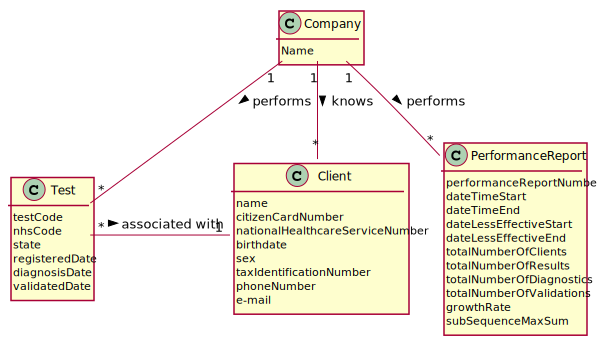

# US 16 - Overview of the Company Performance

## 1. Requirements Engineering

### 1.1. User Story Description

*As a laboratory coordinator, I want to have an overview of all the tests performed by Many Labs and analyse the overall
performance of the company (for instance, check the sub-intervals in which there were more samples waiting for the
result). To facilitate overall analysis, the application should also display statistics and graphs*

### 1.2. Customer Specifications and Clarifications

**From the specifications document:**

> Moreover, Many Labs is a company that needs to be continuously evaluating and improving its internal processes to achieve excellence and to beat the competition. Therefore, the company wants to decrease the number of tests waiting for its result. To evaluate this, it proceeds as following: for any interval of time, for example one week (6 working days with 12 working hours per day), the difference between the number of new tests and the number of results available to the client during each half an hour period is computed. In that case, a list with 144 integers is obtained, where a positive integer means that in such half an hour more tests were processed than results were obtained, and a negative integer means the opposite. Now, the problem consists in determining what the contiguous subsequence of the initial sequence is, whose sum of their entries is maximum. This will show the time interval, in such week, when the company was less effective in responding. So, the application should implement a brute-force algorithm (an algorithm which examines each subsequence) to determine the contiguous subsequence with maximum sum, for any interval of time registered.

> The implemented algorithm should be analysed in terms of its worst-case time complexity, and it should be compared to a provided benchmark algorithm. The algorithm to be used by the application must be defined through a configuration file.

> The complexity analysis must be accompanied by the observation of the execution time of the algorithms for inputs of variable size in order to observe the asymptotic behaviour. The time complexity analysis of the algorithms should be properly documented in the application user manual (in the annexes) that must be delivered with the application.

**From the client clarifications:**

> **Question:** Should the interval of time considered for the evaluation be asked to the Laboratory Coordinator?
>
> **Answer:** Yes.

> **Question:** How should we ask him the interval of time to be considered? Should we ask him to type a number of days? A number of weeks? Should we give general options like: last week, last month..., for him to select from?
>
> **Answer:** In case the Laboratory Coordinator chooses, for example, one week, should we consider the last 7 days, or should we consider, for example, the data from monday to sunday? A: The laboratory coordinator should introduce two dates that define an interval, the beginning date and the end date. This interval will be used to find the contiguous subsequence with maximum sum.

> **Question:** In the User Story Description, it reads: "As a laboratory coordinator, I want to have an overview of all the tests performed by Many Labs. What is the meaning of "overview" here? Should the laboratory coordinator see the number of tests waiting for samples, the number of tests waiting for results, the number of tests waiting for diagnoses... Or should he see the information available for each one of the tests in the application?
>
> **Answer:** The laboratory coordinator should be able to check the number of clients, the number of tests waiting for results, the number of tests waiting for diagnosis, and the total number of tests processed in the laboratory in each day, week, month and year. Moreover, the laboratory coordinator should be able to check the contiguous subsequence with maximum sum.

> **Question:** After the Laboratory Coordinator types the requested data and views the analysis of the company performance, should he be able to re-type different data and view the results for a different interval of time and/or algorithm? To make the re-type of the data easier, should there be a "clear" button, that is responsible for clearing the text fields for data entry?
>
> **Answer:** The laboratory coordinator should be able to explore different parameter values (settings) and check the results. Each team should prepare a simple and intuitive interface that requires a minimum number of interactions with the user.

> **Question:** Does the laboratory coordinator also select the amount of working hours per day? Or should we just consider it as 12 working hours/day?
>
> **Answer:** The lab coordinator does not select the amount of working hours per day. Please consider 12 working hours per day.

> **Question:** Regarding US16, when the laboratory coordinator "analyses the overall performance of the company", is the analysis purely looking at the results? Or should he write any type of report based on the results for the interval he is seeing?
>
> **Answer:** You should only identify the time interval where there was a delay in the response (the maximum subsequence).

> **Question:** On the project description is written that "The algorithm to be used by the application must be defined through a configuration file", but on the requirements is written that "the laboratory coordinator should have the ability to dynamically select the algorithm to be applied from the ones available on the system". Should we discard the configuration file and add an option on th program to select one of the available algorithms?
>
> **Answer:** Developing an application, like the one we are developing during the Integrative Project, is a dynamic process and the best teams are those who are prepared to react to change quickly. Moreover, the latest client requests/requirements are those that should be considered. Typically, a client updates the requirements throughout the project development. Please consider the requirements introduced at the beginning of Sprint D. The laboratory coordinator should have the ability to dynamically select the algorithm to be applied from the ones available on the system (either the benchmark algorithm provided in moodle or the brute-force algorithm to be developed by each team).

> **Question:** When you say tests waiting results are you referring to tests with samples collected but not analyzed yet? If so, and considering the csv file does not have an explicit date for when the sample is collected, which date should we use?
>
> **Answer:** You should use the test registration date (Test_Reg_DateHour).

### 1.3. Acceptance Criteria

* **AC1:** While evaluating the performance the laboratory coordinator should have the ability to dynamically select the
  algorithm to be applied from the ones available on the system (the benchmark algorithm provided in moodle and the
  brute-force algorithm to be developed). Support for easily adding other similar algorithms is required.
* **AC2:** The laboratory coordinator should introduce two dates that define an interval, the beginning date and the end date. This interval will be used to find the contiguous subsequence with maximum sum.
* **AC3:** The laboratory coordinator should only identify the time interval where there was a delay in the response (the maximum subsequence).
* **AC4:** The lab coordinator does not select the amount of working hours per day. Please consider 12 working hours per day.
* **AC5:** The laboratory coordinator should be able to explore different parameter values (settings) and check the results. Each team should prepare a simple and intuitive interface that requires a minimum number of interactions with the user.
* **AC6:** The laboratory coordinator should use the test registration date (Test_Reg_DateHour).

### 1.4. Found out Dependencies

* There is a dependency to "US4", "US5", "US12","US14","US15" since there will be evaluated the difference at a certain
  time between the registered tests, and the validated tests

### 1.5 Input and Output Data

**Input Data:**

* Selected data:
    * Date Interval
    * Algorithm to be used

**Output Data:**

* Number of clients
* Amount of tests waiting for result
* Amount of tests waiting for diagnosis
* Amount of tests validated
* Interval of maximum sum

### 1.6. System Sequence Diagram (SSD)

*Insert here a SSD depicting the envisioned Actor-System interactions and throughout which data is inputted and
outputted to fulfill the requirement. All interactions must be numbered.*


### 1.7 Other Relevant Remarks
 
*Use this section to capture other relevant information that is related with this US such as (i) special requirements
; (ii) data and/or technology variations; (iii) how often this US is held.*

## 2. OO Analysis

### 2.1. Relevant Domain Model Excerpt

*In this section, it is suggested to present an excerpt of the domain model that is seen as relevant to fulfill this
requirement.*



### 2.2. Other Remarks

*Use this section to capture some additional notes/remarks that must be taken into consideration into the design
activity. In some case, it might be useful to add other analysis artifacts (e.g. activity or state diagrams).*

## 3. Design - User Story Realization

### 3.1. Rationale

**The rationale grounds on the SSD interactions and the identified input/output data.**

| Interaction ID                                                | Question: Which class is responsible for...               | Answer                     | Justification (with patterns)                                                                            |
| :-------------                                                | :---------------------                                    | :------------              | :----------------------------                                                                            |
| Step 1: Asks to have an overview of the company's performance | ...interactions with the user                             | CheckPerformanceUI         | **Pure Fabrication:** There is no reason to assign this responsibility to an existing class in the Model |
|                                                               | ... coordination the US?                                  | CheckPerformanceController | **Controller**                                                                                           |
| 		                                                        | ... knowing TestStore? | Company | **IE**: Company knows the TestStore to which it is delegating some tasks. |
| 		                                                        | ... knowing ClientStore? | Company | **IE**: Company knows the ClientStore to which it is delegating some tasks. |
| 		                                  | ... checking all tests available in the system?	| TestStore | **IE**: The testStore knows all tests available in the system. |
| 	                                      | ... verifying if the test is valid (or with a diagnostic, sample collected, sample analysed or only test created)? | Test | **IE**: The test knows its own state. |
| 		                                  | ... knowing all clients available in the system? | Company | **IE**: Company knows all information available in the system. |
| Step 2: Asks for the date interval to be evaluated            |                                                           |                            |                                                                                                          |
| Step 3: Inputs the date interval                              |                                                           |                            |                                                                                                          |
|                                                               | ...obtaining the list of tests in the given date interval | TestStore                  | **IE:** TestStore knows all the tests                                                                                                         |
| Step 4: Asks which algorithm will be used                     |                                                           |                            |                                                                                                          |
| Step 5: Selects an algorithm                                  | ... getting the maxSum interval                           | MaxSumAdapter              | **Protected Variations:** Since the system needs to support different algorithms we are using an interface and several adapters in order to be able to support them. The system uses java reflection in order to know the interface needed in runtime, we use polymorphism by implementing a interface that will be implemented in the adapter classes.                                                                                                          |
| Step 6: Show all data requested and the maximum sum interval  |                                                           |                            |                                                                                                          |
### Systematization ##

According to the taken rationale, the conceptual classes promoted to software classes are:

* Company
* TestParameter
* TestParameterResult

Other software classes (i.e. Pure Fabrication) identified:

* RecordTestResultUI
* RecordTestResultController
* ExternalModule
* RefValue
* RefValueAdapter (1 for each API)
* TestParameterDTO
* TestParameterMapper

## 3.2. Sequence Diagram (SD)


## 3.3. Class Diagram (CD)

*In this section, it is suggested to present an UML static view representing the main domain related software classes
that are involved in fulfilling the requirement as well as and their relations, attributes and methods.*


# 4. Tests

### TestParameterResult Tests

**Test 1:** Checks if the benchmark algorithm is working properly.

````
package app.domain.model;

import org.junit.Assert;
import org.junit.Test;


public class MaxSumAdapterBenchmarkTest {
@Test
public void getMaxSum(){
int[] input = {-2, 1, -3, 4, -1, 2, 1, -5, 4};

        int[] expected = {4, -1, 2, 1};
        MaxSumAdapterBenchmark sumAdapterBenchmark = new MaxSumAdapterBenchmark();

        Assert.assertArrayEquals(expected,sumAdapterBenchmark.getMaxSum(input));

    }

}
````

**Test 2:** Checks if the BruteForce algorithm is working properly.

````
package app.domain.model;

import org.junit.Assert;
import org.junit.Test;

import static org.junit.Assert.*;

public class MaxSumAdapterBruteForceTest {

    @Test
    public void getMaxSum(){
        int[] input = {-2, 1, -3, 4, -1, 2, 1, -5, 4};

        int[] expected = {4, -1, 2, 1};
        MaxSumAdapterBruteForce sumAdapterBruteForce = new MaxSumAdapterBruteForce();

        Assert.assertArrayEquals(expected,sumAdapterBruteForce.getMaxSum(input));

    }

}
````

**Test 3:** Gets the number of tests in all the app.


````
        @Test
        public void getNumberOfTests() {
        ParameterCategoryStore cat = new ParameterCategoryStore();
        ParameterCategory pc1 = new ParameterCategory("AH000", "Hemogram");
        cat.add(pc1);
        List<ParameterCategory> cat1 = new ArrayList<>();
        cat1.add(pc1);
        List<Parameter> pa = new ArrayList<>();
        Parameter p1 = new Parameter("AH000", "Nome", "description", pc1);
        pa.add(p1);
        TestType testType = new TestType("BL000", "description", "sei lá", cat);
        TestStore store = new TestStore();
        app.domain.model.Test t = store.createTest("123456789187", "1234567890123456", testType, cat1, pa);

        ZoneId defaultZoneId = ZoneId.systemDefault();
        LocalDate date1Client = LocalDate.now();
        Date date1 = Date.from(date1Client.atStartOfDay(defaultZoneId).toInstant());


        Client client = new Client("12345678910", "1234567890123456", "1234567891", "1234567891", date1, "email@gamil.com", "Zé");

        List<Client> clientList = new ArrayList<>();
        clientList.add(client);

        Calendar calendar = Calendar.getInstance();
        calendar.add(Calendar.DATE, -10);
        Date toDate = calendar.getTime();

        Client client2 = new Client("12345678911", "1234567890123457", "1234567892", "1234567891", toDate, "email@gamil.com", "Zé");
        clientList.add(client2);

        app.domain.model.Test teste = new app.domain.model.Test("1234s", "123456789012", "1234567890123456", testType, cat1, pa);
        store.saveTest();

        LocalDate beginDate = toDate.toInstant().atZone(ZoneId.systemDefault()).toLocalDate();

        ParameterCategoryStore parameterCategoryStore = App.getInstance().getCompany().getParameterCategoryList();
        ParameterCategory pc10 = parameterCategoryStore.createParameterCategory("12345", "Hemogram");
        parameterCategoryStore.saveParameterCategory();
        ParameterCategory pc2 = parameterCategoryStore.createParameterCategory("12346", "Cholesterol");
        parameterCategoryStore.saveParameterCategory();
        ParameterCategory pc3 = parameterCategoryStore.createParameterCategory("12347", "Covid");
        parameterCategoryStore.saveParameterCategory();

        TestType covidTest = new TestType("COV19", "Covid", "Swab", parameterCategoryStore);

        List<ParameterCategory> testCategories = new ArrayList<>();
        testCategories.add(pc1);

        ParameterStore parameterStore = new ParameterStore();

        Parameter p4 = new Parameter(Constants.IG_GAN, "COVID", "000", pc3);
        parameterStore.add(p4);

        List<Parameter> testParameters1 = new ArrayList<>();
        testParameters1.add(p4);

        app.domain.model.Test t10 = new app.domain.model.Test("1234557890123456", "100000000100", "1234567890", covidTest, testCategories, testParameters1);
        t10.setCreatedDate(LocalDateTime.of(2021, Month.JUNE, 10, 11, 30));
        t10.addTestParameter();
        t10.changeState(Constants.SAMPLE_COLLECTED);
        t10.addTestResult(Constants.IG_GAN, 1.5);
        t10.changeState("VALIDATED");
        store.addTest(t10);

        Assert.assertEquals(store.numberOfTests(),2);
    }
````

**Test 4:** Get the number od tests waiting for analisis.

````
    @Test
    public void getWaitingDiagnosis() {
        ParameterCategoryStore cat = new ParameterCategoryStore();
        ParameterCategory pc1 = new ParameterCategory("AH000", "Hemogram");
        cat.add(pc1);
        List<ParameterCategory> cat1 = new ArrayList<>();
        cat1.add(pc1);
        List<Parameter> pa = new ArrayList<>();
        Parameter p1 = new Parameter("AH000", "Nome", "description", pc1);
        pa.add(p1);
        TestType testType = new TestType("BL000", "description", "sei lá", cat);
        TestStore store = new TestStore();
        app.domain.model.Test t = store.createTest("123456789187", "1234567890123456", testType, cat1, pa);

        ZoneId defaultZoneId = ZoneId.systemDefault();
        LocalDate date1Client = LocalDate.now();
        Date date1 = Date.from(date1Client.atStartOfDay(defaultZoneId).toInstant());


        Client client = new Client("12345678910", "1234567890123456", "1234567891", "1234567891", date1, "email@gamil.com", "Zé");

        List<Client> clientList = new ArrayList<>();
        clientList.add(client);

        Calendar calendar = Calendar.getInstance();
        calendar.add(Calendar.DATE, -10);
        Date toDate = calendar.getTime();

        Client client2 = new Client("12345678911", "1234567890123457", "1234567892", "1234567891", toDate, "email@gamil.com", "Zé");
        clientList.add(client2);

        app.domain.model.Test teste = new app.domain.model.Test("1234s", "123456789012", "1234567890123456", testType, cat1, pa);
        store.saveTest();

        LocalDate beginDate = toDate.toInstant().atZone(ZoneId.systemDefault()).toLocalDate();

        ParameterCategoryStore parameterCategoryStore = App.getInstance().getCompany().getParameterCategoryList();
        ParameterCategory pc10 = parameterCategoryStore.createParameterCategory("12345", "Hemogram");
        parameterCategoryStore.saveParameterCategory();
        ParameterCategory pc2 = parameterCategoryStore.createParameterCategory("12346", "Cholesterol");
        parameterCategoryStore.saveParameterCategory();
        ParameterCategory pc3 = parameterCategoryStore.createParameterCategory("12347", "Covid");
        parameterCategoryStore.saveParameterCategory();

        TestType covidTest = new TestType("COV19", "Covid", "Swab", parameterCategoryStore);

        List<ParameterCategory> testCategories = new ArrayList<>();
        testCategories.add(pc1);

        ParameterStore parameterStore = new ParameterStore();

        Parameter p4 = new Parameter(Constants.IG_GAN, "COVID", "000", pc3);
        parameterStore.add(p4);

        List<Parameter> testParameters1 = new ArrayList<>();
        testParameters1.add(p4);

        app.domain.model.Test t10 = new app.domain.model.Test("1234557890123456", "100000000100", "1234567890", covidTest, testCategories, testParameters1);
        t10.setCreatedDate(LocalDateTime.of(2021, Month.JUNE, 10, 11, 30));
        t10.addTestParameter();
        t10.changeState(Constants.SAMPLE_COLLECTED);
        t10.addTestResult(Constants.IG_GAN, 1.5);
        t10.changeState("VALIDATED");
        store.addTest(t10);

        Assert.assertNotNull(store.getWaitingDiagnosis());
    }
````


# 5. Construction (Implementation)

### Class CheckPerformanceController

````
package app.controller;

import app.domain.model.Company;
import app.domain.model.MaxSumAdapter;
import app.domain.model.Test;
import app.domain.shared.Constants;
import app.domain.stores.ClientStore;
import app.domain.stores.TestStore;

import java.time.LocalDate;
import java.time.LocalDateTime;
import java.time.temporal.ChronoUnit;
import java.util.Arrays;
import java.util.Calendar;

import static app.domain.shared.Constants.BENCHMARK_ALGORITHM_PATH;
import static app.domain.shared.Constants.BRUTEFORCE_ALGORITHM_PATH;

public class CheckPerformanceController {
    private final Company company;
    private final TestStore tStore;
    private final ClientStore cStore;
    private LocalDateTime[] times;
    private int[] differenceArray;
    private int[] subarray;
    private String option;


    public CheckPerformanceController() {
        this(App.getInstance().getCompany());
    }

    public CheckPerformanceController(Company company) {
        this.company = company;
        this.tStore = company.getTestList();
        this.cStore = company.getClientList();
    }

    public MaxSumAdapter getAdapter(String algorithm) throws InstantiationException, IllegalAccessException, ClassNotFoundException {
        MaxSumAdapter adapter;
        if (algorithm.equals("Benchmark Algorithm")) {
            Class<?> oClass = Class.forName(BENCHMARK_ALGORITHM_PATH);
            adapter = (MaxSumAdapter) oClass.newInstance();
        } else {
            Class<?> oClass = Class.forName(BRUTEFORCE_ALGORITHM_PATH);
            adapter = (MaxSumAdapter) oClass.newInstance();
        }

        return adapter;

    }

    public LocalDateTime[] getTimes() {
        return times;
    }

    public int[] getDifferenceArray() {
        return differenceArray;
    }

    public int[] getSubArray(LocalDate beg, LocalDate end, String algorithm) throws ClassNotFoundException, InstantiationException, IllegalAccessException {
        MaxSumAdapter adapter = getAdapter(algorithm);

        Test[] tests = new Test[tStore.getTestsInsideDateInterval(beg, end).length];
        int i = 0;
        for (Object o : tStore.getTestsInsideDateInterval(beg, end)) {
            tests[i] = (Test) o;
            i++;
        }
        int numberOfDays = (int) ChronoUnit.DAYS.between(beg, end);
        int numberOfPeriods = numberOfDays * 24;

        times = new LocalDateTime[numberOfPeriods];

        differenceArray = new int[numberOfPeriods];

        int j = 0;


        while (beg.isBefore(end)) {

            LocalDateTime time1 = beg.atTime(8, 0);
            LocalDateTime time3 = beg.atTime(20, 0);

            LocalDateTime time2 = beg.atTime(8, 30);


            while (time2.isBefore(time3)) {
                int created = 0;
                int validated = 0;

                for (Test t : tests) {
                    if (t.getCreatedDate().isAfter(time1) && t.getCreatedDate().isBefore(time2)) {
                        created++;
                    }
                    if (t.getValidatedDate().isAfter(time1) && t.getValidatedDate().isBefore(time2)) {
                        validated++;
                    }

                }

                differenceArray[j] = created - validated;
                times[j] = time1;

                time1 = time1.plusMinutes(30);

                time2 = time1.plusMinutes(30);
                j++;

            }

            beg = beg.plusDays(1);

        }


        subarray = adapter.getMaxSum(differenceArray);

        return subarray;
    }

    public LocalDateTime[] getDates(int[] subarray) {
        int[] begEnd = getBeginEnd(differenceArray, subarray);
        LocalDateTime[] dates = new LocalDateTime[2];

        dates[0] = times[begEnd[0]];
        dates[1] = times[begEnd[begEnd.length - 1]];

        return dates;
    }

    private int[] getBeginEnd(int[] sequence, int[] subSeq) {
        int i;
        int k = 0;
        int[] indexes = new int[subSeq.length];
        if (subSeq.length == 0) {
            return new int[]{0, 0};
        }
        for (i = 0; i < sequence.length; i++) {
            while (sequence[i] == subSeq[k]) {
                indexes[k] = i;
                i++;
                k++;
                if (k == subSeq.length) {
                    return indexes;
                }
                if (sequence[i] != subSeq[k]) {
                    k = 0;
                }
            }
        }
        for (i = 0; i < indexes.length; i++) {
            indexes[i] = 0;
        }

        int[] begEnd = new int[2];
        begEnd[0] = indexes[0];
        begEnd[1] = indexes[indexes.length - 1];
        return begEnd;
    }

    public int numberClients() {
        return cStore.getClientList().size();
    }

    //nome do método para teres os testes getAllTestsInAInterval

    public void getAllTestsInInterval(int inter) {
        this.tStore.getAllTestsInAInterval(inter);
    }

    public void setInformation(String selection) {
        option = selection;
        constructPerformanceReport();
    }

    public int numberWaitingResults() {

        return tStore.getWaitingResult().size();
    }

    public int numberWaitingDiagnosis() {

        return tStore.getWaitingDiagnosis().size();
    }

    public String constructPerformanceReport() {

        StringBuilder sb = new StringBuilder();

        Calendar calendar = Calendar.getInstance();
        int maxDaysThisMonth = calendar.getActualMaximum(Calendar.DAY_OF_MONTH);

        sb.append("Number of clients: ")
                .append(numberClients())
                .append("\n")
                .append("Number of tests available: ")
                .append(tStore.numberOfTests())
                .append("\n")
                .append("Number of tests waiting for results: ")
                .append(numberWaitingResults())
                .append("\n")
                .append("Number of tests waiting for diagnostic: ")
                .append(numberWaitingDiagnosis())
                .append("\n");

        if (option.equals(Constants.DAY)) {
            sb.append("Tests done today: ")
                    .append(tStore.getAllTestsInAInterval(1))
                    .append("\n");
        } else if (option.equals(Constants.WEEK)) {
            sb.append("Tests done in this week: ")
                    .append(tStore.getAllTestsInAInterval(8))
                    .append("\n");
        } else if (option.equals(Constants.MONTH)) {
            sb.append("Tests done in this month: ")
                    .append(tStore.getAllTestsInAInterval(maxDaysThisMonth))
                    .append("\n");
        } else if (option.equals(Constants.YEAR)) {
            sb.append("Tests done in this year: ")
                    .append(tStore.getAllTestsInAInterval(365))
                    .append("\n");
        }

        sb.append("Max Sum SubArray: ");
        if (subarray.length == 0) {
            sb.append("There is no tests in te selected interval");
        } else {

            sb.append(Arrays.toString(subarray))
                    .append("\n")
                    .append("subArray Interval: ")
                    .append("]").append(getDates(subarray)[0]).append(",").append(getDates(subarray)[1]).append("[")
                    .append("\n");
        }

        return sb.toString();

    }


}

````

### Interface MaxSumAdapter

````
package app.domain.model;

public interface MaxSumAdapter {
    int[] getMaxSum(int[] array);
}
````

### Class TestStore

````
package app.domain.stores;

import app.domain.model.*;
import app.domain.shared.Constants;

import java.io.Serializable;
import java.time.LocalDate;
import java.time.LocalDateTime;
import java.time.Period;
import java.time.ZoneId;
import java.time.temporal.ChronoUnit;
import java.util.*;

/**
 * Class that represents an List of Tests in the system
 */
public class TestStore implements Serializable {
    private final List<Test> array;
    private List<String> testSortedListString = new ArrayList<>();
    private Test t;

    private Calendar cal;
    private LocalDate beginDate;
    private LocalDate todayDate = LocalDate.now();

    /**
     * Constructor of the class it creates an empty list to be filled with objects of Test
     */
    public TestStore() {
        this.array = new ArrayList<>();
    }

    /**
     * This method creates a new Test object by calling his constructor
     *
     * @param testNhsNumber unique code that identifies the test
     * @param clientTin     unique code that identifies the client associated with the test
     * @param testType      type of this test
     * @param catList       list of parameters categories that are measured in this test
     * @param paList        list of parameters that are measured in this test
     * @return boolean value representing the test validity within the system requirements
     */
    public Test createTest(String testNhsNumber, String clientTin, TestType testType, List<ParameterCategory> catList, List<Parameter> paList) {

        this.t = new Test(getTestId(), testNhsNumber, clientTin, testType, catList, paList);
        this.t.addTestParameter();

        return t;
    }

    /**
     * method creates the unique id of a test, the unique id is a number with 15 digits and increases conforming the number of tests in the system, for example if there are 5 tests in the system the id created will be "000000000000006"
     *
     * @return string that represents the id of the test
     */
    public String getTestId() {
        int id = this.array.size() + 1;
        StringBuilder testNumber = new StringBuilder(String.valueOf(id));

        while (testNumber.length() < 15) {
            testNumber.insert(0, "0");
        }

        return testNumber.toString();
    }

    /**
     * checks if the test is valid, in order to be valid the test must not be null, the object cannot already be stored in the list and the object cannot be equal to an object already existent in the list
     *
     * @return boolean value representing the test validity
     */
    public boolean validateTest() {
        return this.t != null && !contains(this.t) && !exists(this.t);
    }

    /**
     * checks if the test exists in the list by comparing the nhs number of each test
     *
     * @param t test object to be compared
     * @return boolean value that represents the existence of the test
     */
    private boolean exists(Test t) {
        for (Test t1 : this.array) {
            if (t.getTestNhsNumber().equals(t1.getTestNhsNumber())) {
                return true;
            }
        }
        return false;
    }

    /**
     * checks if the test object already exits in the list
     *
     * @param t test object to be tested
     * @return boolean value that represents the existence of the object
     */
    private boolean contains(Test t) {
        return array.contains(t);
    }

    /**
     * this methods adds the test object to the list
     *
     * @return boolean value that represents the success of the operation
     */
    public boolean saveTest() {
        if (validateTest()) {
            array.add(this.t);
            return true;
        }
        return false;
    }

    /**
     * @return the list of all the tests in the system
     */
    public List<Test> getList() {
        return this.array;
    }

    /**
     * @return a string that represents the test
     */
    public String getTest() {
        return this.t.toString();
    }

    /**
     * @param testId unique nhs code that represents the test
     * @return the test that is associated with nhs code if there is not a test with this code returns null
     */
    public Test getTestByCode(String testId) {
        for (Test t1 : this.array) {
            if (t1.getTestNhsNumber().equals(testId)) {
                return t1;
            }
        }
        return null;
    }

    /**
     * @return the list of tests which state is "DIAGNOSTIC_MADE"
     */
    public List<Test> getListOfTestsToValidate() {
        List<Test> listToValidate = new ArrayList<>();
        for (Test test : this.array) {
            if (test.getState().equals("DIAGNOSTIC_MADE")) {
                listToValidate.add(test);
            }
        }
        return listToValidate;
    }

    /**
     * @return the list of tests which state is "SAMPLE_ANALYSED"
     */
    public TestStore getListOfTestsAnalysed() {
        TestStore listToReport = new TestStore();
        for (Test test : this.array) {
            if (test.getState().equals("SAMPLE_ANALYSED")) {
                listToReport.addTest(test);
            }
        }
        return listToReport;
    }

    /**
     * adds the test to the list without validation
     *
     * @param t test instance that is going to be saved to the list
     * @return boolean value that represents the success of the operation
     */
    public boolean addTest(Test t) {
        return array.add(t);
    }

    /**
     * Sorts the dates of the tests.
     *
     * @param clientTin the client's TIN number
     * @return the test list sorted by dates
     */
    public List<Test> sortDate(String clientTin) {
        Comparator<Test> comparator1 = (o1, o2) -> {
            LocalDateTime d1 = o1.getDate();
            Date date1 = Date.from(d1.atZone(ZoneId.systemDefault()).toInstant());
            LocalDateTime d2 = o2.getDate();
            Date date2 = Date.from(d2.atZone(ZoneId.systemDefault()).toInstant());

            if (date1.before(date2)) {
                return 1;
            } else if (date1.after(date2)) {
                return -1;
            } else {
                return 0;
            }

        };
        List<Test> testList2 = getTestByTin(clientTin);
        Collections.sort(testList2, comparator1);

        for (Test test : testList2) {
            testSortedListString.add(test.toString() + "\n");
        }
        return testList2;
    }

    /**
     * Gets the test sorted list.
     *
     * @return the test sorted list
     */
    public List<String> getTestSortedListString() {

        return testSortedListString;
    }


    /**
     * Gets the test by the client's TIN number.
     *
     * @param clientTin the client's TIN number
     * @return the test
     */
    public List<Test> getTestByTin(String clientTin) {
        List<Test> tinList = new ArrayList<>();
        for (Test tinTests : this.array) {

            if (tinTests.getClientTin().equals(clientTin)) {
                tinList.add(tinTests);
            }
        }
        return tinList;
    }

    /**
     * Gets the test.
     *
     * @return the test
     */
    public Test getT() {
        return t;
    }

    /**
     * Gets the validated tests for a given client.
     *
     * @param client the client
     * @return the list of validated tests of a given client
     */
    public List<Test> getValidatedTestList(Client client) {
        List<Test> validatedTest = new ArrayList<>();

        for (Test test : array) {
            if (client.getTinNumber().equalsIgnoreCase(test.getClientTin()) && test.getState().equals(Constants.VALIDATED)) {
                validatedTest.add(test);
            }
        }
        return validatedTest;
    }

    /**
     * Gets the COVID-19 validated tests.
     *
     * @return the list of COVID-19 validated tests
     */
    public List<Test> getValidatedTestsListCovid() {

        List<Test> testList = new ArrayList<>();

        for (Test test : array) {
            if (test.getState().equals(Constants.VALIDATED) && test.getTestType().getTestID().equals(Constants.COV19)) {
                testList.add(test);
            }
        }
        return testList;
    }

    /**
     * Gets all the validated tests.
     *
     * @return the list of all the validated tests
     */
    public List<Test> getValidatedTestsListAll() {

        List<Test> testList = new ArrayList<>();

        for (Test test : array) {
            if (test.getState().equals(Constants.VALIDATED)) {
                testList.add(test);
            }
        }
        return testList;
    }

    /**
     * Gets the test list.
     *
     * @return the test list
     */
    public List<Test> getTestListArray() {
        return array;
    }

    /**
     * Returns a string representation of the test list.
     *
     * @return a string representation of the test list
     */
    @Override
    public String toString() {
        for (Test test : array) {
            System.out.println(test.toString());
        }
        return "";
    }

    /**
     * Gets the tests that are still waiting for results.
     *
     * @return the list of the tests that are still waiting for results
     */
    public List<Test> getWaitingResult() {
        List<Test> testList = new ArrayList<>();
        for (Test t1 : array) {
            if (t1.getState().equals(Constants.SAMPLE_COLLECTED) || t1.getState().equals(Constants.CREATED)) {
                testList.add(t1);
            }

        }
        return testList;
    }

    /**
     * Gets the tests that are still waiting for the diagnosis.
     *
     * @return the list of the tests that are still waiting for the diagnosis
     */
    public List<Test> getWaitingDiagnosis() {
        List<Test> testList = new ArrayList<>();
        for (Test t1 : array) {
            if (t1.getState().equals(Constants.SAMPLE_COLLECTED) || t1.getState().equals("CREATED") || t1.getState().equals("SAMPLE_ANALYSED")) {
                testList.add(t1);
            }

        }
        return testList;
    }

    /**
     * Gets the positive COVID-19 tests.
     *
     * @return the list of the positive COVID-19 tests
     */
    public List<Test> getPositiveCovidTest() {

        List<Test> covidTestList = new ArrayList<>();

        for (Test t2 : getValidatedTestsListCovid()) {
            for (TestParameter t1 : t2.getTestParam()) {
                if (t1 != null) {
                    if (t1.getpCode().equals(Constants.IG_GAN) && t1.getTestParameterResult().getResult() > Constants.VALID_COVID_PARAMETER_VALUE) {
                        covidTestList.add(t2);
                    }
                }
            }
        }
        return covidTestList;
    }

    /**
     * Gets the number of days between two given dates.
     *
     * @param start the start date
     * @param end   the end date
     * @return the number of days between two given dates
     */
    public int getIntervalDate(LocalDate start, LocalDate end) {
        return Period.between(start, end).getDays();
    }

    /**
     * Sets the dates.
     *
     * @param historicalDaysInt the number of historical days
     */
    public void setDates(int historicalDaysInt) {

        cal = Calendar.getInstance();
        cal.add(Calendar.DATE, -historicalDaysInt);
        Date toDate = cal.getTime();

        beginDate = toDate.toInstant().atZone(ZoneId.systemDefault()).toLocalDate(); //Date de começo do intervalo (dia de hj - historical days)
    }

    /**
     * Gets all the clients with registered tests.
     *
     * @param clientList the list of clients
     * @return the list of clients with registered tests
     */
    public List<Client> getClientsWithTests(List<Client> clientList) {

        List<Test> validTestList = getListTestsInsideTheHistoricalDays();

        List<Client> clientList1 = new ArrayList<>();

        for (Client c : clientList) {
            for (Test t1 : validTestList) {
                if (c.getTinNumber().equals(t1.getClientTin())) {
                    if (!clientList1.contains(c)) {
                        clientList1.add(c);
                    }
                }
            }
        }
        return clientList1;
    }

    /**
     * Gets all the tests that have an associated client.
     *
     * @param clientList the list of clients
     * @return the list of tests that have an associated client
     */
    public List<Test> getClientsWithTestsListWithTests(List<Client> clientList) {

        List<Test> validTestList = getListTestsInsideTheHistoricalDays();

        List<Test> testList = new ArrayList<>();

        for (Client c : clientList) {
            for (Test t1 : validTestList) {
                if (c.getTinNumber().equals(t1.getClientTin())) {
                    if (!testList.contains(t1))
                        testList.add(t1);
                }
            }
        }
        return testList;
    }

    /**
     * Gets the client's ages.
     *
     * @param clientList        the list of clients
     * @param historicalDaysInt the number of historical days
     * @return the client's ages
     */
    public double[] getClientAge(List<Client> clientList, int historicalDaysInt) {

        double[] clientsAges = new double[historicalDaysInt + 1];

        int n = 0;
        int x = 0;
        int sum = 0;
        int age = 0;

        for (int i = 0; i < historicalDaysInt + 1; i++) {

            LocalDate currentDay = getCurrentDay(i, historicalDaysInt);

            for (Test t1 : getClientsWithTestsListWithTests(clientList)) {

                LocalDate testDate = t1.getValidatedDate().toLocalDate();

                if (testDate.equals(currentDay)) {

                    Client c1 = null;

                    for (Client c : clientList) {
                        if (t1.getClientTin().equals(c.getTinNumber())) {
                            c1 = c;
                        }
                    }

                    LocalDate date = c1.getBirthDate().toInstant().atZone(ZoneId.systemDefault()).toLocalDate();
                    age = Period.between(date, LocalDate.now()).getYears();
                    sum += age;
                    x++;
                }
            }
            if (x != 0) clientsAges[n] = sum / x;
            n++;
            x = 0;
            sum = 0;
        }
        return clientsAges;
    }

    /**
     * Gets the client's age inside a time interval.
     *
     * @param clientList the list of clients
     * @param space      the array's length
     * @param startDate  the start date
     * @return the client's age inside a time interval
     */
    public double[] getClientAgeInsideTheInterval(List<Client> clientList, int space, LocalDate startDate) {

        double[] clientsAges = new double[space];

        int n = 0;
        int x = 0;
        int sum = 0;
        int age = 0;

        for (int i = 0; i < space; i++) {

            LocalDate currentDay = getCurrentDayInsideInterval(i, startDate);

            for (Test t1 : getClientsWithTestsListWithTests(clientList)) {

                LocalDate testDate = t1.getValidatedDate().toLocalDate();

                if (testDate.equals(currentDay)) {

                    Client c1 = null;

                    for (Client c : clientList) {
                        if (t1.getClientTin().equals(c.getTinNumber())) {
                            c1 = c;
                        }
                    }

                    LocalDate date = c1.getBirthDate().toInstant().atZone(ZoneId.systemDefault()).toLocalDate();
                    age = Period.between(date, LocalDate.now()).getYears();
                    sum += age;
                    x++;
                }
            }
            if (x != 0) clientsAges[n] = sum / x;
            n++;
            x = 0;
            sum = 0;
        }
        return clientsAges;
    }

    /**
     * Gets the current day.
     *
     * @param i                 the i
     * @param historicalDaysInt the number of historical days
     * @return the current day
     */
    public LocalDate getCurrentDay(int i, int historicalDaysInt) {

        int interV = historicalDaysInt - i;

        Calendar cal2 = Calendar.getInstance();
        cal2.add(Calendar.DATE, -interV);
        Date toDate2 = cal2.getTime();

        LocalDate currentDay = toDate2.toInstant().atZone(ZoneId.systemDefault()).toLocalDate(); //Date de começo do intervalo (dia de hj - historical days)

        return currentDay;
    }

    /**
     * Gets the current day inside a date interval.
     *
     * @param i                 the i
     * @param startDateInterval the start date of the interval
     * @return the current day inside a date interval
     */
    public LocalDate getCurrentDayInsideInterval(int i, LocalDate startDateInterval) {

        int startDayInterval = (int) ChronoUnit.DAYS.between(startDateInterval, todayDate);

        int interW = startDayInterval - i;

        Calendar cal2 = Calendar.getInstance();
        cal2.add(Calendar.DATE, -interW);
        Date toDate2 = cal2.getTime();

        LocalDate currentDay = toDate2.toInstant().atZone(ZoneId.systemDefault()).toLocalDate(); //Date de começo do intervalo (dia de hj - historical days)
        return currentDay;
    }

    /**
     * Gets the tests inside a date interval.
     *
     * @param startDateInterval the start date of the interval
     * @param endDateInterval   the end date of the interval
     * @return the tests inside a date interval
     */
    public Object[] getTestsInsideDateInterval(LocalDate startDateInterval, LocalDate endDateInterval) {

        List<Test> tests = new ArrayList<>();

        for (Test t1 : array) {
            LocalDate testDate = t1.getDate().toLocalDate();

            if (Period.between(startDateInterval, testDate).getDays() >= 0 && Period.between(testDate, endDateInterval).getDays() >= 0) {
                tests.add(t1);
            }
        }
        return tests.toArray();
    }

    /**
     * Gets the validated tests inside a date interval.
     *
     * @param startDateInterval the start date of the interval
     * @param endDateInterval   the end date of the interval
     * @return the validated tests inside a date interval
     */
    public List<Test> getListTestsInsideDateInterval(LocalDate startDateInterval, LocalDate endDateInterval) {

        List<Test> validTests = new ArrayList<>();

        for (Test t1 : getValidatedTestsListCovid()) {
            LocalDate testDate = t1.getValidatedDate().toLocalDate();

            if (Period.between(startDateInterval, testDate).getDays() >= 0 && Period.between(testDate, endDateInterval).getDays() >= 0) {
                validTests.add(t1);
            }
        }
        return validTests;
    }

    /**
     * Gets the COVID-19 tests per day inside a date interval.
     *
     * @param space             the array's length
     * @param startDateInterval the start date of the interval
     * @return the COVID-19 tests per day inside a date interval
     */
    public double[] getCovidTestsPerDayIntoArrayInsideInterval(int space, LocalDate startDateInterval) {

        double[] positiveCovidTestsPerDay = new double[space];

        for (int i = 0; i < space; i++) {

            LocalDate currentDay = getCurrentDayInsideInterval(i, startDateInterval);

            for (Test t1 : getListTestsInsideTheHistoricalDays()) {
                LocalDate testDate = t1.getValidatedDate().toLocalDate();
                if (testDate.equals(currentDay)) {
                    positiveCovidTestsPerDay[i] += 1;
                }
            }

        }
        return positiveCovidTestsPerDay;
    }

    /**
     * Gets the positive COVID-19 tests per day inside a date interval.
     *
     * @param space             the array's length
     * @param startDateInterval the start date of the interval
     * @return the positive COVID-19 tests per day inside a date interval
     */
    public double[] getPositiveCovidTestsPerDayIntoArrayInsideInterval(int space, LocalDate startDateInterval) {

        double[] positiveCovidTestsPerDay = new double[space];

        for (int i = 0; i < space; i++) {

            LocalDate currentDay = getCurrentDayInsideInterval(i, startDateInterval);

            for (Test t1 : getPositiveCovidTest()) {
                LocalDate testDate = t1.getValidatedDate().toLocalDate();
                if (testDate.equals(currentDay)) {
                    positiveCovidTestsPerDay[i] += 1;
                }
            }
        }
        return positiveCovidTestsPerDay;
    }

    /**
     * Gets the positive COVID-19 tests per day.
     *
     * @param historicalDaysInt the number of historical days
     * @return the positive COVID-19 tests per day
     */
    public double[] getCovidTestsPerDayIntoArray(int historicalDaysInt) {

        double[] positiveCovidTestsPerDay = new double[historicalDaysInt + 1];

        for (int i = 0; i < historicalDaysInt + 1; i++) {

            LocalDate currentDay = getCurrentDay(i, historicalDaysInt);

            for (Test t1 : getPositiveCovidTest()) {
                LocalDate testDate = t1.getValidatedDate().toLocalDate();
                if (testDate.equals(currentDay)) {
                    positiveCovidTestsPerDay[i] += 1;
                }
            }

        }
        return positiveCovidTestsPerDay;
    }

    /**
     * Gets the test list inside the historical days.
     *
     * @return the test list inside the historical days
     */
    public List<Test> getListTestsInsideTheHistoricalDays() {

        List<Test> validCovidTests = getValidatedTestsListCovid();
        List<Test> covidTestsInterval = new ArrayList<>();

        for (Test test : validCovidTests) {
            LocalDate testDate = test.getValidatedDate().toLocalDate();

            if (Period.between(beginDate, testDate).getDays() >= 0 && Period.between(testDate, todayDate).getDays() >= 0) {
                covidTestsInterval.add(test);
            }
        }
        return covidTestsInterval;
    }

    /**
     * Gets the amount of tests in a interval.
     *
     * @param inter the interval
     * @return the amount of tests in a interval
     */
    public int getAllTestsInAInterval(int inter) {

        int sum = 0;
        int count = inter;

        for (int i = 0; i < count; i++) {

            inter -= 1;

            Calendar calendar = getDayForTests(inter);
            Date toDate2 = calendar.getTime();
            LocalDate currentDay = toDate2.toInstant().atZone(ZoneId.systemDefault()).toLocalDate();

            if ((calendar.get(Calendar.DAY_OF_WEEK) != 1)) {

                for (Test t : array) {
                    if (t.getDate().toLocalDate().equals(currentDay)) {
                        sum += 1;
                    }
                }
            }
        }
        return sum;
    }

    /**
     * Gets the date of the tests.
     *
     * @param inter the interval
     * @return the date of the tests
     */
    public Calendar getDayForTests(int inter) {

        Calendar cal2 = Calendar.getInstance();
        cal2.add(Calendar.DATE, -inter);

        return cal2;
    }

    /**
     * Number of tests available in the array (test store)
     *
     * @return the number of tests available
     */

    public int numberOfTests() {
        return array.size();
    }


}
````

### Class ClientStore

````
package app.domain.stores;

import app.domain.model.*;
import app.domain.shared.Constants;

import java.io.Serializable;
import java.time.LocalDate;
import java.time.LocalDateTime;
import java.time.Period;
import java.time.ZoneId;
import java.time.temporal.ChronoUnit;
import java.util.*;

/**
 * Class that represents an List of Tests in the system
 */
public class TestStore implements Serializable {
    private final List<Test> array;
    private List<String> testSortedListString = new ArrayList<>();
    private Test t;

    private Calendar cal;
    private LocalDate beginDate;
    private LocalDate todayDate = LocalDate.now();

    /**
     * Constructor of the class it creates an empty list to be filled with objects of Test
     */
    public TestStore() {
        this.array = new ArrayList<>();
    }

    /**
     * This method creates a new Test object by calling his constructor
     *
     * @param testNhsNumber unique code that identifies the test
     * @param clientTin     unique code that identifies the client associated with the test
     * @param testType      type of this test
     * @param catList       list of parameters categories that are measured in this test
     * @param paList        list of parameters that are measured in this test
     * @return boolean value representing the test validity within the system requirements
     */
    public Test createTest(String testNhsNumber, String clientTin, TestType testType, List<ParameterCategory> catList, List<Parameter> paList) {

        this.t = new Test(getTestId(), testNhsNumber, clientTin, testType, catList, paList);
        this.t.addTestParameter();

        return t;
    }

    /**
     * method creates the unique id of a test, the unique id is a number with 15 digits and increases conforming the number of tests in the system, for example if there are 5 tests in the system the id created will be "000000000000006"
     *
     * @return string that represents the id of the test
     */
    public String getTestId() {
        int id = this.array.size() + 1;
        StringBuilder testNumber = new StringBuilder(String.valueOf(id));

        while (testNumber.length() < 15) {
            testNumber.insert(0, "0");
        }

        return testNumber.toString();
    }

    /**
     * checks if the test is valid, in order to be valid the test must not be null, the object cannot already be stored in the list and the object cannot be equal to an object already existent in the list
     *
     * @return boolean value representing the test validity
     */
    public boolean validateTest() {
        return this.t != null && !contains(this.t) && !exists(this.t);
    }

    /**
     * checks if the test exists in the list by comparing the nhs number of each test
     *
     * @param t test object to be compared
     * @return boolean value that represents the existence of the test
     */
    private boolean exists(Test t) {
        for (Test t1 : this.array) {
            if (t.getTestNhsNumber().equals(t1.getTestNhsNumber())) {
                return true;
            }
        }
        return false;
    }

    /**
     * checks if the test object already exits in the list
     *
     * @param t test object to be tested
     * @return boolean value that represents the existence of the object
     */
    private boolean contains(Test t) {
        return array.contains(t);
    }

    /**
     * this methods adds the test object to the list
     *
     * @return boolean value that represents the success of the operation
     */
    public boolean saveTest() {
        if (validateTest()) {
            array.add(this.t);
            return true;
        }
        return false;
    }

    /**
     * @return the list of all the tests in the system
     */
    public List<Test> getList() {
        return this.array;
    }

    /**
     * @return a string that represents the test
     */
    public String getTest() {
        return this.t.toString();
    }

    /**
     * @param testId unique nhs code that represents the test
     * @return the test that is associated with nhs code if there is not a test with this code returns null
     */
    public Test getTestByCode(String testId) {
        for (Test t1 : this.array) {
            if (t1.getTestNhsNumber().equals(testId)) {
                return t1;
            }
        }
        return null;
    }

    /**
     * @return the list of tests which state is "DIAGNOSTIC_MADE"
     */
    public List<Test> getListOfTestsToValidate() {
        List<Test> listToValidate = new ArrayList<>();
        for (Test test : this.array) {
            if (test.getState().equals("DIAGNOSTIC_MADE")) {
                listToValidate.add(test);
            }
        }
        return listToValidate;
    }

    /**
     * @return the list of tests which state is "SAMPLE_ANALYSED"
     */
    public TestStore getListOfTestsAnalysed() {
        TestStore listToReport = new TestStore();
        for (Test test : this.array) {
            if (test.getState().equals("SAMPLE_ANALYSED")) {
                listToReport.addTest(test);
            }
        }
        return listToReport;
    }

    /**
     * adds the test to the list without validation
     *
     * @param t test instance that is going to be saved to the list
     * @return boolean value that represents the success of the operation
     */
    public boolean addTest(Test t) {
        return array.add(t);
    }

    /**
     * Sorts the dates of the tests.
     *
     * @param clientTin the client's TIN number
     * @return the test list sorted by dates
     */
    public List<Test> sortDate(String clientTin) {
        Comparator<Test> comparator1 = (o1, o2) -> {
            LocalDateTime d1 = o1.getDate();
            Date date1 = Date.from(d1.atZone(ZoneId.systemDefault()).toInstant());
            LocalDateTime d2 = o2.getDate();
            Date date2 = Date.from(d2.atZone(ZoneId.systemDefault()).toInstant());

            if (date1.before(date2)) {
                return 1;
            } else if (date1.after(date2)) {
                return -1;
            } else {
                return 0;
            }

        };
        List<Test> testList2 = getTestByTin(clientTin);
        Collections.sort(testList2, comparator1);

        for (Test test : testList2) {
            testSortedListString.add(test.toString() + "\n");
        }
        return testList2;
    }

    /**
     * Gets the test sorted list.
     *
     * @return the test sorted list
     */
    public List<String> getTestSortedListString() {

        return testSortedListString;
    }


    /**
     * Gets the test by the client's TIN number.
     *
     * @param clientTin the client's TIN number
     * @return the test
     */
    public List<Test> getTestByTin(String clientTin) {
        List<Test> tinList = new ArrayList<>();
        for (Test tinTests : this.array) {

            if (tinTests.getClientTin().equals(clientTin)) {
                tinList.add(tinTests);
            }
        }
        return tinList;
    }

    /**
     * Gets the test.
     *
     * @return the test
     */
    public Test getT() {
        return t;
    }

    /**
     * Gets the validated tests for a given client.
     *
     * @param client the client
     * @return the list of validated tests of a given client
     */
    public List<Test> getValidatedTestList(Client client) {
        List<Test> validatedTest = new ArrayList<>();

        for (Test test : array) {
            if (client.getTinNumber().equalsIgnoreCase(test.getClientTin()) && test.getState().equals(Constants.VALIDATED)) {
                validatedTest.add(test);
            }
        }
        return validatedTest;
    }

    /**
     * Gets the COVID-19 validated tests.
     *
     * @return the list of COVID-19 validated tests
     */
    public List<Test> getValidatedTestsListCovid() {

        List<Test> testList = new ArrayList<>();

        for (Test test : array) {
            if (test.getState().equals(Constants.VALIDATED) && test.getTestType().getTestID().equals(Constants.COV19)) {
                testList.add(test);
            }
        }
        return testList;
    }

    /**
     * Gets all the validated tests.
     *
     * @return the list of all the validated tests
     */
    public List<Test> getValidatedTestsListAll() {

        List<Test> testList = new ArrayList<>();

        for (Test test : array) {
            if (test.getState().equals(Constants.VALIDATED)) {
                testList.add(test);
            }
        }
        return testList;
    }

    /**
     * Gets the test list.
     *
     * @return the test list
     */
    public List<Test> getTestListArray() {
        return array;
    }

    /**
     * Returns a string representation of the test list.
     *
     * @return a string representation of the test list
     */
    @Override
    public String toString() {
        for (Test test : array) {
            System.out.println(test.toString());
        }
        return "";
    }

    /**
     * Gets the tests that are still waiting for results.
     *
     * @return the list of the tests that are still waiting for results
     */
    public List<Test> getWaitingResult() {
        List<Test> testList = new ArrayList<>();
        for (Test t1 : array) {
            if (t1.getState().equals(Constants.SAMPLE_COLLECTED) || t1.getState().equals(Constants.CREATED)) {
                testList.add(t1);
            }

        }
        return testList;
    }

    /**
     * Gets the tests that are still waiting for the diagnosis.
     *
     * @return the list of the tests that are still waiting for the diagnosis
     */
    public List<Test> getWaitingDiagnosis() {
        List<Test> testList = new ArrayList<>();
        for (Test t1 : array) {
            if (t1.getState().equals(Constants.SAMPLE_COLLECTED) || t1.getState().equals("CREATED") || t1.getState().equals("SAMPLE_ANALYSED")) {
                testList.add(t1);
            }

        }
        return testList;
    }

    /**
     * Gets the positive COVID-19 tests.
     *
     * @return the list of the positive COVID-19 tests
     */
    public List<Test> getPositiveCovidTest() {

        List<Test> covidTestList = new ArrayList<>();

        for (Test t2 : getValidatedTestsListCovid()) {
            for (TestParameter t1 : t2.getTestParam()) {
                if (t1 != null) {
                    if (t1.getpCode().equals(Constants.IG_GAN) && t1.getTestParameterResult().getResult() > Constants.VALID_COVID_PARAMETER_VALUE) {
                        covidTestList.add(t2);
                    }
                }
            }
        }
        return covidTestList;
    }

    /**
     * Gets the number of days between two given dates.
     *
     * @param start the start date
     * @param end   the end date
     * @return the number of days between two given dates
     */
    public int getIntervalDate(LocalDate start, LocalDate end) {
        return Period.between(start, end).getDays();
    }

    /**
     * Sets the dates.
     *
     * @param historicalDaysInt the number of historical days
     */
    public void setDates(int historicalDaysInt) {

        cal = Calendar.getInstance();
        cal.add(Calendar.DATE, -historicalDaysInt);
        Date toDate = cal.getTime();

        beginDate = toDate.toInstant().atZone(ZoneId.systemDefault()).toLocalDate(); //Date de começo do intervalo (dia de hj - historical days)
    }

    /**
     * Gets all the clients with registered tests.
     *
     * @param clientList the list of clients
     * @return the list of clients with registered tests
     */
    public List<Client> getClientsWithTests(List<Client> clientList) {

        List<Test> validTestList = getListTestsInsideTheHistoricalDays();

        List<Client> clientList1 = new ArrayList<>();

        for (Client c : clientList) {
            for (Test t1 : validTestList) {
                if (c.getTinNumber().equals(t1.getClientTin())) {
                    if (!clientList1.contains(c)) {
                        clientList1.add(c);
                    }
                }
            }
        }
        return clientList1;
    }

    /**
     * Gets all the tests that have an associated client.
     *
     * @param clientList the list of clients
     * @return the list of tests that have an associated client
     */
    public List<Test> getClientsWithTestsListWithTests(List<Client> clientList) {

        List<Test> validTestList = getListTestsInsideTheHistoricalDays();

        List<Test> testList = new ArrayList<>();

        for (Client c : clientList) {
            for (Test t1 : validTestList) {
                if (c.getTinNumber().equals(t1.getClientTin())) {
                    if (!testList.contains(t1))
                        testList.add(t1);
                }
            }
        }
        return testList;
    }

    /**
     * Gets the client's ages.
     *
     * @param clientList        the list of clients
     * @param historicalDaysInt the number of historical days
     * @return the client's ages
     */
    public double[] getClientAge(List<Client> clientList, int historicalDaysInt) {

        double[] clientsAges = new double[historicalDaysInt + 1];

        int n = 0;
        int x = 0;
        int sum = 0;
        int age = 0;

        for (int i = 0; i < historicalDaysInt + 1; i++) {

            LocalDate currentDay = getCurrentDay(i, historicalDaysInt);

            for (Test t1 : getClientsWithTestsListWithTests(clientList)) {

                LocalDate testDate = t1.getValidatedDate().toLocalDate();

                if (testDate.equals(currentDay)) {

                    Client c1 = null;

                    for (Client c : clientList) {
                        if (t1.getClientTin().equals(c.getTinNumber())) {
                            c1 = c;
                        }
                    }

                    LocalDate date = c1.getBirthDate().toInstant().atZone(ZoneId.systemDefault()).toLocalDate();
                    age = Period.between(date, LocalDate.now()).getYears();
                    sum += age;
                    x++;
                }
            }
            if (x != 0) clientsAges[n] = sum / x;
            n++;
            x = 0;
            sum = 0;
        }
        return clientsAges;
    }

    /**
     * Gets the client's age inside a time interval.
     *
     * @param clientList the list of clients
     * @param space      the array's length
     * @param startDate  the start date
     * @return the client's age inside a time interval
     */
    public double[] getClientAgeInsideTheInterval(List<Client> clientList, int space, LocalDate startDate) {

        double[] clientsAges = new double[space];

        int n = 0;
        int x = 0;
        int sum = 0;
        int age = 0;

        for (int i = 0; i < space; i++) {

            LocalDate currentDay = getCurrentDayInsideInterval(i, startDate);

            for (Test t1 : getClientsWithTestsListWithTests(clientList)) {

                LocalDate testDate = t1.getValidatedDate().toLocalDate();

                if (testDate.equals(currentDay)) {

                    Client c1 = null;

                    for (Client c : clientList) {
                        if (t1.getClientTin().equals(c.getTinNumber())) {
                            c1 = c;
                        }
                    }

                    LocalDate date = c1.getBirthDate().toInstant().atZone(ZoneId.systemDefault()).toLocalDate();
                    age = Period.between(date, LocalDate.now()).getYears();
                    sum += age;
                    x++;
                }
            }
            if (x != 0) clientsAges[n] = sum / x;
            n++;
            x = 0;
            sum = 0;
        }
        return clientsAges;
    }

    /**
     * Gets the current day.
     *
     * @param i                 the i
     * @param historicalDaysInt the number of historical days
     * @return the current day
     */
    public LocalDate getCurrentDay(int i, int historicalDaysInt) {

        int interV = historicalDaysInt - i;

        Calendar cal2 = Calendar.getInstance();
        cal2.add(Calendar.DATE, -interV);
        Date toDate2 = cal2.getTime();

        LocalDate currentDay = toDate2.toInstant().atZone(ZoneId.systemDefault()).toLocalDate(); //Date de começo do intervalo (dia de hj - historical days)

        return currentDay;
    }

    /**
     * Gets the current day inside a date interval.
     *
     * @param i                 the i
     * @param startDateInterval the start date of the interval
     * @return the current day inside a date interval
     */
    public LocalDate getCurrentDayInsideInterval(int i, LocalDate startDateInterval) {

        int startDayInterval = (int) ChronoUnit.DAYS.between(startDateInterval, todayDate);

        int interW = startDayInterval - i;

        Calendar cal2 = Calendar.getInstance();
        cal2.add(Calendar.DATE, -interW);
        Date toDate2 = cal2.getTime();

        LocalDate currentDay = toDate2.toInstant().atZone(ZoneId.systemDefault()).toLocalDate(); //Date de começo do intervalo (dia de hj - historical days)
        return currentDay;
    }

    /**
     * Gets the tests inside a date interval.
     *
     * @param startDateInterval the start date of the interval
     * @param endDateInterval   the end date of the interval
     * @return the tests inside a date interval
     */
    public Object[] getTestsInsideDateInterval(LocalDate startDateInterval, LocalDate endDateInterval) {

        List<Test> tests = new ArrayList<>();

        for (Test t1 : array) {
            LocalDate testDate = t1.getDate().toLocalDate();

            if (Period.between(startDateInterval, testDate).getDays() >= 0 && Period.between(testDate, endDateInterval).getDays() >= 0) {
                tests.add(t1);
            }
        }
        return tests.toArray();
    }

    /**
     * Gets the validated tests inside a date interval.
     *
     * @param startDateInterval the start date of the interval
     * @param endDateInterval   the end date of the interval
     * @return the validated tests inside a date interval
     */
    public List<Test> getListTestsInsideDateInterval(LocalDate startDateInterval, LocalDate endDateInterval) {

        List<Test> validTests = new ArrayList<>();

        for (Test t1 : getValidatedTestsListCovid()) {
            LocalDate testDate = t1.getValidatedDate().toLocalDate();

            if (Period.between(startDateInterval, testDate).getDays() >= 0 && Period.between(testDate, endDateInterval).getDays() >= 0) {
                validTests.add(t1);
            }
        }
        return validTests;
    }

    /**
     * Gets the COVID-19 tests per day inside a date interval.
     *
     * @param space             the array's length
     * @param startDateInterval the start date of the interval
     * @return the COVID-19 tests per day inside a date interval
     */
    public double[] getCovidTestsPerDayIntoArrayInsideInterval(int space, LocalDate startDateInterval) {

        double[] positiveCovidTestsPerDay = new double[space];

        for (int i = 0; i < space; i++) {

            LocalDate currentDay = getCurrentDayInsideInterval(i, startDateInterval);

            for (Test t1 : getListTestsInsideTheHistoricalDays()) {
                LocalDate testDate = t1.getValidatedDate().toLocalDate();
                if (testDate.equals(currentDay)) {
                    positiveCovidTestsPerDay[i] += 1;
                }
            }

        }
        return positiveCovidTestsPerDay;
    }

    /**
     * Gets the positive COVID-19 tests per day inside a date interval.
     *
     * @param space             the array's length
     * @param startDateInterval the start date of the interval
     * @return the positive COVID-19 tests per day inside a date interval
     */
    public double[] getPositiveCovidTestsPerDayIntoArrayInsideInterval(int space, LocalDate startDateInterval) {

        double[] positiveCovidTestsPerDay = new double[space];

        for (int i = 0; i < space; i++) {

            LocalDate currentDay = getCurrentDayInsideInterval(i, startDateInterval);

            for (Test t1 : getPositiveCovidTest()) {
                LocalDate testDate = t1.getValidatedDate().toLocalDate();
                if (testDate.equals(currentDay)) {
                    positiveCovidTestsPerDay[i] += 1;
                }
            }
        }
        return positiveCovidTestsPerDay;
    }

    /**
     * Gets the positive COVID-19 tests per day.
     *
     * @param historicalDaysInt the number of historical days
     * @return the positive COVID-19 tests per day
     */
    public double[] getCovidTestsPerDayIntoArray(int historicalDaysInt) {

        double[] positiveCovidTestsPerDay = new double[historicalDaysInt + 1];

        for (int i = 0; i < historicalDaysInt + 1; i++) {

            LocalDate currentDay = getCurrentDay(i, historicalDaysInt);

            for (Test t1 : getPositiveCovidTest()) {
                LocalDate testDate = t1.getValidatedDate().toLocalDate();
                if (testDate.equals(currentDay)) {
                    positiveCovidTestsPerDay[i] += 1;
                }
            }

        }
        return positiveCovidTestsPerDay;
    }

    /**
     * Gets the test list inside the historical days.
     *
     * @return the test list inside the historical days
     */
    public List<Test> getListTestsInsideTheHistoricalDays() {

        List<Test> validCovidTests = getValidatedTestsListCovid();
        List<Test> covidTestsInterval = new ArrayList<>();

        for (Test test : validCovidTests) {
            LocalDate testDate = test.getValidatedDate().toLocalDate();

            if (Period.between(beginDate, testDate).getDays() >= 0 && Period.between(testDate, todayDate).getDays() >= 0) {
                covidTestsInterval.add(test);
            }
        }
        return covidTestsInterval;
    }

    /**
     * Gets the amount of tests in a interval.
     *
     * @param inter the interval
     * @return the amount of tests in a interval
     */
    public int getAllTestsInAInterval(int inter) {

        int sum = 0;
        int count = inter;

        for (int i = 0; i < count; i++) {

            inter -= 1;

            Calendar calendar = getDayForTests(inter);
            Date toDate2 = calendar.getTime();
            LocalDate currentDay = toDate2.toInstant().atZone(ZoneId.systemDefault()).toLocalDate();

            if ((calendar.get(Calendar.DAY_OF_WEEK) != 1)) {

                for (Test t : array) {
                    if (t.getDate().toLocalDate().equals(currentDay)) {
                        sum += 1;
                    }
                }
            }
        }
        return sum;
    }

    /**
     * Gets the date of the tests.
     *
     * @param inter the interval
     * @return the date of the tests
     */
    public Calendar getDayForTests(int inter) {

        Calendar cal2 = Calendar.getInstance();
        cal2.add(Calendar.DATE, -inter);

        return cal2;
    }

    /**
     * Number of tests available in the array (test store)
     *
     * @return the number of tests available
     */

    public int numberOfTests() {
        return array.size();
    }


}
````

### Class BruteForceMaxSum

````
package app.domain.shared;

import java.util.Arrays;

public class BruteForceMaxSum {
    private BruteForceMaxSum() {
    }

    /**
     * Gets the maximum sum sub-array
     * @param array the array
     * @return the maximum sum sub-array
     */
    public static int[] max(int[] array) {
        int max = Integer.MIN_VALUE;
        int beggining = 0;
        int ending = 0;
        for (int i = 0; i < array.length; i++) {
            int sum = 0;
            for (int j = i; j < array.length; j++) {
                sum += array[j];
                if (sum > max) {
                    max = sum;
                    beggining = i;
                    ending = j;
                }
            }
        }
        return Arrays.copyOfRange(array, beggining, ending + 1);
    }
}

````

### Class MaxSumAdapterBenchmark

````
package app.domain.model;

import com.isep.mdis.Sum;

public class MaxSumAdapterBenchmark implements MaxSumAdapter {

    /**
     * Gets the max sum of a array.
     *
     * @param array the array
     * @return the max sum of the array
     */
    @Override
    public int[] getMaxSum(int[] array) {
        return Sum.Max(array);
    }
}

````

### Class MaxSumAdapterBenchmark

````

package app.domain.model;

import com.isep.mdis.Sum;

public class MaxSumAdapterBenchmark implements MaxSumAdapter {

    /**
     * Gets the max sum of a array.
     *
     * @param array the array
     * @return the max sum of the array
     */
    @Override
    public int[] getMaxSum(int[] array) {
        return Sum.Max(array);
    }
}

````

# 6. Integration and Demo

# 7. Observations