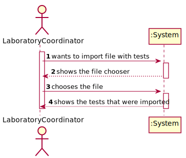
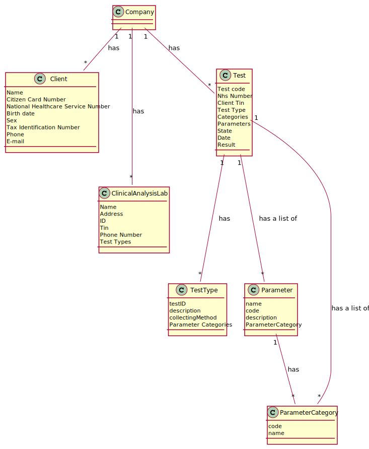
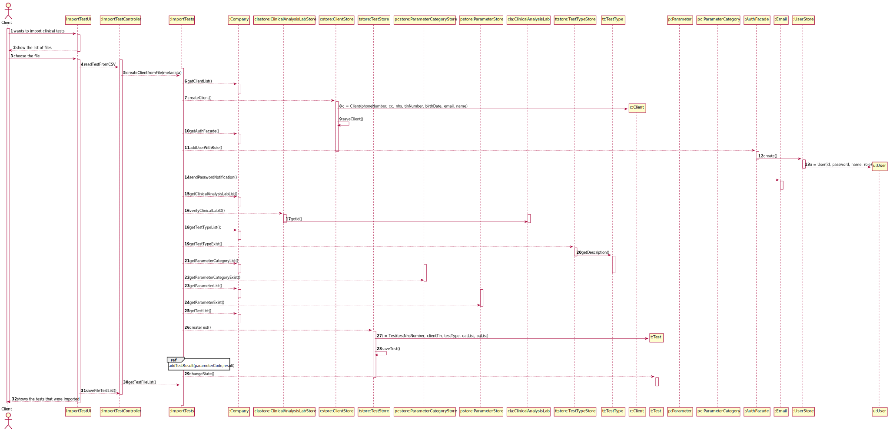
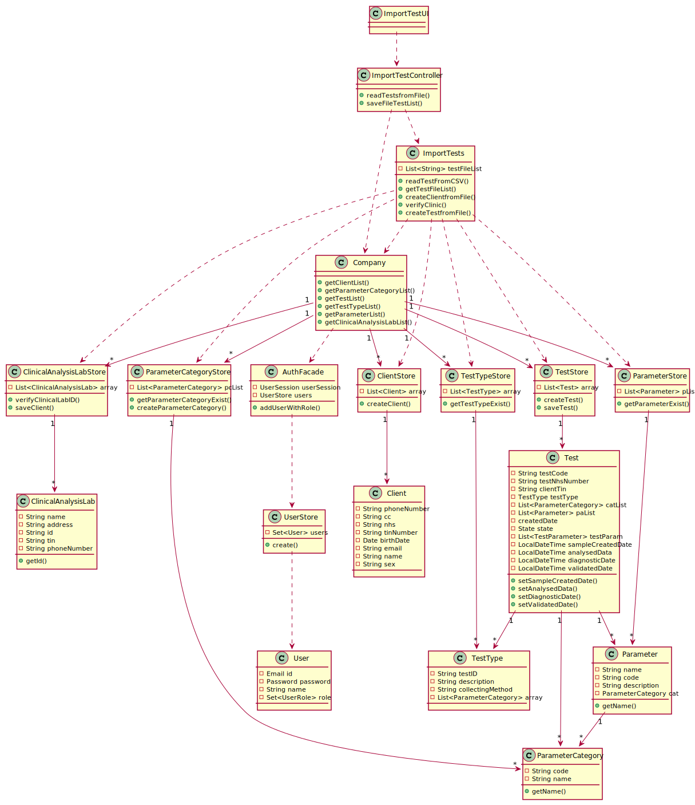

# US 17 - Import tests from a CSV file

## 1. Requirements Engineering


### 1.1. User Story Description

*As a laboratory coordinator, I want to import clinical tests from a CSV file.*

### 1.2. Customer Specifications and Clarifications 

**From the specifications document:**


**From the client clarifications:**

> **Question:** In what folder should the CSV file be when we want to use the application through the console?

> **Answer:** In this sprint each team should develop a graphical user interface. The file to import can be located in any folder. The user should specify the path of the file.
  https://moodle.isep.ipp.pt/mod/forum/discuss.php?d=8857

-

> **Question:** In the CSV files provided for this sprint we can find a parameter with code HDL00 which belongs to the Cholesterol category and to the blood test type, but by searching the external modules for the blood test type the team could not find a match for the said parameter. What can we as a team do to resolve such issue?

> **Answer:** If the API does not have reference values for this parameter, than you should not present the reference values to the application user.
  https://moodle.isep.ipp.pt/mod/forum/discuss.php?d=8877

-

> **Question:** Will the CSV files always have the same format as the ones available on moodle?

> **Answer:** Yes. But we can have more categories and parameters for each type of test.
  https://moodle.isep.ipp.pt/mod/forum/discuss.php?d=8883

-

> **Question:** if a labID on the CSV file isn't found on the system, should we consider it "invalid data"?

> **Answer:** Yes. To import tests of any laboratory (with a given Lab_ID), it is required that a laboratory having the given Lab_ID exists in the system.
Therefore, if you want to import data from a given laboratory, you should use the application to create that laboratory in the system. Then you should import the data.
When creating a laboratory in the system, you should use the given Lab_ID (available in the CSV file) and define the other attributes using valid data. In this project, we are NOT going to import data from laboratories (or other entities) to reduce the amount of hours required to develop and deliver a working application to the client.
What I say in this message is valid for the laboratories and for other entities that appear in the CSV files.
  https://moodle.isep.ipp.pt/mod/forum/discuss.php?d=8935

-

> **Question:** In the CSV, there is a parameter category that has 11 characters (Cholesterol). How do you suggest we should proceed?

> **Answer:** Please modify your application to accept category names with a maximum of 15 characters.

-

> **Question:** Also, how should we fill the remaining data that's not mentioned in the CSV? Should it go as null or should we insert some random value?

> **Answer:** Please specify what information are you referring to.
  https://moodle.isep.ipp.pt/mod/forum/discuss.php?d=8925

-

> **Question:** But during the last Sprint you mentioned a registration date also. Considering we could have more clients than the number that a Many Labs specific laboratory could deal in a day, then the registration date could be different than the sample collection date. My question is thus: Should the tests have a registration date plus sample collection date?

> **Answer:** You should use the Test_Reg_DateHour as the sample collection date.
  https://moodle.isep.ipp.pt/mod/forum/discuss.php?d=8884 


### 1.3. Acceptance Criteria

* **AC1:** If the file contains invalid data (e.g., a parameter not defined in the system), that data should not be load into the system. An exception should be thrown.

* **AC2:** If the client data is correct, then the system must create the client.

### 1.4. Found out Dependencies

- The US17 has dependency with the US08 since it needs the clinical analysis lab data in the system.


### 1.5 Input and Output Data

**Input Data:**

* Typed data:


* Selected data:
   * CSV File

**Output Data:**

* List of Tests

### 1.6. System Sequence Diagram (SSD)

*Insert here a SSD depicting the envisioned Actor-System interactions and throughout which data is inputted and outputted to fulfill the requirement. All interactions must be numbered.*




### 1.7 Other Relevant Remarks

*Use this section to capture other relevant information that is related with this US such as (i) special requirements ; (ii) data and/or technology variations; (iii) how often this US is held.* 


## 2. OO Analysis

### 2.1. Relevant Domain Model Excerpt 
*In this section, it is suggested to present an excerpt of the domain model that is seen as relevant to fulfill this requirement.* 



### 2.2. Other Remarks

*Use this section to capture some additional notes/remarks that must be taken into consideration into the design activity. In some case, it might be useful to add other analysis artifacts (e.g. activity or state diagrams).* 


## 3. Design - User Story Realization 

### 3.1. Rationale

**The rationale grounds on the SSD interactions and the identified input/output data.**

| Interaction ID                                     | Question: Which class is responsible for...             | Answer                   | Justification (with patterns)                                                    |
| :-------------                                     | :---------------------                                  | :------------            | :----------------------------                                                    |
| **Step/Msg 1:** wants to import file with tests    | ... interacting with the actor?                         | ImportTestUI             | IE: the interface interacts with the actor.                                      |
|                                                    | ... coordinating the US?                                | ImportTestController     | Controller                                                                       |
| **Step/Msg 2:** shows the file chooser             |                                                         |                          |                                                                                  |
| **Step/Msg 3:** chooses the file                   | ... knowing for the client verification and creation?   | ClientStore              | IE: it knows and saves all the information related to the client.                |
|                                                    | ... knowing for the clinical analysis lab verification? | ClinicalAnalysisLabStore | IE: it knows and saves all the information related to the Clinical Analysis Lab. |
|                                                    | ... knowing for the test creation?                      | TestStore                | IE: it knows and saves all the information related to the test.                  |
|                                                    | ... knowing for the test type existence?                | TestTypeStore            | IE: it knows and saves all the information related to the  test type.            |
|                                                    | ... changing the test State?                            | Test                     | IE: it knows its own  information.                                               |
|                                                    | ... sending the password to the client?                 | Email                    | IE: Is responsible for the client's data access to the system.                   |
|                                                    | ... knowing for the parameter existence?                | ParameterStore           | IE: it knows and saves all the information related to the  parameter.            |
|                                                    | ... knowing for the parameter category existence?       | ParameterCategoryStore   | IE: it knows and saves all the information related to the  parameter category.   |
|                                                    | ... accessing the file?                                 | ImportTests              | IE: Is responsible for the file manipulation and importation                     |
| **Step/Msg 4:** shows the tests that were imported |                                                         |                          |                                                                                  |
|                                                    | ... showing the list with tests                         | ImportTestUI             | IE: the interface interacts with the actor.                                      |


### Systematization ##

According to the taken rationale, the conceptual classes promoted to software classes are: 

* Company
* ClinicalAnalysisLab
* TestType
* Client
* Test
* Parameter
* ParameterCategory
* Email


Other software classes (i.e. Pure Fabrication) identified: 

* ImportTestUI
* ImportTestController
* ImportTests
* ClinicalAnalysisLabStore
* ClientStore
* TestStore
* ParameterCategoryStore
* ParameterStore
* TestTypeStore
* AuthFacade
* UserStore
* User

## 3.2. Sequence Diagram (SD)


  

* SD_AddTestResult(parameterCode, result, metric)
.svg)


## 3.3. Class Diagram (CD)

*In this section, it is suggested to present an UML static view representing the main domain related software classes that are involved in fulfilling the requirement as well as and their relations, attributes and methods.*



# 4. Tests


**Test 1:** If the file contains invalid data (e.g., a parameter not defined in the system), that data should not be load into the system. An exception should be thrown.
````
        @Test
    public void CreateValidCategoryTest() {
        //Arrange + Act
        String fileName = "csv/tests_BloodMDISCCSV.csv";

        ImportTests aa = new ImportTests();
        aa.readTestFromCSV(fileName);
        Assert.assertNotNull(aa.getTestFileList());

    }
````


# 5. Construction (Implementation)

### Class ImportTestUI
````
    package app.ui.gui.ImportTest;

import app.controller.ImportTestsController;
import app.domain.shared.Constants;
import app.controller.SceneController;
import javafx.event.ActionEvent;
import javafx.fxml.FXML;
import javafx.fxml.Initializable;
import javafx.scene.control.*;
import javafx.stage.FileChooser;

import java.io.File;
import java.net.URL;
import java.util.ResourceBundle;

public class ImportTestUI implements Initializable {

    private final ImportTestsController imp = new ImportTestsController();
    private final SceneController sceneController = SceneController.getInstance();

    @FXML
    private ListView<String> ListView;

    @Override
    public void initialize(URL url, ResourceBundle resourceBundle) {
        ListView.setVisible(false);

    }

    public void confirm() {
        FileChooser chooser = new FileChooser();
        chooser.getExtensionFilters().add(new FileChooser.ExtensionFilter("CSV files", "*.csv"));
        File f = chooser.showOpenDialog(null);


        imp.readTestsfromFile(f.getAbsolutePath());
        ListView.setVisible(true);
        ListView.getItems().addAll(imp.saveFileTestList());
    }

    public void returnToMenu(ActionEvent event) {
        sceneController.switchMenu(event, Constants.LABORATORY_COORDINATOR_UI);
    }
}


````
### Class ImportTestController
````
    package app.controller;

import app.domain.model.Company;
import app.domain.model.ImportTests;


import java.util.List;

/**
 * Controller of the UserStory : Imports a new Test
 */
public class ImportTestsController {

    private Company company;
    private ImportTests importt = new ImportTests();


    /**
     * Constructor of the class
     * @param company instance of Company
     */
    public ImportTestsController(Company company) {
        this.company = company;
    }

    /**
     * This method aims to instance the Company
     */
    public ImportTestsController() {
        this(App.getInstance().getCompany());
    }

    /**
     * This method reads the tests from the CSV File
     * @param filepath path of the CSV file
     */
    public void readTestsfromFile(String filepath) {
        importt.readTestFromCSV(filepath);
    }

    /**
     * This method  saves the test list from the file
     * @return
     */
    public List<String> saveFileTestList() {
        return importt.getTestFileList();

    }


}

````
### Class ImportTests
````
    package app.domain.model;

import app.controller.App;
import app.domain.shared.Constants;
import app.domain.shared.exceptions.FileInvalidClientException;
import app.domain.stores.*;

import java.io.BufferedReader;
import java.io.IOException;
import java.nio.charset.StandardCharsets;
import java.nio.file.Files;
import java.nio.file.Path;
import java.nio.file.Paths;
import java.text.ParseException;
import java.text.SimpleDateFormat;
import java.time.LocalDateTime;
import java.time.format.DateTimeFormatter;
import java.util.ArrayList;
import java.util.Arrays;
import java.util.Date;
import java.util.List;

/**
 * Class that represents the Tests that are going to be Imported from the CSV file
 */
public class ImportTests {

    int errorcount = 0;
    TestTypeStore ttstore;
    ClientStore cstore;
    ClinicalAnalysisLabStore store;
    ParameterCategoryStore pcstore;
    ParameterStore pstore;
    TestStore tstore;
    List<String> testFileList = new ArrayList<>();

    /**
     * Constructor of ImportTests, it calls methods in order to validate the parameters
     */
    public ImportTests() {
        App app = App.getInstance();
        Company company = app.getCompany();
        cstore = company.getClientList();
        pcstore = company.getParameterCategoryList();
        tstore = company.getTestList();
        ttstore = company.getTestTypeList();
        pstore = company.getParameterList();
        store = company.getClinicalAnalysisLabList();

    }

    /**
     * This method reads a test from the CSV file
     * @param filepath path of the CSV file
     */
    public void readTestFromCSV(String filepath) {


        Path path = Paths.get(filepath);
        String firstLine1 = "Test_Code;NHS_Code;Lab_ID;CitizenCard_Number;NHS_Number;TIN;BirthDay;PhoneNumber;Name;E-mail ;Address;TestType;Category;HB000;WBC00;PLT00;RBC00;Category;HDL00;Category;IgGAN;Test_Reg_DateHour;Test_Chemical_DateHour;Test_Doctor_DateHour;Test_Validation_DateHour";
        String firstLine2 = "Test_Code;NHS_Code;Lab_ID;CitizenCard_Number;NHS_Number;TIN;BirthDay;PhoneNumber;Name;Email ;Address;TestType;Category;HB000;WBC00;PLT00;RBC00;Category;HDL00;Category;IgGAN;Test_Reg_DateHour;Test_Chemical_DateHour;Test_Doctor_DateHour;Test_Validation_DateHour";
        String firstLine3 = "Test_Code;NHS_Code;Lab_ID;CitizenCard_Number;NHS_Number;TIN;BirthDay;PhoneNumber;Name;E/mail ;Address;TestType;Category;HB000;WBC00;PLT00;RBC00;Category;HDL00;Category;IgGAN;Test_Reg_DateHour;Test_Chemical_DateHour;Test_Doctor_DateHour;Test_Validation_DateHour";

        try (BufferedReader br = Files.newBufferedReader(path, StandardCharsets.US_ASCII)) {


            String line = br.readLine();


            if (line.equals(firstLine1) || line.equals(firstLine2) || line.equals(firstLine3)) {


                while (line != null) {

                    boolean a = true;
                    String[] metadata = line.split(";");


                    line = br.readLine();


                    try {
                        createClientfromFile(metadata);
                    } catch (Exception e) {
                        a = false;
                        errorcount++;
                        continue;
                    }
                    try {
                        verifyClinicalAnalysisLab(metadata);
                    } catch (Exception e) {
                        a = false;
                        errorcount++;
                        continue;
                    }
                    try {
                        createTestfromFile(metadata);

                    } catch (Exception e) {
                        a = false;
                        errorcount++;
                        continue;
                    }

                    if (a) {
                        testFileList.add(Arrays.toString(metadata));
                        /*System.out.println(Arrays.toString(metadata));*/
                    }

                }
            }
        } catch (IOException e) {
            e.printStackTrace();
        }
    }
    /**
     * This method gets a list of the tests that the CSV file contains, counts and shows the errors found on it
     * @return a list that has the tests plus the number of errors of it
     */
    public List<String> getTestFileList() {
        String error = (errorcount - 1) + " errors found.";
        testFileList.add(error);
        return testFileList;
    }
    /**
     * This method creates the client with the information presented on the CSV file
     * @param metadata array string that represents the saved lines from the CSV file
     * @return a boolean value representing the success of the operation
     * @throws ParseException signals that an error has been reached unexpectedly while parsing
     */
    public boolean createClientfromFile(String[] metadata) throws ParseException {


        Date date = new SimpleDateFormat("dd/MM/yyyy").parse(metadata[6]);

        cstore.createClient(metadata[7], metadata[3], metadata[4], metadata[5], date, ' ', metadata[9], metadata[8]);
        cstore.saveClient();
        String pwd = PasswordGenerator.getPassword();
        System.out.println(metadata[9] + " " + pwd);
        boolean success = true;
        try {
            App.getInstance().getCompany().getAuthFacade().addUserWithRole(metadata[8], metadata[9], pwd, Constants.ROLE_CLIENT);
        } catch (Exception e) {
            success = false;
        }
        if (success) {
            Email.sendPasswordNotification(metadata[8], metadata[9], pwd);

        }

        return success;
    }
    /**
     * This method verifies if the Clinical Lab ID already exists
     * @param metadata array string that represents the saved lines from the CSV file
     * @return a boolean value that if it's true then it means the clinical laboratory already exists
     */
    public boolean verifyClinicalAnalysisLab(String[] metadata) {

        return store.verifyClinicalLabID(metadata[2]);
    }
    /**
     * This method creates a test from the CSV file
     * @param metadata array string that represents the saved lines from the CSV file
     * @return the test with all the necessary data and changes its state to validated
     * @throws ParseException signals that an error has been reached unexpectedly while parsing
     */
    public boolean createTestfromFile(String[] metadata) {
        TestType testtype = ttstore.getTestTypeExist(metadata[11]);


        List<ParameterCategory> pcList = new ArrayList<>();

        if (!metadata[12].equalsIgnoreCase("NA")) {

            ParameterCategory pc1 = pcstore.getParameterCategoryExist(metadata[12]);
            if (pc1 == null) {
                pc1 = pcstore.createParameterCategory("12345", metadata[12]);
            }
            pcList.add(pc1);
        }
        if (!metadata[17].equalsIgnoreCase("NA")) {
            ParameterCategory pc2 = pcstore.getParameterCategoryExist(metadata[17]);
            if (pc2 == null) {
                pc2 = pcstore.createParameterCategory("12346", metadata[12]);
            }
            pcList.add(pc2);
        }
        if (!metadata[19].equalsIgnoreCase("NA")) {
            ParameterCategory pc3 = pcstore.getParameterCategoryExist(metadata[19]);
            if (pc3 == null) {
                pc3 = pcstore.createParameterCategory("12347", metadata[12]);
            }
            pcList.add(pc3);
        }

        List<Parameter> pList = new ArrayList<>();

        if (!(metadata[13].equalsIgnoreCase("NA"))) {
            Parameter p1 = pstore.getParameterExist("HB");
            pList.add(p1);
        }
        if (!(metadata[14].equalsIgnoreCase("NA"))) {
            Parameter p2 = pstore.getParameterExist("WBC");
            pList.add(p2);
        }
        if (!(metadata[15].equalsIgnoreCase("NA"))) {
            Parameter p3 = pstore.getParameterExist("PLT");
            pList.add(p3);
        }
        if (!(metadata[16].equalsIgnoreCase("NA"))) {
            Parameter p4 = pstore.getParameterExist("RBC");
            pList.add(p4);
        }
        if (!(metadata[20].equalsIgnoreCase("NA"))) {
            Parameter p5 = pstore.getParameterExist("COVID");
            pList.add(p5);
        }


        Test t = tstore.createTest(metadata[4], metadata[5], testtype, pcList, pList);
        tstore.saveTest();
        t.createReport("Undefined");

        DateTimeFormatter formatter = DateTimeFormatter.ofPattern("dd/MM/yyyy HH:mm");

        t.changeState(Test.State.SAMPLE_COLLECTED);


        if (!(metadata[13].equalsIgnoreCase("NA"))) {
            t.addTestResult("HB000", Double.parseDouble(metadata[13].replace(",", ".")));

        }
        if (!(metadata[14].equalsIgnoreCase("NA"))) {
            t.addTestResult("WBC00", Double.parseDouble(metadata[14].replace(",", ".")));

        }
        if (!(metadata[15].equalsIgnoreCase("NA"))) {
            t.addTestResult("PLT00", Double.parseDouble(metadata[15].replace(",", ".")));

        }
        if (!(metadata[16].equalsIgnoreCase("NA"))) {
            t.addTestResult("RBC00", Double.parseDouble(metadata[16].replace(",", ".")));

        }
        if (!(metadata[20].equalsIgnoreCase("NA"))) {
            t.addTestResult("IgGAN", Double.parseDouble(metadata[20].replace(",", ".")));

        }

        String date1 = metadata[21];
        String date2 = metadata[22];
        String date3 = metadata[23];
        String date4 = metadata[24];


        String[] DateSplitted1 = date1.split(" ");
        String[] DateSplitted2 = date2.split(" ");
        String[] DateSplitted3 = date3.split(" ");
        String[] DateSplitted4 = date4.split(" ");

        if (DateSplitted1[1].length() == 4) {
            date1 = DateSplitted1[0] + " 0" + DateSplitted1[1];
        }
        if (DateSplitted2[1].length() == 4) {
            date2 = DateSplitted2[0] + " 0" + DateSplitted2[1];
        }
        if (DateSplitted3[1].length() == 4) {
            date3 = DateSplitted3[0] + " 0" + DateSplitted3[1];
        }
        if (DateSplitted4[1].length() == 4) {
            date4 = DateSplitted4[0] + " 0" + DateSplitted4[1];
        }


        LocalDateTime date11 = LocalDateTime.parse(date1, formatter);
        t.setCreatedDate(date11);
        LocalDateTime date22 = LocalDateTime.parse(date2, formatter);
        t.setAnalysedData(date22);
        LocalDateTime date33 = LocalDateTime.parse(date3, formatter);
        t.setDiagnosticDate(date33);
        LocalDateTime date44 = LocalDateTime.parse(date4, formatter);
        t.setValidatedDate(date44);


        t.changeState(Test.State.VALIDATED);

        return true;
    }
}
````
# 6. Integration and Demo

- A new option was added in the laboratory coordinator Menu

# 7. Observations