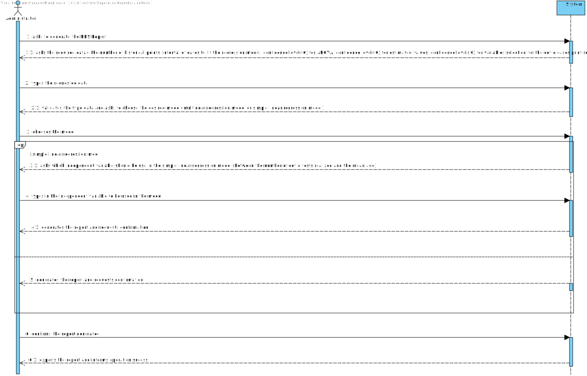
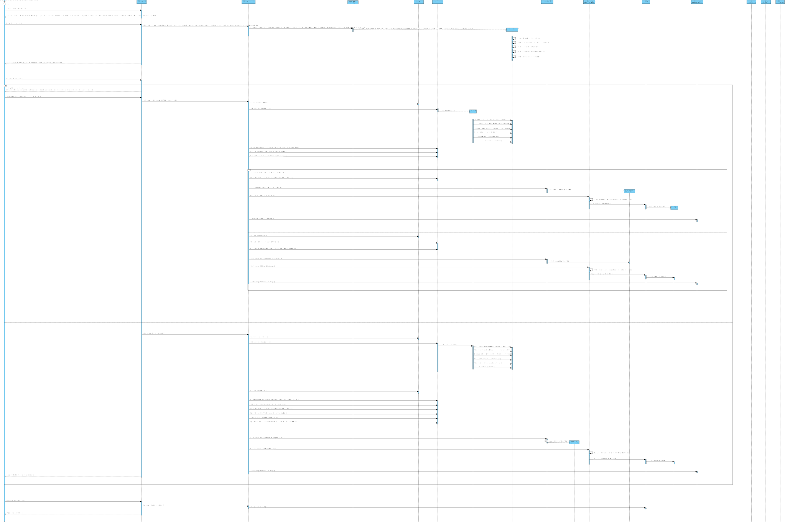
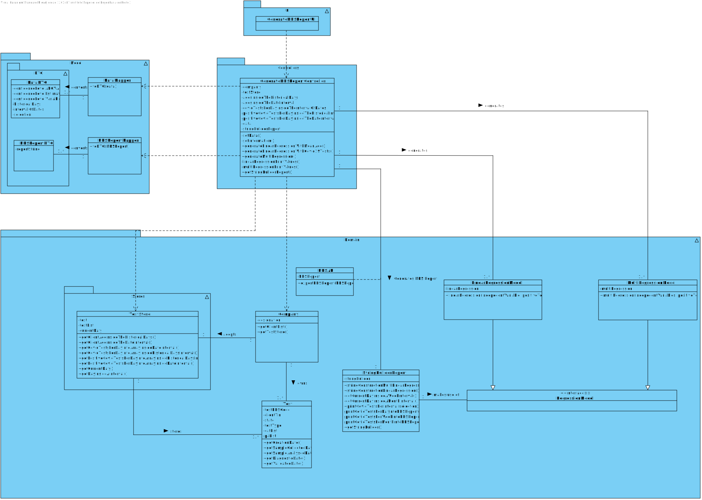

# US 18 - As_An_Administrator_I_Want_To_Send_The_Covid-19_Report_To_The_NHS_At_Any_Time

## 1. Requirements Engineering

### 1.1. User Story Description

*As an Administrator I want to send the Covid-19 report to the NHS at any time. I want to define the interval of dates
to fit the regression model, the number of historical points (number of days or number of weeks) that must be sent to
the NHS, the regression model to use and select the independent variables to use.*

### 1.2. Customer Specifications and Clarifications

**From the specifications document:**

> “Considering that **Many Labs** has the exclusivity to perform **Covid 19 tests**, and that the contract with the **NHS** in England requires Many Labs to **summarize and report Covid 19 data**, the company needs to: **identify the number of Covid 19 tests performed, identify all positive results to Covid 19 tests, report the total number of Covid 19 cases per day, per week and per month of the year, and send the forecasts for these same time horizons the number of Covid 19 cases for the following day, next week and next month**.”

> "...should send them to the **NHS using their API**."

> “To make the **predictions** , the NHS contract defines that **a linear regression algorithm should be used** . The NHS required that both **simple linear and multiple linear regression algorithms should be evaluated to select the best model** . The accuracy of the **prediction models** should be **analysed and documented in the application user manual** (in the that must be delivered with the application The algorithm to be used by the application must be defined through a configuration file.”

**From the client clarifications:**

> **Question:** Which significance level should we use for the hypothesis tests?
>
> **Answer:** The application should allow the user to choose the significance level.

> **Question:** Regarding US18 and US19, it is only one report containing all the tests performed by Many Labs to be sent each time, correct? Or is it one report per laboratory, for example? Or other option?
>
> **Answer:** The report should contain all the tests made by Many Labs.

> **Question:** Should the report contain the data of all the tests with results (with or without report, with or without validation) or contain only the validated tests? (Or other option?)
>
> **Answer:** The NHS Covid report should include statistics computed only from validated tests.

> **Question:** From the project description it is known "send the forecasts for these same time horizons (the number of Covid-19 cases for the following day, next week and next month)." In the example report we have in moodle, there is a line that says "// Prediction values". Does this mean that after this line we should put our predictions or it refers to the following table?
>
> **Answer:** Yes, the prediction values are the ones available in the table that we include in the example.

> **Question:** From Sprint D requirements we get "I want to define... the number of historical points (number of days or number of weeks) that must be sent to the NHS". Is the Administrator who must choose between days or weeks? If so, how should he make this choice?
>
> **Answer:** Yes. The Administrator should select between days and weeks using the user interface.

> **Question:** From Sprint D requirements we get "I want to define ... the regression model to use and select the independent variables to use"
**Q1:** If the admin selects the multilinear regression he/she can select more than one independent variable. Should he select from a checklist the ones that he/she want? If so, what are the supposed independent variables we need to include in the checklist? From Sprint D requirements we also get "Administrator should be able to choose the independent variable to use with the simple linear regression model (either the number of tests realized or the mean age)."
**Q2**: When you say "mean age" are you referring to the average age of clients?
>
> **Answer:**
**Q1** - to apply mlr you need two independent variables- daily number tests and mean age person tested daily. Also you need the same records per week.
**Q2**-It is already in **Q1**

> **Question:** Regarding the hypothesis tests: "The application should allow the user to choose the significance level."
**Q**: Is the same logic applied to the confidence intervals to be on the table?
>
> **Answer:** Yes the user could choose the significance level for hip t and confidence level for IC.

### 1.3. Acceptance Criteria

* **AC1:** The system should allow the Administrator to select between a simple linear and multilinear regression model
  to fit the data. Moreover, the Administrator should be able to choose the independent variable to use with the simple
  linear regression model (either the number of tests realized or the mean age). The system should send the report using
  the NHS API (available in moodle).
* **AC2:** The user could choose the significance level for hip t and confidence level for IC.
* **AC3:** To apply mlr you need two independent variables - daily number tests and mean age person tested daily. Also,
  you need the same records per week.
* **AC4:** The Administrator should select between days and weeks using the user interface.
* **AC5:** The NHS Covid-19 report should include statistics computed only from validated tests.
* **AC6:** The report should contain all the tests made by Many Labs.
* **AC7:** The application should allow the user to choose the significance level(Confidence Level for ANOVA, confidence
  level for estimated values and confidence level for variables).
* **AC8:** The report should include the prediction values , like the report available Moodle.

### 1.4. Found out Dependencies

**From Sprint B:**

There is a dependency to:

* **"US07 Register a new employee"** since at least a Administrator must be registered in the system.

* **"US03 Register a new client"** since there should be "x" registered clients to apply the slr or mlr (1 of the 2
  independent variables - mean age).

**From Sprint C:**

There is a dependency to:

* **"US04 Register a test"** since at least "x" tests should be registered in the system in order to create the report.
* **"US15 Validate a test"** since to perform the slr or mlr (simple linear regression or multi linear regression) there
  should be validated tests (1 of the 2 independent variables - covid tests).

**From Sprint D :**

There is a dependency to :

* **"US17 Import a CSV file"** since the system should have the tests from various days available to apply the desired
  models (to have more precise values).

### 1.5 Input and Output Data

**Input Data:**

* Typed data:
    * Confidence level of Anova;
    * Confidence level of variables;
    * Confidence level of estimated values;
    * Number of historical points;
    * Selection between day,week and month to generate the cases of Covid-19.
    * The dates intervals to fit the model.

* Selected data:
    * The regression model (between multi linear regression or simple linear regression);
    * IF (Simple linear regression) : The independent variable (between the number of Covid-19tests realized and the
      mean age).

**Output Data:**

* NHS Report with all data;
* (In)Success of the operation.

### 1.6. System Sequence Diagram (SSD)

### 1.7 Other Relevant Remarks

*Various opt frames were use in order to maintain a balance between the program (the flow of the system)*

## 2. OO Analysis

### 2.1. Relevant Domain Model Excerpt

### 2.2. Other Remarks

*n/a*

## 3. Design - User Story Realization

### 3.1. Rationale

**The rationale grounds on the SSD interactions and the identified input/output data.**

| Interaction ID | Question: Which class is responsible for... | Answer  | Justification (with patterns)  |
|:-------------  |:--------------------- |:------------|:---------------------------- |
| **Step/MSG 1**: asks to generate the NHS Report |	... interacting with the actor? | GenerateNHSReportUI | **PureFabrication**: There is no reason to assign this responsibility to any existing class in the Domain model |
| 		                                  | ... coordinating the US? | GenerateNHSReportController | **Controller** |
| 		                                  | ... knowing TestStore? | Company | **IE**: Company knows the TestStore to which it is delegating some tasks. |
| 		                                  | ... checking all tests available in the system?	| TestStore | **IE**: The testStore knows all tests available in the system. |
| 	                                      | ... verifying if the test is valid (or with a diagnostic, sample collected, sample analysed or only test created)? | Test | **IE**: The test knows its own state. |
| 		                                  | ... knowing all clients available in the system? | Company | **IE**: Company knows all information available in the system. |
| **Step/MSG 2**: asks the required data | n/a | | |
| **Step/MSG 3**: types the requested data|	... creates the DataDTO? | DataMapper |**DTO**: In order to detach the domain layer from the UI layer, we use a data transfer object (DTO) to only extract data from the domain class (and not extract methods from the domain class) |
| 		                                  | ... validating the data locally (e.g.: mandatory vs non-mandatory data)? | DataDTO | **IE**: An object knows its data |
| **Step/MSG 4**: asks the desired regression model | n/a | | |
| **Step/MSG 5**: chooses the model | | | |
| **Step/MSG 6**: (IF the model chosen it's Simple linear Regression) asks which independent variable should be use in the simple linear regression model  | n/a |  | |
| **Step/MSG 7**: (IF the model chosen it's Simple linear Regression) types in the variable  | n/a |  | |
| 		                                  | ... generates the regression model? | RegressionModel |**IE**: The Regression Model has all the information necessary to know which model should be created |
| 		                                  | ... generates the NHS Report? | StringBuilderReport | **PureFabrication**: The StringBuilderReport class was assign this responsibility in order to generate the report itself (the information) |
| 		                                  | ... getting the NHS Report to expose to the user?? | NhsReportMapper | **DTO**: In order to detach the domain layer from the UI layer, we use a data transfer object (DTO) to only extract data from the domain class (and not extract methods from the domain class) |
| **Step/MSG 8**: shows the report and requests confirmation | n/a | | |   
| **Step/MSG 9**: confirms the report generated | ... exports the NHSReport? | NHSApi | **IE**: Responsible for exporting the report to the NHS|              
| **Step/MSG 10**: informs operation success | ... informing operation success? | GenerateNHSReportUI | **IE**: Responsible for user interaction |

### Systematization ##

According to the taken rationale, the conceptual classes promoted to software classes are:

* Company
* StringBuilderReport
* Data
* RegressionModel
* SimpleLinearRegression
* MultiLinearRegression
* NhsReport

Other software classes (i.e. Pure Fabrication) identified:

* GenerateNHSReportUI
* GenerateNHSReportController
* NhsReportDTO
* NhsReportMapper
* DataDTO
* DataMapper 

## 3.2. Sequence Diagram (SD)

## 3.3. Class Diagram (CD)

*Packages were use in order to simplify the flow of the system*

# 4. Tests

### TestStore Tests

**Test 1:** Get the validated test list

     public void getValidatedTestList() {
        ParameterCategoryStore cat = new ParameterCategoryStore();
        ParameterCategory pc1 = new ParameterCategory("AH000", "Hemogram");
        cat.add(pc1);
        List<ParameterCategory> cat1 = new ArrayList<>();
        cat1.add(pc1);
        List<Parameter> pa = new ArrayList<>();
        Parameter p1 = new Parameter("AH000", "Nome", "description", pc1);
        pa.add(p1);
        TestType testType = new TestType("BL000", "description", "sei lá", cat);
        TestStore store = new TestStore();
        app.domain.model.Test t = store.createTest("123456789187", "1234567890123456", testType, cat1, pa);

        ZoneId defaultZoneId = ZoneId.systemDefault();
        LocalDate date1Client = LocalDate.now();
        Date date1 = Date.from(date1Client.atStartOfDay(defaultZoneId).toInstant());

        Client client = new Client("12345678910", "1234567890123456", "1234567891", "1234567891", date1, "email@gamil.com", "Zé");

        List<Client> clientList = new ArrayList<>();
        clientList.add(client);

        Calendar calendar = Calendar.getInstance();
        calendar.add(Calendar.DATE, -10);
        Date toDate = calendar.getTime();

        Client client2 = new Client("12345678911", "1234567890123457", "1234567892", "1234567891", toDate, "email@gamil.com", "Zé");
        clientList.add(client2);

        app.domain.model.Test teste = new app.domain.model.Test("1234s", "123456789012", "1234567890123456", testType, cat1, pa);
        store.saveTest();

        LocalDate beginDate = toDate.toInstant().atZone(ZoneId.systemDefault()).toLocalDate();

        ParameterCategoryStore parameterCategoryStore = App.getInstance().getCompany().getParameterCategoryList();
        ParameterCategory pc10 = parameterCategoryStore.createParameterCategory("12345", "Hemogram");
        parameterCategoryStore.saveParameterCategory();
        ParameterCategory pc2 = parameterCategoryStore.createParameterCategory("12346", "Cholesterol");
        parameterCategoryStore.saveParameterCategory();
        ParameterCategory pc3 = parameterCategoryStore.createParameterCategory("12347", "Covid");
        parameterCategoryStore.saveParameterCategory();

        TestType covidTest = new TestType("COV19", "Covid", "Swab", parameterCategoryStore);

        List<ParameterCategory> testCategories = new ArrayList<>();
        testCategories.add(pc1);

        ParameterStore parameterStore = new ParameterStore();

        Parameter p4 = new Parameter(Constants.IG_GAN, "COVID", "000", pc3);
        parameterStore.add(p4);

        List<Parameter> testParameters1 = new ArrayList<>();
        testParameters1.add(p4);

        app.domain.model.Test t10 = new app.domain.model.Test("1234557890123456", "100000000100", "1234567890", covidTest, testCategories, testParameters1);
        t10.setCreatedDate(LocalDateTime.of(2021, Month.JUNE, 10, 11, 30));
        t10.addTestParameter();
        t10.changeState(Constants.SAMPLE_COLLECTED);
        t10.addTestResult(Constants.IG_GAN, 1.5);
        t10.changeState("VALIDATED");
        store.addTest(t10);

        Assert.assertNotNull(store.getValidatedTestList(client2));
    }

**Test 2:** Get the Interval of dates 

     public void getIntervalDates() {
        ParameterCategoryStore cat = new ParameterCategoryStore();
        ParameterCategory pc1 = new ParameterCategory("AH000", "Hemogram");
        cat.add(pc1);
        List<ParameterCategory> cat1 = new ArrayList<>();
        cat1.add(pc1);
        List<Parameter> pa = new ArrayList<>();
        Parameter p1 = new Parameter("AH000", "Nome", "description", pc1);
        pa.add(p1);
        TestType testType = new TestType("BL000", "description", "sei lá", cat);
        TestStore store = new TestStore();
        app.domain.model.Test t = store.createTest("123456789187", "1234567890123456", testType, cat1, pa);

        ZoneId defaultZoneId = ZoneId.systemDefault();
        LocalDate date1Client = LocalDate.now();
        Date date1 = Date.from(date1Client.atStartOfDay(defaultZoneId).toInstant());

        store.getIntervalDate(LocalDate.now(), LocalDate.now());

    }

**Test 3:** Get the Number of tests

     @Test
        public void getNumberOfTests() {
        ParameterCategoryStore cat = new ParameterCategoryStore();
        ParameterCategory pc1 = new ParameterCategory("AH000", "Hemogram");
        cat.add(pc1);
        List<ParameterCategory> cat1 = new ArrayList<>();
        cat1.add(pc1);
        List<Parameter> pa = new ArrayList<>();
        Parameter p1 = new Parameter("AH000", "Nome", "description", pc1);
        pa.add(p1);
        TestType testType = new TestType("BL000", "description", "sei lá", cat);
        TestStore store = new TestStore();
        app.domain.model.Test t = store.createTest("123456789187", "1234567890123456", testType, cat1, pa);

        ZoneId defaultZoneId = ZoneId.systemDefault();
        LocalDate date1Client = LocalDate.now();
        Date date1 = Date.from(date1Client.atStartOfDay(defaultZoneId).toInstant());

        Client client = new Client("12345678910", "1234567890123456", "1234567891", "1234567891", date1, "email@gamil.com", "Zé");

        List<Client> clientList = new ArrayList<>();
        clientList.add(client);

        Calendar calendar = Calendar.getInstance();
        calendar.add(Calendar.DATE, -10);
        Date toDate = calendar.getTime();

        Client client2 = new Client("12345678911", "1234567890123457", "1234567892", "1234567891", toDate, "email@gamil.com", "Zé");
        clientList.add(client2);

        app.domain.model.Test teste = new app.domain.model.Test("1234s", "123456789012", "1234567890123456", testType, cat1, pa);
        store.saveTest();

        LocalDate beginDate = toDate.toInstant().atZone(ZoneId.systemDefault()).toLocalDate();

        ParameterCategoryStore parameterCategoryStore = App.getInstance().getCompany().getParameterCategoryList();
        ParameterCategory pc10 = parameterCategoryStore.createParameterCategory("12345", "Hemogram");
        parameterCategoryStore.saveParameterCategory();
        ParameterCategory pc2 = parameterCategoryStore.createParameterCategory("12346", "Cholesterol");
        parameterCategoryStore.saveParameterCategory();
        ParameterCategory pc3 = parameterCategoryStore.createParameterCategory("12347", "Covid");
        parameterCategoryStore.saveParameterCategory();

        TestType covidTest = new TestType("COV19", "Covid", "Swab", parameterCategoryStore);

        List<ParameterCategory> testCategories = new ArrayList<>();
        testCategories.add(pc1);

        ParameterStore parameterStore = new ParameterStore();

        Parameter p4 = new Parameter(Constants.IG_GAN, "COVID", "000", pc3);
        parameterStore.add(p4);

        List<Parameter> testParameters1 = new ArrayList<>();
        testParameters1.add(p4);

        app.domain.model.Test t10 = new app.domain.model.Test("1234557890123456", "100000000100", "1234567890", covidTest, testCategories, testParameters1);
        t10.setCreatedDate(LocalDateTime.of(2021, Month.JUNE, 10, 11, 30));
        t10.addTestParameter();
        t10.changeState(Constants.SAMPLE_COLLECTED);
        t10.addTestResult(Constants.IG_GAN, 1.5);
        t10.changeState("VALIDATED");
        store.addTest(t10);

        Assert.assertEquals(store.numberOfTests(),2);
    }

**Test 4:** Get the list of tests inside a date interval.

    public void getListTestsInsideDateInterval() {
        ParameterCategoryStore cat = new ParameterCategoryStore();
        ParameterCategory pc1 = new ParameterCategory("AH000", "Hemogram");
        cat.add(pc1);
        List<ParameterCategory> cat1 = new ArrayList<>();
        cat1.add(pc1);
        List<Parameter> pa = new ArrayList<>();
        Parameter p1 = new Parameter("AH000", "Nome", "description", pc1);
        pa.add(p1);
        TestType testType = new TestType("BL000", "description", "sei lá", cat);
        TestStore store = new TestStore();
        app.domain.model.Test t = store.createTest("123456789187", "1234567890123456", testType, cat1, pa);

        ZoneId defaultZoneId = ZoneId.systemDefault();
        LocalDate date1Client = LocalDate.now();
        Date date1 = Date.from(date1Client.atStartOfDay(defaultZoneId).toInstant());

        Client client = new Client("12345678910", "1234567890123456", "1234567891", "1234567891", date1, "email@gamil.com", "Zé");

        List<Client> clientList = new ArrayList<>();
        clientList.add(client);

        Calendar calendar = Calendar.getInstance();
        calendar.add(Calendar.DATE, -10);
        Date toDate = calendar.getTime();

        Client client2 = new Client("12345678911", "1234567890123457", "1234567892", "1234567891", toDate, "email@gamil.com", "Zé");
        clientList.add(client2);

        app.domain.model.Test teste = new app.domain.model.Test("1234s", "123456789012", "1234567890123456", testType, cat1, pa);
        store.saveTest();

        LocalDate beginDate = toDate.toInstant().atZone(ZoneId.systemDefault()).toLocalDate();

        ParameterCategoryStore parameterCategoryStore = App.getInstance().getCompany().getParameterCategoryList();
        ParameterCategory pc10 = parameterCategoryStore.createParameterCategory("12345", "Hemogram");
        parameterCategoryStore.saveParameterCategory();
        ParameterCategory pc2 = parameterCategoryStore.createParameterCategory("12346", "Cholesterol");
        parameterCategoryStore.saveParameterCategory();
        ParameterCategory pc3 = parameterCategoryStore.createParameterCategory("12347", "Covid");
        parameterCategoryStore.saveParameterCategory();

        TestType covidTest = new TestType("COV19", "Covid", "Swab", parameterCategoryStore);

        List<ParameterCategory> testCategories = new ArrayList<>();
        testCategories.add(pc1);

        ParameterStore parameterStore = new ParameterStore();

        Parameter p4 = new Parameter(Constants.IG_GAN, "COVID", "000", pc3);
        parameterStore.add(p4);

        List<Parameter> testParameters1 = new ArrayList<>();
        testParameters1.add(p4);

        app.domain.model.Test t10 = new app.domain.model.Test("1234557890123456", "100000000100", "1234567890", covidTest, testCategories, testParameters1);
        t10.setCreatedDate(LocalDateTime.of(2021, Month.JUNE, 10, 11, 30));
        t10.addTestParameter();
        t10.changeState(Constants.SAMPLE_COLLECTED);
        t10.addTestResult(Constants.IG_GAN, 1.5);
        t10.changeState("VALIDATED");
        store.addTest(t10);

        store.getListTestsInsideDateInterval(beginDate, LocalDate.now());
    }

**Test 5:** Get client ages inside a array 

    @Test
    public void getClientAgeInsideTheInterval() {
        ParameterCategoryStore cat = new ParameterCategoryStore();
        ParameterCategory pc1 = new ParameterCategory("AH000", "Hemogram");
        cat.add(pc1);
        List<ParameterCategory> cat1 = new ArrayList<>();
        cat1.add(pc1);
        List<Parameter> pa = new ArrayList<>();
        Parameter p1 = new Parameter("AH000", "Nome", "description", pc1);
        pa.add(p1);
        TestType testType = new TestType("BL000", "description", "sei lá", cat);
        TestStore store = new TestStore();
        app.domain.model.Test t = store.createTest("123456789187", "1234567890123456", testType, cat1, pa);

        ZoneId defaultZoneId = ZoneId.systemDefault();
        LocalDate date1Client = LocalDate.now();
        Date date1 = Date.from(date1Client.atStartOfDay(defaultZoneId).toInstant());

        Client client = new Client("12345678910", "1234567890123456", "1234567891", "1234567891", date1, "email@gamil.com", "Zé");

        List<Client> clientList = new ArrayList<>();
        clientList.add(client);

        Calendar calendar = Calendar.getInstance();
        calendar.add(Calendar.DATE, -10);
        Date toDate = calendar.getTime();

        Client client2 = new Client("12345678911", "1234567890123457", "1234567892", "1234567891", toDate, "email@gamil.com", "Zé");
        clientList.add(client2);

        LocalDate beginDate = toDate.toInstant().atZone(ZoneId.systemDefault()).toLocalDate();
        store.getClientAgeInsideTheInterval(clientList, 10, LocalDate.now());
    }

**Test 6:** Get the minimum reference value.

    public void getRefValueMin() {

        RefValue rv1 = new RefValue("aaa", 10.0, 20.0);

        Double expected = 10.0;
        Double actual = rv1.getRefValueMin();

        Assert.assertEquals(expected, actual);

    }

**Test 7:** Sort Date test.

    public void sortDateTest() {
     ParameterCategoryStore cat = new ParameterCategoryStore();
     ParameterCategory pc1 = new ParameterCategory("AH000", "Hemogram");
     cat.add(pc1);
     List<ParameterCategory> cat1 = new ArrayList<>();
     cat1.add(pc1);
     List<Parameter> pa = new ArrayList<>();
     Parameter p1 = new Parameter("AH000", "Nome", "description", pc1);
     pa.add(p1);
     TestType testType = new TestType("BL000", "description", "sei lá", cat);
     TestStore store = new TestStore();
     app.domain.model.Test t1 = store.createTest("123456789187", "1234567890123456", testType, cat1, pa);
     app.domain.model.Test t2 = store.createTest("123456789185", "1234567890123456", testType, cat1, pa);
     app.domain.model.Test t3 = store.createTest("123456782187", "1234567890123455", testType, cat1, pa);

        store.addTest(t3);
        store.addTest(t2);
        store.addTest(t1);

        List<app.domain.model.Test> list = store.sortDate("1234567890123456");

        List<app.domain.model.Test> expected = new ArrayList<>();
        expected.add(t2);
        expected.add(t1);
        Assert.assertEquals(list,expected);
    }

# 5. Construction (Implementation)

### Class GenerateNHSControllerUI

    package app.ui.gui.adminMenuUIs;

    import app.controller.App;
    import app.controller.GenerateNHSReportController;
    import app.domain.shared.Constants;
    import app.domain.shared.exceptions.*;
    import app.ui.gui.Alerts;
    import app.controller.SceneController;
    import javafx.event.ActionEvent;
    import javafx.fxml.FXML;
    import javafx.fxml.Initializable;
    import javafx.scene.control.*;

    import java.net.URL;
    import java.time.temporal.ChronoUnit;
    import java.util.ResourceBundle;

    public class GenerateNHSReportUI implements Initializable {

    private final SceneController sceneController = SceneController.getInstance();
    private final GenerateNHSReportController ctrl = new GenerateNHSReportController();
    private final App app = sceneController.getApp();

    @FXML
    private TextField myTextFieldNHS;
    @FXML
    private ChoiceBox<String> myChoiceBoxNHS;
    @FXML
    private DatePicker myDatePicker1;
    @FXML
    private DatePicker myDatePicker2;
    @FXML
    private ChoiceBox<String> myChoiceBoxNHS2;
    @FXML
    private TextField myTextFieldNHSIC1;
    @FXML
    private TextField myTextFieldNHSIC2;
    @FXML
    private TextField myTextFieldNHSIC3;

    public GenerateNHSReportUI() {
        //Generate NHS Report UI
    }

    @Override
    public void initialize(URL url, ResourceBundle resourceBundle) {
        String[] choices = {Constants.SIMPLE_LINEAR_REGRESSION, Constants.MULTI_LINEAR_REGRESSION};
        myChoiceBoxNHS.getItems().addAll(choices);
        String[] information = {Constants.DAY, Constants.WEEK, Constants.MONTH};
        myChoiceBoxNHS2.getItems().addAll(information);
    }

    public void returnToAdminMenu(ActionEvent event) {
        app.doLogout();
        sceneController.switchMenu(event, Constants.ADMINISTRATOR_UI);
    }

    public void enterData(ActionEvent event) {

        try {

            if ((int) ChronoUnit.DAYS.between(myDatePicker2.getValue(), ctrl.getTodayDate()) < 0) {
                throw new InvalidIntervalOfDatesEndException();
            }

            if (myChoiceBoxNHS.getValue() == null || myChoiceBoxNHS2.getValue() == null) {
                throw new ChoiceBoxEmptyException();
            }

            setInformation();
            changeScene(event);

        } catch (ConfidenceLevelInvalidException | InvalidIntervalOfDatesEndException | HistoricalDaysEmptyException | DateInvalidException | ConfidenceLevelICEmptyException | ChoiceBoxEmptyException | HistoricalDaysInvalidException err1) {
            Alerts.errorAlert(err1.getMessage());
        } catch (RuntimeException err2) {
            Alerts.errorAlert(Constants.ERROR_BLANK_CONTAINERS);
        }

    }

    private void setInformation() throws DateInvalidException, HistoricalDaysInvalidException, HistoricalDaysEmptyException, ConfidenceLevelICEmptyException, ConfidenceLevelInvalidException {

        this.ctrl.setInformation(myDatePicker1.getValue(), myDatePicker2.getValue(), myTextFieldNHS.getText(), myTextFieldNHSIC1.getText(), myChoiceBoxNHS2.getValue(), myTextFieldNHSIC2.getText(), myTextFieldNHSIC3.getText());

    }

    private void changeScene(ActionEvent event) {

        if (myChoiceBoxNHS.getValue().equals(Constants.SIMPLE_LINEAR_REGRESSION)) {
            sceneController.switchMenu(event, Constants.SIMPLE_LINEAR_REGRESSION_UI);
        } else {
            sceneController.switchMenu(event, Constants.MULTI_LINEAR_REGRESSION_UI);
        }
     }

    }

### Class SimpleLinearRegressionUI

    package app.ui.gui.adminMenuUIs;

    import app.controller.App;
    import app.controller.GenerateNHSReportController;
    import app.domain.shared.Constants;
    import app.domain.shared.exceptions.ChoiceBoxEmptyException;
    import app.ui.gui.Alerts;
    import app.controller.SceneController;
    import javafx.event.ActionEvent;
    import javafx.fxml.FXML;
    import javafx.fxml.Initializable;
    import javafx.scene.control.ChoiceBox;
    import javafx.scene.control.TextArea;

    import java.net.URL;
    import java.util.*;

    public class SimpleLinearRegressionUI implements Initializable {

    @FXML
    private ChoiceBox<String> myChoiceBoxSimple;
    @FXML
    private TextArea myTextAreaSimple;

    private final SceneController sceneController = SceneController.getInstance();
    private final App app = sceneController.getApp();
    private final GenerateNHSReportController ctrl = new GenerateNHSReportController();

    public void returnToGenerateNHSReport(ActionEvent event) {
        app.doLogout();
        sceneController.switchMenu(event, Constants.NHS_REPORT_UI);
    }

    @Override
    public void initialize(URL url, ResourceBundle resourceBundle) {
        String[] choices = {Constants.COVID_TESTS, Constants.MEAN_AGE};
        myChoiceBoxSimple.getItems().addAll(choices);
        ctrl.setDates(ctrl.getData().getHistoricalDaysInt());
    }

    public void confirm() {

        try {

            if (myChoiceBoxSimple.getValue() == null) {
                throw new ChoiceBoxEmptyException();
            }

            if (myChoiceBoxSimple.getValue().equals(Constants.COVID_TESTS)) {

                ctrl.linearRegressionWithCovidTests();
                myTextAreaSimple.setText(ctrl.getSb().toString());

            } else if (myChoiceBoxSimple.getValue().equals(Constants.MEAN_AGE)) {

                ctrl.linearRegressionWithMeanAge();
                myTextAreaSimple.setText(ctrl.getSb().toString());

            }

        } catch (ChoiceBoxEmptyException err2) {
            Alerts.errorAlert(err2.getMessage());
        } catch (RuntimeException err1) {
            Alerts.errorAlert(err1.getMessage());
        }
      }
    }

### Class MultiLinearRegressionUI

    package app.ui.gui.adminMenuUIs;

    import app.controller.App;
    import app.controller.GenerateNHSReportController;
    import app.domain.shared.Constants;
    import app.controller.SceneController;
    import javafx.event.ActionEvent;
    import javafx.fxml.FXML;
    import javafx.fxml.Initializable;
    import javafx.scene.control.TextArea;

    import java.net.URL;
    import java.util.ResourceBundle;

    public class MultiLinearRegressionUI implements Initializable {

    @FXML
    private TextArea myTextAreaMulti;

    private final SceneController sceneController = SceneController.getInstance();
    private final App app = sceneController.getApp();
    private final GenerateNHSReportController ctrl = new GenerateNHSReportController();

    public void returnToGenerateNHSReport(ActionEvent event) {
        app.doLogout();
        sceneController.switchMenu(event, Constants.NHS_REPORT_UI);
    }

    @Override
    public void initialize(URL url, ResourceBundle resourceBundle) {
        ctrl.multiRegression();
        myTextAreaMulti.setText(ctrl.getSb().toString());
     }

    }

### Class GenerateNHSReportController

    package app.controller;

    import app.domain.model.*; import app.domain.shared.LinearRegression; import app.domain.shared.MultiLinearRegression;
    import app.domain.shared.exceptions.*; import app.domain.stores.TestStore; import app.ui.gui.Alerts; import
    com.nhs.report.Report2NHS;

    import java.time.LocalDate; import java.time.ZoneId; import java.util.*;

    public class GenerateNHSReportController {

    private Company company;
    private TestStore testStore;
    private StringBuilderReport stringBuilderReport;
    private Data data;

    private double[] agesInsideTheHistoricalDays;
    private double[] agesInsideTheDateInterval;
    private double[] covidTestsPerDayInsideTheHistoricalDays;
    private double[] covidTestsPerDayInsideTheIntervalOfDates;
    private double[] positiveCovidTestsPerDayInsideTheHistoricalInterval;
    private double[] positiveCovidTestsPerDayInsideTheDateInterval;

    private StringBuilder sb = new StringBuilder();

    /**
     * Creates an empty NHS Report controller.
     */
    public GenerateNHSReportController() {
        this(App.getInstance().getCompany());
    }

    /**
     * Constructor.
     *
     * @param company the company that administrates the system
     */
    public GenerateNHSReportController(Company company) {

        this.company = company;
        this.testStore = company.getTestList();
        this.data = company.getData();

    }

    /**
     * Sets all the data.
     */
    private void setData() {

        Calendar cal2 = Calendar.getInstance();
        cal2.add(Calendar.DATE, -company.getData().getHistoricalDaysInt());
        Date toDate2 = cal2.getTime();

        LocalDate currentDay = toDate2.toInstant().atZone(ZoneId.systemDefault()).toLocalDate(); //Date de começo do intervalo (dia de hj - historical days)

        List<Client> clientsWithTests = this.testStore.getClientsWithTests(company.getClientArrayList());

        this.agesInsideTheHistoricalDays = this.testStore.getClientAge(clientsWithTests, this.company.getData().getHistoricalDaysInt());
        this.agesInsideTheDateInterval = this.testStore.getClientAgeInsideTheInterval(clientsWithTests, this.company.getData().getDifferenceInDates() + 1, this.company.getData().getIntervalStartDate());

        this.covidTestsPerDayInsideTheHistoricalDays = this.testStore.getCovidTestsPerDayIntoArrayInsideInterval(company.getData().getHistoricalDaysInt() + 1, currentDay);
        this.covidTestsPerDayInsideTheIntervalOfDates = this.testStore.getCovidTestsPerDayIntoArrayInsideInterval(this.company.getData().getDifferenceInDates() + 1, this.company.getData().getIntervalStartDate());

        this.positiveCovidTestsPerDayInsideTheHistoricalInterval = this.testStore.getCovidTestsPerDayIntoArray(this.company.getData().getHistoricalDaysInt());
        this.positiveCovidTestsPerDayInsideTheDateInterval = this.testStore.getPositiveCovidTestsPerDayIntoArrayInsideInterval(this.company.getData().getDifferenceInDates() + 1, this.company.getData().getIntervalStartDate());

    }

    /**
     * Prints the linear regression values for mean age as independent variable.
     */
    public void linearRegressionWithMeanAge() {
        setData();

        linearRegressionPrintValues(agesInsideTheDateInterval, positiveCovidTestsPerDayInsideTheDateInterval, positiveCovidTestsPerDayInsideTheHistoricalInterval, covidTestsPerDayInsideTheHistoricalDays);
    }

    /**
     * Prints the linear regression values for Covid-19 tests as independent variable.
     */
    public void linearRegressionWithCovidTests() {
        setData();

        linearRegressionPrintValues(covidTestsPerDayInsideTheIntervalOfDates, positiveCovidTestsPerDayInsideTheDateInterval, positiveCovidTestsPerDayInsideTheHistoricalInterval, covidTestsPerDayInsideTheHistoricalDays);
    }

    /**
     * Does the multi linear regression.
     */
    public void multiRegression() {
        setData();

        double[][] multiArray = new double[covidTestsPerDayInsideTheIntervalOfDates.length][2];
        for (int i = 0; i < multiArray.length; i++) {
            multiArray[i][0] = covidTestsPerDayInsideTheIntervalOfDates[i];
            multiArray[i][1] = agesInsideTheDateInterval[i];

        }

        double[][] multiArrayObs = new double[covidTestsPerDayInsideTheHistoricalDays.length][2];
        for (int i = 0; i < multiArrayObs.length; i++) {
            multiArrayObs[i][0] = covidTestsPerDayInsideTheHistoricalDays[i];
            multiArrayObs[i][1] = agesInsideTheHistoricalDays[i];
        }

        multiRegressionPrintValues(multiArray, positiveCovidTestsPerDayInsideTheDateInterval, positiveCovidTestsPerDayInsideTheHistoricalInterval, multiArrayObs);

    }

    /**
     * Prints the multi regression values.
     *
     * @param x    the x
     * @param y    the y
     * @param yObs the observed y
     * @param xObs the observed x
     */

    private void multiRegressionPrintValues(double[][] x, double[] y, double[] yObs, double[][] xObs) {

        MultiLinearRegression s = new MultiLinearRegression(x, y);

        this.stringBuilderReport = new StringBuilderReport(s);
        this.stringBuilderReport.setvalues(xObs, yObs, company.getData().getHistoricalDaysInt());
        this.stringBuilderReport.setConfidenceValues(company.getData().getConfidenceLevelAnova(), company.getData().getConfidenceLevelVariables(), company.getData().getConfidenceLevelEstimated());

        this.stringBuilderReport.clear();

        try {
            this.sb = this.stringBuilderReport.stringConstructionMultiLinearRegression();

        } catch (InvalidLengthException e) {
            Alerts.errorAlert(e.getMessage());
        }

        this.sb = this.stringBuilderReport.printCovidTestsPerInterval(company.getData().getSelection());
        Report2NHS.writeUsingFileWriter(stringBuilderReport.getSb().toString());

    }

    /**
     * Prints the linear regression values.
     *
     * @param x    the x array
     * @param y    the y array
     * @param yObs the observed y (array)
     * @param xObs the observed x (array)
     */
    private void linearRegressionPrintValues(double[] x, double[] y, double[] yObs, double[] xObs) {

        LinearRegression linearRegression = new LinearRegression(x, y);

        this.stringBuilderReport = new StringBuilderReport(linearRegression);
        this.stringBuilderReport.setvalues(xObs, yObs, company.getData().getHistoricalDaysInt());
        this.stringBuilderReport.setConfidenceValues(company.getData().getConfidenceLevelAnova(), company.getData().getConfidenceLevelVariables(), company.getData().getConfidenceLevelEstimated());

        this.stringBuilderReport.clear();

        this.sb = stringBuilderReport.stringConstructionLinearRegression();
        this.sb = this.stringBuilderReport.printCovidTestsPerInterval(company.getData().getSelection());
        Report2NHS.writeUsingFileWriter(stringBuilderReport.getSb().toString());

    }

    /**
     * Sets the information.
     *
     * @param start          the beggining date
     * @param end            the ending date
     * @param historicalDays the number of historical days
     * @param icAnova        the ANOVA's alpha (confidence level for the ANOVA table)
     * @param selection      the selection for the report generation time
     * @param icVariables    the confidence level values
     * @param icEstimated    the confidence level estimated
     * @throws DateInvalidException
     * @throws HistoricalDaysInvalidException
     * @throws HistoricalDaysEmptyException
     * @throws ConfidenceLevelInvalidException
     */
    public void setInformation(LocalDate start, LocalDate end, String historicalDays, String icAnova, String selection, String icVariables, String icEstimated) throws DateInvalidException, HistoricalDaysInvalidException, HistoricalDaysEmptyException, ConfidenceLevelInvalidException {

        data.setIntervalDates(this.testStore.getIntervalDate(start, end));
        data.setHistoricalDays(historicalDays);

        data.setConfidenceLevelAnova((double) 100 - Integer.parseInt(icAnova));
        data.setConfidenceLevelEstimated((double) 100 - Integer.parseInt(icEstimated));
        data.setConfidenceLevelVariables((double) 100 - Integer.parseInt(icVariables));

        data.setSelection(selection);

        data.setDates(start, end);

    }

    /**
     * Sets the dates.
     * @param historicalDaysInt the number of historical days
     */
    public void setDates(int historicalDaysInt) {
        this.testStore.setDates(historicalDaysInt);
    }

    /**
     * Gets the data.
     * @return the data
     */
    public Data getData() {
        return data;
    }

    /**
     * Gets the string builder.
     * @return the string builder
     */
    public StringBuilder getSb() {
        return this.sb;
    }

    /**
     * Gets the today's date.
     * @return the today's date
     */
    public LocalDate getTodayDate() {
        return LocalDate.now();
    }

    /**
     * Gets the company.
     * @return the company
     */
    public Company getCompany() {
        return company;
      }
     }

### Class StringBuilderReport

    package app.domain.model;

    import app.controller.App;
    import app.domain.shared.LinearRegression;
    import app.domain.shared.MultiLinearRegression;
    import app.domain.shared.Regression;
    import app.domain.shared.exceptions.InvalidLengthException;
    import app.domain.stores.TestStore;

    import java.time.LocalDate;
    import java.time.Period;
    import java.time.ZoneId;
    import java.util.Calendar;
    import java.util.Date;

    public class StringBuilderReport {

    private final Company company;
    private final TestStore testStore;
    private final LocalDate todayDateForCovidReport = LocalDate.now();
    private StringBuilder sb;
    private LinearRegression regressionSimple;
    private MultiLinearRegression regressionMulti;
    private double[] xLinear;
    private double[][] xMulti;
    private double[] yObs;
    private int historicalDays;
    private double significanceLevelAnova;
    private double significanceLevelCoefficient;
    private double significanceLevelEstimated;

    // Constants

    private static final String T_OBS = " t_obs = ";
    private static final String T_0 = "T0 = ";
    private static final String NO_REJECT_H0 = " No reject H0\n\n";
    private static final String REJECT_H0 = " Reject H0\n\n";
    private static final String SIGNIFICANCE_MODEL_ANOVA = "Significance model with Anova";
    private static final String HYP_TEST = "H0: b=0  H1:b<>0 \n";
    private static final String SPACE_1 = "\t\t\t\t\t";
    private static final String SPACE_2 = "\t\t\t\t\t\t";
    private static final String SPACE_3 = "\t\t\t\t\t\t\t\t";
    private static final String SPACE_4 = "\t\t\t";
    private static final String REGRESSION_MODEL = "The regression model is significant.";
    private static final String END_REPORT = "------------------------------------------------------------End of Report------------------------------------------------------------";

    /**
     * Constructor.
     * @param regression the regression
     */

    public StringBuilderReport(Regression regression) {
        if (regression instanceof LinearRegression) {
            this.regressionSimple = (LinearRegression) regression;
        } else if (regression instanceof MultiLinearRegression) {
            this.regressionMulti = (MultiLinearRegression) regression;
        } else {
            throw new IllegalArgumentException();
        }

        this.company = App.getInstance().getCompany();
        this.testStore = company.getTestList();
        this.sb = new StringBuilder();
    }

    /**
     * Clears the string builder.
     */
    public void clear() {
        StringBuilder sbAux = new StringBuilder();
        this.sb = sbAux;
    }

    /**
     * Sets the confidence values.
     *
     * @param significanceLevelAnova       the ANOVA's significance level
     * @param significanceLevelCoefficient the significance level coefficient
     * @param significanceLevelEstimated   the estimated significance level
     */
    public void setConfidenceValues(double significanceLevelAnova, double significanceLevelCoefficient, double significanceLevelEstimated) {
        this.significanceLevelAnova = significanceLevelAnova;
        this.significanceLevelCoefficient = significanceLevelCoefficient;
        this.significanceLevelEstimated = significanceLevelEstimated;
    }

    /**
     * Sets the simple linear regression values.
     *
     * @param x              the x (array)
     * @param yObs           the observed y (array)
     * @param historicalDays the number of historical days
     */
    public void setvalues(double[] x, double[] yObs, int historicalDays) {
        this.xLinear = x;
        this.yObs = yObs;
        this.historicalDays = historicalDays;
    }

    /**
     * Sets the multi linear regression values.
     *
     * @param x              the x (matrix)
     * @param yObs           the observed y (array)
     * @param historicalDays the number of historical days
     */
    public void setvalues(double[][] x, double[] yObs, int historicalDays) {
        this.xMulti = x;
        this.yObs = yObs;
        this.historicalDays = historicalDays;
    }

    /**
     * Writes the multi linear regression report.
     *
     * @return the multi linear regression report
     */
    public StringBuilder stringConstructionMultiLinearRegression() throws InvalidLengthException {
        sb.append("\n\n").append("------------------------------------------------------------Beginning of Report------------------------------------------------------------").append("\n\n");

        sb.append("The regression model fitted using data from the interval\n")
                .append("^y = ").append(regressionMulti.toString())
                .append("\n\nOther statistics\n")
                .append("R = ").append(String.format("%.4f", regressionMulti.getR())).append("\n\n")
                .append("R^2 = " + String.format("%.4f", regressionMulti.getR2()) + "\n")
                .append("R^2 Adjusted = " + String.format("%.4f", regressionMulti.getR2Adjusted()) + "\n\n")
                .append("Hypothesis tests for regression coefficient\n\n ")
                .append("Hypothesis test for coefficient a\n H0: betta0=0   H1: betta0!=0 \n")
                .append(T_OBS)
                .append(String.format("%.4f", regressionMulti.getCriticValueStudent(significanceLevelCoefficient)) + "\n")
                .append(T_0 + String.format("%.4f", regressionMulti.getTestStatistics(0)) + "\n");

        if (regressionMulti.getCriticValueStudent(significanceLevelCoefficient) < regressionMulti.getTestStatistics(0)) {
            sb.append("Reject H0\n\n");
        } else {
            sb.append(NO_REJECT_H0);
        }

        sb.append("Hypothesis test for coefficient \n H0: betta1=0   H1: betta1!=0 \n")
                .append("t_obs = ")
                .append(String.format("%.4f", regressionMulti.getCriticValueStudent(significanceLevelCoefficient)) + "\n")
                .append(T_0 + String.format("%.4f", regressionMulti.getTestStatistics(1)) + "\n");

        if (regressionMulti.getCriticValueStudent(significanceLevelCoefficient) < regressionMulti.getTestStatistics(1)) {
            sb.append(REJECT_H0);
        } else {
            sb.append(NO_REJECT_H0);
        }

        sb.append("Hypothesis test for coefficient a\n H0: betta2=0   H1: betta2!=0 \n")
                .append(T_OBS)
                .append(String.format("%.4f", regressionMulti.getCriticValueStudent(significanceLevelCoefficient)) + "\n")
                .append(T_0 + String.format("%.4f", regressionMulti.getTestStatistics(2)) + "\n");

        if (regressionMulti.getCriticValueStudent(significanceLevelCoefficient) < regressionMulti.getTestStatistics(2)) {
            sb.append(REJECT_H0);
        } else {
            sb.append(NO_REJECT_H0);
        }
        sb.append("\n\n").append("------------------------------------------------------------Beginning of ANOVA------------------------------------------------------------").append("\n\n");

        sb.append("\n")
                .append(SIGNIFICANCE_MODEL_ANOVA)
                .append(HYP_TEST)
                .append("\n")
                .append("\t\t\t\t" + "df" + SPACE_1 + "SS" + "\t\t\t\t\t\t\t" + "MS" + SPACE_1 + "F" + "\n")
                .append("Regression" + "\t\t").append(this.regressionMulti.getK()).append(SPACE_1).append(String.format("%.4f", this.regressionMulti.getSQr())).append(SPACE_2).append(String.format("%.4f", this.regressionMulti.getMQr()) + SPACE_4 + this.regressionMulti.getF0() + "\n")
                .append("Residual" + "\t\t").append(this.regressionMulti.getN() - (this.regressionMulti.getK() + 1)).append(SPACE_1).append(String.format("%.4f", this.regressionMulti.getSQe())).append(SPACE_2).append(String.format("%.4f", this.regressionMulti.getMQe()) + "\n")
                .append("Total" + SPACE_4).append(this.regressionMulti.getN() - 1).append(SPACE_1).append(String.format("%.4f", this.regressionMulti.getSQt()) + "\n");

        sb.append("\n");
        if (this.regressionMulti.getF0() > this.regressionMulti.getCriticValueFisher(1 - significanceLevelAnova)) {
            sb.append(String.format("Decision: f0 > f %.4f = %.4f %n", 1 - significanceLevelAnova, this.regressionMulti.getCriticValueFisher(1 - significanceLevelAnova))).append("\n")
                    .append("Reject H0\n")
                    .append(REGRESSION_MODEL + "\n");
        } else {
            sb.append(String.format("Decision: f0 < f %.4f = %.4f %n", 1 - significanceLevelAnova, this.regressionMulti.getCriticValueFisher(1 - significanceLevelAnova))).append("\n")
                    .append("Don't reject H0\n")
                    .append(REGRESSION_MODEL + "\n");
        }

        sb.append("\n\n").append("--------------------------------------------------------------------End of ANOVA--------------------------------------------------------------------").append("\n\n");

        sb.append("\n\n").append("-------------------------------------------------------------------------------------Beginning of Prediction-------------------------------------------------------------------------------------").append("\n\n");

        sb.append("Date\t\t\t\t\t\t    " + "Number of OBSERVED positive cases\t\t\t\t\t\t" + "Number of ESTIMATED positive cases\t\t\t\t\t\t").append(100 - (significanceLevelEstimated * 100)).append("% intervals\n");

        for (int i = 0; i < this.yObs.length; i++) {

            int interW = this.historicalDays - i + 1;

            Calendar cal2 = Calendar.getInstance();
            cal2.add(Calendar.DATE, -interW);
            Date toDate2 = cal2.getTime();

            LocalDate currentDay = toDate2.toInstant().atZone(ZoneId.systemDefault()).toLocalDate();

            if ((cal2.get(Calendar.DAY_OF_WEEK) != 1)) {

                this.sb.append(currentDay)
                        .append(SPACE_3)
                        .append(String.format("%.0f", this.yObs[i]))
                        .append("\t\t\t\t\t\t\t\t\t\t\t\t")
                        .append(String.format("%.2f", this.regressionMulti.getEstimate(this.xMulti[i])))
                        .append(SPACE_3 + "\t\t  ")
                        .append("]").append(String.format("%.2f", this.regressionMulti.lowerLimitAnswer(this.xMulti[i], significanceLevelEstimated)))
                        .append(",")
                        .append(String.format("%.2f", this.regressionMulti.upperLimitAnswer(this.xMulti[i], significanceLevelEstimated))).append("[")
                        .append("\n");

            }

        }

        sb.append("\n\n").append("-------------------------------------------------------------------------------------End of Prediction-------------------------------------------------------------------------------------").append("\n\n");

        return sb;
    }

    /**
     * Writes the simple linear regression report.
     *
     * @return the simple linear regression report
     */
    public StringBuilder stringConstructionLinearRegression() {
        sb.append("\n\n").append("------------------------------------------------------------Beginning of Report------------------------------------------------------------").append("\n\n");

        sb.append("The regression model fitted using data from the interval\n")
                .append("^y = ").append(regressionSimple.toString())
                .append("\n\nOther statistics\n")
                .append("R = ").append(String.format("%.4f", regressionSimple.getR())).append("\n\n")
                .append("R^2 = " + String.format("%.4f", regressionSimple.getR2()) + "\n")
                .append("Hypothesis tests for regression coefficient\n\n ")
                .append("Hypothesis test for coefficient a\n H0: a=0   H1: a!=0 \n")
                .append(T_OBS)
                .append(String.format("%.4f", regressionSimple.getCriticValueStudent(significanceLevelCoefficient)) + "\n")
                .append(T_0 + String.format("%.4f", regressionSimple.getTestStatistica()) + "\n");

        if (regressionSimple.getCriticValueStudent(significanceLevelCoefficient) < regressionSimple.getTestStatistica()) {
            sb.append(REJECT_H0);
        } else {
            sb.append(NO_REJECT_H0);
        }

        sb.append("Hypothesis test for coefficient \n H0: b1=0   H1: betta1!=0 \n")
                .append(T_OBS)
                .append(String.format("%.4f", regressionSimple.getCriticValueStudent(significanceLevelCoefficient)) + "\n")
                .append(T_0 + String.format("%.4f", regressionSimple.getTestStatisticb()) + "\n");

        if (regressionSimple.getCriticValueStudent(significanceLevelCoefficient) < regressionSimple.getTestStatisticb()) {
            sb.append(REJECT_H0);
        } else {
            sb.append(NO_REJECT_H0);
        }

        sb.append("\n\n").append("------------------------------------------------------------Beginning of ANOVA------------------------------------------------------------").append("\n\n");

        sb.append("\n")
                .append(SIGNIFICANCE_MODEL_ANOVA)
                .append(HYP_TEST)
                .append("\n")
                .append("\t\t\t\t" + "df" + SPACE_1 + "SS" + "\t\t\t\t\t\t\t" + "MS" + SPACE_2 + "F" + "\n")
                .append("Regression" + "\t\t").append(1).append(SPACE_1).append(String.format("%.4f", this.regressionSimple.getSr())).append(SPACE_2).append(String.format("%.4f", this.regressionSimple.getMsr()) + SPACE_4 + this.regressionSimple.getF0() + "\n")
                .append("Residual" + "\t\t").append(this.regressionSimple.getN() - 2).append(SPACE_1).append(String.format("%.4f", this.regressionSimple.getSe())).append(SPACE_2).append(String.format("%.4f", this.regressionSimple.getMse()) + "\n")
                .append("Total" + SPACE_4).append(this.regressionSimple.getN() - 1).append(SPACE_1).append(String.format("%.4f", this.regressionSimple.getSt()) + "\n");

        sb.append("\n");
        if (this.regressionSimple.getF0() > this.regressionSimple.getCriticValueFisher(1 - significanceLevelAnova)) {
            sb.append(String.format("Decision: f0 > f %.4f = %.4f %n", 1 - significanceLevelAnova, this.regressionSimple.getCriticValueFisher(1 - significanceLevelAnova))).append("\n")
                    .append("Reject H0\n")
                    .append(REGRESSION_MODEL + "\n");
        } else {
            sb.append(String.format("Decision: f0 < f %.4f = %.4f %n", 1 - significanceLevelAnova, this.regressionSimple.getCriticValueFisher(1 - significanceLevelAnova))).append("\n")
                    .append("Don't reject H0\n")
                    .append(REGRESSION_MODEL + "\n");
        }

        sb.append("\n\n").append("-----------------------------------------------------------------End of ANOVA-----------------------------------------------------------------").append("\n\n");

        sb.append("\n\n").append("-------------------------------------------------------------------------------------Beginning of Prediction-------------------------------------------------------------------------------------").append("\n\n");

        sb.append("Date\t\t\t\t\t\t    " + "Number of OBSERVED positive cases\t\t\t\t\t\t" + "Number of ESTIMATED positive cases\t\t\t\t\t\t").append(100 - (significanceLevelEstimated * 100)).append("% intervals\n");

        for (int i = 0; i < this.yObs.length; i++) {

            int interW = this.historicalDays - i + 1;

            Calendar cal2 = Calendar.getInstance();
            cal2.add(Calendar.DATE, -interW);
            Date toDate2 = cal2.getTime();

            LocalDate currentDay = toDate2.toInstant().atZone(ZoneId.systemDefault()).toLocalDate();

            if ((cal2.get(Calendar.DAY_OF_WEEK) != 1)) {

                this.sb.append(currentDay)
                        .append(SPACE_3)
                        .append(String.format("%.0f", this.yObs[i]))
                        .append("\t\t\t\t\t\t\t\t\t\t\t\t");
                if (this.regressionSimple.predict(this.xLinear[i]) < 0) {
                    this.sb.append("0");
                } else {
                    this.sb.append(String.format("%.2f", this.regressionSimple.predict(this.xLinear[i])));
                }
                this.sb.append(SPACE_3 + "\t\t  ")
                        .append("]").append(String.format("%.2f", this.regressionSimple.lowerLimitAnswer(this.xLinear[i], significanceLevelEstimated)))
                        .append(",")
                        .append(String.format("%.2f", this.regressionSimple.upperLimitAnswer(this.xLinear[i], significanceLevelEstimated))).append("[")
                        .append("\n");

            }
        }

        sb.append("\n\n").append("-------------------------------------------------------------------------------------End of Prediction-------------------------------------------------------------------------------------").append("\n\n");

        return sb;
    }

    /**
     * Gets the current day inside an interval of a week.
     *
     * @return the current day inside an interval of a week
     */
    private LocalDate getCurrentDayInsideAWeekInterval() {

        Calendar cal2 = Calendar.getInstance();
        cal2.add(Calendar.DATE, -7);
        Date toDate2 = cal2.getTime();

        return toDate2.toInstant().atZone(ZoneId.systemDefault()).toLocalDate();

    }

    /**
     * Gets the current day inside an interval of a month.
     *
     * @return the current day inside an interval of a month
     */
    private LocalDate getCurrentDayInsideAMonthInterval() {
        Calendar c = Calendar.getInstance();
        int monthMaxDays = c.getActualMaximum(Calendar.DAY_OF_MONTH);

        Calendar cal2 = Calendar.getInstance();
        cal2.add(Calendar.DATE, -monthMaxDays);
        Date toDate2 = cal2.getTime();

        return toDate2.toInstant().atZone(ZoneId.systemDefault()).toLocalDate();

    }

    /**
     * Prints the COVID-19 tests per interval.
     *
     * @param selection the selection for the report generation time
     * @return the COVID-19 tests per interval
     */
    public StringBuilder printCovidTestsPerInterval(String selection) {

        if (selection.equals("Day")) {
            printTheCovidTestsIntoTheNHSReportDay();
        } else if (selection.equals("Week")) {
            printTheCovidTestsIntoTheNHSReportWeek();
        } else {
            printTheCovidTestsIntoTheNHSReportMonthly();
        }
        return sb;

    }

    /**
     * Prints the COVID-19 tests into the daily NHS report.
     *
     * @return the daily report with the printed COVID-19 tests
     */
    public StringBuilder printTheCovidTestsIntoTheNHSReportDay() {

        int dayTests = 0;

        sb.append("\n")
                .append("Today covid tests :")
                .append("\n\n")
                .append(todayDateForCovidReport)
                .append(" : ");

        for (Test t : this.testStore.getPositiveCovidTest()) {
            LocalDate tDate = t.getValidatedDate().toLocalDate();

            if (tDate.equals(todayDateForCovidReport)) {
                dayTests++;
            }

        }

        Calendar cal2 = Calendar.getInstance();
        if ((cal2.get(Calendar.DAY_OF_WEEK) != 1)) {

            sb.append(dayTests)
                    .append(" positive covid tests");
        }
        sb.append("\n\n").append(END_REPORT).append("\n\n");
        return sb;

    }

    /**
     * Prints the COVID-19 tests into the weekly NHS report.
     *
     * @return the weekly report with the printed COVID-19 tests
     */
    public StringBuilder printTheCovidTestsIntoTheNHSReportWeek() {

        int interval = Period.between(getCurrentDayInsideAWeekInterval(), todayDateForCovidReport).getDays();
        int[] covidTestsIntoArray = new int[interval + 1];

        sb.append("\n")
                .append("Week report:")
                .append("\n");

        for (int i = 0; i < interval; i++) {

            int interW = 7 - i - 1;

            Calendar cal2 = Calendar.getInstance();
            cal2.add(Calendar.DATE, -interW);
            Date toDate2 = cal2.getTime();

            LocalDate currentDay = toDate2.toInstant().atZone(ZoneId.systemDefault()).toLocalDate(); //Date de começo do intervalo (dia de hj - historical days)

            for (Test t : this.testStore.getPositiveCovidTest()) {
                LocalDate tDate = t.getValidatedDate().toLocalDate();
                if (tDate.equals(currentDay)) {
                    covidTestsIntoArray[i] += 1;
                }
            }

            if ((cal2.get(Calendar.DAY_OF_WEEK) != 1)) {

                sb.append(currentDay).append(" : ").append(covidTestsIntoArray[i]).append(" positive covid tests\n");

            }
        }
        sb.append("\n\n").append(END_REPORT).append("\n\n");
        return sb;
    }

    /**
     * Prints the COVID-19 tests into the monthly NHS report.
     *
     * @return the monthly report with the printed COVID-19 tests
     */
    public StringBuilder printTheCovidTestsIntoTheNHSReportMonthly() {

        int interval = Period.between(getCurrentDayInsideAMonthInterval(), todayDateForCovidReport).getDays();
        int[] covidTestsIntoArray = new int[interval + 1];

        Calendar c = Calendar.getInstance();
        int monthMaxDays = c.getActualMaximum(Calendar.DAY_OF_MONTH);

        sb.append("\n")
                .append("Month report:")
                .append("\n");

        for (int i = 0; i < interval; i++) {

            int interM = monthMaxDays - i - 1;

            Calendar cal2 = Calendar.getInstance();
            cal2.add(Calendar.DATE, -interM);
            Date toDate2 = cal2.getTime();

            LocalDate currentDay = toDate2.toInstant().atZone(ZoneId.systemDefault()).toLocalDate(); //Date de começo do intervalo (dia de hj - historical days)

            for (Test t : this.testStore.getPositiveCovidTest()) {
                LocalDate tDate = t.getValidatedDate().toLocalDate();
                if (tDate.equals(currentDay)) {
                    covidTestsIntoArray[i] += 1;
                }
            }

            if ((cal2.get(Calendar.DAY_OF_WEEK) != 1)) {

                sb.append(currentDay)
                        .append(" : ")
                        .append(covidTestsIntoArray[i])
                        .append(" positive covid tests\n");

            }
        }
        sb.append("\n\n").append(END_REPORT).append("\n\n");
        return sb;
    }

    /**
     * Gets the string builder.
     *
     * @return the string builder
     */
    public StringBuilder getSb() {
        return sb;
        }
      }

### Class Data

    package app.domain.model;

    import app.domain.shared.exceptions.*;
    import org.apache.commons.lang3.StringUtils;

    import java.io.Serializable;
    import java.time.LocalDate;
    import java.time.temporal.ChronoUnit;

    public class Data implements Serializable {

    private String historicalDays;
    private double confidenceLevelAnova;
    private double confidenceLevelVariables;
    private double confidenceLevelEstimated;
    private LocalDate intervalStartDate;
    private LocalDate intervalEndDate;
    private String selection;
    private int date;

    /**
     * Constructor.
     */
    public Data() {

        this.historicalDays = null;
        this.date = 0;
        this.confidenceLevelAnova = 0;
        this.intervalStartDate = null;
        this.intervalEndDate = null;
        this.selection = null;
    }

    /**
     * Sets the ANOVA's confidence level.
     *
     * @param confidenceLevelAnova the ANOVA's confidence level
     * @throws ConfidenceLevelInvalidException
     */
    public void setConfidenceLevelAnova(double confidenceLevelAnova) throws ConfidenceLevelInvalidException {
        checkConfidenceLevelIC(confidenceLevelAnova);
        this.confidenceLevelAnova = confidenceLevelAnova;
    }

    /**
     * Sets the confidence level estimated.
     *
     * @param confidenceLevelEstimated the confidence level estimated
     * @throws ConfidenceLevelInvalidException
     */
    public void setConfidenceLevelEstimated(double confidenceLevelEstimated) throws ConfidenceLevelInvalidException {
        checkConfidenceLevelIC(confidenceLevelEstimated);
        this.confidenceLevelEstimated = confidenceLevelEstimated;
    }

    /**
     * Sets the confidence level variables.
     *
     * @param confidenceLevelVariables the confidence level variables
     * @throws ConfidenceLevelInvalidException
     */
    public void setConfidenceLevelVariables(double confidenceLevelVariables) throws ConfidenceLevelInvalidException {
        checkConfidenceLevelIC(confidenceLevelVariables);
        this.confidenceLevelVariables = confidenceLevelVariables;
    }

    /**
     * Sets the historical days.
     *
     * @param historicalDays the historical days
     * @throws HistoricalDaysEmptyException
     * @throws HistoricalDaysInvalidException
     */
    public void setHistoricalDays(String historicalDays) throws HistoricalDaysEmptyException, HistoricalDaysInvalidException {
        checkHistoricaldays(historicalDays);
        this.historicalDays = historicalDays;
    }

    /**
     * Sets the date intervals.
     *
     * @param date the date
     * @throws DateInvalidException
     */
    public void setIntervalDates(int date) throws DateInvalidException {
        checkIntervalDates(date);
        this.date = date;
    }

    /**
     * Sets the dates.
     *
     * @param start the start date
     * @param end   the end date
     */
    public void setDates(LocalDate start, LocalDate end) {
        this.intervalStartDate = start;
        this.intervalEndDate = end;
    }

    /**
     * Sets the selected report generation time.
     *
     * @param selection the selected report generation time
     */
    public void setSelection(String selection) {
        this.selection = selection;
    }

    /**
     * Gets the selected report generation time.
     *
     * @return the selected report generation time
     */
    public String getSelection() {
        return this.selection;
    }

    /**
     * Checks if the confidence level is valid.
     *
     * @param confidenceLevelIC the confidence level
     * @throws ConfidenceLevelInvalidException
     */
    private void checkConfidenceLevelIC(double confidenceLevelIC) throws ConfidenceLevelInvalidException {

        if (confidenceLevelIC > 100 || confidenceLevelIC < 0) {
            throw new ConfidenceLevelInvalidException();
        }

    }

    /**
     * Checks if the date intervals are valid.
     *
     * @param date the date
     * @throws DateInvalidException
     */
    private void checkIntervalDates(long date) throws DateInvalidException {

        if (date < 0) {
            throw new DateInvalidException();
        }

    }

    /**
     * Checks if the historical days are valid.
     *
     * @param historicalDays the historical days
     * @throws HistoricalDaysEmptyException
     * @throws HistoricalDaysInvalidException
     */
    private void checkHistoricaldays(String historicalDays) throws HistoricalDaysEmptyException, HistoricalDaysInvalidException {

        if (historicalDays.isEmpty() || StringUtils.isBlank(historicalDays)) {
            throw new HistoricalDaysEmptyException();
        }

        int n = Integer.parseInt(historicalDays);

        if (n > 365) {
            throw new HistoricalDaysInvalidException();
        }

    }

    /**
     * Gets the number of historical days.
     *
     * @return the number of historical days
     */
    public int getHistoricalDaysInt() {
        return Integer.parseInt(historicalDays);
    }

    /**
     * Gets the ANOVA's confidence level.
     *
     * @return the ANOVA's confidence level
     */
    public double getConfidenceLevelAnova() {
        return (confidenceLevelAnova / 100);
    }

    /**
     * Gets the estimated confidence level.
     *
     * @return the estimated confidence level
     */
    public double getConfidenceLevelEstimated() {
        return (confidenceLevelEstimated / 100);
    }

    /**
     * Gets the confidence levels variables.
     *
     * @return the confidence levels variables
     */
    public double getConfidenceLevelVariables() {
        return (confidenceLevelVariables / 100);
    }

    /**
     * Gets the historical days.
     *
     * @return the historical days
     */
    public String getHistoricalDays() {
        return historicalDays;
    }

    /**
     * Gets the end date (interval).
     * @return the end date
     */
    public LocalDate getIntervalEndDate() {
        return intervalEndDate;
    }

    /**
     * Gets the start date (interval).
     * @return the start date
     */
    public LocalDate getIntervalStartDate() {
        return intervalStartDate;
    }

    /**
     * Gets the difference between dates.
     * @return the difference between the start and end dates
     */
    public int getDifferenceInDates() {
        return (int) ChronoUnit.DAYS.between(this.intervalStartDate, this.intervalEndDate);
    }

}

# 6. Integration and Demo

### Integration in the Test class

    /**
     * Sets the dates.
     *
     * @param historicalDaysInt the number of historical days
     */
    public void setDates(int historicalDaysInt) {

        cal = Calendar.getInstance();
        cal.add(Calendar.DATE, -historicalDaysInt);
        Date toDate = cal.getTime();

        beginDate = toDate.toInstant().atZone(ZoneId.systemDefault()).toLocalDate(); //Date de começo do intervalo (dia de hj - historical days)
    }

    /**
     * Gets all the clients with registered tests.
     *
     * @param clientList the list of clients
     * @return the list of clients with registered tests
     */
    public List<Client> getClientsWithTests(List<Client> clientList) {

        List<Test> validTestList = getListTestsInsideTheHistoricalDays();

        List<Client> clientList1 = new ArrayList<>();

        for (Client c : clientList) {
            for (Test t1 : validTestList) {
                if (c.getTinNumber().equals(t1.getClientTin())) {
                    if (!clientList1.contains(c)) {
                        clientList1.add(c);
                    }
                }
            }
        }
        return clientList1;
    }

    /**
     * Gets all the tests that have an associated client.
     *
     * @param clientList the list of clients
     * @return the list of tests that have an associated client
     */
    public List<Test> getClientsWithTestsListWithTests(List<Client> clientList) {

        List<Test> validTestList = getListTestsInsideTheHistoricalDays();

        List<Test> testList = new ArrayList<>();

        for (Client c : clientList) {
            for (Test t1 : validTestList) {
                if (c.getTinNumber().equals(t1.getClientTin())) {
                    if (!testList.contains(t1))
                        testList.add(t1);
                }
            }
        }
        return testList;
    }

    /**
     * Gets the client's ages.
     *
     * @param clientList        the list of clients
     * @param historicalDaysInt the number of historical days
     * @return the client's ages
     */
    public double[] getClientAge(List<Client> clientList, int historicalDaysInt) {

        double[] clientsAges = new double[historicalDaysInt + 1];

        int n = 0;
        int x = 0;
        int sum = 0;
        int age = 0;

        for (int i = 0; i < historicalDaysInt + 1; i++) {

            LocalDate currentDay = getCurrentDay(i, historicalDaysInt);

            for (Test t1 : getClientsWithTestsListWithTests(clientList)) {

                LocalDate testDate = t1.getValidatedDate().toLocalDate();

                if (testDate.equals(currentDay)) {

                    Client c1 = null;

                    for (Client c : clientList) {
                        if (t1.getClientTin().equals(c.getTinNumber())) {
                            c1 = c;
                        }
                    }

                    LocalDate date = c1.getBirthDate().toInstant().atZone(ZoneId.systemDefault()).toLocalDate();
                    age = Period.between(date, LocalDate.now()).getYears();
                    sum += age;
                    x++;
                }
            }
            if (x != 0) clientsAges[n] = sum / x;
            n++;
            x = 0;
            sum = 0;
        }
        return clientsAges;
    }

    /**
     * Gets the client's age inside a time interval.
     *
     * @param clientList the list of clients
     * @param space      the array's length
     * @param startDate  the start date
     * @return the client's age inside a time interval
     */
    public double[] getClientAgeInsideTheInterval(List<Client> clientList, int space, LocalDate startDate) {

        double[] clientsAges = new double[space];

        int n = 0;
        int x = 0;
        int sum = 0;
        int age = 0;

        for (int i = 0; i < space; i++) {

            LocalDate currentDay = getCurrentDayInsideInterval(i, startDate);

            for (Test t1 : getClientsWithTestsListWithTests(clientList)) {

                LocalDate testDate = t1.getValidatedDate().toLocalDate();

                if (testDate.equals(currentDay)) {

                    Client c1 = null;

                    for (Client c : clientList) {
                        if (t1.getClientTin().equals(c.getTinNumber())) {
                            c1 = c;
                        }
                    }

                    LocalDate date = c1.getBirthDate().toInstant().atZone(ZoneId.systemDefault()).toLocalDate();
                    age = Period.between(date, LocalDate.now()).getYears();
                    sum += age;
                    x++;
                }
            }
            if (x != 0) clientsAges[n] = sum / x;
            n++;
            x = 0;
            sum = 0;
        }
        return clientsAges;
    }

    /**
     * Gets the current day.
     *
     * @param i                 the i
     * @param historicalDaysInt the number of historical days
     * @return the current day
     */
    public LocalDate getCurrentDay(int i, int historicalDaysInt) {

        int interV = historicalDaysInt - i;

        Calendar cal2 = Calendar.getInstance();
        cal2.add(Calendar.DATE, -interV);
        Date toDate2 = cal2.getTime();

        LocalDate currentDay = toDate2.toInstant().atZone(ZoneId.systemDefault()).toLocalDate(); //Date de começo do intervalo (dia de hj - historical days)

        return currentDay;
    }

    /**
     * Gets the current day inside a date interval.
     *
     * @param i                 the i
     * @param startDateInterval the start date of the interval
     * @return the current day inside a date interval
     */
    public LocalDate getCurrentDayInsideInterval(int i, LocalDate startDateInterval) {

        int startDayInterval = (int) ChronoUnit.DAYS.between(startDateInterval, todayDate);

        int interW = startDayInterval - i;

        Calendar cal2 = Calendar.getInstance();
        cal2.add(Calendar.DATE, -interW);
        Date toDate2 = cal2.getTime();

        LocalDate currentDay = toDate2.toInstant().atZone(ZoneId.systemDefault()).toLocalDate(); //Date de começo do intervalo (dia de hj - historical days)
        return currentDay;
    }

    /**
     * Gets the tests inside a date interval.
     *
     * @param startDateInterval the start date of the interval
     * @param endDateInterval   the end date of the interval
     * @return the tests inside a date interval
     */
    public Object[] getTestsInsideDateInterval(LocalDate startDateInterval, LocalDate endDateInterval) {

        List<Test> tests = new ArrayList<>();

        for (Test t1 : array) {
            LocalDate testDate = t1.getDate().toLocalDate();

            if (Period.between(startDateInterval, testDate).getDays() >= 0 && Period.between(testDate, endDateInterval).getDays() >= 0) {
                tests.add(t1);
            }
        }
        return tests.toArray();
    }

    /**
     * Gets the validated tests inside a date interval.
     *
     * @param startDateInterval the start date of the interval
     * @param endDateInterval   the end date of the interval
     * @return the validated tests inside a date interval
     */
    public List<Test> getListTestsInsideDateInterval(LocalDate startDateInterval, LocalDate endDateInterval) {

        List<Test> validTests = new ArrayList<>();

        for (Test t1 : getValidatedTestsListCovid()) {
            LocalDate testDate = t1.getValidatedDate().toLocalDate();

            if (Period.between(startDateInterval, testDate).getDays() >= 0 && Period.between(testDate, endDateInterval).getDays() >= 0) {
                validTests.add(t1);
            }
        }
        return validTests;
    }

    /**
     * Gets the COVID-19 tests per day inside a date interval.
     *
     * @param space             the array's length
     * @param startDateInterval the start date of the interval
     * @return the COVID-19 tests per day inside a date interval
     */
    public double[] getCovidTestsPerDayIntoArrayInsideInterval(int space, LocalDate startDateInterval) {

        double[] positiveCovidTestsPerDay = new double[space];

        for (int i = 0; i < space; i++) {

            LocalDate currentDay = getCurrentDayInsideInterval(i, startDateInterval);

            for (Test t1 : getListTestsInsideTheHistoricalDays()) {
                LocalDate testDate = t1.getValidatedDate().toLocalDate();
                if (testDate.equals(currentDay)) {
                    positiveCovidTestsPerDay[i] += 1;
                }
            }

        }
        return positiveCovidTestsPerDay;
    }

    /**
     * Gets the positive COVID-19 tests per day inside a date interval.
     *
     * @param space             the array's length
     * @param startDateInterval the start date of the interval
     * @return the positive COVID-19 tests per day inside a date interval
     */
    public double[] getPositiveCovidTestsPerDayIntoArrayInsideInterval(int space, LocalDate startDateInterval) {

        double[] positiveCovidTestsPerDay = new double[space];

        for (int i = 0; i < space; i++) {

            LocalDate currentDay = getCurrentDayInsideInterval(i, startDateInterval);

            for (Test t1 : getPositiveCovidTest()) {
                LocalDate testDate = t1.getValidatedDate().toLocalDate();
                if (testDate.equals(currentDay)) {
                    positiveCovidTestsPerDay[i] += 1;
                }
            }
        }
        return positiveCovidTestsPerDay;
    }

    /**
     * Gets the positive COVID-19 tests per day.
     *
     * @param historicalDaysInt the number of historical days
     * @return the positive COVID-19 tests per day
     */
    public double[] getCovidTestsPerDayIntoArray(int historicalDaysInt) {

        double[] positiveCovidTestsPerDay = new double[historicalDaysInt + 1];

        for (int i = 0; i < historicalDaysInt + 1; i++) {

            LocalDate currentDay = getCurrentDay(i, historicalDaysInt);

            for (Test t1 : getPositiveCovidTest()) {
                LocalDate testDate = t1.getValidatedDate().toLocalDate();
                if (testDate.equals(currentDay)) {
                    positiveCovidTestsPerDay[i] += 1;
                }
            }

        }
        return positiveCovidTestsPerDay;
    }

    /**
     * Gets the test list inside the historical days.
     *
     * @return the test list inside the historical days
     */
    public List<Test> getListTestsInsideTheHistoricalDays() {

        List<Test> validCovidTests = getValidatedTestsListCovid();
        List<Test> covidTestsInterval = new ArrayList<>();

        for (Test test : validCovidTests) {
            LocalDate testDate = test.getValidatedDate().toLocalDate();

            if (Period.between(beginDate, testDate).getDays() >= 0 && Period.between(testDate, todayDate).getDays() >= 0) {
                covidTestsInterval.add(test);
            }
        }
        return covidTestsInterval;
    }

    /**
     * Gets the amount of tests in a interval.
     *
     * @param inter the interval
     * @return the amount of tests in a interval
     */
    public int getAllTestsInAInterval(int inter) {

        int sum = 0;
        int count = inter;

        for (int i = 0; i < count; i++) {

            inter -= 1;

            Calendar calendar = getDayForTests(inter);
            Date toDate2 = calendar.getTime();
            LocalDate currentDay = toDate2.toInstant().atZone(ZoneId.systemDefault()).toLocalDate();

            if ((calendar.get(Calendar.DAY_OF_WEEK) != 1)) {

                for (Test t : array) {
                    if (t.getDate().toLocalDate().equals(currentDay)) {
                        sum += 1;
                    }
                }
            }
        }
        return sum;
    }

    /**
     * Gets the date of the tests.
     *
     * @param inter the interval
     * @return the date of the tests
     */
    public Calendar getDayForTests(int inter) {

        Calendar cal2 = Calendar.getInstance();
        cal2.add(Calendar.DATE, -inter);

        return cal2;
    }

    /**
     * Number of tests available in the array (test store)
     *
     * @return the number of tests available
     */

### Constants class

    public static final String COVID_TESTS = "Covid-19 tests";
    public static final String MEAN_AGE = "Mean age"; public static final String EM_REFERENCE_API = "app.domain.model.RefValueAdapter2";
    public static final double VALID_COVID_PARAMETER_VALUE = 1.4;

# 7. Observations

*The report is generated by the NHS API (a dependency added in the pom file) , and it's exported into a directory name "
NHSReport" , so in order to visualize the results open the file.*