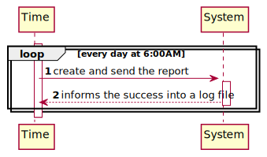
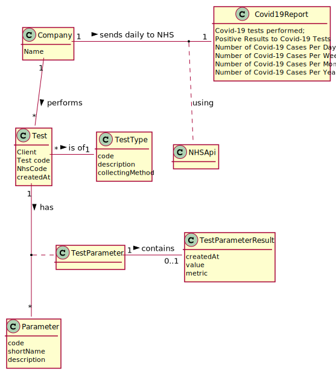
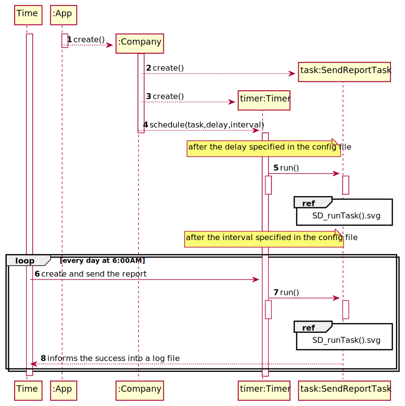
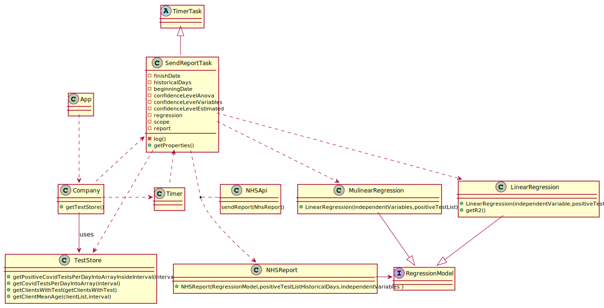

# US 006 - To create a Task

## 1. Requirements Engineering

### 1.1. User Story Description

As an organization employee, I want to create a new task in order to be further published.

### 1.2. Customer Specifications and Clarifications

**From the specifications document:**
> The Many Labs company wants to send to the NHS daily reports of Covid-19 data, including the number of observed values and estimated values. Reports should be generated automatically with historical data and must be sent every day at 6:00 am

> The contract with the NHS in England requires Many Labs to summarize and report Covid-19 data, the company needs to: identify the number of Covid-19 tests performed, identify all positive results to Covid-19 tests, report the total number of Covid-19 cases per day, per week and per month of the year, and send the forecasts for these same time horizons (the number of Covid-19 cases for the following day, next week and next month)

> Many Labs is also required to generate daily (automatic) reports with all the information demanded by the NHS and should send them to the NHS using their API.

> To make the predictions, the NHS contract defines that a linear regression algorithm should be used. The NHS required that both simple linear and multiple linear regression algorithms should be evaluated to select the best model. The accuracy of the prediction models should be analysed and documented in the application user manual (in the annexes) that must be delivered with the application. The algorithm to be used by the application must be defined through a configuration file.

**From the client clarifications:**

> **Question:** Regarding US18 and US19, it is only one report containing all the tests performed by Many Labs to be sent each time, correct? Or is it one report per laboratory, for example? Or other option?
>
> **Answer:** The report should contain all the tests made by Many Labs.

> **Question:** As the report is generated automatically, should the system generate a notication that the report was sent?
>
> **Answer:** The application should write the event into a log file.

> **Question:** In US19, in Sprint D Requirements, it says "The report should include day and week (observed and estimated) values..." and also "Reports...must be sent every day at 6:00 am". As the Report is to be automatically sent very early in the morning, do you wish the report to have the data concerning the day before and the last week starting at the day before?
>
> **Answer:** The format of the report should follow the report example that is available in moodle.

> **Question:** Should the report contain the data of all the tests with results (with or without report, with or without validation) or contain only the validated tests? (Or other option?)
>
> **Answer:** The NHS Covid report should include statistics computed only from validated tests.

> **Question:** Are we going to be able to use more math libraries in order to facilitate the calculus (for example, for confidence intervals) or is the rest of the calculus to be developed by each team?
>
> **Answer:** Each team should implement the classes and methods needed.

> **Question:** Which significance level should we use for the hypothesis tests?
>
> **Answer:** The application should allow the user to choose the significance level.

> **Question:** Should we assume the report scope is Many Labs or is it each laboratory?
>
> **Answer:** Many Labs Many has exclusivity for doing Covid-19 tests and should send nationwide reports to NHS. The scope is Many Labs.

> **Question:** Could you clarify how the historical points work? Acording to the NhsReportExample, it was chosen 15 points and the dates to fit the regression model but it seems that it was not chosen the day to start the prediction table
>
> **Answer:** In the header of the exampleNHSReport.txt file it says "If the administrator selects: The current day to be 31/05/2021...". Please relate this information with the table available in the exampleNHSReport.txt file. In US19, the current day is the day when the report is sent automatically to the NHS. The teams should not include sundays in their analysis or estimates. When the time resolution is a week, please consider only complete weeks.

### 1.3. Acceptance Criteria

* **AC1:** The report should include day and week (observed and estimated) values, the regression model used to estimate
  each value, R(SLR), R2 and R2 adjusted for SLR and MLR, hypothesis tests for regression coefficients significance
  model with Anova. Simple linear and multilinear regression models can be used to compute the estimates and
  corresponding confidence intervals. When the system is configured to use the simple linear regression model, the
  performance of each model should be used to select the best model (the one that uses the number of tests realized or
  the one that uses the mean age as independent variable). The best model will be used to make the estimated/expected
  values that will be send to NHS. The interval of dates to fit the regression model and the number of historical
  points (number of days and number of weeks) must be defined through a configuration file. The system should send the
  report using the NHS API (available in moodle).

* **AC2:** The report should contain all the tests made by Many Labs.

* **AC3:** The application should write the notification the event into a log file.

* **AC4:** The NHS Covid report should include statistics computed only from validated tests.

* **AC5:** The application should allow the user to choose the significance level.

### 1.4. Found out Dependencies

* There is a dependency to "US4", "US5", "US12","US14","US15" since the test needs to be on **last state** in order to
  be able to be mentioned in report.

### 1.5 Input and Output Data

**Input Data:**

*nothing*

**Output Data:**

* Report sent to the NHS

### 1.6. System Sequence Diagram (SSD)

**Alternative 1**

### 1.7 Other Relevant Remarks

## 2. OO Analysis

### 2.1. Relevant Domain Model Excerpt

### 2.2. Other Remarks

## 3. Design - User Story Realization

### 3.1. Rationale

**SSD - Alternative 1 is adopted.**

| Interaction ID | Question: Which class is responsible for...                  | Answer          | Justification (with patterns)                                                                                               |
| :------------- | :---------------------                                       | :------------   | :----------------------------                                                                                               |
| Step 1         | ...schedule the sent of the report?                          | Company         | IE: Since the scope of the report is the company the Company class knows all the information required to create the report. |
|                | ...knowing all the tests?                                    | TestStore       | IE: TestStore stores all testes                                                                                             |
|                | ...knowing the positive COVID tests?                         | TestStore       | IE: TestStore stores all testes                                                                                             |
|                | ...knowing all valid COVID tests?                            | TestStore       | IE: TestStore stores all testes                                                                                             |
|                | ...knowing the the age of clients associated with the test ? | ClientStore     | IE: knows all clients                                                                                                       |
|                | ...creating the NHS report                                   | SendReportTask  | Pure Fabrication: there is no class on the domain to give this responsibility                                               |
|                | ...send the NHS report to NHS ?                              | NHSAPI          | API                                                                                                                         |
|                | ...create the regression model                               | RegressionModel | Pure Fabrication: there is no class on the domain to give this responsibility                                               |
|                |                                                              |                 |                                                                                                                             |
| Step 2         | ...write the success of the operation into a log file        | SendReportTask  | IE: has all the necessary data                                                                                              |

### Systematization ##

According to the taken rationale, the conceptual classes promoted to software classes are:
* NHSReport

Other software classes (i.e. Pure Fabrication) identified:
* SendReportTask
* RegressionModel

## 3.2. Sequence Diagram (SD)

**Alternative 1**

**RunTank()**
.svg)

## 3.3. Class Diagram (CD)

# 4. Tests

**Test 1:** Check that it is not possible to create a mode of regression with arrays of different length.

    @Test(expected = IllegalArgumentException.class)
    public void differentLengthsTest() {
        double[][] matrix1 = {
                {120, 19},
                {200, 8},
                {150, 12},
                {180, 15},
                {240, 16},
                {250, 13}
        };
        double[] matrixb = {23.8, 24.2, 22.0, 26.2, 33.5, 35, 5};

        MultiLinearRegression s = new MultiLinearRegression(matrix1, matrixb);

    }

**Test 2:** Check if the task is successful created

    @Test
    public void taskCreated(){
        Assert.assertTrue(company.isCreatedTask());
    }

**Test 3:** Check if it is possible to obtain the list of validated CovidTests

    @Test
    public void getValidatedTestsListAll() {
        ParameterCategoryStore cat = new ParameterCategoryStore();
        ParameterCategory pc1 = new ParameterCategory("AH000", "Hemogram");
        cat.add(pc1);
        List<ParameterCategory> cat1 = new ArrayList<>();
        cat1.add(pc1);
        List<Parameter> pa = new ArrayList<>();
        Parameter p1 = new Parameter("AH000", "Nome", "description", pc1);
        pa.add(p1);
        TestType testType = new TestType("BL000", "description", "sei lá", cat);
        TestStore store = new TestStore();
        app.domain.model.Test t = store.createTest("123456789187", "1234567890123456", testType, cat1, pa);

        ZoneId defaultZoneId = ZoneId.systemDefault();
        LocalDate date1Client = LocalDate.now();
        Date date1 = Date.from(date1Client.atStartOfDay(defaultZoneId).toInstant());

        Client client = new Client("12345678910", "1234567890123456", "1234567891", "1234567891", date1, "email@gamil.com", "Zé");

        List<Client> clientList = new ArrayList<>();
        clientList.add(client);

        Calendar calendar = Calendar.getInstance();
        calendar.add(Calendar.DATE, -10);
        Date toDate = calendar.getTime();

        Client client2 = new Client("12345678911", "1234567890123457", "1234567892", "1234567891", toDate, "email@gamil.com", "Zé");
        clientList.add(client2);

        app.domain.model.Test teste = new app.domain.model.Test("1234s", "123456789012", "1234567890123456", testType, cat1, pa);
        store.saveTest();

        LocalDate beginDate = toDate.toInstant().atZone(ZoneId.systemDefault()).toLocalDate();

        ParameterCategoryStore parameterCategoryStore = App.getInstance().getCompany().getParameterCategoryList();
        ParameterCategory pc10 = parameterCategoryStore.createParameterCategory("12345", "Hemogram");
        parameterCategoryStore.saveParameterCategory();
        ParameterCategory pc2 = parameterCategoryStore.createParameterCategory("12346", "Cholesterol");
        parameterCategoryStore.saveParameterCategory();
        ParameterCategory pc3 = parameterCategoryStore.createParameterCategory("12347", "Covid");
        parameterCategoryStore.saveParameterCategory();

        TestType covidTest = new TestType("COV19", "Covid", "Swab", parameterCategoryStore);

        List<ParameterCategory> testCategories = new ArrayList<>();
        testCategories.add(pc1);

        ParameterStore parameterStore = new ParameterStore();

        Parameter p4 = new Parameter(Constants.IG_GAN, "COVID", "000", pc3);
        parameterStore.add(p4);

        List<Parameter> testParameters1 = new ArrayList<>();
        testParameters1.add(p4);

        app.domain.model.Test t10 = new app.domain.model.Test("1234557890123456", "100000000100", "1234567890", covidTest, testCategories, testParameters1);
        t10.setCreatedDate(LocalDateTime.of(2021, Month.JUNE, 10, 11, 30));
        t10.addTestParameter();
        t10.changeState(Constants.SAMPLE_COLLECTED);
        t10.addTestResult(Constants.IG_GAN, 1.5);
        t10.changeState("VALIDATED");
        store.addTest(t10);

        Assert.assertNotNull(store.getValidatedTestsListAll());
    }

# 5. Construction (Implementation)

## Class CreateTaskController

		public boolean createTask(String ref, String designation, String informalDesc, 
			String technicalDesc, Integer duration, Double cost, Integer catId)() {
		
			Category cat = this.platform.getCategoryById(catId);
			
			Organization org;
			// ... (omitted)
			
			this.task = org.createTask(ref, designation, informalDesc, technicalDesc, duration, cost, cat);
			
			return (this.task != null);
		}

## Class Organization

		public Task createTask(String ref, String designation, String informalDesc, 
			String technicalDesc, Integer duration, Double cost, Category cat)() {
		
	
			Task task = new Task(ref, designation, informalDesc, technicalDesc, duration, cost, cat);
			if (this.validateTask(task))
				return task;
			return null;
		}

# 6. Integration and Demo

* A new option on the Employee menu options was added.

* Some demo purposes some tasks are bootstrapped while system starts.

# 7. Observations

Platform and Organization classes are getting too many responsibilities due to IE pattern and, therefore, they are
becoming huge and harder to maintain.

Is there any way to avoid this to happen?

